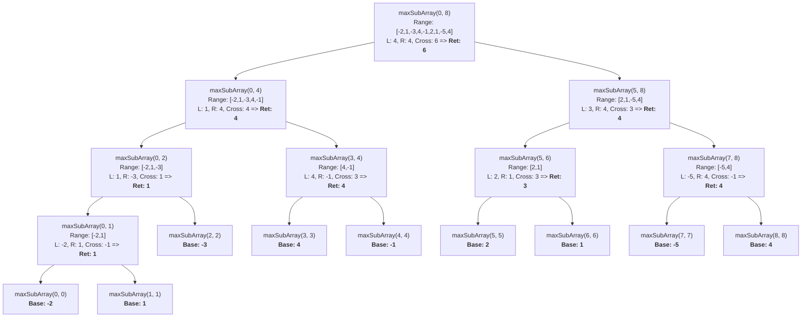

# Maximum Subarray Sum: Divide & Conquer Step-by-Step Simulation

> [!abstract] Simulation Objective
> This note provides a complete, step-by-step simulation and recursion tree execution trace for finding the **Maximum Subarray Sum** using Divide and Conquer.

---

## 1. Input Array & Problem Setup

Consider the array `arr` of size $N = 9$:

| Index $i$ | 0 | 1 | 2 | 3 | 4 | 5 | 6 | 7 | 8 |
| :---: | :---: | :---: | :---: | :---: | :---: | :---: | :---: | :---: | :---: |
| **`arr[i]`** | **-2** | **1** | **-3** | **4** | **-1** | **2** | **1** | **-5** | **4** |

> [!info] Expected Optimal Output
> * **Maximum Contiguous Subarray**: `[4, -1, 2, 1]` (from index 3 to index 6).
> * **Maximum Sum**: $4 + (-1) + 2 + 1 = \mathbf{6}$.

---

## 2. D&C Algorithm Quick Reference

```cpp
int maxSubArraySum(arr, l, r) {
    if (l == r) return arr[l]; // Base Case: 1 element
    
    int mid = l + (r - l) / 2;
    
    int left_max  = maxSubArraySum(arr, l, mid);
    int right_max = maxSubArraySum(arr, mid + 1, r);
    int cross_max = findCrossing(arr, l, mid, r);
    
    return max({left_max, right_max, cross_max});
}
```

---

## 3. Full Recursion Tree Diagram



---

## 4. Step-by-Step Simulation Call Trace

We trace the recursive call stack chronologically (Depth-First Search order).

### Phase 1: Left Subtree Execution (`arr[0..4]`)

#### Step 1: Call `maxSubArray(0, 8)`
* `l = 0, r = 8, mid = 4`.
* Needs `left_max` from `maxSubArray(0, 4)`.

#### Step 2: Call `maxSubArray(0, 4)`
* `l = 0, r = 4, mid = 2`. Range: `[-2, 1, -3, 4, -1]`.
* Needs `left_max` from `maxSubArray(0, 2)`.

#### Step 3: Call `maxSubArray(0, 2)`
* `l = 0, r = 2, mid = 1`. Range: `[-2, 1, -3]`.
* Needs `left_max` from `maxSubArray(0, 1)`.

#### Step 4: Call `maxSubArray(0, 1)`
* `l = 0, r = 1, mid = 0`. Range: `[-2, 1]`.
* Base Call Left: `maxSubArray(0, 0)` $\implies$ returns **`-2`**.
* Base Call Right: `maxSubArray(1, 1)` $\implies$ returns **`1`**.
* Call `findCrossing(0, 0, 1)` on `[-2, 1]`:
  * Left loop from `mid=0` down to `0`: `arr[0] = -2` $\implies \text{left\_sum} = -2$.
  * Right loop from `mid+1=1` up to `1`: `arr[1] = 1` $\implies \text{right\_sum} = 1$.
  * `cross_max` $= -2 + 1 = \mathbf{-1}$.
* `maxSubArray(0, 1)` returns $\max(-2, 1, -1) = \mathbf{1}$.

#### Step 5: Complete `maxSubArray(0, 2)`
* `left_max` $= 1$ (from `maxSubArray(0, 1)`).
* `right_max`: Base Call `maxSubArray(2, 2)` $\implies$ returns **`-3`**.
* Call `findCrossing(0, 1, 2)` on `[-2, 1, -3]`:
  * Left sum from `mid=1` down to `0`:
    * $i=1$: `sum = 1`, `left_sum = 1`.
    * $i=0$: `sum = 1 + (-2) = -1`, `left_sum = max(1, -1) = 1`.
  * Right sum from `mid+1=2` up to `2`:
    * $i=2$: `sum = -3`, `right_sum = -3`.
  * `cross_max` $= 1 + (-3) = \mathbf{-2}$.
* `maxSubArray(0, 2)` returns $\max(1, -3, -2) = \mathbf{1}$.

#### Step 6: Call `maxSubArray(3, 4)`
* `l = 3, r = 4, mid = 3`. Range: `[4, -1]`.
* Base Call Left: `maxSubArray(3, 3)` $\implies$ returns **`4`**.
* Base Call Right: `maxSubArray(4, 4)` $\implies$ returns **`-1`**.
* Call `findCrossing(3, 3, 4)` on `[4, -1]`:
  * `left_sum = 4`, `right_sum = -1` $\implies \text{cross\_max} = 4 + (-1) = \mathbf{3}$.
* `maxSubArray(3, 4)` returns $\max(4, -1, 3) = \mathbf{4}$.

#### Step 7: Complete `maxSubArray(0, 4)`
Now we combine the subproblems for `arr[0..4] = [-2, 1, -3, 4, -1]`:
* `left_max` $= 1$ (from `maxSubArray(0, 2)`).
* `right_max` $= 4$ (from `maxSubArray(3, 4)`).
* Detailed Trace of `findCrossing(0, 2, 4)` with `mid = 2`:
  * **Left Loop** ($i = 2$ down to $0$):
    * $i=2$ (`arr[2] = -3`): `sum = -3`, `left_sum = -3`.
    * $i=1$ (`arr[1] = 1`): `sum = -3 + 1 = -2`, `left_sum = max(-3, -2) = -2`.
    * $i=0$ (`arr[0] = -2`): `sum = -2 + (-2) = -4`, `left_sum = max(-2, -4) = -2`.
    * Result: `left_sum = -2`.
  * **Right Loop** ($i = 3$ up to $4$):
    * $i=3$ (`arr[3] = 4`): `sum = 4`, `right_sum = 4`.
    * $i=4$ (`arr[4] = -1`): `sum = 4 + (-1) = 3`, `right_sum = max(4, 3) = 4`.
    * Result: `right_sum = 4`.
  * `cross_max` $= -2 + 4 = \mathbf{2}$.
* `maxSubArray(0, 4)` returns $\max(1, 4, 2) = \mathbf{4}$.

---

### Phase 2: Right Subtree Execution (`arr[5..8]`)

#### Step 8: Call `maxSubArray(5, 8)`
* `l = 5, r = 8, mid = 6`. Range: `[2, 1, -5, 4]`.

#### Step 9: Call `maxSubArray(5, 6)`
* `l = 5, r = 6, mid = 5`. Range: `[2, 1]`.
* Base Left `maxSubArray(5, 5)` $= \mathbf{2}$.
* Base Right `maxSubArray(6, 6)` $= \mathbf{1}$.
* `findCrossing(5, 5, 6)` $\implies \text{left\_sum} = 2, \text{right\_sum} = 1 \implies \text{cross\_max} = 3$.
* `maxSubArray(5, 6)` returns $\max(2, 1, 3) = \mathbf{3}$.

#### Step 10: Call `maxSubArray(7, 8)`
* `l = 7, r = 8, mid = 7`. Range: `[-5, 4]`.
* Base Left `maxSubArray(7, 7)` $= \mathbf{-5}$.
* Base Right `maxSubArray(8, 8)` $= \mathbf{4}$.
* `findCrossing(7, 7, 8)` $\implies \text{left\_sum} = -5, \text{right\_sum} = 4 \implies \text{cross\_max} = -1$.
* `maxSubArray(7, 8)` returns $\max(-5, 4, -1) = \mathbf{4}$.

#### Step 11: Complete `maxSubArray(5, 8)`
* `left_max` $= 3$ (from `maxSubArray(5, 6)`).
* `right_max` $= 4$ (from `maxSubArray(7, 8)`).
* `findCrossing(5, 6, 8)` with `mid = 6` on `[2, 1, -5, 4]`:
  * Left loop ($i=6$ down to $5$): `arr[6]=1`, `arr[5]=2` $\implies \text{left\_sum} = 1 + 2 = \mathbf{3}$.
  * Right loop ($i=7$ up to $8$): `arr[7]=-5` (`sum=-5`), `arr[8]=4` (`sum=-1`) $\implies \text{right\_sum} = \mathbf{-1}$.
  * `cross_max` $= 3 + (-1) = \mathbf{2}$.
* `maxSubArray(5, 8)` returns $\max(3, 4, 2) = \mathbf{4}$.

---

### Phase 3: Root Level Combination (`arr[0..8]`)

#### Step 12: Final Merge at `maxSubArray(0, 8)`
We now have the three candidate results at the top level:
1. **`left_max`** $= \mathbf{4}$ (from left half `arr[0..4]`).
2. **`right_max`** $= \mathbf{4}$ (from right half `arr[5..8]`).
3. **`cross_max`**: Computed via `findCrossing(0, 4, 8)` with `mid = 4`:

> [!important] Detailed Root `findCrossing(0, 4, 8)` Execution
> * **Left Expansion** ($i = 4$ down to $0$):
>   * $i=4$ (`arr[4] = -1`): `sum = -1`, `left_sum = -1`
>   * $i=3$ (`arr[3] = 4`): `sum = -1 + 4 = 3`, `left_sum = max(-1, 3) = 3`
>   * $i=2$ (`arr[2] = -3`): `sum = 3 + (-3) = 0`, `left_sum = max(3, 0) = 3`
>   * $i=1$ (`arr[1] = 1`): `sum = 0 + 1 = 1`, `left_sum = max(3, 1) = 3`
>   * $i=0$ (`arr[0] = -2`): `sum = 1 + (-2) = -1`, `left_sum = max(3, -1) = 3`
>   * **Best Left Suffix**: Subarray `arr[3..4] = [4, -1]` with sum **`3`**.
>
> * **Right Expansion** ($i = 5$ up to $8$):
>   * $i=5$ (`arr[5] = 2`): `sum = 2`, `right_sum = 2`
>   * $i=6$ (`arr[6] = 1`): `sum = 2 + 1 = 3`, `right_sum = max(2, 3) = 3`
>   * $i=7$ (`arr[7] = -5`): `sum = 3 + (-5) = -2`, `right_sum = max(3, -2) = 3`
>   * $i=8$ (`arr[8] = 4`): `sum = -2 + 4 = 2`, `right_sum = max(3, 2) = 3`
>   * **Best Right Prefix**: Subarray `arr[5..6] = [2, 1]` with sum **`3`**.
>
> * **Combining Left Suffix & Right Prefix**:
>   $$\text{cross\_max} = \text{left\_sum} + \text{right\_sum} = 3 + 3 = \mathbf{6}$$
>   (Corresponding to contiguous subarray `arr[3..6] = [4, -1, 2, 1]`).

---

## 5. Final Decision Table

| Candidate | Location | Subarray Indices | Subarray Elements | Value |
| :--- | :--- | :--- | :--- | :---: |
| `left_max` | Entirely in Left (`0..4`) | `3..3` | `[4]` | 4 |
| `right_max` | Entirely in Right (`5..8`) | `8..8` | `[4]` | 4 |
| **`cross_max`** | **Crosses Midpoint (`mid=4`)** | **`3..6`** | **`[4, -1, 2, 1]`** | **6** |

$$\text{Final Result} = \max(4, 4, 6) = \mathbf{6}$$

---

## 6. Summary of Key Learnings

1. **Why `cross_max` won**: Neither the left half alone nor the right half alone contained the complete optimal sequence. The optimal sequence `[4, -1, 2, 1]` started in the left half at index 3 and crossed into the right half ending at index 6.
2. **How `findCrossing` works**: By fixing the midpoint `mid` and expanding outwards in both directions (leftwards to find the best suffix of `arr[l..mid]`, rightwards to find the best prefix of `arr[mid+1..r]`), we guaranteed finding the best contiguous crossing range in linear $O(n)$ time.
