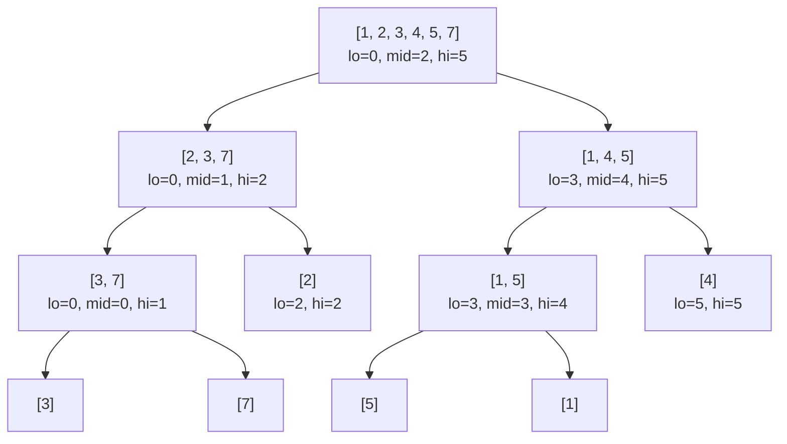

# Divide and Conquer 1: Foundations & Core Algorithms

> [!abstract] Overview
> **Divide and Conquer (D&C)** is an algorithmic paradigm based on multi-branched recursion. A problem is broken down into two or more subproblems of the same or related type, until these become simple enough to be solved directly. The solutions to the subproblems are then combined to give a solution to the original problem.

---

## 1. Dynamic Programming vs. Divide & Conquer

> [!info] Key Architectural Difference
> The crucial distinction between **Dynamic Programming (DP)** and **Divide & Conquer (D&C)** lies in the independence of subproblems.

| Dimension | Dynamic Programming (DP) | Divide & Conquer (D&C) |
| :--- | :--- | :--- |
| **Subproblems** | Overlapping (same subproblem appears repeatedly) | **Independent** (no overlap across subproblems) |
| **Caching / Memoization** | **Required** (table/memo array used to avoid re-computation) | **Not needed** (subproblems are solved once) |
| **Execution Flow** | Typically Bottom-up tabular construction (or Top-down + Memo) | Strictly **Top-down recursion** |
| **Classic Examples** | Coin Change, 0/1 Knapsack, LCS, Floyd-Warshall | Merge Sort, Quick Sort, Binary Search, Convex Hull |

---

## 2. The General D&C Template

Every Divide and Conquer algorithm follows three main phases:

1. **Split (Divide)**: Partition the problem of size $n$ into $a$ smaller subproblems, each of size $n/b$.
2. **Solve (Conquer)**: Recursively solve each subproblem. If the subproblem size is small enough, solve it directly via the **Base Case**.
3. **Combine (Merge)**: Recombine the answers of the subproblems into a unified final answer for the parent problem.

> [!tip] The "Smart Combine" Rule
> In most D&C algorithms, **the SPLIT step is trivial** (e.g., just finding the midpoint $\lfloor (l + r)/2 \rfloor$). All the core intelligence and computational work resides in the **COMBINE** step!

> [!example]- D&C Pseudocode Template
> ```python
> function solve(problem):
>     # 1. Base Case check
>     if problem is small enough:
>         return base_case_solution(problem)
>     
>     # 2. Split (Divide)
>     left_subproblem, right_subproblem = split(problem)
>     
>     # 3. Solve (Conquer)
>     left_ans = solve(left_subproblem)
>     right_ans = solve(right_subproblem)
>     
>     # 4. Combine (Merge)
>     return combine(left_ans, right_ans)
> ```

---

## 3. Merge Sort

### 3.1 Pseudocode & Implementation

> [!note] Merge Sort Mechanics
> Merge Sort splits an array in half recursively until single-element arrays are reached (which are inherently sorted), then **merges** adjacent sorted arrays in linear time $O(n)$.

```cpp
void mergeSort(vector<int>& arr, int l, int r) {
    // Base case: Sub-array with 0 or 1 element is already sorted
    if (l >= r) return;
    
    // Split step: Trivial midpoint calculation
    int mid = l + (r - l) / 2;
    
    // Solve step: Recursively sort left and right halves
    mergeSort(arr, l, mid);
    mergeSort(arr, mid + 1, r);
    
    // Combine step: Merge two sorted sub-arrays arr[l..mid] and arr[mid+1..r]
    merge(arr, l, mid, r);
}

void merge(vector<int>& arr, int l, int mid, int r) {
    int n1 = mid - l + 1;
    int n2 = r - mid;
    
    vector<int> L(n1), R(n2);
    for (int i = 0; i < n1; i++) L[i] = arr[l + i];
    for (int j = 0; j < n2; j++) R[j] = arr[mid + 1 + j];
    
    int i = 0, j = 0, k = l;
    while (i < n1 && j < n2) {
        if (L[i] <= R[j]) {
            arr[k++] = L[i++];
        } else {
            arr[k++] = R[j++];
        }
    }
    
    while (i < n1) arr[k++] = L[i++];
    while (j < n2) arr[k++] = R[j++];
}
```

---

### 3.2 Merge Sort Recursion Tree Visualization



---

### 3.3 Correctness Proof of Merge Sort

#### 1. Intuitive Proof (Plain English)
Imagine you have two piles of cards on a table, and **both piles are already sorted** from smallest to largest. If you want to merge them into a single sorted pile:
1. You only ever need to look at the **top (smallest available) card** of each pile.
2. Whichever card is smaller between the two top cards is guaranteed to be the overall smallest card remaining.
3. You pick that card up and put it into your new combined pile.
4. Repeating this step until both piles are empty guarantees the final combined pile is perfectly sorted!
Since single-element piles are automatically sorted (you can't misorder 1 card), breaking the array down to single elements and repeatedly merging sorted pairs guarantees the entire array becomes sorted.

#### 2. Formal Mathematical Proof (by Structural Induction)
* **Base Case**: For an array of size $n = 1$ ($l = r$), the array contains a single element. A single-element array is trivially sorted. The base case holds.
* **Inductive Hypothesis**: Assume `mergeSort(arr, l, r)` correctly returns a sorted array for any sub-array of length $k < n$.
* **Inductive Step**: For an array of size $n$:
  1. The midpoint splits the array into left sub-array of length $n_1 = \lfloor n/2 \rfloor$ and right sub-array of length $n_2 = \lceil n/2 \rceil$.
  2. By the Inductive Hypothesis, since $n_1 < n$ and $n_2 < n$, `mergeSort(arr, l, mid)` correctly sorts `arr[l..mid]` and `mergeSort(arr, mid+1, r)` correctly sorts `arr[mid+1..r]`.
  3. The `merge()` function takes two sorted arrays $L$ and $R$. By comparing the current elements $L[i]$ and $R[j]$ and copying the smaller element into `arr[k]`, it maintains the loop invariant that `arr[l..k-1]` contains the $k-l$ smallest elements of $L \cup R$ in sorted order.
  4. Thus, `merge()` yields a completely sorted array `arr[l..r]`. By induction, Merge Sort is correct for all $n \ge 1$. $\blacksquare$

> [!tip] 3. Exam-Ready Proof (Fast to write on paper)
> **Goal**: Prove `MergeSort(arr, l, r)` correctly sorts array of size $n$.
> * **Base Case ($n=1$)**: A single element $l=r$ is sorted by definition.
> * **Inductive Hypothesis**: Assume `MergeSort` works for all sizes $k < n$.
> * **Inductive Step**:
>   1. Array is split at `mid`. Size of left & right halves are $< n$.
>   2. By IH, `left` and `right` sub-arrays are correctly sorted.
>   3. `Merge()` compares smallest elements of both sorted halves, placing min element next. This maintains sorted order.
> * **Conclusion**: By induction, `MergeSort` is correct for all $n \ge 1$.

---

### 3.4 Step-by-Step Complexity Analysis of Merge Sort

#### 1. Time Complexity Recurrence
Let $T(n)$ be the total time required to sort an array of size $n$:
$$T(n) = \begin{cases} \Theta(1) & \text{if } n = 1 \\ 2T\left(\frac{n}{2}\right) + \Theta(n) & \text{if } n > 1 \end{cases}$$

Where:
* $2T(n/2)$ represents the 2 recursive calls on sub-arrays of size $n/2$.
* $\Theta(n)$ represents the linear time work done by `merge()` at each level.

#### 2. Derivation via Recursion Tree Method
1. **Tree Depth**: At each recursive level $k$, array size is reduced to $\frac{n}{2^k}$.
   The recursion terminates when $\frac{n}{2^k} = 1 \implies k = \log_2 n$. Total levels = $\mathbf{1 + \log_2 n}$.
2. **Work per Level**:
   * Level 0 (Root): $1 \times cn = cn$
   * Level 1: $2 \times c\left(\frac{n}{2}\right) = cn$
   * Level 2: $4 \times c\left(\frac{n}{4}\right) = cn$
   * Level $k$: $2^k \times c\left(\frac{n}{2^k}\right) = cn$
3. **Total Work**:
   $$\text{Total Time} = \sum_{k=0}^{\log_2 n} cn = cn \times (1 + \log_2 n) = \Theta(n \log_2 n)$$

> [!success] Time Complexity Summary
> * **Best Case**: $\Omega(n \log n)$
> * **Average Case**: $\Theta(n \log n)$
> * **Worst Case**: $O(n \log n)$

#### 3. Space Complexity Analysis
* Auxiliary array memory inside `merge()` function takes $\Theta(n)$ space.
* Call stack memory takes $\Theta(\log n)$ space due to tree height.
* **Total Space Complexity**: $\mathbf{\Theta(n)}$ auxiliary space.

---

## 4. Binary Search Reframed as D&C

> [!note] Binary Search as D&C
> Binary Search splits the search space at the midpoint. However, unlike Merge Sort which solves **both** subproblems, Binary Search eliminates one half and solves **only one** subproblem. Additionally, the combine step is trivial ($O(1)$).

### 4.1 Pseudocode

```python
function binarySearchDC(arr, l, r, target):
    # Base case: Search space exhausted
    if l > r:
        return -1
    
    mid = l + (r - l) // 2
    
    # Check if target is at mid
    if arr[mid] == target:
        return mid
    
    # Recurse on left half
    elif arr[mid] > target:
        return binarySearchDC(arr, l, mid - 1, target)
    
    # Recurse on right half
    else:
        return binarySearchDC(arr, mid + 1, r, target)
```

---

### 4.2 Correctness Proof of Binary Search

#### 1. Intuitive Proof (Plain English)
Think of looking up a word in a dictionary:
1. You open the dictionary right in the middle.
2. If the word at the middle page comes *after* your target word alphabetically, you know for a fact that your target word **cannot possibly be in the second half** of the book (because the book is sorted!).
3. Therefore, you can safely discard the entire right half and focus exclusively on the left half.
4. You never risk accidentally throwing away the target because the sorted order guarantees where it can and cannot be.

#### 2. Formal Mathematical Proof (by Induction on Search Space Size)
* **Invariant**: If `target` exists in the initial array `arr[0..N-1]`, then `target` must exist within the index range `arr[l..r]`.
* **Base Case**: Initially $l = 0, r = N-1$. The invariant holds trivially. If $l > r$, the range is empty, so `target` does not exist in the array. Returning `-1` is correct.
* **Inductive Step**: Suppose the invariant holds for range `arr[l..r]`. Let `mid = floor((l + r) / 2)`:
  1. If `arr[mid] == target`, target is found at `mid`. Returning `mid` is correct.
  2. If `arr[mid] > target`: Since `arr` is sorted in ascending order, for all $j \ge \text{mid}$, `arr[j] >= arr[mid] > target`. Thus, `target` cannot be present at any index $j \in [\text{mid}, r]$. Hence, if `target` exists, it must lie in `arr[l..mid-1]`.
  3. If `arr[mid] < target`: Similarly, for all $j \le \text{mid}$, `arr[j] <= arr[mid] < target`. Thus `target` cannot lie in $j \in [l, \text{mid}]$. If it exists, it must lie in `arr[mid+1..r]`.
* In all cases, the invariant is preserved for the smaller sub-range. By induction, Binary Search is correct. $\blacksquare$

> [!tip] 3. Exam-Ready Proof (Fast to write on paper)
> **Goal**: Prove `BinarySearch(arr, l, r, target)` correctly locates `target`.
> * **Loop Invariant**: `target` $\in$ `arr[l..r]` if it exists in the array.
> * **Base Case ($l > r$)**: Range is empty $\implies$ return `-1` (target absent).
> * **Step**: Midpoint element `arr[mid]` is compared with `target`:
>   * `arr[mid] == target` $\implies$ Found at `mid`.
>   * `arr[mid] > target` $\implies$ Array sorted $\implies$ target cannot be in `arr[mid..r]`. Search `arr[l..mid-1]`.
>   * `arr[mid] < target` $\implies$ Target cannot be in `arr[l..mid]`. Search `arr[mid+1..r]`.
> * **Conclusion**: Invariant preserved at each step. Search terminates in $\le \log_2 n$ steps.

---

### 4.3 Step-by-Step Complexity Analysis of Binary Search

#### 1. Time Complexity Recurrence
$$T(n) = T\left(\frac{n}{2}\right) + \Theta(1)$$

Where:
* $a = 1$: We only recurse on $1$ subproblem of size $n/2$.
* $f(n) = \Theta(1)$: Midpoint calculation and comparison take $O(1)$ constant time.
* **Combine step**: None / $O(1)$ constant work.

#### 2. Derivation via Substitution / Master Theorem
Using **Master Theorem** ($T(n) = aT(n/b) + f(n)$):
* $a = 1, b = 2 \implies n^{\log_b a} = n^{\log_2 1} = n^0 = 1$.
* $f(n) = \Theta(1) = \Theta(n^{\log_b a})$.
* This corresponds to **Case 2** of Master Theorem $\implies T(n) = \Theta(n^{\log_b a} \log n) = \mathbf{\Theta(\log n)}$.

#### 3. Space Complexity
* **Recursive Implementation**: $\mathbf{O(\log n)}$ space due to call stack frame depth of $\log_2 n$.
* **Iterative Implementation**: $\mathbf{O(1)}$ space.

---

## 5. Recurrence Trees & Master Theorem Framework

> [!info] The Generalized Recurrence Form
> For any D&C algorithm dividing a problem of size $n$ into $a$ subproblems of size $n/b$ with combine cost $f(n)$:
> $$T(n) = a T\left(\frac{n}{b}\right) + f(n)$$

---

### 5.1 Three Benchmark Recurrence Analysis Examples

#### Example 1: $T(n) = 2T(n/2) + cn$ (Equal Work at Every Level)
* **Tree Structure**: $2^k$ nodes at level $k$, each doing work $c(n/2^k)$.
* **Level Work**: $2^k \cdot c(n/2^k) = cn$.
* **Total Sum**: $\sum_{k=0}^{\log_2 n} cn = cn(1 + \log_2 n) = \mathbf{\Theta(n \log n)}$.
* **Work Location**: Work is evenly distributed across all levels.

#### Example 2: $T(n) = 2T(n/2) + c$ (Work Dominated by Leaves)
* **Tree Structure**: $2^k$ nodes at level $k$, each doing constant work $c$.
* **Level Work**: $2^k \cdot c = c \cdot 2^k$.
* **Total Sum**: $\sum_{k=0}^{\log_2 n} c \cdot 2^k = c(1 + 2 + 4 + \dots + n) = c(2n - 1) = \mathbf{\Theta(n)}$.
* **Work Location**: Work is dominated by the bottom leaf level ($n$ leaves).

#### Example 3: $T(n) = 2T(n/2) + cn^2$ (Work Dominated by Root)
* **Tree Structure**: $2^k$ nodes at level $k$, each doing work $c(n/2^k)^2 = c \frac{n^2}{4^k}$.
* **Level Work**: $2^k \cdot c \frac{n^2}{4^k} = cn^2 \left(\frac{1}{2}\right)^k$.
* **Total Sum**: $cn^2 \sum_{k=0}^{\log_2 n} \left(\frac{1}{2}\right)^k \le cn^2 \left(\frac{1}{1 - 1/2}\right) = 2cn^2 = \mathbf{\Theta(n^2)}$.
* **Work Location**: Work is dominated by the top root node.

---

### 5.2 Master Theorem Cheat Sheet

> [!important] Master Theorem Formulation
> Given $T(n) = aT(n/b) + \Theta(n^c)$ where $a \ge 1, b > 1, c \ge 0$:
>
> 1. **Case 1 (Leaf Heavy)**: If $c < \log_b a$, then:
>    $$T(n) = \Theta\left(n^{\log_b a}\right)$$
> 2. **Case 2 (Balanced Work)**: If $c = \log_b a$, then:
>    $$T(n) = \Theta\left(n^c \log n\right) = \Theta\left(n^{\log_b a} \log n\right)$$
> 3. **Case 3 (Root Heavy)**: If $c > \log_b a$, then:
>    $$T(n) = \Theta\left(n^c\right) = \Theta(f(n))$$
