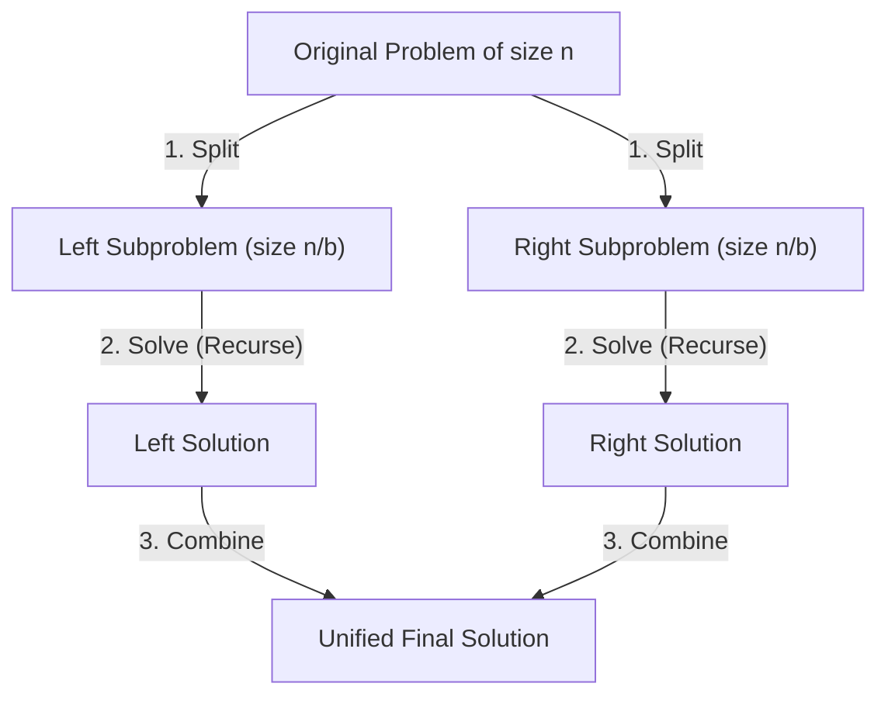
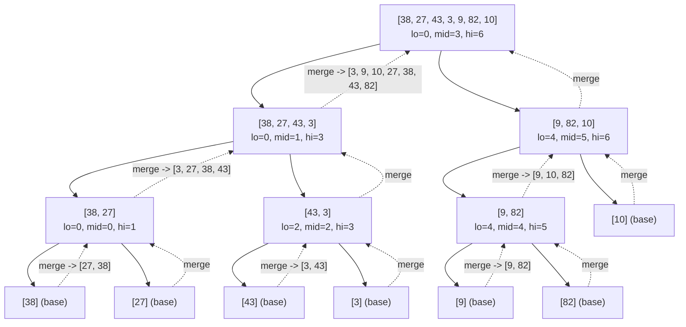
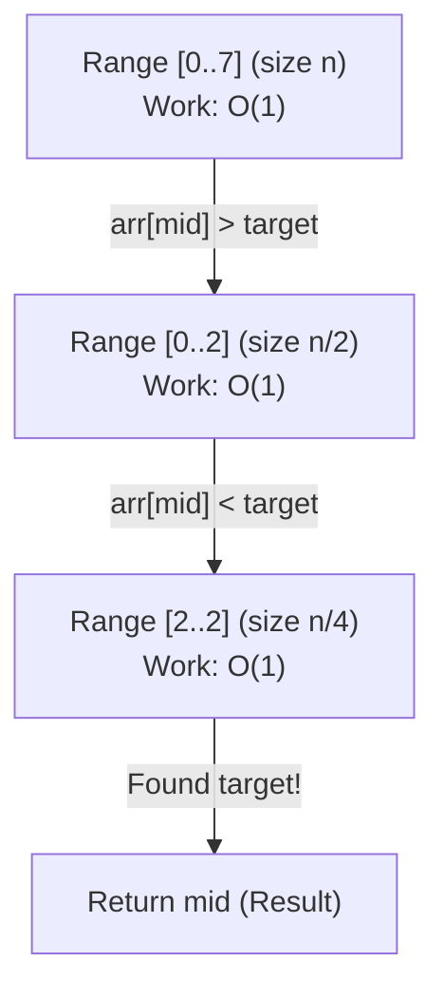
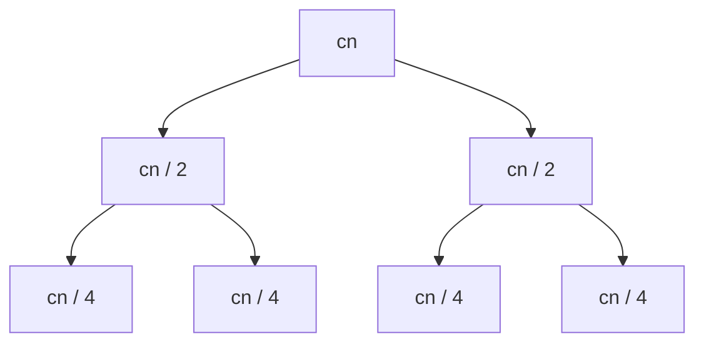
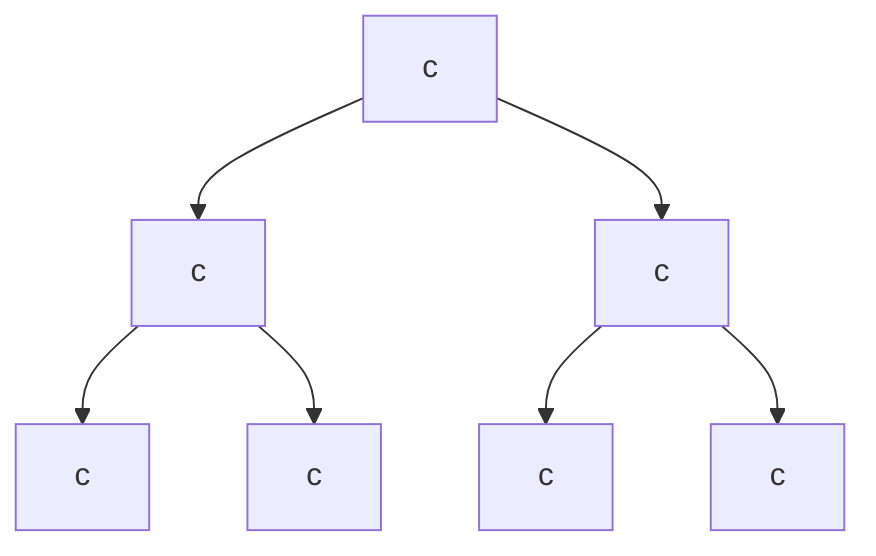
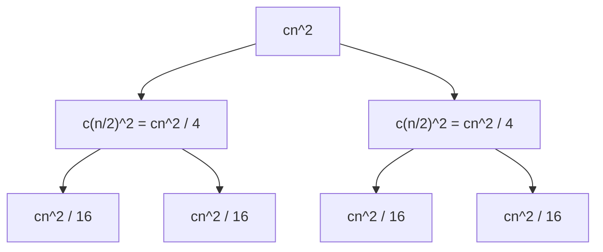

# Divide and Conquer 1: Foundations & Core Algorithms

> [!abstract] Overview
> **Divide and Conquer (D&C)** is an algorithmic paradigm based on multi-branched recursion. A problem is broken down into two or more independent subproblems of the same type, until these become simple enough to be solved directly (base case). The solutions to the subproblems are then combined to give a solution to the original problem.
> 
> *Course Reference*: CSE 4403 Lecture 16 (Divide and Conquer - 1).

---

## 1. Dynamic Programming vs. Divide & Conquer

> [!info] The Key Architectural Difference
> In Dynamic Programming, subproblems **overlap** — the same smaller problem appears repeatedly, so we cached/memoized results to avoid recomputation.
> 
> In Divide & Conquer, our subproblems are **strictly independent**. There is no overlap across branches, so **no caching or memoization is needed**. Subproblems are solved once and combined.

| Dimension | Dynamic Programming (DP) | Divide & Conquer (D&C) |
| :--- | :--- | :--- |
| **Subproblem Nature** | **Overlapping** (identical subproblems recur many times) | **Independent** (disjoint subproblems, no overlap) |
| **Re-computation Handling** | **Cache/Memoize** (save answers in a table/array) | **Solve once** (never repeated, nothing to cache) |
| **Execution Direction** | Bottom-up tabular construction or Top-down + memo | Strictly **Top-down multi-branch recursion** |
| **Dependency Graph** | Directed Acyclic Graph (DAG) with shared nodes | **Recursion Tree** (branches do not intersect) |
| **Classic Examples** | Coin Change, 0/1 Knapsack, LCS, Floyd-Warshall | Merge Sort, Quick Sort, Binary Search, Convex Hull |

---

## 2. The General D&C Template

Every Divide and Conquer algorithm follows three fundamental phases:



1. **Split (Divide)**: Break the problem of size $n$ into $a$ smaller, independent subproblems of size $n/b$.
2. **Solve (Conquer)**: Recursively solve each subproblem. When the subproblem is sufficiently small, solve it immediately via the **Base Case**.
3. **Combine (Merge)**: Merge the subproblem solutions into the final answer.

> [!tip] Slide Insight: "The Hard Part Is Never the Split"
> In most D&C algorithms:
> * **The SPLIT is dumb**: Just cut the array/data in half at the midpoint $\lfloor (l + r) / 2 \rfloor$. No intelligence required.
> * **The COMBINE is smart**: This is where the real work lives. Most of the algorithm's logic, correctness, and runtime complexity reside here!
> 
> *Examples*:
> * **Merge Sort**: Split is trivial ($O(1)$ cut in half); Combine does the heavy lifting ($O(n)$ two-pointer merge).
> * **Binary Search**: Split is trivial ($O(1)$ midpoint); Combine is trivial ($O(1)$ return selected branch).
> * **Quick Sort**: Exception to the rule — Split is smart ($O(n)$ Lomuto partitioning); Combine is free ($O(1)$).

> [!example]- General D&C Pseudocode Template
> ```cpp
> //generic d&c template
> Solution solve(Problem p) {
>     //base case: small enough to solve directly
>     if (isBaseCase(p)) {
>         return solveBaseCase(p);
>     }
> 
>     //1. split into independent parts
>     auto [left_sub, right_sub] = split(p);
> 
>     //2. solve subproblems recursively
>     Solution left_ans = solve(left_sub);
>     Solution right_ans = solve(right_sub);
> 
>     //3. combine results into final answer
>     return combine(left_ans, right_ans);
> }
> ```

---

## 3. Merge Sort

### 3.1 Intuition & Analogy

> [!note] The Card Sorting Analogy
> Imagine you have an unsorted pile of cards:
> 1. You divide the pile into two halves repeatedly until you have single cards. A pile with just 1 card is already sorted by definition.
> 2. Now take two sorted piles lying face-up on the table. How do you merge them into a single sorted pile?
> 3. You simply compare the **top card of Pile A** with the **top card of Pile B**.
> 4. Pick whichever is smaller, remove it, and place it at the back of your new pile.
> 5. Repeat until both piles are empty. This takes linear time $O(n)$ because every card is inspected and moved exactly once!

---

### 3.2 C++ Implementation

```cpp
#include <iostream>
#include <vector>

using namespace std;

//combines two sorted subarrays arr[l..mid] and arr[mid+1..r]
void merge(vector<int>& arr, int l, int mid, int r) {
    int n1 = mid - l + 1;
    int n2 = r - mid;

    //temporary arrays for left and right halves
    vector<int> L(n1), R(n2);
    for (int i = 0; i < n1; i++) L[i] = arr[l + i];
    for (int j = 0; j < n2; j++) R[j] = arr[mid + 1 + j];

    int i = 0, j = 0, k = l;
    //pick the smaller element from L or R
    while (i < n1 && j < n2) {
        if (L[i] <= R[j]) {
            arr[k++] = L[i++];
        } else {
            arr[k++] = R[j++];
        }
    }

    //copy any remaining elements
    while (i < n1) arr[k++] = L[i++];
    while (j < n2) arr[k++] = R[j++];
}

//main recursive merge sort function
void mergeSort(vector<int>& arr, int l, int r) {
    //base case: 0 or 1 element is already sorted
    if (l >= r) return;

    //trivial split at midpoint
    int mid = l + (r - l) / 2;

    //recurse on left and right halves
    mergeSort(arr, l, mid);
    mergeSort(arr, mid + 1, r);

    //smart combine step
    merge(arr, l, mid, r);
}
```

---

### 3.3 Concrete Step-by-Step Recursion Tree

Let us trace `arr = [38, 27, 43, 3, 9, 82, 10]` ($n = 7$):



---

### 3.4 Complexity Analysis of Merge Sort

#### 1. Time Complexity Recurrence
Let $T(n)$ be the runtime for an array of size $n$:
$$T(n) = \begin{cases} \Theta(1) & \text{if } n = 1 \\ 2T\left(\frac{n}{2}\right) + \Theta(n) & \text{if } n > 1 \end{cases}$$

Where:
* $2T(n/2)$: two recursive calls on subproblems of size $n/2$.
* $\Theta(n)$: linear work performed by the `merge()` procedure across all elements.

#### 2. Derivation via Recursion Tree Method
1. **Tree Depth**: Each step cuts array size in half ($n \to n/2 \to n/4 \to \dots \to 1$).
   $$\frac{n}{2^k} = 1 \implies 2^k = n \implies k = \log_2 n \implies \text{Depth} = 1 + \log_2 n$$
2. **Work Done per Level**:
   * Level 0 (Root): $1 \text{ node} \times cn = cn$
   * Level 1: $2 \text{ nodes} \times c\left(\frac{n}{2}\right) = cn$
   * Level 2: $4 \text{ nodes} \times c\left(\frac{n}{4}\right) = cn$
   * Level $k$: $2^k \text{ nodes} \times c\left(\frac{n}{2^k}\right) = cn$
3. **Total Work**:
   $$\text{Total Time} = \sum_{k=0}^{\log_2 n} cn = cn \times (1 + \log_2 n) = \mathbf{\Theta(n \log n)}$$

> [!note]- Tree Level Calculation Table
> | Level $k$ | Number of Subproblems | Subproblem Size | Work per Node | Total Work at Level |
> | :---: | :---: | :---: | :---: | :---: |
> | 0 | $2^0 = 1$ | $n$ | $cn$ | $cn$ |
> | 1 | $2^1 = 2$ | $n/2$ | $c(n/2)$ | $cn$ |
> | 2 | $2^2 = 4$ | $n/4$ | $c(n/4)$ | $cn$ |
> | $k$ | $2^k$ | $n/2^k$ | $c(n/2^k)$ | $cn$ |
> | $\log_2 n$ (Leaves) | $n$ | 1 | $c$ | $cn$ |
> | **Total Sum** | — | — | — | **$cn(1 + \log_2 n) = \Theta(n \log n)$** |

#### 3. Best, Average, and Worst Case
* **Best Case**: $\Omega(n \log n)$ — array is still split and merged completely.
* **Average Case**: $\Theta(n \log n)$
* **Worst Case**: $O(n \log n)$
* **Stability**: **Stable** (using `<=` in `L[i] <= R[j]` preserves original relative order of equal elements).

#### 4. Space Complexity Analysis
* **Auxiliary Array Space**: $\Theta(n)$ extra space needed by temporary buffers `L` and `R` in `merge()`.
* **Call Stack Space**: $\Theta(\log n)$ activation records simultaneously active on the recursion stack.
* **Total Space Complexity**: $\mathbf{\Theta(n)}$ auxiliary space.

---

### 3.5 Intuitive & Exam-Ready Correctness

> [!tip] Why Merge Sort Works (Intuitive & Exam-Ready Proof)
> * **Intuition (Two Card Piles)**: When merging two already sorted piles of cards, comparing only the top cards guarantees you always pick the smallest remaining card overall. Since 1-element piles are automatically sorted, merging sorted pairs step-by-step upwards guarantees the entire array is sorted.
> * **Exam-Ready Points**:
>   1. **Base Case ($n=1$)**: A single element is sorted by definition.
>   2. **Inductive Hypothesis**: Assume `mergeSort` correctly sorts halves of size $< n$.
>   3. **Combine Step**: The `merge()` routine repeatedly picks the smaller of the two remaining front elements from the sorted left and right halves, placing them in non-decreasing order.
>   4. **Conclusion**: By induction, Merge Sort is correct for all $n \ge 1$.

---

## 4. Binary Search Reframed as Divide & Conquer

> [!question] Slide 10 Home Task: Complete Solution
> Slide 10 asks:
> 1. What is the "combine" step here?
> 2. What is the recurrence relation and time complexity?
> 3. What does the recursion tree look like?

### 4.1 Concept & C++ Code

Unlike Merge Sort which solves **both** subproblems, Binary Search inspects the middle element and **discards one half entirely**, recursing on only **one** subproblem.

```cpp
//binary search reframed as divide and conquer
int binarySearchDC(const vector<int>& arr, int l, int r, int target) {
    //base case: search space exhausted
    if (l > r) return -1;

    int mid = l + (r - l) / 2;

    //base case: found target at mid
    if (arr[mid] == target) {
        return mid;
    }
    //recurse on left half only
    else if (arr[mid] > target) {
        return binarySearchDC(arr, l, mid - 1, target);
    }
    //recurse on right half only
    else {
        return binarySearchDC(arr, mid + 1, r, target);
    }
}
```

---

### 4.2 Answering the Slide 10 Questions

#### 1. What is the "combine" step in Binary Search?
* **Answer**: There is **no combine step** (or it is trivial $O(1)$).
* Because only one recursive call is made, the result returned by that single call is directly passed up the call stack without any merging of sub-solutions:
  $$\text{Combine Cost } f(n) = \Theta(1)$$

#### 2. What is the Recurrence Relation and Time Complexity?
* **Recurrence**:
  $$T(n) = 1 \cdot T\left(\frac{n}{2}\right) + \Theta(1)$$
  * $a = 1$: exactly 1 subproblem is solved.
  * $b = 2$: subproblem size is halved.
  * $f(n) = \Theta(1)$: midpoint calculation and comparison.
* **Solving via Master Theorem**:
  * $n^{\log_b a} = n^{\log_2 1} = n^0 = 1$.
  * $f(n) = \Theta(1) = \Theta(n^{\log_b a})$.
  * Falls into **Case 2** with $k = 0 \implies T(n) = \Theta(n^{\log_b a} \log n) = \mathbf{\Theta(\log n)}$.

#### 3. What does the Recursion Tree look like?
Because $a = 1$, the tree does not branch out; it is a **single vertical chain (path)**:



* **Number of nodes**: Exactly $1 + \log_2 n$ nodes.
* **Work per node**: $O(1)$.
* **Total Time**: $O(1) \times (1 + \log_2 n) = \mathbf{O(\log n)}$.

---

### 4.3 Intuitive & Exam-Ready Correctness

> [!tip] Why Binary Search Works (Intuitive & Exam-Ready Proof)
> * **Intuition (Dictionary Lookup)**: Opening a dictionary in the middle and seeing a word alphabetically greater than your target means the target cannot exist in the right half. Discarding that half never risks losing the target because the array is sorted.
> * **Exam-Ready Points**:
>   1. **Search Invariant**: If `target` exists, it must lie in `arr[l..r]`.
>   2. **Base Case ($l > r$)**: Range is empty $\implies$ return `-1` (target absent).
>   3. **Midpoint Check**:
>      - `arr[mid] == target`: found at `mid`.
>      - `arr[mid] > target`: target cannot be in `arr[mid..r]`; search `arr[l..mid-1]`.
>      - `arr[mid] < target`: target cannot be in `arr[l..mid]`; search `arr[mid+1..r]`.
>   4. **Termination**: Invariant is preserved and range halves each step, terminating in $\le 1 + \log_2 n$ steps.

---

## 5. Generalized Recurrences & Master Theorem Framework

> [!info] The Generalized Form (Slide 11)
> Given a problem of size $n$:
> * Divide into $a$ subproblems ($a \ge 1$)
> * Each with size $n/b$ ($b > 1$)
> * Combine cost = $[\text{merge}] = f(n)$
> 
> $$T(n) = a T\left(\frac{n}{b}\right) + f(n)$$

---

### 5.1 The 3 Slide Benchmark Recurrence Examples

The course slides (Slides 12, 13, 14) present 3 fundamental archetypes illustrating how work distribution determines the overall runtime:

```
Archetype 1: Balanced Work (Every level does equal work)  -> O(n log n)
Archetype 2: Leaf-Heavy (Work grows exponentially down)   -> O(n)
Archetype 3: Root-Heavy (Work shrinks exponentially down)  -> O(n^2)
```

---

#### Example 1: $T(n) = 2T(n/2) + cn$ (Slide 12 — Balanced Work)



* **Level-by-Level Work**:
  * Level 0: $cn$
  * Level 1: $2 \times \frac{cn}{2} = cn$
  * Level 2: $4 \times \frac{cn}{4} = cn$
  * Level $k$: $2^k \times \frac{cn}{2^k} = cn$
* **Work Location**: **Equal amount of work done at every level**.
* **Total Work**:
  $$\text{Total} = \sum_{k=0}^{\log_2 n} cn = cn \times (1 + \log_2 n) = \mathbf{\Theta(n \log_2 n)}$$

---

#### Example 2: $T(n) = 2T(n/2) + c$ (Slide 13 — Leaf-Heavy)



* **Level-by-Level Work**:
  * Level 0: $c$
  * Level 1: $2c$
  * Level 2: $4c$
  * Level $k$: $2^k c$
  * Leaf Level ($\log_2 n$): $n \times c = nc$
* **Work Location**: **Most of the work is done in the leaves** (geometric series expanding downwards).
* **Total Work**:
  $$T(n) = nc + \frac{nc}{2} + \frac{nc}{4} + \dots + c = nc \left(1 + \frac{1}{2} + \frac{1}{4} + \dots + \frac{1}{n}\right) \le 2nc = \mathbf{\Theta(n)}$$

---

#### Example 3: $T(n) = 2T(n/2) + cn^2$ (Slide 14 — Root-Heavy)



* **Level-by-Level Work**:
  * Level 0: $cn^2$
  * Level 1: $2 \times \frac{cn^2}{4} = \frac{cn^2}{2}$
  * Level 2: $4 \times \frac{cn^2}{16} = \frac{cn^2}{4}$
  * Level $k$: $2^k \times \frac{cn^2}{4^k} = cn^2 \left(\frac{1}{2}\right)^k$
* **Work Location**: **Most of the work is done in the root** (geometric series decaying downwards).
* **Total Work**:
  $$T(n) = cn^2 + \frac{cn^2}{2} + \frac{cn^2}{4} + \dots = cn^2 \left(1 + \frac{1}{2} + \frac{1}{4} + \dots\right) \le 2cn^2 = \mathbf{\Theta(n^2)}$$

---

### 5.2 Master Theorem Cheat Sheet (Slide 15)

> [!important] The Master Theorem Formulation
> Given recurrence $T(n) = aT(n/b) + f(n)$ where $a \ge 1, b > 1$:
> Let $c_{crit} = \log_b a$ (critical exponent representing number of leaves $n^{\log_b a}$).
> 
> 1. **Case 1 (Leaf Heavy / $f(n) = O(n^c)$ where $c < \log_b a$)**:
>    $$T(n) = \mathbf{\Theta\left(n^{\log_b a}\right)}$$
> 2. **Case 2 (Balanced Work / $f(n) = \Theta(n^c)$ where $c = \log_b a$)**:
>    $$T(n) = \mathbf{\Theta\left(n^c \log n\right)} = \mathbf{\Theta\left(n^{\log_b a} \log n\right)}$$
> 3. **Case 3 (Root Heavy / $f(n) = \Omega(n^c)$ where $c > \log_b a$)**:
>    $$T(n) = \mathbf{\Theta(f(n))}$$
>    *(Requires regularity condition: $a f(n/b) \le k f(n)$ for some $k < 1$)*.

---

### 5.3 Master Theorem Exam Practice Problems

> [!example]- Click to expand 7 Fully Solved Exam Recurrences
> 
> #### Problem 1: $T(n) = 4T(n/2) + n$
> * $a = 4, b = 2, f(n) = n^1 \implies \log_b a = \log_2 4 = 2$.
> * Compare $c = 1$ with $\log_b a = 2$: $1 < 2 \implies$ **Case 1 (Leaf Heavy)**.
> * Result: $T(n) = \mathbf{\Theta(n^2)}$.
> 
> #### Problem 2: $T(n) = 4T(n/2) + n^2$
> * $a = 4, b = 2, f(n) = n^2 \implies \log_b a = \log_2 4 = 2$.
> * Compare $c = 2$ with $\log_b a = 2$: $2 = 2 \implies$ **Case 2 (Balanced)**.
> * Result: $T(n) = \mathbf{\Theta(n^2 \log n)}$.
> 
> #### Problem 3: $T(n) = 4T(n/2) + n^3$
> * $a = 4, b = 2, f(n) = n^3 \implies \log_b a = \log_2 4 = 2$.
> * Compare $c = 3$ with $\log_b a = 2$: $3 > 2 \implies$ **Case 3 (Root Heavy)**.
> * Regularity check: $4(n/2)^3 = 4(n^3/8) = \frac{1}{2} n^3 \le k n^3$ (with $k = 1/2 < 1$).
> * Result: $T(n) = \mathbf{\Theta(n^3)}$.
> 
> #### Problem 4: Karatsuba Multiplication: $T(n) = 3T(n/2) + O(n)$
> * $a = 3, b = 2, f(n) = n^1 \implies \log_2 3 \approx 1.585$.
> * $c = 1 < 1.585 \implies$ **Case 1**.
> * Result: $T(n) = \mathbf{\Theta(n^{\log_2 3}) \approx \Theta(n^{1.585})}$.
> 
> #### Problem 5: Strassen's Matrix Multiplication: $T(n) = 7T(n/2) + O(n^2)$
> * $a = 7, b = 2, f(n) = n^2 \implies \log_2 7 \approx 2.807$.
> * $c = 2 < 2.807 \implies$ **Case 1**.
> * Result: $T(n) = \mathbf{\Theta(n^{\log_2 7}) \approx \Theta(n^{2.807})}$.
> 
> #### Problem 6: When Master Theorem FAILS: $T(n) = 2T(n/2) + n \log n$
> * $a = 2, b = 2 \implies n^{\log_2 2} = n^1$.
> * $f(n) = n \log n$ is asymptotically larger than $n^1$, but **not polynomially larger** (ratio is $\log n$, not $n^\epsilon$).
> * Extended Master Theorem gives: $T(n) = \mathbf{\Theta(n \log^2 n)}$.
> 
> #### Problem 7: When Master Theorem Cannot Be Used
> Master Theorem cannot be used if:
> 1. $a$ is not a constant (e.g., $T(n) = 2^n T(n/2) + n$).
> 2. $b \le 1$ or subproblem sizes are unequal (e.g., $T(n) = T(n-1) + 1$ or $T(n) = T(n/3) + T(2n/3) + n$).
> 3. $f(n)$ is not monotonic or positive (e.g., $T(n) = 2T(n/2) + n \sin n$).

---

## 6. Exam Tips & Key Takeaways

1. **Top-Down Independence**: If an exam question asks why caching is not used in MergeSort or Binary Search, state clearly: *Subproblems are completely disjoint and independent; no subproblem is ever evaluated more than once.*
2. **Master Theorem Short Answer**: In the exam, always state:
   - $a = \dots, b = \dots, f(n) = \dots$
   - Critical value $n^{\log_b a} = \dots$
   - Comparison between $f(n)$ and $n^{\log_b a}$
   - Specific Case (1, 2, or 3) applied.
