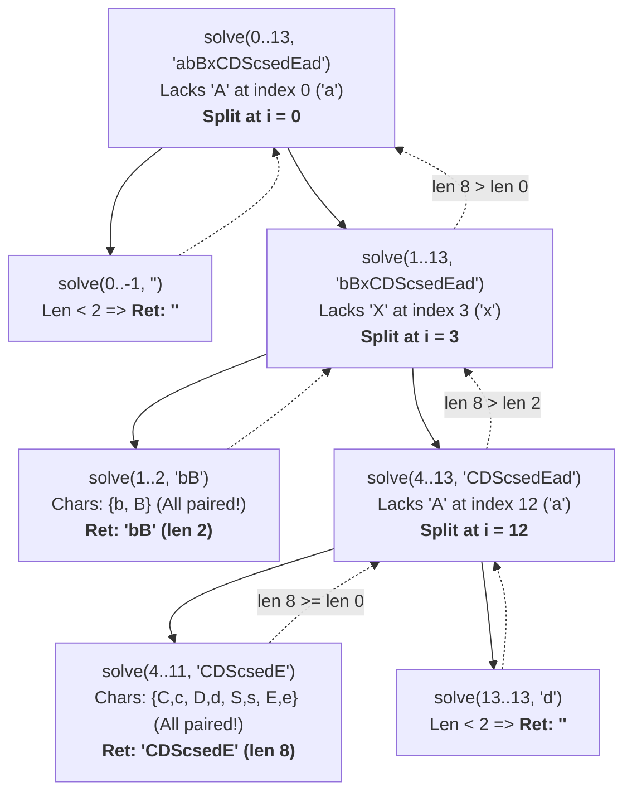

# Divide and Conquer 2: Maximum Subarray Sum & Longest Nice Substring

> [!abstract] Overview
> In this lecture, we apply Divide & Conquer to linear data structures (arrays and strings) where the optimal contiguous range can span across the dividing boundary.
> 1. **Maximum Subarray Sum**: Finding the contiguous subarray with the largest sum in $O(n \log n)$ by analyzing left, right, and crossing segments.
> 2. **Longest Nice Substring**: Finding the longest substring where every letter appears in both upper and lowercase by using invalid characters as partition pivots.
> 
> *Course Reference*: CSE 4403 Lecture 17 (Divide and Conquer - 2).  
> *Simulation Reference*: See [[Divide and Conquer - Maximum Subarray Sum Simulation]] for a full 9-element execution trace.

---

## 1. Maximum Subarray Sum Problem

> [!question] Problem Statement (Slide 2)
> Given an array of $n$ integers `arr` (which may contain both positive and negative values), find the contiguous subarray that has the **maximum sum**, and return that sum.
> 
> **Example**:
> * Array: `[-2, 1, -3, 4, -1, 2, 1, -5, 4]`
> * Maximum Subarray: `[4, -1, 2, 1]` (indices `3..6`)
> * Maximum Sum: $4 + (-1) + 2 + 1 = \mathbf{6}$.

---

### 1.1 The Divide & Conquer Strategy (Slide 3)

When we split the array `arr[l..r]` at midpoint `mid = (l + r) / 2`, **any contiguous subarray must lie in exactly one of three places**:

```
[--------------------- arr[l..r] ---------------------]
[--- Left Half (l..mid) ---] [--- Right Half (mid+1..r) ---]
 1. [=== Left Max ===]
                                2. [=== Right Max ===]
              3. [====== Crossing Max ======]
```

1. **Entirely in the Left Half** (`arr[l..mid]`): Solved recursively $\to$ `left_max`.
2. **Entirely in the Right Half** (`arr[mid+1..r]`): Solved recursively $\to$ `right_max`.
3. **Crossing the Midpoint**: Starts at or before `mid` and ends at or after `mid+1` $\to$ `cross_max`.

The overall answer is simply:
$$\text{Max Subarray Sum} = \max(\text{left\_max}, \text{right\_max}, \text{cross\_max})$$

---

### 1.2 C++ Implementation (Slides 4 & 7)

```cpp
#include <iostream>
#include <vector>
#include <algorithm>
#include <climits>

using namespace std;

//finds max crossing sum in O(n) time
int findCrossing(const vector<int>& arr, int l, int mid, int r) {
    //1. expand leftwards from mid to l
    int left_sum = INT_MIN;
    int sum = 0;
    for (int i = mid; i >= l; i--) {
        sum += arr[i];
        left_sum = max(left_sum, sum);
    }

    //2. expand rightwards from mid+1 to r
    int right_sum = INT_MIN;
    sum = 0;
    for (int i = mid + 1; i <= r; i++) {
        sum += arr[i];
        right_sum = max(right_sum, sum);
    }

    //3. combine best left suffix and best right prefix
    return left_sum + right_sum;
}

//main recursive d&c solver
int maxSubArraySum(const vector<int>& arr, int l, int r) {
    //base case: single element
    if (l == r) {
        return arr[l];
    }

    int mid = l + (r - l) / 2;

    //recurse on left and right halves
    int left_max  = maxSubArraySum(arr, l, mid);
    int right_max = maxSubArraySum(arr, mid + 1, r);

    //find max crossing sum in O(n)
    int cross_max = findCrossing(arr, l, mid, r);

    //combine: max of all three possibilities
    return max({left_max, right_max, cross_max});
}
```

---

### 1.3 Deep Dive: Why Starting Index Matters (Slide 6)

> [!important] Crucial Observation from Slide 6
> A crossing subarray **must be contiguous** and **must cross the boundary between `mid` and `mid+1`**.
> * Therefore, the left portion **MUST end at `mid`** (it is a suffix of `arr[l..mid]`).
> * The right portion **MUST start at `mid+1`** (it is a prefix of `arr[mid+1..r]`).

```
           l                 mid   mid+1               r
Array:   [ . . . . . . . . . . | . . . . . . . . . . . . ]
                               |
         <=== Left Loop ===    |    === Right Loop ===>
         (start at mid, i--)   |    (start at mid+1, i++)
```

#### Step-by-Step Trace of Slide 6 Example:
Let subarray be `arr = [-2, 1, 4, -5]` with `mid = 1` (`arr[mid] = 1`, `arr[mid+1] = 4`):

1. **Left Loop** (starts at `mid=1` down to `l=0`):
   * $i = 1$ (`arr[1] = 1`): `sum = 1`, `left_sum = 1`.
   * $i = 0$ (`arr[0] = -2`): `sum = 1 + (-2) = -1`, `left_sum = max(1, -1) = 1`.
   * Best left suffix = `[1]` (sum = **1**).
2. **Right Loop** (starts at `mid+1=2` up to `r=3`):
   * $i = 2$ (`arr[2] = 4`): `sum = 4`, `right_sum = 4`.
   * $i = 3$ (`arr[3] = -5`): `sum = 4 + (-5) = -1`, `right_sum = max(4, -1) = 4`.
   * Best right prefix = `[4]` (sum = **4**).
3. **Crossing Result**:
   $$\text{cross\_max} = \text{left\_sum} + \text{right\_sum} = 1 + 4 = \mathbf{5} \quad (\text{Subarray } [1, 4])$$

> [!warning] Common Student Mistake in Exams
> * If you start the left loop at `l` going forwards ($i = l \to mid$), you would compute a prefix of the left half.
> * Combining a prefix of the left half with a prefix of the right half **leaves a gap in the middle**, resulting in a non-contiguous subarray (invalid!).
> * **Always start left at `mid` ($i--$) and right at `mid+1` ($i++$)!**

---

### 1.4 Complexity Analysis

#### 1. Time Complexity Recurrence
$$T(n) = 2T\left(\frac{n}{2}\right) + \Theta(n)$$
* $2T(n/2)$: two recursive calls on halves of size $n/2$.
* $\Theta(n)$: `findCrossing()` scans from `mid` down to `l` ($n/2$ steps) and `mid+1` up to `r` ($n/2$ steps) $\implies n$ total iterations.

#### 2. Master Theorem Evaluation
* $a = 2, b = 2, f(n) = \Theta(n^1)$.
* Critical value: $n^{\log_b a} = n^{\log_2 2} = n^1$.
* Since $f(n) = \Theta(n^{\log_b a})$, this is **Case 2** of Master Theorem.
* **Total Time Complexity**: $\mathbf{\Theta(n \log n)}$.

#### 3. Space Complexity
* **Auxiliary Memory**: $O(1)$ extra space (no additional array allocations).
* **Call Stack Memory**: Depth of recursion tree is $1 + \log_2 n \implies \mathbf{O(\log n)}$ stack frames.

---

### 1.5 Intuitive & Exam-Ready Correctness

> [!tip] Why Maximum Subarray D&C Works (Intuitive & Exam-Ready Proof)
> * **Intuition (3-Zone Slice)**: Any continuous slice of an array cut at `mid` must either lie entirely in the left half, entirely in the right half, or straddle across the cut line. Finding the best in each zone and taking the maximum guarantees finding the optimal sum.
> * **Exam-Ready Points**:
>   1. **Exhaustive Partition**: Midpoint `mid` partitions all possible contiguous subarrays into 3 mutually exclusive cases: (a) Left, (b) Right, (c) Crossing `mid`.
>   2. **Induction on Halves**: Left and Right cases are solved recursively by induction on smaller subarrays.
>   3. **Crossing Calculation**: Any crossing subarray must touch both `arr[mid]` and `arr[mid+1]`. It splits into a suffix of the left half and a prefix of the right half. `findCrossing()` independently maximizes both in $O(n)$.
>   4. **Conclusion**: $\max(\text{Left}, \text{Right}, \text{Cross})$ covers 100% of all possible subarray positions.

---

## 2. Longest Nice Substring Problem

> [!question] Problem Statement (Slides 9-11)
> A string $s$ is called **nice** if, for every letter of the alphabet present in $s$, both its **uppercase and lowercase** forms appear in $s$.
> 
> Return the **longest nice substring** of $s$. If multiple exist with the same maximum length, return the earliest occurring one. If none exists, return `""`.
> 
> **Slide Examples**:
> * `s = "aAbBAAA"` $\to$ `"aAbBAAA"` (All letters 'a'/'A' and 'b'/'B' have pairs $\implies$ **Nice**).
> * `s = "Abc"` $\to$ `""` ('A' lacks 'a', 'b' lacks 'B', 'c' lacks 'C' $\implies$ **Not Nice**).
> * `s = "abBxCDScsedEad"` $\to$ Contains nice substrings! Longest is **`"CDScsedE"`** (length 8).

---

### 2.1 Trivial / Brute Force Approach (Slides 12-14)

1. Generate all possible non-empty substrings: $\frac{n(n+1)}{2} = \Theta(n^2)$.
2. For each substring, check if every character has its uppercase and lowercase counterpart:
   - Insert all chars of substring into a `set<char>` or boolean array in $O(m)$ time.
   - For every char $c$, verify both `tolower(c)` and `toupper(c)` exist in the set.
3. **Total Brute Force Complexity**: $\mathbf{O(n^3)}$ (or $O(n^2)$ with rolling frequency tables).

---

### 2.2 The Divide & Conquer Pivot Insight

> [!tip] The "Impassable Barrier" Principle
> Suppose character $c = s[k]$ in current segment $s[l..r]$ **lacks its uppercase/lowercase pair in $s[l..r]$**.
> * Can $s[k]$ be part of **any valid nice substring** within $s[l..r]$? **NO!**
> * Because if a nice substring contained $s[k]$, it would also have to contain its pair. But that pair does not even exist in the entire segment $s[l..r]$!
> * Therefore, index $k$ acts as a **brick wall (partition pivot)**. Any valid nice substring must lie strictly to the left ($s[l..k-1]$) or strictly to the right ($s[k+1..r]$).

---

### 2.3 C++ Implementation (Slide 15)

```cpp
#include <iostream>
#include <string>
#include <unordered_set>
#include <algorithm>

using namespace std;

string solveNice(const string& s, int l, int r) {
    //base case: need at least 2 characters to form a pair
    if (r - l + 1 < 2) return "";

    //step 1: record all unique characters present in current window s[l..r]
    unordered_set<char> present(s.begin() + l, s.begin() + r + 1);

    //step 2: find the first character lacking its case pair
    for (int i = l; i <= r; i++) {
        char c = s[i];
        char lower_c = tolower(c);
        char upper_c = toupper(c);

        //if either uppercase or lowercase form is missing, split around index i
        if (present.find(lower_c) == present.end() || present.find(upper_c) == present.end()) {
            string left_ans  = solveNice(s, l, i - 1);
            string right_ans = solveNice(s, i + 1, r);

            //combine: return the longer nice substring (prefer left in tie)
            return (left_ans.size() >= right_ans.size()) ? left_ans : right_ans;
        }
    }

    //step 3: if every character has its pair, the whole segment is nice!
    return s.substr(l, r - l + 1);
}

string longestNiceSubstring(string s) {
    if (s.length() < 2) return "";
    return solveNice(s, 0, s.length() - 1);
}
```

---

### 2.4 Slide 16 Complete Solution: "How Does the Tree Look Like?"

Let us trace the exact lecture string `s = "abBxCDScsedEad"` ($n = 14$, indices `0..13`):



#### Step-by-Step Call Trace Table:

| Call | Substring Range | Present Characters | Missing Partner Check | Result |
| :--- | :--- | :--- | :--- | :--- |
| `solve(0..13)` | `"abBxCDScsedEad"` | `a,b,B,x,C,D,S,c,s,e,d,E` | `'a'` at $i=0$ lacks `'A'` $\to$ **Split at $i=0$** | `"CDScsedE"` |
| `solve(0..-1)` | `""` | $\emptyset$ | Length $< 2$ | `""` |
| `solve(1..13)` | `"bBxCDScsedEad"` | `b,B,x,C,D,S,c,s,e,d,E,a` | `'x'` at $i=3$ lacks `'X'` $\to$ **Split at $i=3$** | `"CDScsedE"` |
| `solve(1..2)` | `"bB"` | `b, B` | Both `'b'` and `'B'` present! | **`"bB"`** |
| `solve(4..13)` | `"CDScsedEad"` | `C,D,S,c,s,e,d,E,a,d` | `'a'` at $i=12$ lacks `'A'` $\to$ **Split at $i=12$** | `"CDScsedE"` |
| `solve(4..11)` | `"CDScsedE"` | `C,c, D,d, S,s, E,e` | All 4 character pairs present! | **`"CDScsedE"`** |
| `solve(13..13)`| `"d"` | `d` | Length $< 2$ | `""` |

* **Final Winner**: `"CDScsedE"` with length **8**!

---

### 2.5 Complexity Analysis

#### 1. Time Complexity
* **Best Case**: Whole string is already nice. $O(n)$ to build set and verify pairs $\implies \mathbf{O(n)}$.
* **Average Case**: Balanced splits near midpoint. $T(n) = 2T(n/2) + O(n) \implies \mathbf{O(n \log n)}$.
* **Worst Case (Slide Implementation)**: String with repeated invalid character (e.g. `s = "aaaaa..."`). Peels off 1 character per level $\implies \sum_{i=1}^n i = \mathbf{O(n^2)}$.
* **Optimized Alphabet Bound**:
  * There are only $K = 26$ unique letters in the English alphabet.
  * Each split on an invalid character permanently removes at least one distinct letter from consideration.
  * Thus, maximum recursion depth is bounded by $\le 26$.
  * Total time bound: $O(26 \cdot n) = \mathbf{O(n)}$ linear time!

#### 2. Space Complexity
* **Auxiliary Space**: Character set has at most $|\Sigma| \le 52$ elements $\implies O(1)$ extra space.
* **Call Stack**: $O(n)$ worst-case depth, $O(\log n)$ average depth.
* **Total Space Complexity**: $\mathbf{O(n)}$ worst case due to recursion call stack.

---

### 2.6 Intuitive & Exam-Ready Correctness

> [!tip] Why Longest Nice Substring D&C Works (Intuitive & Exam-Ready Proof)
> * **Intuition (The Brick Wall)**: If a character `'x'` lacks `'X'` anywhere in the string segment, no valid nice substring can contain `'x'` because it could never satisfy the pairing requirement. Thus `'x'` is an impenetrable barrier; any nice substring must lie entirely to its left or entirely to its right.
> * **Exam-Ready Points (Contradiction)**:
>   1. **Assumption**: Suppose a nice substring $N$ contains index $k$ where $s[k]$ lacks its pair in string $S$.
>   2. **Contradiction**: $N$ being nice means $\text{pair}(s[k]) \in N \subseteq S \implies \text{pair}(s[k]) \in S$, which directly contradicts that $S$ lacks the pair.
>   3. **Conclusion**: No nice substring contains index $k$. Splitting $S$ into $s[l..k-1]$ and $s[k+1..r]$ preserves all potential nice substrings.
