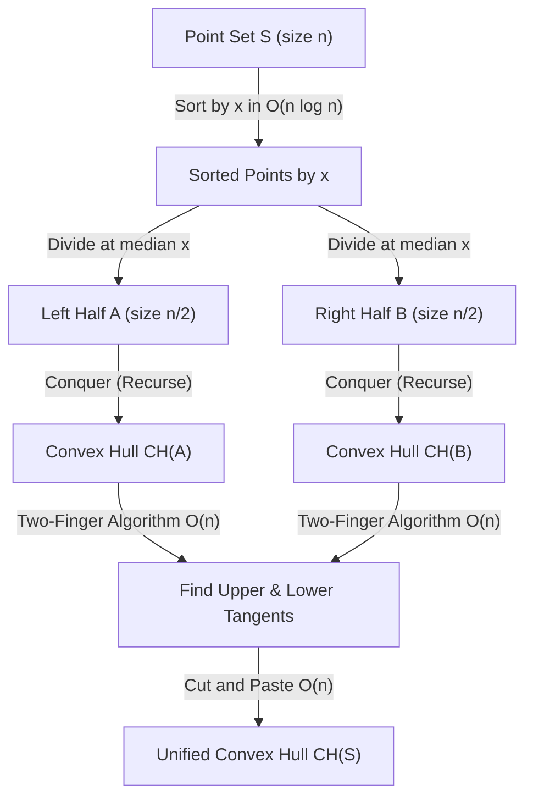
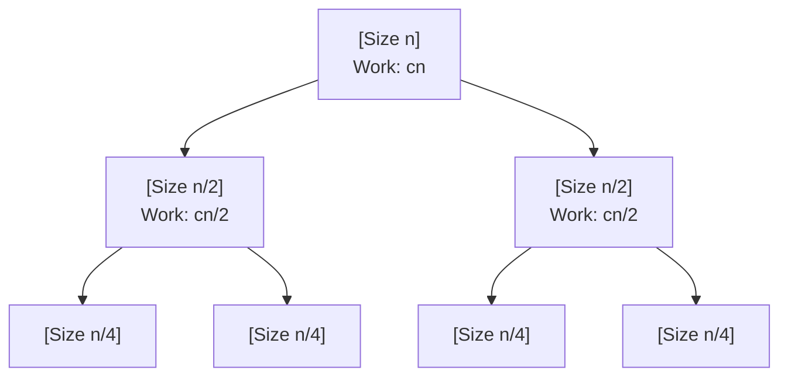
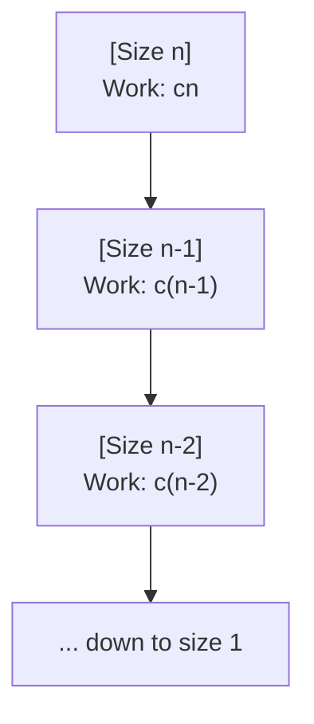

# Divide and Conquer 3: Convex Hull & Quick Sort

> [!abstract] Overview
> This lecture explores two sophisticated applications of Divide and Conquer:
> 1. **Convex Hull (Geometric D&C)**: Solving the foundational 2D computational geometry problem in $O(n \log n)$ by recursively finding sub-hulls and merging them via the Two-Finger tangent algorithm.
> 2. **Quick Sort (Partition-based D&C)**: An algorithm where the **SPLIT step does all the smart work** ($O(n)$), while the **COMBINE step is free** ($O(1)$).
> 
> *Course Reference*: CSE 4403 Lecture 18 (Divide and Conquer - 3).

---

## 1. Convex Hull Problem (Computational Geometry)

### 1.1 Geometric Definition & Intuition (Slides 2-3)

> [!info] Definition
> In geometry, the **Convex Hull** $CH(S)$ of a set of points $S$ in a 2D plane is the **smallest convex polygon** (convex envelope/closure) that contains all points in $S$.
> 
> *The Rubber Band Analogy*: Imagine points as nails hammered into a flat wooden board. If you stretch a rubber band around all nails and release it, the taut boundary formed by the rubber band is the convex hull.

```
              p2 (top nail)
            .    .
    p1    .        .    p3
    .   p6 (inside)  p7 .
     .                 .
       p5------------p4
```

---

### 1.2 Problem Statement & Assumptions (Slide 4)

* **Input**: A set of $n$ points in a 2D plane:
  $$S = \{(x_i, y_i) \mid i = 1, 2, \dots, n\}$$
* **Assumptions** (General Position / No Edge-Case Degeneracies):
  1. No two points have the same $x$-coordinate ($x_i \ne x_j$).
  2. No two points have the same $y$-coordinate ($y_i \ne y_j$).
  3. No three points are collinear (no straight 3-point lines).
* **Output**: The sequence of boundary points forming the convex polygon $CH(S)$ ordered in **clockwise sequence**.

---

### 1.3 Brute Force Approach (Slide 5)

> [!note] Brute Force Mechanics
> 1. For every pair of points $(p_i, p_j)$:
>    * Construct a directed line segment $L(p_i, p_j)$.
>    * Check if all other $n - 2$ points lie entirely on **one side** (e.g., right side) of the line.
>    * If yes $\implies (p_i, p_j)$ is an edge on the boundary of the Convex Hull.
>    * If points lie on both sides $\implies (p_i, p_j)$ is internal and not on the hull.
> 2. **Complexity**:
>    * Total pairs of points = $\binom{n}{2} = \frac{n(n-1)}{2} = O(n^2)$.
>    * Checking $n - 2$ points per pair takes $O(n)$ time.
>    * **Total Brute Force Time Complexity**: $O(n^2) \times O(n) = \mathbf{O(n^3)}$.

---

### 1.4 Divide & Conquer Convex Hull Algorithm (Slide 6)



#### Algorithm Steps:
1. **Pre-processing (Sort)**: Sort all points by $x$-coordinate in $O(n \log n)$ time (using Merge Sort or $O(n)$ with Radix Sort).
2. **Divide**: Partition the sorted set $S$ into left half $A$ and right half $B$ by the median vertical line $x = x_{mid}$.
3. **Conquer**: Recursively compute $CH(A)$ and $CH(B)$.
   - *Base Case*: If $|S| \le 3$, compute the convex hull directly using brute force in $O(1)$ time.
4. **Combine (Merge)**:
   - Find the **Upper Tangent** and **Lower Tangent** between $CH(A)$ and $CH(B)$ using the **Two-Finger Algorithm** in $O(n)$ time.
   - Discard the internal vertices between the two tangents using the **Cut and Paste Method** in $O(n)$ time.

---

### 1.5 Deep Dive: Two-Finger Algorithm & Slide 8 $y(i, j)$ Maximization

> [!important] Crucial Concept from Slide 8
> *"Picking the max $y$ for both hulls is NOT enough. We need to maximize $y(i, j)$."*
> 
> Simply connecting the highest point in $A$ with the highest point in $B$ might produce a line that cuts through one of the hulls! We must find the line segment $(a_i, b_j)$ that passes completely **above** all vertices of both hulls.

```
       CH(A)                                 CH(B)
        a4 ----------------(Upper Tangent)------------ b2
      /    \                                        /    \
    a5      a1                                    b1      b3
      \    /                  |                     \    /
        a2 ----------------(Lower Tangent)------------ b4
        (Left Hull)    Vertical Line (x = x_mid)   (Right Hull)
```

#### Definition of $y(i, j)$:
Let $x = x_{mid}$ be the vertical dividing line separating $CH(A)$ and $CH(B)$.  
For any choice of vertex $a_i \in CH(A)$ and $b_j \in CH(B)$, the line passing through $(a_i, b_j)$ intersects the vertical line $x = x_{mid}$ at height:
$$y(i, j) = y_{a_i} + (x_{mid} - x_{a_i}) \frac{y_{b_j} - y_{a_i}}{x_{b_j} - x_{a_i}}$$

* The **Upper Tangent** corresponds to the pair $(i, j)$ that **maximizes** $y(i, j)$.
* The **Lower Tangent** corresponds to the pair $(i, j)$ that **minimizes** $y(i, j)$.

---

#### Step-by-Step Two-Finger Algorithm (Slide 8):
1. **Initialize**:
   * Start with $a = \text{rightmost point of } CH(A)$ (maximum $x$ in $A$).
   * Start with $b = \text{leftmost point of } CH(B)$ (minimum $x$ in $B$).
2. **Iterative Ascent**:
   * **Step $B$ Clockwise**: Move $b$ clockwise on $CH(B) \to$ update $b$ if the line $(a, b_{next})$ increases $y(i, j)$ (i.e. line cuts through hull $B$).
   * **Step $A$ Counter-Clockwise**: Move $a$ anti-clockwise on $CH(A) \to$ update $a$ if the line $(a_{next}, b)$ increases $y(i, j)$ (i.e. line cuts through hull $A$).
3. **Repeat**: Alternate adjusting $b$ and $a$ until neither can move further without decreasing $y(i, j)$. The algorithm has converged to the **Upper Tangent**!
4. **Lower Tangent**: Symmetrically find the lower tangent by stepping $b$ counter-clockwise and $a$ clockwise to minimize $y(i, j)$.

---

### 1.6 Cut and Paste Merge Step (Slide 9)

Once the Upper Tangent $(a_u, b_u)$ and Lower Tangent $(a_l, b_l)$ are determined:

```
        a4 ---------------------------- b2
       /  \ (discard a5, a1)   (discard b1) \
      a3                                     b3
       \  /                                 /
        a2 ---------------------------- b4
```

#### Slide 9 Exact Traversal Sequence:
Let $a = \{a_1, a_2, a_3, a_4, a_5\}$ and $b = \{b_1, b_2, b_3\}$.  
Upper Tangent = $(a_4, b_2)$ [denoted $y(4, 2)$]. Lower Tangent = $(a_2, b_3)$ [denoted $y(2, 3)$].

1. Start at the left upper tangent point: **$a_4$**.
2. Cross the Upper Tangent bridge to **$b_2$**.
3. Walk **clockwise** along $CH(B)$ from $b_2$ until reaching the right lower tangent point: **$b_3$**.
4. Cross the Lower Tangent bridge to **$a_2$**.
5. Walk **clockwise** along $CH(A)$ from $a_2 \to a_3 \to a_4$ until reaching the starting point: **$a_4$**.
6. **Resulting Polygon**: $a_4 \to b_2 \to b_3 \to a_2 \to a_3 \to a_4$.
7. All internal vertices ($a_5, a_1, b_1$) fall inside and are permanently discarded!

---

### 1.7 Complexity Analysis of Convex Hull D&C (Slide 10)

#### 1. Pre-sorting Time:
* Using Merge Sort: $O(n \log_2 n)$.
* Using Radix Sort (if coordinates are bounded integers): $O(n)$.

#### 2. Divide & Conquer Recurrence:
* **Divide**: Midpoint split in $O(1)$.
* **Solve**: Two recursive subproblems of size $n/2 \implies 2T(n/2)$.
* **Combine**:
  * Two-Finger tangent search: each vertex is traversed at most once $\implies O(n)$.
  * Cut and paste merging: $O(n)$.
  * Total Combine Work = $O(n)$.

$$T(n) = 2T\left(\frac{n}{2}\right) + O(n)$$

#### 3. Master Theorem Solution:
* $a = 2, b = 2, f(n) = O(n) \implies n^{\log_2 2} = n^1$.
* Falls into **Case 2** $\implies T(n) = \mathbf{O(n \log_2 n)}$.
* **Overall Time Complexity**: $\text{Pre-sorting } O(n \log n) + \text{D&C } O(n \log n) = \mathbf{O(n \log n)}$.
* **Space Complexity**: $\mathbf{O(n)}$ auxiliary space to store polygon vertices $+ O(\log n)$ call stack frames.

---

### 1.8 Intuitive & Exam-Ready Correctness

> [!tip] Why Two-Finger Tangent Convergence Works (Intuitive & Exam-Ready Proof)
> * **Intuition (Rope Walking Over Islands)**: Anchoring a rope between two islands and sliding either end upwards whenever land touches the rope naturally lifts the rope to the highest bridge where both islands sit completely underneath.
> * **Exam-Ready Points**:
>   1. **Unimodal Curve**: The line intercept height $y(i, j)$ at vertical boundary $x = x_{mid}$ is a single-peak (concave) function over the cyclic vertices.
>   2. **Monotonic Step**: Stepping $b$ clockwise on $CH(B)$ or $a$ counter-clockwise on $CH(A)$ whenever the line cuts through a hull strictly increases $y(i, j)$.
>   3. **Global Convergence**: Since the domain has no local traps, the two-finger ascent terminates at the unique maximum $y(i, j)$, corresponding to the global Upper Tangent in $O(|A| + |B|) = O(n)$ steps.

---

## 2. Quick Sort Algorithm

> [!info] The Dual of Merge Sort
> * In **Merge Sort**: Split is trivial ($O(1)$), Combine does all the work ($O(n)$).
> * In **Quick Sort**: **Split does all the work ($O(n)$ partitioning)**, Combine is completely free ($O(1)$).

---

### 2.1 Recursive Structure (Slide 11)

```cpp
#include <iostream>
#include <vector>

using namespace std;

//forward declaration of partition
int partition(vector<int>& arr, int low, int high);

//quicksort recursive function
void quickSort(vector<int>& arr, int low, int high) {
    if (low < high) {
        //pi is partition return index of pivot
        int pi = partition(arr, low, high);

        //recursion calls for smaller elements and greater elements
        quickSort(arr, low, pi - 1);
        quickSort(arr, pi + 1, high);
    }
}
```

---

### 2.2 Lomuto's Partition Scheme (Slide 12)

```cpp
//lomuto's partition function
int partition(vector<int>& arr, int low, int high) {
    //choose the rightmost element as pivot
    int pivot = arr[high];

    //index of smaller element (indicates right boundary of elements < pivot)
    int i = low - 1;

    //traverse arr[low..high-1] and move all smaller elements to the left side
    for (int j = low; j <= high - 1; j++) {
        //if current element is smaller than pivot
        if (arr[j] < pivot) {
            i++;
            swap(arr[i], arr[j]);
        }
    }

    //move pivot after smaller elements and return its final sorted position
    swap(arr[i + 1], arr[high]);
    return i + 1;
}
```

---

### 2.3 Step-by-Step Trace of Lomuto's Partition

Let us trace `arr = [10, 80, 30, 90, 40, 50, 70]` with `low = 0, high = 6`:
* **Pivot**: `arr[6] = 70`. Initial `i = low - 1 = -1`.

| $j$ | `arr[j]` | `arr[j] < 70`? | Action Taken | Array State after Step | $i$ |
| :---: | :---: | :---: | :--- | :--- | :---: |
| 0 | 10 | **Yes** | `i++ (0)`, `swap(arr[0], arr[0])` | `[10, 80, 30, 90, 40, 50, 70]` | 0 |
| 1 | 80 | **No** | None ($j$ advances) | `[10, 80, 30, 90, 40, 50, 70]` | 0 |
| 2 | 30 | **Yes** | `i++ (1)`, `swap(arr[1], arr[2])` | `[10, 30, 80, 90, 40, 50, 70]` | 1 |
| 3 | 90 | **No** | None ($j$ advances) | `[10, 30, 80, 90, 40, 50, 70]` | 1 |
| 4 | 40 | **Yes** | `i++ (2)`, `swap(arr[2], arr[4])` | `[10, 30, 40, 90, 80, 50, 70]` | 2 |
| 5 | 50 | **Yes** | `i++ (3)`, `swap(arr[3], arr[5])` | `[10, 30, 40, 50, 80, 90, 70]` | 3 |
| — | — | **End** | `swap(arr[i+1], arr[high])` $\to$ `swap(arr[4], arr[6])` | `[10, 30, 40, 50, 70, 90, 80]` | 3 |

* **Returned Pivot Index**: `pi = i + 1 = 4`.
* Element **`70`** is now at index 4 in its **permanent sorted position**:
  - All elements at indices `0..3` (`[10, 30, 40, 50]`) are $< 70$.
  - All elements at indices `5..6` (`[90, 80]`) are $> 70$.

---

### 2.4 Lomuto vs. Hoare Partition Comparison

| Feature | Lomuto's Partition | Hoare's Partition |
| :--- | :--- | :--- |
| **Pivot Position** | Usually rightmost `arr[high]` | Usually leftmost `arr[low]` or middle |
| **Pointers** | 2 pointers moving in **same direction** ($i, j \to$) | 2 pointers moving **inward from ends** ($\to i, j \leftarrow$) |
| **Number of Swaps** | More swaps (swaps on every element $< \text{pivot}$) | Fewer swaps (on average $3\times$ fewer swaps) |
| **Pivot Final Position** | Pivot placed at exact return index `pi` | Pivot not necessarily placed at return index |
| **Simplicity** | Very easy to understand, trace, and prove | Slightly more subtle edge cases |

---

### 2.5 Complexity Analysis of Quick Sort

#### 1. Best-Case Analysis (Balanced Splits)
* Pivot splits array into two equal halves of size $n/2$.
* Recurrence: $T(n) = 2T(n/2) + \Theta(n)$.
* Tree depth: $\log_2 n$. Work per level: $\Theta(n)$.
* **Best-Case Time**: $\mathbf{\Omega(n \log n)}$.



#### 2. Worst-Case Analysis (Unbalanced Splits)
* Occurs when array is already sorted (ascending/descending) and pivot is picked as the extreme element.
* Subproblem sizes: $0$ and $n - 1$.
* Recurrence:
  $$T(n) = T(n - 1) + \Theta(n) = T(n - 2) + (n - 1) + n = \sum_{k=1}^n k = \frac{n(n + 1)}{2} = \mathbf{O(n^2)}$$



#### 3. Average-Case Analysis
* Under random permutations, splits are balanced (e.g. 9:1 or 1:1).
* **Average-Case Time**: $\mathbf{\Theta(n \log n)}$.

#### 4. Space Complexity Analysis
* Quick Sort sorts **in-place** ($O(1)$ auxiliary memory).
* **Call Stack Depth**:
  * Best/Average Case: $O(\log n)$ stack frames.
  * Worst Case: $O(n)$ stack frames.

---

### 2.6 Intuitive & Exam-Ready Correctness

> [!tip] Why Lomuto Partition Works (Intuitive & Exam-Ready Proof)
> * **Intuition (The Movable Fence)**: Pointer $i$ acts as a fence. Everything to the left of $i$ is smaller than the pivot. When pointer $j$ encounters an element smaller than the pivot, we shift the fence ($i++$) and swap the small element behind it. At the end, placing the pivot at $i+1$ puts it in its final sorted position.
> * **Exam-Ready Points**:
>   1. **Loop Invariant**: At step $j$: (a) `arr[low..i] < pivot`, (b) `arr[i+1..j-1] >= pivot`, (c) `arr[high] == pivot`.
>   2. **Maintenance**:
>      - `arr[j] >= pivot`: $j$ increments, large element range expands.
>      - `arr[j] < pivot`: $i++$, swap `arr[i]` and `arr[j]`, small element range expands.
>   3. **Termination**: At $j = high$, swapping `arr[i+1]` with `arr[high]` places the pivot in its permanent spot, with smaller elements on the left and larger on the right.
