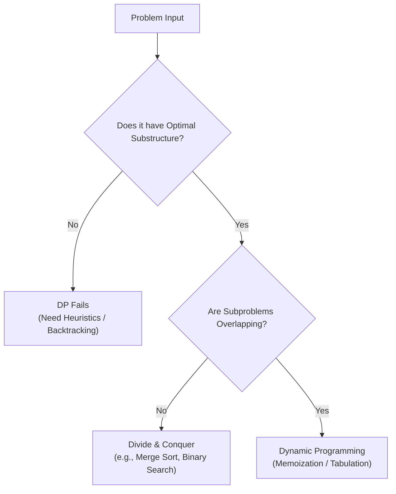
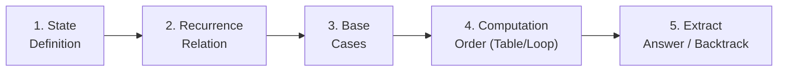
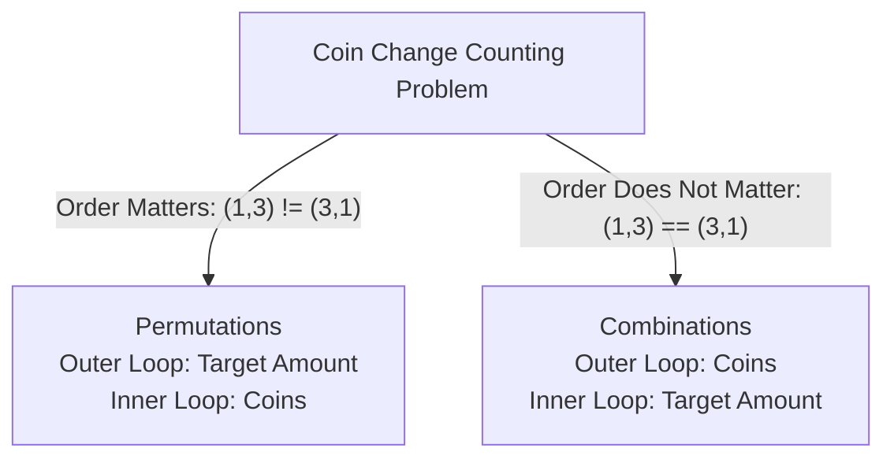
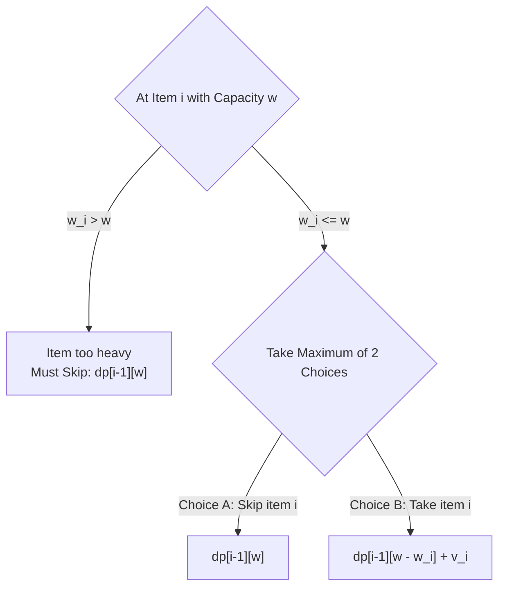
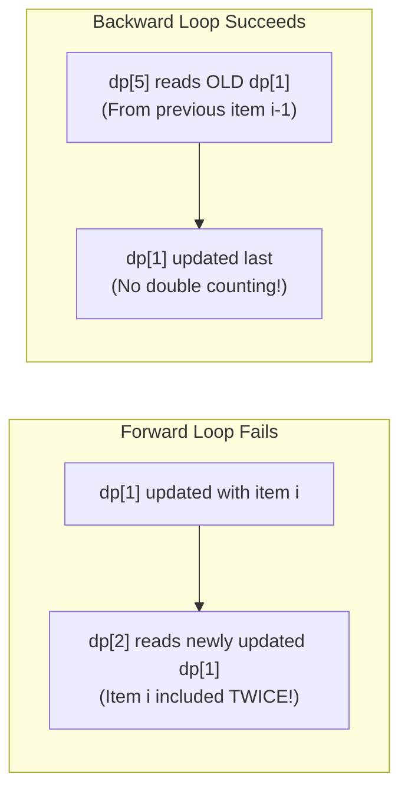
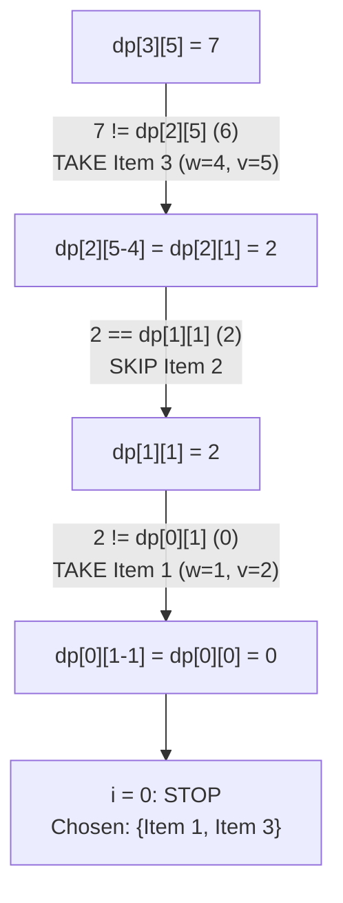
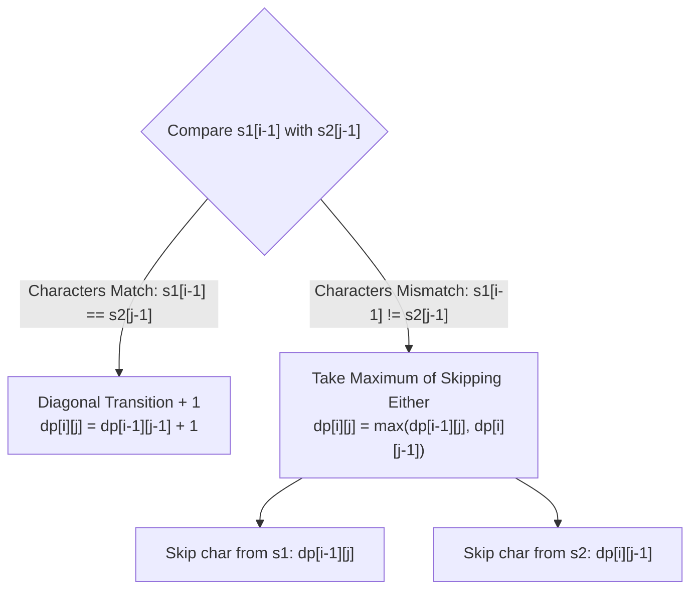
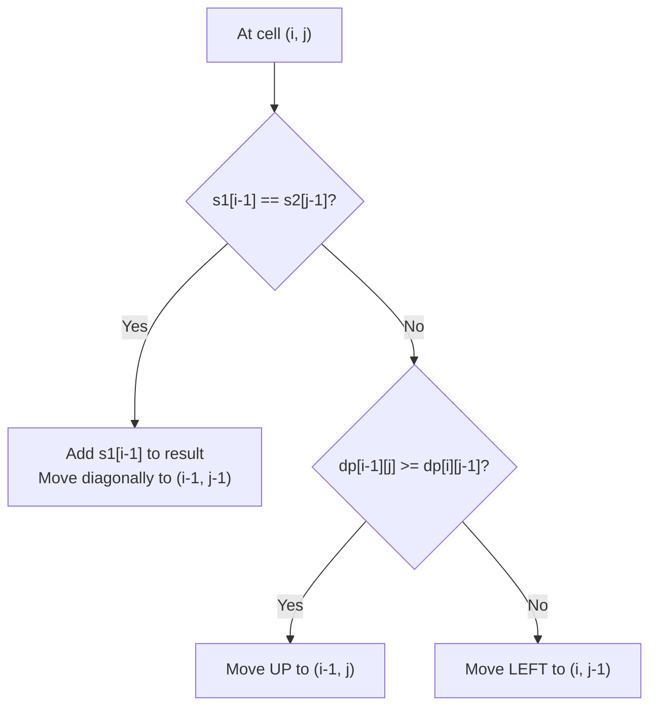
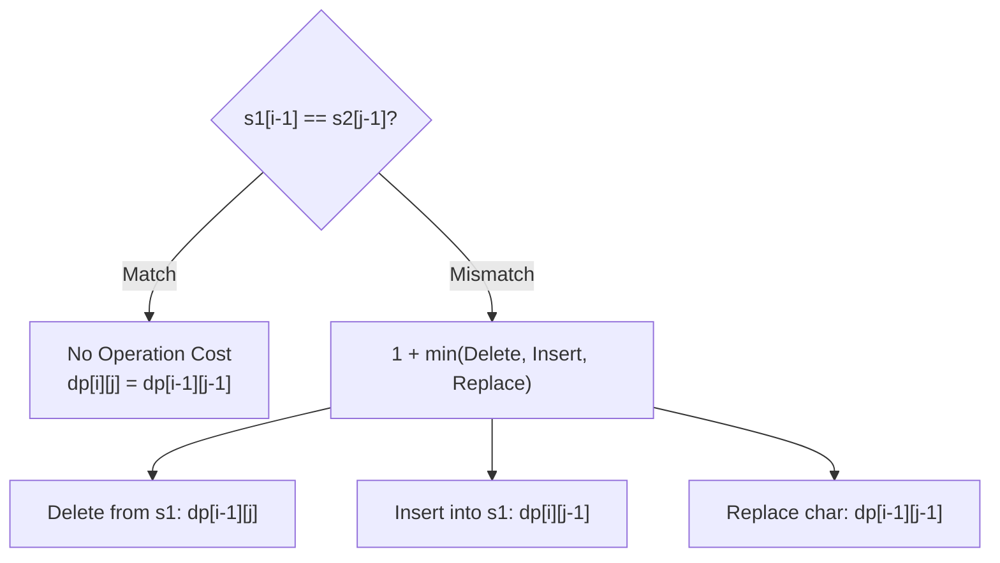
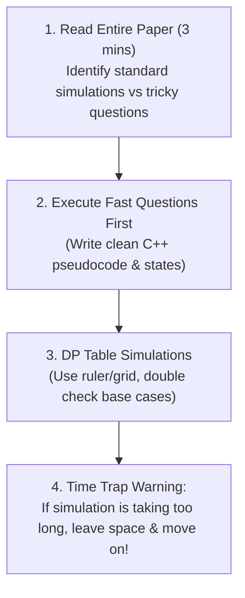

# 🧩 Dynamic Programming — Part III: Advanced State Formulations & Reconstruction

> [!abstract] Overview & Scope
> This guide covers the core topics of **Dynamic Programming — III** (Lectures 14 & 15). It focuses on building deep intuitive understanding, mastering loop direction mechanics, simulating tables step-by-step, reconstructing optimal solutions via backtracking, and mastering exam-focused problem solving.
>
> **Core Topics Covered:**
> 1. **The DP Paradigm & Recipe**: Overlapping subproblems, optimal substructure, and the 5-step problem-solving framework.
> 2. **Coin Change Variations**: Number of Permutations (order matters) vs. Number of Combinations (order does not matter / loop reversal trick).
> 3. **0/1 Knapsack Problem**: 2D formulation, the $i-1$ invariant, 1D backward loop optimization, and full state reconstruction.
> 4. **Longest Common Subsequence (LCS)**: Top-down vs bottom-up formulations, 2D table dynamics, string reconstruction, and recurrence intuition.
> 5. **Edit Distance (Levenshtein Distance)**: Transition dynamics across insertion, deletion, and substitution.
> 6. **Master Synthesis & Exam Survival Guide**: Comparison tables, time/space derivations, and exam execution strategies.

---

## 0. Fundamental Concepts: The DP Paradigm



### The Two Invariant Ingredients of DP

To determine if a problem can be solved efficiently using Dynamic Programming, it must satisfy two essential properties:

1. **Overlapping Subproblems**:
   - The same subproblems are encountered repeatedly during the recursive expansion of the problem.
   - Standard recursion solves identical subproblems from scratch exponentially many times. DP solves each subproblem **exactly once**, memoizes the result in a table, and performs $O(1)$ lookups for subsequent calls.
   - *Contrast:* Merge Sort divides an array into non-overlapping halves; hence DP provides no asymptotic benefit over standard Divide & Conquer.

2. **Optimal Substructure**:
   - An optimal solution to the overall problem can be constructed directly from the optimal solutions of its subproblems.
   - *Example:* The shortest path from $u$ to $v$ passing through $w$ consists of the shortest path from $u$ to $w$ combined with the shortest path from $w$ to $v$.

---

### The 5-Step DP Recipe

Every Dynamic Programming solution follows a structured sequence:



1. **Define the State**: What do the subproblem parameters represent? (e.g., $dp[i][w]$ = max value using a subset of items $\{1, \dots, i\}$ with weight limit $w$).
2. **Define the Recurrence Relation**: How do you express the answer to the current state as a function of already solved smaller states?
3. **Identify the Base Cases**: What are the trivial, boundary subproblems that require no further decomposition? (e.g., $dp[0][w] = 0$, $dp[i][0] = 0$).
4. **Determine Computation Order**: In what order must the table be populated so that required sub-states are always calculated before they are accessed? (Top-Down with Memoization vs. Bottom-Up Tabulation).
5. **Return the Goal State / Reconstruct**: Extract the value at the terminal state (e.g., $dp[n][W]$) or trace decisions backward to retrieve the optimal solution set.

---

## 1. Coin Change Variations: Permutations vs. Combinations

A subtle change in problem constraints completely transforms the state transition and the required loop ordering.



---

### 1.1 Problem 1: Number of Permutations (Order Matters)

> [!note] Problem Definition
> Given a set of coin denominations $C = \{c_1, c_2, \dots, c_n\}$ and a target amount $X$, find the total number of ordered sequences (permutations) of coins that sum exactly to $X$. Coins can be reused an unlimited number of times.
>
> *Example:* For coins $\{1, 3, 4\}$ and target $4$, sequences $[1, 3]$ and $[3, 1]$ are counted as **two distinct ways**.

#### DP Formulation
- **State:** $dp[x]$ = Total number of ordered sequences summing to amount $x$.
- **Base Case:** $dp[0] = 1$ (There is exactly 1 way to make amount 0: use an empty set of coins).
- **Recurrence Relation:**
  $$dp[x] = \sum_{c \in C, \, c \le x} dp[x - c]$$
- **Loop Ordering:** **Amount in the outer loop**, **Coins in the inner loop**.

> [!info]- 💡 Deep Intuition: Why Amount Outer Gives Permutations
> When computing $dp[x]$, we iterate through all available coins. Any coin $c \le x$ can serve as the **very last coin** placed in the sequence. 
> - If the last coin is $1$, the preceding sequence must sum to $x - 1$ (counted in $dp[x - 1]$).
> - If the last coin is $3$, the preceding sequence must sum to $x - 3$ (counted in $dp[x - 3]$).
>
> Because we aggregate across all possible final coins at each step $x$, a sequence ending in $1$ (like $[3, 1]$) and a sequence ending in $3$ (like $[1, 3]$) are accumulated independently from $dp[3]$ and $dp[1]$. Thus, all distinct orderings are naturally preserved and counted.

---

#### Step-by-Step Simulation: Coins = $\{1, 3, 4\}$, Target = $6$

> [!example]- 📊 Step-by-Step State Trace (Target = 6)
> Initial array: $dp[0] = 1$, all other $dp[x] = 0$.
>
> 1. **$x = 1$**:
>    - Coin $1$: $dp[1] += dp[1 - 1] = dp[0] = 1 \implies \mathbf{dp[1] = 1}$ ($[1]$)
> 2. **$x = 2$**:
>    - Coin $1$: $dp[2] += dp[2 - 1] = dp[1] = 1 \implies \mathbf{dp[2] = 1}$ ($[1, 1]$)
> 3. **$x = 3$**:
>    - Coin $1$: $dp[3] += dp[2] = 1$
>    - Coin $3$: $dp[3] += dp[0] = 1 \implies \mathbf{dp[3] = 2}$ ($[1, 1, 1], [3]$)
> 4. **$x = 4$**:
>    - Coin $1$: $dp[4] += dp[3] = 2$ ($[1,1,1,1], [3,1]$)
>    - Coin $3$: $dp[4] += dp[1] = 1$ ($[1,3]$)
>    - Coin $4$: $dp[4] += dp[0] = 1$ ($[4]$)
>    - $\mathbf{dp[4] = 2 + 1 + 1 = 4}$
> 5. **$x = 5$**:
>    - Coin $1$: $dp[5] += dp[4] = 4$
>    - Coin $3$: $dp[5] += dp[2] = 1$
>    - Coin $4$: $dp[5] += dp[1] = 1$
>    - $\mathbf{dp[5] = 4 + 1 + 1 = 6}$
> 6. **$x = 6$**:
>    - Coin $1$: $dp[6] += dp[5] = 6$
>    - Coin $3$: $dp[6] += dp[3] = 2$
>    - Coin $4$: $dp[6] += dp[2] = 1$
>    - $\mathbf{dp[6] = 6 + 2 + 1 = \mathbf{9}}$
>
> **Final Answer:** There are **9 distinct permutations** that sum to 6.

---

### 1.2 Problem 2: Number of Combinations (Order Does NOT Matter)

> [!note] Problem Definition
> Given coin denominations $C = \{c_1, c_2, \dots, c_n\}$ and target amount $X$, find the number of unordered multisets (combinations) that sum to $X$. Coins can be reused infinitely.
>
> *Example:* For coins $\{1, 3\}$ and target $4$, the multiset $\{1, 1, 1, 1\}$ and $\{1, 3\}$ are the **only 2 combinations**. The sequence $[3, 1]$ is identical to $[1, 3]$ and is **not** counted again.

#### The Loop Reversal Trick
To count combinations instead of permutations, **reverse the nesting order of the loops**:
- **Outer Loop:** Iterate through each coin $c_i \in C$.
- **Inner Loop:** Iterate target amount $x$ from $c_i$ up to $X$.

```cpp
//combinations: coin outer, amount inner
vector<int> dp(target + 1, 0);
dp[0] = 1;

for (int coin : coins) {
    for (int x = coin; x <= target; x++) {
        dp[x] += dp[x - coin];
    }
}
```

> [!info] 💡 Deep Intuition: Why Coin Outer Gives Combinations (Slide 10)
> When you process one coin fully before moving to the next, each combination is built in exactly **one canonical order — smallest coin first**.
> - So $\{1, 3\}$ is only ever built as *"ways to make 3 using coin=1, then add coin=3"*.
> - The reverse order $\{3, 1\}$ is **never separately constructed** because coin 1 is completely finished before coin 3 is ever considered.

---

#### 2D Dynamic Programming Formulation of Combinations

- **State:** $dp[i][x]$ = Number of combinations to make amount $x$ using a subset of the first $i$ coin denominations $\{c_1, c_2, \dots, c_i\}$.
- **Base Cases:**
  - $dp[i][0] = 1$ for all $0 \le i \le n$ (1 way to form 0: take nothing).
  - $dp[0][x] = 0$ for all $x > 0$ (0 ways to form positive amount with 0 coin types).
- **Recurrence Relation:**
  $$dp[i][x] = dp[i-1][x] + \begin{cases} dp[i][x - c_i] & \text{if } x \ge c_i \\ 0 & \text{if } x < c_i \end{cases}$$
  - $dp[i-1][x]$: Combinations to make $x$ **without** using coin $c_i$ at all.
  - $dp[i][x - c_i]$: Combinations to make $x$ using **at least one** coin $c_i$ (remaining amount $x - c_i$ can still use coin $c_i$, hence $dp[i][\dots]$).

> [!example]- 📊 2D Table Trace: Coins = $\{1, 3, 4\}$, Target = $5$ (Slide 13)
>
> | $i$ \ Amount ($x$) | 0 | 1 | 2 | 3 | 4 | 5 |
> | :---: | :---: | :---: | :---: | :---: | :---: | :---: |
> | **0 (No coins)** | 1 | 0 | 0 | 0 | 0 | 0 |
> | **1 ($c_1 = 1$)** | 1 | 1 | 1 | 1 | 1 | 1 |
> | **2 ($c_2 = 3$)** | 1 | 1 | 1 | 2 | 2 | 2 |
> | **3 ($c_3 = 4$)** | 1 | 1 | 1 | 2 | 3 | **3** |
>
> **Detailed cell updates for Row 3 ($c_3 = 4$):**
> - $dp[3][0] = 1$
> - $dp[3][1] = dp[2][1] = 1$
> - $dp[3][2] = dp[2][2] = 1$
> - $dp[3][3] = dp[2][3] = 2$
> - $dp[3][4] = dp[2][4] + dp[3][4-4] = 2 + dp[3][0] = 2 + 1 = 3$ ($\{1,1,1,1\}, \{1,3\}, \{4\}$)
> - $dp[3][5] = dp[2][5] + dp[3][5-4] = 2 + dp[3][1] = 2 + 1 = \mathbf{3}$ ($\{1,1,1,1,1\}, \{1,1,3\}, \{1,4\}$)

---

### 1.3 Code Implementation & Complexity Analysis

```cpp
#include <iostream>
#include <vector>

using namespace std;

//1. Permutations: Order matters ({1,3} != {3,1})
int countPermutations(const vector<int>& coins, int target) {
    vector<int> dp(target + 1, 0);
    dp[0] = 1; //base case: 1 way to make 0

    //amount outer, coin inner
    for (int x = 1; x <= target; x++) {
        for (int c : coins) {
            if (x >= c) {
                dp[x] += dp[x - c];
            }
        }
    }
    return dp[target];
}

//2. Combinations: Order does NOT matter ({1,3} == {3,1})
int countCombinations(const vector<int>& coins, int target) {
    vector<int> dp(target + 1, 0);
    dp[0] = 1; //base case: 1 way to make 0

    //coin outer, amount inner
    for (int c : coins) {
        for (int x = c; x <= target; x++) {
            dp[x] += dp[x - c];
        }
    }
    return dp[target];
}
```

> [!info]- ⏱️ Complexity Derivations
> - **Permutations:**
>   - **Time Complexity:** The outer loop runs $W$ times (from $1$ to $W$), and the inner loop iterates over all $n$ coins. Total operations = $W \times n \implies \mathbf{O(n \cdot W)}$.
>   - **Space Complexity:** A single 1D array of size $W + 1 \implies \mathbf{O(W)}$.
> - **Combinations:**
>   - **Time Complexity:** The outer loop runs $n$ times (for each coin), and the inner loop runs at most $W$ times. Total operations = $n \times W \implies \mathbf{O(n \cdot W)}$.
>   - **Space Complexity:** 1D optimized array takes $\mathbf{O(W)}$ space. The full 2D table takes $\mathbf{O(n \cdot W)}$ space.

---

## 2. 0/1 Knapsack Problem & Reconstruction

> [!note] Problem Definition
> Given $n$ items, each with an integer weight $w_i > 0$ and value $v_i > 0$, and a knapsack of capacity $W$. Select a subset of items to maximize the total value such that the total weight does not exceed $W$.
>
> **The 0/1 Constraint:** Each item can be chosen **at most once** ($x_i \in \{0, 1\}$).
>
> $$\text{Maximize } \sum_{i=1}^{n} x_i v_i \quad \text{subject to} \quad \sum_{i=1}^{n} x_i w_i \le W, \quad x_i \in \{0, 1\}$$



---

### 2.1 2D DP Formulation & The $i-1$ Invariant

- **State:** $dp[i][w]$ = Maximum value achievable using a subset of the first $i$ items with knapsack capacity $w$.
- **Base Cases:**
  - $dp[0][w] = 0$ for all $0 \le w \le W$ (0 items available $\implies$ 0 value).
  - $dp[i][0] = 0$ for all $0 \le i \le n$ (0 capacity available $\implies$ 0 value).
- **Recurrence Relation:**
  $$dp[i][w] = \begin{cases} dp[i-1][w] & \text{if } w_i > w \\ \max\Big(dp[i-1][w], \; dp[i-1][w - w_i] + v_i\Big) & \text{if } w_i \le w \end{cases}$$

> [!warning] 🔑 Why did we need 2D DP here? (Slides 20–21)
> - In 0/1 Knapsack, each item can be chosen **only once**.
> - If we use the current row, then $dp[i][w - w_i]$ may already include the current item. Adding it again would count the same item twice, making it behave like **Unbounded Knapsack**.
> - *Example:* While filling $dp[2][5]$ with $w_2 = 2$:
>   $$dp[2][5] = \max(dp[2][5], dp[2][5 - 2] + v_2) = \max(dp[2][5], dp[2][3] + v_2)$$
>   If $dp[2][3]$ already included item 2, adding $v_2$ again would choose the second item twice, which violates the 0/1 constraint.
> - Therefore, we use the **previous row ($dp[i-1]$)** instead of the current row, ensuring each item is used at most once.

---

### 2.2 Step-by-Step 2D Table Simulation

Let $n = 3$ items, Knapsack capacity $W = 5$:
- $\text{Weights } w = [1, 3, 4]$ (1-indexed: $w_1=1, w_2=3, w_3=4$)
- $\text{Values } v = [2, 4, 5]$ (1-indexed: $v_1=2, v_2=4, v_3=5$)

> [!example]- 📊 2D Knapsack Table Simulation (Slide 18)
>
> | Item ($i$) \ Capacity ($w$) | 0 | 1 | 2 | 3 | 4 | 5 |
> | :---: | :---: | :---: | :---: | :---: | :---: | :---: |
> | **0 (None)** | 0 | 0 | 0 | 0 | 0 | 0 |
> | **Item 1 ($w_1=1, v_1=2$)** | 0 | 2 | 2 | 2 | 2 | 2 |
> | **Item 2 ($w_2=3, v_2=4$)** | 0 | 2 | 2 | 4 | 6 | 6 |
> | **Item 3 ($w_3=4, v_3=5$)** | 0 | 2 | 2 | 4 | 5 | **7** |
>
> **Detailed Step-by-Step Cell Calculations:**
> - **Row 1 ($w_1 = 1, v_1 = 2$):**
>   - $w=1$: $\max(dp[0][1], dp[0][0] + 2) = \max(0, 2) = 2$
>   - $w=2 \dots 5$: $\max(dp[0][w], dp[0][w-1] + 2) = 2$
> - **Row 2 ($w_2 = 3, v_2 = 4$):**
>   - $w=1, 2$: $w_2 > w \implies dp[1][w] = 2$
>   - $w=3$: $\max(dp[1][3], dp[1][0] + 4) = \max(2, 4) = 4$
>   - $w=4$: $\max(dp[1][4], dp[1][1] + 4) = \max(2, 2 + 4) = 6$
>   - $w=5$: $\max(dp[1][5], dp[1][2] + 4) = \max(2, 2 + 4) = 6$
> - **Row 3 ($w_3 = 4, v_3 = 5$):**
>   - $w=1, 2, 3$: $w_3 > w \implies dp[2][w] = [2, 2, 4]$
>   - $w=4$: $\max(dp[2][4], dp[2][0] + 5) = \max(6, 0 + 5) = 6$
>   - $w=5$: $\max(dp[2][5], dp[2][1] + 5) = \max(6, 2 + 5) = \mathbf{7}$

---

### 2.3 Space Optimization: The 1D Backward Loop Hack

We can reduce the space complexity from $O(n \cdot W)$ to $O(W)$ using a 1D array by running the capacity loop **backwards** (Slide 23):

```cpp
vector<int> dp(W + 1, 0);

for (int i = 0; i < n; i++) {
    //iterate backwards from W down to weight[i]
    for (int w = W; w >= weight[i]; w--) {
        dp[w] = max(dp[w], dp[w - weight[i]] + value[i]);
    }
}
```



> [!info]- 💡 Deep Intuition: Why Backward Loop Works
> When updating $dp[w]$ at step $i$, we need the value of $dp[w - w_i]$ from step $i - 1$.
> - If we iterate **forward** ($w = w_i \to W$), $dp[w - w_i]$ is updated *before* $dp[w]$. When $dp[w]$ reads $dp[w - w_i]$, it reads the **newly modified value** (already containing item $i$), allowing item $i$ to be picked multiple times.
> - If we iterate **backward** ($w = W \to w_i$), when $dp[w]$ is updated, the cell $dp[w - w_i]$ has **not yet been touched** in the current iteration. It still holds the result from the previous item $i-1$. Thus, each item is guaranteed to be used at most once.

---

### 2.4 Reconstruction: Finding the Selected Items (Backtracking)

While 1D DP computes the maximum value in $O(W)$ space, the full 2D DP table is required to **reconstruct which items are picked for weight W knapsack** (Lecture 15 Slides 8–16).

#### The Core Idea (Slide 9)
We filled the table forward. Now we trace back from $dp[n][W]$. At each cell $dp[i][w]$, ask: *"Did I take item $i$ or not?"*
- **If $dp[i][w] == dp[i-1][w]$:** Item $i$ was **skipped** $\implies$ Move to $(i-1, w)$.
- **Otherwise ($dp[i][w] \ne dp[i-1][w]$):** Item $i$ was **taken** $\implies$ Move to $(i-1, w - w_i)$.
- Repeat until $i = 0$.



> [!example]- 📊 Step-by-Step Backtracking Trace from $dp[3][5] = 7$ (Slides 10–16)
> - **Step 1 ($i = 3, w = 5$):**
>   - $dp[3][5] = 7$ vs $dp[2][5] = 6 \implies$ Not equal $\to$ **Take Item 3** ($w_3 = 4, v_3 = 5$).
>   - Move to $dp[2][5 - 4] = dp[2][1]$.
> - **Step 2 ($i = 2, w = 1$):**
>   - $dp[2][1] = 2$ vs $dp[1][1] = 2 \implies$ Equal $\to$ **Skip Item 2**.
>   - Move to $dp[1][1]$.
> - **Step 3 ($i = 1, w = 1$):**
>   - $dp[1][1] = 2$ vs $dp[0][1] = 0 \implies$ Not equal $\to$ **Take Item 1** ($w_1 = 1, v_1 = 2$).
>   - Move to $dp[0][1 - 1] = dp[0][0]$.
> - **Step 4 ($i = 0$):**
>   - Stop.
>
> **Selected Items:** Item 1 and Item 3 (Total Weight $= 1 + 4 = 5$, Total Value $= 2 + 5 = 7$).

---

### 2.5 Full C++ Code Implementation

```cpp
#include <iostream>
#include <vector>
#include <algorithm>

using namespace std;

//0/1 Knapsack with 2D table and full reconstruction
void solveKnapsack(int n, int W, const vector<int>& weight, const vector<int>& value) {
    //dp table of size (n + 1) x (W + 1)
    vector<vector<int>> dp(n + 1, vector<int>(W + 1, 0));

    //build table bottom-up
    for (int i = 1; i <= n; i++) {
        for (int w = 0; w <= W; w++) {
            if (weight[i - 1] > w) {
                dp[i][w] = dp[i - 1][w]; //can't fit, skip
            } else {
                dp[i][w] = max(dp[i - 1][w], //skip item i
                               dp[i - 1][w - weight[i - 1]] + value[i - 1]); //take item i
            }
        }
    }

    cout << "Maximum Value = " << dp[n][W] << "\n";

    //reconstruction (backtracking)
    vector<int> chosen_items;
    int curr_w = W;

    for (int i = n; i >= 1; i--) {
        //if value changed, item i was taken
        if (dp[i][curr_w] != dp[i - 1][curr_w]) {
            chosen_items.push_back(i); //record 1-indexed item
            curr_w -= weight[i - 1]; //reduce capacity
        }
    }

    cout << "Selected Items: ";
    for (int i = (int)chosen_items.size() - 1; i >= 0; i--) {
        cout << chosen_items[i] << " ";
    }
    cout << "\n";
}

//1D Space-optimized version (O(W) space)
int knapsack1D(int n, int W, const vector<int>& weight, const vector<int>& value) {
    vector<int> dp(W + 1, 0);

    for (int i = 0; i < n; i++) {
        //traverse capacity backwards
        for (int w = W; w >= weight[i]; w--) {
            dp[w] = max(dp[w], dp[w - weight[i]] + value[i]);
        }
    }
    return dp[W];
}
```

> [!info]- ⏱️ Complexity Derivations & Pseudo-Polynomial Explanation
> - **Time Complexity:** The 2D table has $(n + 1) \times (W + 1)$ cells. Each cell requires $O(1)$ operations (one comparison and addition). Backtracking traverses $n$ rows in $O(n)$ time. Total time = $(n \cdot W) + n \implies \mathbf{O(n \cdot W)}$.
> - **Space Complexity:**
>   - 2D Table: $\mathbf{O(n \cdot W)}$ (required for reconstruction).
>   - 1D Optimized: $\mathbf{O(W)}$ (value only).
> - **Why is 0/1 Knapsack "Pseudo-Polynomial"?**
>   - In computational complexity, runtime is measured relative to the **input size in bits**.
>   - The number of items $n$ takes $\approx n$ bits, but the capacity $W$ is encoded in $k = \lceil \log_2 W \rceil$ bits.
>   - Thus, $W = 2^k$. The runtime $O(n \cdot W) = O(n \cdot 2^k)$ is **exponential** in the length of the binary representation of $W$.
>   - Hence, Knapsack is NP-complete, and its DP solution is *pseudo-polynomial*.

---

## 3. Longest Common Subsequence (LCS)

> [!note] Problem Definition
> Given two strings $s_1$ of length $m$ and $s_2$ of length $n$, find the length of their **Longest Common Subsequence (LCS)**.
>
> - **Subsequence:** A sequence derived from another string by deleting zero or more characters without changing the relative order of the remaining characters (e.g., `"ACE"` is a subsequence of `"ABCDE"`).
> - **Contrast with Substring:** Substrings must be strictly **contiguous**; subsequences do not need to be contiguous.
>
> *Example:* $s_1 = \text{"ABCBDAB"}$, $s_2 = \text{"BDCABA"}$. The LCS is $\text{"BCBA"}$ (or $\text{"BDAB"}$), with length $\mathbf{4}$.

---

### 3.1 Why Brute Force Fails (Slide 20)

- A string $s_1$ of length $m$ has $2^m$ possible subsequences (each character can be either included or excluded).
- Testing each subsequence for presence in $s_2$ takes $O(n)$ time.
- Total Brute Force Time: $\mathbf{O(n \cdot 2^m)}$ $\implies$ Exponential time, completely intractable for $m, n \ge 30$.

---

### 3.2 DP Formulation & Recurrence (Slide 21)

- **State:** $dp[i][j]$ = Length of the LCS of first $i$ characters of $s_1$ and first $j$ characters of $s_2$.
- **Base Cases:**
  - $dp[0][j] = 0$ and $dp[i][0] = 0$ for all $i, j$ (LCS with an empty string is always 0).
- **Recurrence Relation:**
  $$dp[i][j] = \begin{cases} dp[i-1][j-1] + 1 & \text{if } s_1[i-1] == s_2[j-1] \\ \max\Big(dp[i-1][j], \; dp[i][j-1]\Big) & \text{if } s_1[i-1] \ne s_2[j-1] \end{cases}$$



> [!info] 💡 DP Solution Intuition (Slide 22)
> - **$s_1[i-1] == s_2[j-1]$:** These two characters must be in the LCS. Take them and look at what remains: $dp[i-1][j-1] + 1$.
> - **$s_1[i-1] \ne s_2[j-1]$:** At least one of them is **NOT** in the LCS.
>   - Try skipping $s_1[i-1] \to dp[i-1][j]$
>   - Try skipping $s_2[j-1] \to dp[i][j-1]$
>   - Take the better option: $\max$ of both.

---

### 3.3 Step-by-Step 2D Table Simulation (Slides 26–27)

Let $s_1 = \text{"ABBCD"}$ ($m = 5$) and $s_2 = \text{"BABAC"}$ ($n = 5$):

> [!example]- 📊 2D LCS Table Simulation ($s_1 = \text{"ABBCD"}, s_2 = \text{"BABAC"}$)
>
> | $s_1 \setminus s_2$ | $\epsilon$ (0) | B (1) | A (2) | B (3) | A (4) | C (5) |
> | :---: | :---: | :---: | :---: | :---: | :---: | :---: |
> | **$\epsilon$ (0)** | 0 | 0 | 0 | 0 | 0 | 0 |
> | **A (1)** | 0 | 0 | **1** | 1 | 1 | 1 |
> | **B (2)** | 0 | **1** | 1 | **2** | 2 | 2 |
> | **B (3)** | 0 | 1 | 1 | 2 | 2 | 2 |
> | **C (4)** | 0 | 1 | 1 | 2 | 2 | **3** |
> | **D (5)** | 0 | 1 | 1 | 2 | 2 | **3** |
>
> **Highlighted Cell Steps:**
> - $dp[1][2]$ ($s_1[0]='A', s_2[1]='A'$): Match $\implies dp[0][1] + 1 = 0 + 1 = 1$.
> - $dp[2][1]$ ($s_1[1]='B', s_2[0]='B'$): Match $\implies dp[1][0] + 1 = 0 + 1 = 1$.
> - $dp[2][3]$ ($s_1[1]='B', s_2[2]='B'$): Match $\implies dp[1][2] + 1 = 1 + 1 = 2$.
> - $dp[4][5]$ ($s_1[3]='C', s_2[4]='C'$): Match $\implies dp[3][4] + 1 = 2 + 1 = 3$.
> - $dp[5][5]$ ($s_1[4]='D', s_2[4]='C'$): Mismatch $\implies \max(dp[4][5], dp[5][4]) = \max(3, 2) = \mathbf{3}$.
>
> **LCS Length = 3** (The subsequence is `"ABC"` or `"BBC"`).

---

### 3.4 LCS String Reconstruction (Homework Slide 28)

To print the actual LCS string, start at cell $(m, n)$ and trace backward:



> [!example]- 📊 Traceback Walkthrough ($s_1 = \text{"ABBCD"}, s_2 = \text{"BABAC"}$)
> - Start at $(5, 5)$ ($s_1[4]='D', s_2[4]='C'$): Mismatch. $dp[4][5] = 3 \ge dp[5][4] = 2 \implies$ Move UP to $(4, 5)$.
> - At $(4, 5)$ ($s_1[3]='C', s_2[4]='C'$): **Match!** Append `'C'`, move diagonal to $(3, 4)$.
> - At $(3, 4)$ ($s_1[2]='B', s_2[3]='A'$): Mismatch. $dp[2][4] = 2 \ge dp[3][3] = 2 \implies$ Move UP to $(2, 4)$.
> - At $(2, 4)$ ($s_1[1]='B', s_2[3]='A'$): Mismatch. $dp[2][3] = 2 > dp[1][4] = 1 \implies$ Move LEFT to $(2, 3)$.
> - At $(2, 3)$ ($s_1[1]='B', s_2[2]='B'$): **Match!** Append `'B'`, move diagonal to $(1, 2)$.
> - At $(1, 2)$ ($s_1[0]='A', s_2[1]='A'$): **Match!** Append `'A'`, move diagonal to $(0, 1)$.
> - At $(0, 1)$: $i = 0$, STOP.
>
> Accumulated characters (reversed): `'C'`, `'B'`, `'A'` $\implies$ **Reconstructed LCS:** $\mathbf{\text{"ABC"}}$.

---

### 3.5 Full C++ Code: LCS (Tabulation, Reconstruction & Space Optimization)

```cpp
#include <iostream>
#include <string>
#include <vector>
#include <algorithm>

using namespace std;

//1. Bottom-up Tabulation with String Reconstruction
pair<int, string> lcsWithReconstruction(const string& s1, const string& s2) {
    int m = s1.length();
    int n = s2.length();

    //(m+1) x (n+1) dp table
    vector<vector<int>> dp(m + 1, vector<int>(n + 1, 0));

    //fill table
    for (int i = 1; i <= m; i++) {
        for (int j = 1; j <= n; j++) {
            if (s1[i - 1] == s2[j - 1]) {
                dp[i][j] = dp[i - 1][j - 1] + 1; //matching char
            } else {
                dp[i][j] = max(dp[i - 1][j], dp[i][j - 1]); //mismatch
            }
        }
    }

    int lcs_len = dp[m][n];

    //backtracking to reconstruct LCS string
    string lcs_str = "";
    int i = m, j = n;

    while (i > 0 && j > 0) {
        if (s1[i - 1] == s2[j - 1]) {
            lcs_str.push_back(s1[i - 1]);
            i--;
            j--;
        } else if (dp[i - 1][j] >= dp[i][j - 1]) {
            i--; //move up
        } else {
            j--; //move left
        }
    }

    reverse(lcs_str.begin(), lcs_str.end());
    return {lcs_len, lcs_str};
}

//2. Space-Optimized LCS Length (O(min(m, n)) space)
int lcsSpaceOptimized(const string& s1, const string& s2) {
    int m = s1.length();
    int n = s2.length();

    //ensure s2 is smaller for minimum space
    if (m < n) return lcsSpaceOptimized(s2, s1);

    vector<int> prev(n + 1, 0);
    vector<int> curr(n + 1, 0);

    for (int i = 1; i <= m; i++) {
        for (int j = 1; j <= n; j++) {
            if (s1[i - 1] == s2[j - 1]) {
                curr[j] = prev[j - 1] + 1;
            } else {
                curr[j] = max(prev[j], curr[j - 1]);
            }
        }
        prev = curr;
    }

    return prev[n];
}
```

> [!info]- ⏱️ Complexity Derivations
> - **Time Complexity:** Filling the $(m+1) \times (n+1)$ table requires computing $(m \times n)$ cells, each taking $O(1)$ time. Backtracking visits at most $m + n$ cells, taking $O(m + n)$ time. Total runtime: $\mathbf{O(m \cdot n)}$.
> - **Space Complexity:**
>   - Standard 2D Table: $\mathbf{O(m \cdot n)}$ (necessary for backtracking).
>   - Two-Row Rolling Array: $\mathbf{O(\min(m, n))}$ (sufficient if only LCS length is required).

---

## 4. Extended Topic: Edit Distance (Levenshtein Distance)

*(Covered in Slide 28 Homework)*

> [!note] Problem Definition
> Given two strings $s_1$ (length $m$) and $s_2$ (length $n$), find the **minimum number of edit operations** required to convert $s_1$ into $s_2$.
>
> **Permitted Operations:**
> 1. **Insert** a character (cost = 1)
> 2. **Delete** a character (cost = 1)
> 3. **Replace** (Substitute) a character (cost = 1)

---

### 4.1 DP Formulation & Recurrence

- **State:** $dp[i][j]$ = Minimum edit operations to transform prefix $s_1[0 \dots i-1]$ into $s_2[0 \dots j-1]$.
- **Base Cases:**
  - $dp[i][0] = i$: Converting a string of length $i$ to an empty string requires **$i$ deletions**.
  - $dp[0][j] = j$: Converting an empty string to a string of length $j$ requires **$j$ insertions**.
- **Recurrence Relation:**
  $$dp[i][j] = \begin{cases} dp[i-1][j-1] & \text{if } s_1[i-1] == s_2[j-1] \\ 1 + \min\begin{cases} dp[i-1][j] & \text{(Delete from } s_1\text{)} \\ dp[i][j-1] & \text{(Insert into } s_1\text{)} \\ dp[i-1][j-1] & \text{(Replace in } s_1\text{)} \end{cases} & \text{if } s_1[i-1] \ne s_2[j-1] \end{cases}$$



---

### 4.2 C++ Implementation: Edit Distance

```cpp
#include <iostream>
#include <string>
#include <vector>
#include <algorithm>

using namespace std;

int minEditDistance(const string& s1, const string& s2) {
    int m = s1.length();
    int n = s2.length();

    vector<vector<int>> dp(m + 1, vector<int>(n + 1, 0));

    //base cases
    for (int i = 0; i <= m; i++) dp[i][0] = i; //i deletions
    for (int j = 0; j <= n; j++) dp[0][j] = j; //j insertions

    //fill table bottom-up
    for (int i = 1; i <= m; i++) {
        for (int j = 1; j <= n; j++) {
            if (s1[i - 1] == s2[j - 1]) {
                dp[i][j] = dp[i - 1][j - 1]; //characters match, 0 cost
            } else {
                int delete_op = dp[i - 1][j];
                int insert_op = dp[i][j - 1];
                int replace_op = dp[i - 1][j - 1];

                dp[i][j] = 1 + min({delete_op, insert_op, replace_op});
            }
        }
    }

    return dp[m][n];
}
```

> [!info]- ⏱️ Complexity Derivation
> - **Time Complexity:** The $(m+1) \times (n+1)$ matrix has $O(m \cdot n)$ cells. Each transition performs $O(1)$ constant-time comparisons. Total Time = $\mathbf{O(m \cdot n)}$.
> - **Space Complexity:** Full table requires $\mathbf{O(m \cdot n)}$ space. Space can be optimized to $\mathbf{O(\min(m, n))}$ using two rolling rows.

---

## 5. Master Comparison & Final Exam Survival Guide

### 5.1 Comprehensive Algorithm Comparison Matrix

| Problem | State Definition | Core Recurrence | Loop Order | Time Complexity | Space Complexity |
| :--- | :--- | :--- | :--- | :---: | :---: |
| **Coin Permutations** | $dp[x]$: Permutations for sum $x$ | $dp[x] = \sum_{c \le x} dp[x - c]$ | **Amount Outer**, Coin Inner | $O(n \cdot W)$ | $O(W)$ |
| **Coin Combinations** | $dp[x]$: Combinations for sum $x$ | $dp[x] = dp[x] + dp[x - c]$ | **Coin Outer**, Amount Inner | $O(n \cdot W)$ | $O(W)$ |
| **0/1 Knapsack** | $dp[i][w]$: Max value with items $1..i$ | $\max(dp[i-1][w], dp[i-1][w-w_i] + v_i)$ | Item Outer, **Weight Inner (Backwards)** | $O(n \cdot W)$ | $O(n \cdot W) \to O(W)$ |
| **Unbounded Knapsack** | $dp[w]$: Max value with weight $w$ | $\max(dp[w], dp[w-w_i] + v_i)$ | Item Outer, **Weight Inner (Forwards)** | $O(n \cdot W)$ | $O(W)$ |
| **LCS** | $dp[i][j]$: LCS length of $s_1[1..i], s_2[1..j]$ | Match: $dp[i-1][j-1] + 1$<br>Mismatch: $\max(\text{Up}, \text{Left})$ | $i$ Outer ($1 \to m$), $j$ Inner ($1 \to n$) | $O(m \cdot n)$ | $O(m \cdot n) \to O(\min(m, n))$ |
| **Edit Distance** | $dp[i][j]$: Min edits to match prefixes | Match: $dp[i-1][j-1]$<br>Mismatch: $1 + \min(\text{Up}, \text{Left}, \text{Diag})$ | $i$ Outer ($1 \to m$), $j$ Inner ($1 \to n$) | $O(m \cdot n)$ | $O(m \cdot n) \to O(\min(m, n))$ |

---

### 5.2 Teacher's Final Exam Guidelines & Time Management Tactics

> [!important] 🎯 Exam Breakdown (Marks: 120, Time: 2 Hours)
> - **4 Question Sets**: You must answer all 4 sets. Average time per set: **25-28 minutes**.
> - **After-Mid Focus**: DP, Divide & Conquer, Greedy, Max Flow, Randomized Algorithms.
> - **Proofs from before mid are excluded**; after-mid topics focus on working principles and state transitions!



#### 🛡️ Rapid Simulation Checklists Under Exam Pressure

1. **Knapsack Simulation Checklist:**
   - Draw table with columns $w = 0, 1, \dots, W$ and rows $i = 0, 1, \dots, n$.
   - Initialize row 0 and column 0 with all $0$s.
   - For cell $(i, w)$: If $w_i > w$, copy value directly from **one row above** ($dp[i-1][w]$).
   - If $w_i \le w$, check the value at $(i-1, w - w_i) + v_i$. Write the higher value.
   - **Backtracking:** Always compare cell $(i, w)$ with $(i-1, w)$. If different $\implies$ Circle Item $i$ and jump left by $w_i$.

2. **LCS Simulation Checklist:**
   - Draw $(m+1) \times (n+1)$ matrix with empty string $\epsilon$ as row 0 and column 0 (all $0$s).
   - Walk row by row: If characters match $\implies$ take top-left diagonal $+ 1$.
   - If characters mismatch $\implies$ copy the maximum of top neighbor and left neighbor.
   - **Reconstruction:** Trace back from bottom-right. When moving diagonally, record the character!
