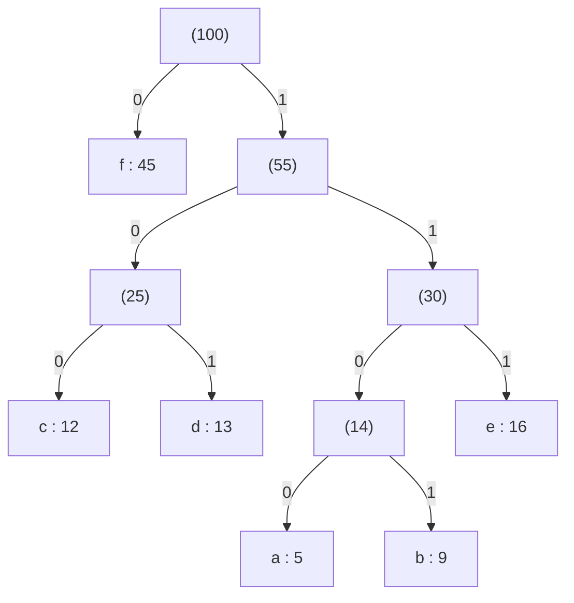

# Greedy Algorithms

> [!abstract] Overview & Core Philosophy
> A **Greedy Algorithm** builds up a solution incrementally, step by step. At each decision point, it makes the choice that looks best at that exact moment (**the locally optimal choice**), without reconsidering earlier choices or looking ahead at future consequences.
> 
> The core hope of the greedy paradigm is that a sequence of locally optimal choices leads to a **globally optimal solution**.
> 
> *Greedy is simple, intuitive, and fast—typically $O(n)$ or $O(n \log n)$—but it does NOT work for every optimization problem.*

---

## 0. Fundamental Concepts & General Framework

### Core Properties Required for Greedy Optimality

For a greedy algorithm to produce an optimal solution, the problem must exhibit two foundational mathematical properties:

1. **Greedy Choice Property**:
   - A globally optimal solution can be arrived at by making locally optimal (greedy) choices at each step without ever needing to backtrack or revisit previous decisions.
   - Unlike Dynamic Programming (which solves all subproblems first before deciding), Greedy makes its choice first before solving subproblems.
2. **Optimal Substructure**:
   - An optimal solution to the overall problem contains within it optimal solutions to its subproblems.
   - After making the greedy choice, the remaining subproblem has the exact same structure as the original problem, just on a smaller input size.

```
       +-------------------------------------------------------------+
       |                  Optimization Problem                       |
       +-------------------------------------------------------------+
                                      |
                 Does local optimal choice guarantee global?
                                      |
                    +-----------------+-----------------+
                    |                                   |
                 [ YES ]                             [ NO ]
                    |                                   |
         +--------------------+              +--------------------+
         |  Greedy Algorithm  |              | Dynamic Program. / |
         | O(n) or O(n log n) |              | Branch & Bound /   |
         | (No Backtracking)  |              | Backtracking       |
         +--------------------+              +--------------------+
```

---

### The 4-Step General Greedy Recipe

Whenever formulating or executing a Greedy Algorithm (in class or during exams), follow this standardized 4-step framework:

1. **Define the Greedy Criterion**:
   - Pick a precise heuristic metric to rank candidates (e.g., value/weight ratio $v_i / w_i$, earliest finish time $f_i$, highest profit $p_i$, earliest start time $s_i$, or lowest frequency $f_i$).
2. **Sort or Order the Input**:
   - Arrange candidate items based on the chosen criterion. This sorting step typically dominates the time complexity at $O(n \log n)$.
3. **Iterate and Choose Feasible Items**:
   - Walk through the sorted candidates one by one. Include each candidate in the solution set if and only if it keeps the solution **feasible** (satisfies all problem constraints).
4. **Never Reconsider (Irrevocability)**:
   - Once a choice is made (committed or permanently rejected), it is final. There is zero backtracking.

---

## 1. Fractional Knapsack Problem

> [!note] Problem Formulation
> - **Given**: $n$ items, where each item $i$ has an integer weight $w_i > 0$ and value $v_i > 0$. A knapsack of total weight capacity $W$.
> - **Goal**: Maximize the total value carried in the knapsack.
> - **Constraints**: Total weight $\le W$. Items may be broken into arbitrary continuous fractions ($x_i \in [0, 1]$).
> 
> $$\text{Maximize } \sum_{i=1}^{n} x_i v_i \quad \text{subject to} \quad \sum_{i=1}^{n} x_i w_i \le W, \quad \text{where } 0 \le x_i \le 1$$

---

### Contrast: Fractional vs. 0/1 Knapsack

> [!warning] Critical Exam Distinction
> - **Fractional Knapsack (Greedy Works)**: Items can be divided continuously (e.g., gold dust, liquids, grains). Greedy choice by value-to-weight ratio achieves the exact global optimum in $O(n \log n)$.
> - **0/1 Knapsack (Greedy Fails)**: Items must be taken whole ($x_i = 1$) or left behind ($x_i = 0$) (e.g., laptops, gold ingots). Greedy heuristics fail because taking a high-ratio item might leave unused capacity that cannot be filled. Dynamic Programming ($O(nW)$) or Branch & Bound is strictly required.

> [!example]- ❌ Counter-Example: Why Greedy Fails on 0/1 Knapsack
> Let capacity $W = 50$.
> - Item 1: $w_1 = 10, v_1 = 60 \implies \text{ratio} = 6.0$
> - Item 2: $w_2 = 20, v_2 = 100 \implies \text{ratio} = 5.0$
> - Item 3: $w_3 = 30, v_3 = 120 \implies \text{ratio} = 4.0$
> 
> **Greedy approach for 0/1**:
> - Takes Item 1 ($w=10, v=60$, remaining capacity $= 40$).
> - Takes Item 2 ($w=20, v=100$, remaining capacity $= 20$).
> - Cannot take Item 3 ($w=30 > 20$).
> - **Total Greedy Value** $= 60 + 100 = \mathbf{160}$ (weight $= 30$).
> 
> **Optimal 0/1 Choice**:
> - Take Item 2 and Item 3 ($w = 20 + 30 = 50$).
> - **Optimal Total Value** $= 100 + 120 = \mathbf{220}$.
> - *Greedy produced 160 vs Optimal 220 $\implies$ Greedy fails for 0/1 Knapsack.*

---

### Greedy Strategy & Criterion

1. **Compute Ratios**: For each item $i$, calculate value per unit weight $r_i = \frac{v_i}{w_i}$.
2. **Sort Descending**: Order items such that $r_1 \ge r_2 \ge \dots \ge r_n$ in $O(n \log n)$.
3. **Fill Greedily**: Walk through items in descending ratio order. Take $100\%$ of each item as long as it fits within the remaining capacity.
4. **Take Fraction**: When the next item cannot fit completely, take a fractional amount $x_i = \frac{\text{remaining capacity}}{w_i}$ to fill the knapsack completely, then terminate.

---

### Worked Example (From Lecture Slides)

> [!example]- 📊 Simulation: Capacity $W = 50$
> **Input Items:**
> 
> | Item | Weight ($w_i$) | Value ($v_i$) | Ratio ($r_i = v_i/w_i$) |
> | :---: | :---: | :---: | :---: |
> | **A** | 10 | 60 | 6.0 |
> | **B** | 20 | 100 | 5.0 |
> | **C** | 30 | 120 | 4.0 |
> 
> **Step-by-Step Execution Trace:**
> 1. **Sort by Ratio**: Order is Item A ($6.0$) $\to$ Item B ($5.0$) $\to$ Item C ($4.0$).
> 2. **Process Item A**:
>    - Weight $w_A = 10 \le W = 50$.
>    - Take $x_A = 1.0$ ($100\%$).
>    - Value added $= 60$, Remaining capacity $= 50 - 10 = 40$.
> 3. **Process Item B**:
>    - Weight $w_B = 20 \le 40$.
>    - Take $x_B = 1.0$ ($100\%$).
>    - Value added $= 100$, Remaining capacity $= 40 - 20 = 20$.
> 4. **Process Item C**:
>    - Weight $w_C = 30 > 20$ (cannot fit fully).
>    - Take fraction $x_C = \frac{20}{30} = \frac{2}{3} \approx 66.7\%$.
>    - Value added $= \frac{2}{3} \times 120 = 80$.
>    - Remaining capacity $= 0$. Stop.
> 
> **Summary Table:**
> 
> | Item | Weight Taken | Fraction Taken ($x_i$) | Value Earned |
> | :---: | :---: | :---: | :---: |
> | **A** | 10 | $100\%$ | 60 |
> | **B** | 20 | $100\%$ | 100 |
> | **C** | 20 | $66.7\%$ | 80 |
> | **Total** | **50 / 50** | — | **240** |
> 
> $$\text{Maximum Total Value} = 60 + 100 + 80 = \mathbf{240}$$

---

### Algorithmic Pseudocode & C++ Implementation

> [!note]- 📜 Algorithmic Pseudocode
> ```text
> FRACTIONAL-KNAPSACK(items, W):
>     //items is an array of structs with (id, weight, value)
>     for each item i in items:
>         i.ratio = i.value / i.weight
>     
>     SORT items in descending order of ratio
>     
>     current_weight = 0
>     total_value = 0.0
>     x = array of size n initialized to 0.0
>     
>     for i = 1 to n:
>         if current_weight + items[i].weight <= W:
>             x[items[i].id] = 1.0
>             current_weight = current_weight + items[i].weight
>             total_value = total_value + items[i].value
>         else:
>             remaining = W - current_weight
>             x[items[i].id] = remaining / items[i].weight
>             total_value = total_value + x[items[i].id] * items[i].value
>             current_weight = W
>             break
>             
>     return total_value, x
> ```

```cpp
#include <iostream>
#include <vector>
#include <algorithm>

using namespace std;

struct Item {
    int id;
    double weight;
    double value;
    double ratio;
};

//fractional knapsack solver
pair<double, vector<double>> fractionalKnapsack(vector<Item>& items, double capacity) {
    int n = items.size();
    
    //compute value to weight ratio
    for (int i = 0; i < n; i++) {
        items[i].ratio = items[i].value / items[i].weight;
    }

    //sort descending by ratio
    sort(items.begin(), items.end(), [](const Item& a, const Item& b) {
        return a.ratio > b.ratio;
    });

    vector<double> x(n, 0.0);
    double current_weight = 0.0;
    double total_value = 0.0;

    //greedily pick highest ratio items
    for (int i = 0; i < n; i++) {
        if (current_weight + items[i].weight <= capacity) {
            x[items[i].id] = 1.0;
            current_weight += items[i].weight;
            total_value += items[i].value;
        } else {
            double remaining = capacity - current_weight;
            x[items[i].id] = remaining / items[i].weight;
            total_value += x[items[i].id] * items[i].value;
            current_weight = capacity;
            break; //knapsack full
        }
    }

    return {total_value, x};
}
```

---

### Complexity Analysis & Step-by-Step Derivation

#### Time Complexity: $O(n \log n)$
1. **Ratio Computation**: Iterating through all $n$ items to compute $r_i = v_i / w_i$ takes $n \times O(1) = O(n)$ time.
2. **Sorting**: Sorting $n$ items by ratio takes $O(n \log n)$ time using comparison sorting (`std::sort`).
3. **Greedy Loop**: We scan through the items array at most once, performing $O(1)$ arithmetic operations per item, taking $O(n)$ time.
4. **Total Time**:
   $$T(n) = O(n) + O(n \log n) + O(n) = O(n \log n)$$

#### Space Complexity: $O(n)$
- $O(n)$ auxiliary space to store item structs, computed ratios, and the resulting fraction array $x$.

---

## 2. Activity Selection Problem (Interval Scheduling)

> [!note] Problem Formulation
> - **Given**: A single shared resource (e.g., lecture hall, CPU) and a set of $n$ activities $S = \{a_1, a_2, \dots, a_n\}$. Each activity $i$ has a start time $s_i$ and finish time $f_i$, represented by interval $[s_i, f_i)$ with $s_i < f_i$.
> - **Goal**: Select the **maximum-cardinality subset** of mutually compatible activities.
> - **Constraint**: Activities $i$ and $j$ are **compatible** if they do not overlap:
>   $$s_i \ge f_j \quad \text{or} \quad s_j \ge f_i$$

---

### Analysis of Sorting Options & Visual Counter-Examples

Why does **Earliest Finish Time** succeed while other intuitive greedy heuristics fail?

```
1. Earliest Start Time Strategy (FAILS):
   Long activity:   [===========================================]  (Picked: 1)
   Short options:      [====]     [====]     [====]     [====]     (Optimal: 4)

2. Shortest Duration Strategy (FAILS):
   Option A & B:    [============]           [============]        (Optimal: 2)
   Short activity:          [=============]                        (Picked: 1)

3. Fewest Conflicts Strategy (FAILS):
   Left clique (4):    === === === ===
   Center activity:          [==================]                  (Picked: 1)
   Right clique (4):                       === === === ===         (Optimal: 8)
```

> [!question]- ❌ Detailed Breakdown: The 3 Counter-Examples from Slide 15
> 
> 1. **Option 1: Earliest Start Time ($s_i$)**
>    - *Greedy Rule*: Pick the activity that starts earliest.
>    - *Counter-Example*: Activities $(1, 10), (2, 3), (4, 5), (6, 7), (8, 9)$.
>    - Earliest start chooses $(1, 10)$, which blocks all other 4 activities.
>    - Result: $1$ activity selected vs. Optimal $4$ activities.
> 
> 2. **Option 2: Shortest Duration ($f_i - s_i$)**
>    - *Greedy Rule*: Pick the shortest activity to leave as much room as possible.
>    - *Counter-Example*: Activities $(1, 6), (5, 8), (7, 15)$.
>    - The shortest interval is $(5, 8)$ of length $3$. Selecting $(5, 8)$ conflicts with both $(1, 6)$ and $(7, 15)$.
>    - Result: $1$ activity selected vs. Optimal $2$ activities $\{(1, 6), (7, 15)\}$.
> 
> 3. **Option 3: Minimum Overlaps / Fewest Conflicts**
>    - *Greedy Rule*: Pick the activity that overlaps with the fewest remaining candidates.
>    - *Counter-Example (11 intervals total)*: A single central interval overlaps with 2 flanking intervals (conflict count $= 2$). However, on the left side, the flanking interval overlaps with 3 other parallel intervals (forming a clique of 4); similarly on the right side.
>    - Picking the minimum conflict node (count $= 2$) destroys both sides, yielding at most $2$ to $4$ total activities, whereas picking the cliques yields $8$ activities!
> 
> **✅ Correct Greedy Criterion: Earliest Finish Time ($f_i$)**
> By picking the activity that finishes earliest, we free up the resource as early as possible, maximizing the remaining time available for future activities.

---

### Worked Example (From Lecture Slides)

> [!example]- 📊 Simulation: 6 Activities
> **Given Activities:**
> - Activity 1: $[2, 7)$
> - Activity 2: $[3, 4)$
> - Activity 3: $[4.5, 6.5)$
> - Activity 4: $[2.2, 3.5)$
> - Activity 5: $[3.9, 5.7)$
> - Activity 6: $[5.9, 7.5)$
> 
> **Step 1: Sort by Finish Time ($f_i$) Ascending:**
> 1. **Activity 4**: $[2.2, \mathbf{3.5})$
> 2. **Activity 2**: $[3.0, \mathbf{4.0})$
> 3. **Activity 5**: $[3.9, \mathbf{5.7})$
> 4. **Activity 3**: $[4.5, \mathbf{6.5})$
> 5. **Activity 1**: $[2.0, \mathbf{7.0})$
> 6. **Activity 6**: $[5.9, \mathbf{7.5})$
> 
> **Step 2: Linear Greedy Scan:**
> - **Select Activity 4** $[2.2, 3.5)$ $\implies \text{Last Finish} = 3.5$.
> - **Check Activity 2**: Start $3.0 < 3.5$ (Conflict $\implies$ Skip).
> - **Check Activity 5**: Start $3.9 \ge 3.5$ $\implies$ **Select Activity 5** $[3.9, 5.7)$, $\text{Last Finish} = 5.7$.
> - **Check Activity 3**: Start $4.5 < 5.7$ (Conflict $\implies$ Skip).
> - **Check Activity 1**: Start $2.0 < 5.7$ (Conflict $\implies$ Skip).
> - **Check Activity 6**: Start $5.9 \ge 5.7$ $\implies$ **Select Activity 6** $[5.9, 7.5)$, $\text{Last Finish} = 7.5$.
> 
> **Final Optimal Subset**: $\{4, 5, 6\}$ (Total = 3 activities).

---

### Algorithmic Pseudocode & C++ Implementation

> [!note]- 📜 Algorithmic Pseudocode
> ```text
> ACTIVITY-SELECTION(S):
>     //S is a set of n activities with start time s_i and finish time f_i
>     SORT S in ascending order of finish time f_i
>     
>     A = { S[1] }          //always select the earliest finishing activity
>     last_finish = S[1].f
>     
>     for i = 2 to n:
>         if S[i].s >= last_finish:
>             A = A U { S[i] }
>             last_finish = S[i].f
>             
>     return A
> ```

```cpp
#include <iostream>
#include <vector>
#include <algorithm>

using namespace std;

struct Activity {
    int id;
    double start;
    double finish;
};

//activity selection via earliest finish time
vector<int> activitySelection(vector<Activity>& activities) {
    int n = activities.size();
    if (n == 0) return {};

    //sort ascending by finish time
    sort(activities.begin(), activities.end(), [](const Activity& a, const Activity& b) {
        return a.finish < b.finish;
    });

    vector<int> selected;
    
    //always take the first activity
    selected.push_back(activities[0].id);
    double last_finish = activities[0].finish;

    //scan remaining activities
    for (int i = 1; i < n; i++) {
        if (activities[i].start >= last_finish) {
            selected.push_back(activities[i].id);
            last_finish = activities[i].finish;
        }
    }

    return selected;
}
```

---

### Complexity Analysis & Step-by-Step Derivation

#### Time Complexity: $O(n \log n)$
1. **Sorting**: Ordering $n$ activities by finish time takes $O(n \log n)$ using merge sort / quicksort (`std::sort`).
2. **Linear Selection Pass**: A single pass through the $n$ sorted activities performs one comparison (`start >= last_finish`) per activity $\implies n \times O(1) = O(n)$.
3. **Total Time**:
   $$T(n) = O(n \log n) + O(n) = O(n \log n)$$
   *(Note: If input activities are already pre-sorted by finish time, time complexity is strictly $O(n)$).*

#### Space Complexity: $O(n)$
- $O(n)$ auxiliary space to store input structures and the array of selected activity IDs.

---

### Proof of Correctness (3 Versions)

> [!info] 🧠 1. Intuitive Explanation (Plain English)
> **The Free Time / Movie Marathon Analogy**: Imagine you want to watch as many movies as possible in a single day. If you choose a movie that ends at 10:00 AM instead of one that ends at 1:00 PM, you free up your schedule 3 hours earlier! 
> By consistently selecting the activity that finishes earliest, you leave the **maximum possible remaining time** to fit in more activities later. Swapping an optimal schedule's first choice for our earliest-finishing choice can only free up more time, never less.

> [!tip]- 📝 2. Exam-Ready Proof (Rapid 2-Minute Version)
> - **Setup**: Let $G = \{g_1, g_2, \dots, g_m\}$ be the Greedy set and $O = \{r_1, r_2, \dots, r_n\}$ be an Optimal set, both ordered by finish times ($n \ge m$).
> - **First Difference**: Let $k$ be the first index where $g_k \ne r_k$. Up to $k-1$, both sets are identical.
> - **Exchange Argument**:
>   - By greedy choice, $g_k$ has the earliest finish time among all candidates compatible with $g_{k-1}$, so $f(g_k) \le f(r_k)$.
>   - Since $r_{k+1}$ starts after $r_k$ finishes ($s(r_{k+1}) \ge f(r_k) \ge f(g_k)$), replacing $r_k$ with $g_k$ in $O$ creates no conflict with $r_{k+1}$.
>   - The modified set $O' = (O \setminus \{r_k\}) \cup \{g_k\}$ is valid, compatible, and optimal with $|O'| = n$.
> - **Contradiction**: Repeat this exchange until $O$ contains all elements of $G$. If $n > m$, there must exist an activity $r_{m+1} \in O$ starting after $g_m$. But Greedy only stops when no compatible activity remains, so $r_{m+1}$ would have been picked by Greedy. Contradiction!
> - **Conclusion**: $m = n \implies |G| = |O|$. Greedy is optimal. $\blacksquare$

> [!success]- 🔬 3. Slide-Exact 5-Step Proof (Rigorous Lecture Version)
> ##### Step 1: Setup
> Let $G = \{g_1, g_2, \dots, g_m\}$ be the set of intervals selected by the greedy algorithm.
> Let $O = \{r_1, r_2, \dots, r_n\}$ be the set of intervals in some optimal solution.
> If $G = O$, then $G$ is already optimal. If $G \ne O$, since $O$ is optimal and $G$ is valid, $n \ge m$.
> **Goal**: Prove by contradiction that $G$ and $O$ have the same size ($m = n$).
> 
> ##### Step 2: Ordered Sequences
> Write both solutions as sequences, ordered by finish time:
> $$G = \{g_1, g_2, \dots, g_m\}$$
> $$O = \{r_1, r_2, \dots, r_n\} \quad (\text{where } n \ge m)$$
> 
> ##### Step 3: The First Mismatch
> Let $k$ be the index of the first interval where the two sequences differ:
> $$G = \{g_1, g_2, \dots, g_{k-1}, \mathbf{g_k}, \dots, g_m\}$$
> $$O = \{g_1, g_2, \dots, g_{k-1}, \mathbf{r_k}, \dots, r_n\}$$
> (The first $k-1$ intervals already agree).
> 
> ##### Step 4: The Exchange
> Both $g_k$ and $r_k$ are compatible with $g_{k-1}$, so different start times create no conflict with earlier choices.
> By greedy choice, $g_k$ has the earliest finish time among available compatible intervals:
> $$f(g_k) \le f(r_k)$$
> Since $r_{k+1}$ starts after $r_k$ finishes ($s(r_{k+1}) \ge f(r_k) \ge f(g_k)$), replacing $r_k$ with $g_k$ creates no conflict with $r_{k+1}$.
> After replacement:
> $$O' = \{g_1, g_2, \dots, g_{k-1}, g_k, r_{k+1}, \dots, r_n\}$$
> $O'$ is valid, compatible, and $|O'| = |O| = n$.
> 
> ##### Step 5: Iteration & Contradiction
> By repeating this process for all indices, we can replace all $g_i$ into the set $O$:
> $$O = \{g_1, g_2, \dots, g_m, r_{m+1}, \dots, r_n\}$$
> Suppose, for contradiction, that $O$ contains an interval after $g_m$ that does not conflict with it ($n > m$).
> By definition, Greedy only terminates when no remaining interval is compatible with its last choice. So such an interval would have been selected by Greedy and would already belong to $G$, contradicting the assumption that it is exclusive to $O$.
> Hence no such interval exists, and $O$ cannot extend past $G$.
> 
> $$\therefore |G| = |O| \implies \text{Greedy is Optimal.} \quad \blacksquare$$

---

## 3. Job Sequencing with Deadlines

> [!note] Problem Formulation
> - **Given**: $n$ jobs, where each job $i$ takes **exactly 1 unit of time** to execute. Each job $i$ has an integer deadline $d_i \ge 1$ and a profit $p_i > 0$.
> - **Resource**: A single machine/processor that can execute at most one job in any time slot $[t-1, t]$.
> - **Goal**: Schedule a subset of jobs to **maximize total profit**.
> - **Constraint**: A job earns its profit $p_i$ if and only if it finishes on or before its deadline (scheduled in slot $t \le d_i$).

---

### Greedy Strategy & Criterion

1. **Sort by Profit Descending**: Order all jobs such that $p_1 \ge p_2 \ge \dots \ge p_n$ in $O(n \log n)$.
2. **Scan in Profit Order**: Process each job in turn, highest profit first.
3. **Find the Latest Free Slot**: For job $j$ with deadline $d_j$, search for the latest available integer time slot $t$ such that $1 \le t \le \min(d_{\max}, d_j)$.
4. **Place or Skip**:
   - If a free slot $t$ exists, assign the job to slot $t$ and earn profit $p_j$.
   - If all slots from $d_j$ down to $1$ are occupied, the job cannot be completed before its deadline $\implies$ **skip the job**.

---

### Worked Examples (From Lecture Slides)

> [!example]- 📊 Worked Example 1: Four Jobs
> **Input Jobs:**
> 
> | Job | Deadline ($d_i$) | Profit ($p_i$) |
> | :---: | :---: | :---: |
> | $a$ | 4 | 20 |
> | $b$ | 1 | 10 |
> | $c$ | 1 | 40 |
> | $d$ | 1 | 30 |
> 
> **Step 1: Sort by Profit Descending:**
> 1. Job $c$ ($d=1, p=40$)
> 2. Job $d$ ($d=1, p=30$)
> 3. Job $a$ ($d=4, p=20$)
> 4. Job $b$ ($d=1, p=10$)
> 
> Max deadline $d_{\max} = 4$. Time slots: `[Slot 1, Slot 2, Slot 3, Slot 4]`.
> 
> **Step 2: Slot Allocation Trace:**
> - **Job $c$**: Deadline 1 $\to$ Slot 1 is free $\to$ **Assign $c$ to Slot 1**. Slots: `[c, -, -, -]`.
> - **Job $d$**: Deadline 1 $\to$ Slot 1 is taken $\to$ No earlier slot $\to$ **Skip $d$**.
> - **Job $a$**: Deadline 4 $\to$ Slot 4 is free $\to$ **Assign $a$ to Slot 4**. Slots: `[c, -, -, a]`.
> - **Job $b$**: Deadline 1 $\to$ Slot 1 is taken $\to$ No earlier slot $\to$ **Skip $b$**.
> 
> **Output:** Scheduled jobs: $\{c, a\}$ in slots 1 and 4.
> $$\text{Total Maximum Profit} = 40 + 20 = \mathbf{60}$$

> [!example]- 📊 Worked Example 2: Five Jobs
> **Input Jobs:**
> 
> | Job | Deadline ($d_i$) | Profit ($p_i$) |
> | :---: | :---: | :---: |
> | $a$ | 2 | 100 |
> | $b$ | 1 | 19 |
> | $c$ | 2 | 27 |
> | $d$ | 1 | 25 |
> | $e$ | 3 | 15 |
> 
> **Step 1: Sort by Profit Descending:**
> 1. Job $a$ ($d=2, p=100$)
> 2. Job $c$ ($d=2, p=27$)
> 3. Job $d$ ($d=1, p=25$)
> 4. Job $b$ ($d=1, p=19$)
> 5. Job $e$ ($d=3, p=15$)
> 
> Max deadline $d_{\max} = 3$. Time slots: `[Slot 1, Slot 2, Slot 3]`.
> 
> **Step 2: Slot Allocation Trace:**
> - **Job $a$**: Deadline 2 $\to$ Slot 2 is free $\to$ **Assign $a$ to Slot 2**. Slots: `[-, a, -]`.
> - **Job $c$**: Deadline 2 $\to$ Slot 2 taken $\to$ check Slot 1 $\to$ Slot 1 free $\to$ **Assign $c$ to Slot 1**. Slots: `[c, a, -]`.
> - **Job $d$**: Deadline 1 $\to$ Slot 1 taken $\to$ **Skip $d$**.
> - **Job $b$**: Deadline 1 $\to$ Slot 1 taken $\to$ **Skip $b$**.
> - **Job $e$**: Deadline 3 $\to$ Slot 3 free $\to$ **Assign $e$ to Slot 3**. Slots: `[c, a, e]`.
> 
> **Output:** Scheduled jobs: $\{c, a, e\}$ in slots 1, 2, 3.
> $$\text{Total Maximum Profit} = 27 + 100 + 15 = \mathbf{142}$$

---

### Disjoint-Set Union (DSU) Optimization ($O(n \log n)$)

In the naive approach, searching for the latest free slot involves a linear backward scan taking $O(d)$ per job, leading to $O(n \cdot d) = O(n^2)$ worst-case time.

We can optimize slot allocation to **almost $O(1)$ per job** using a **Disjoint Set Union (DSU / Union-Find)** structure:
1. **Initialize**: Create parent pointers for slots $0, 1, 2, \dots, d_{\max}$, where `parent[i] = i`.
   - The root/representative of slot $i$ represents the **latest available free slot $\le i$**.
2. **Find Available Slot**: To schedule a job with deadline $d$, query `k = find(d)`.
   - If $k > 0$, slot $k$ is the latest available free slot!
   - Assign the job to slot $k$.
3. **Union / Update**: Mark slot $k$ as occupied by linking it to the slot before it:
   $$\text{parent}[k] = \text{find}(k - 1)$$
   With path compression, future queries jump over all occupied slots in $O(\alpha(n)) \approx O(1)$ time!
   - If $k = 0$, no free slot $\ge 1$ exists $\implies$ skip the job.

---

### Algorithmic Pseudocode & C++ Implementation

> [!note]- 📜 Algorithmic Pseudocode (Naive & DSU)
> ```text
> JOB-SEQUENCING-DSU(jobs):
>     SORT jobs in descending order of profit
>     dmax = MAX(job.deadline for all jobs)
>     
>     //initialize dsu
>     parent = array of size dmax + 1 where parent[i] = i
>     
>     function FIND(i):
>         if parent[i] == i: return i
>         parent[i] = FIND(parent[i])   //path compression
>         return parent[i]
>         
>     totalProfit = 0
>     for each job j in jobs:
>         availableSlot = FIND(MIN(dmax, j.deadline))
>         if availableSlot > 0:
>             schedule j in availableSlot
>             totalProfit = totalProfit + j.profit
>             parent[availableSlot] = FIND(availableSlot - 1)  //merge with previous
>             
>     return totalProfit
> ```

```cpp
#include <iostream>
#include <vector>
#include <algorithm>

using namespace std;

struct Job {
    char id;
    int deadline;
    int profit;
};

//dsu structure for slot finding
struct DSU {
    vector<int> parent;
    DSU(int n) {
        parent.resize(n + 1);
        for (int i = 0; i <= n; i++) parent[i] = i;
    }
    int find(int i) {
        if (parent[i] == i) return i;
        return parent[i] = find(parent[i]); //path compression
    }
    void unite(int u, int v) {
        parent[u] = v;
    }
};

pair<vector<char>, int> jobSequencingDSU(vector<Job>& jobs) {
    int n = jobs.size();
    
    //sort jobs descending by profit
    sort(jobs.begin(), jobs.end(), [](const Job& a, const Job& b) {
        return a.profit > b.profit;
    });

    int maxDeadline = 0;
    for (const auto& j : jobs) maxDeadline = max(maxDeadline, j.deadline);

    DSU dsu(maxDeadline);
    vector<char> slot(maxDeadline + 1, '-');
    int totalProfit = 0;

    for (const auto& j : jobs) {
        //find latest free slot <= deadline
        int availableSlot = dsu.find(min(maxDeadline, j.deadline));
        if (availableSlot > 0) {
            slot[availableSlot] = j.id;
            totalProfit += j.profit;
            //link this slot to the previous slot
            dsu.unite(availableSlot, dsu.find(availableSlot - 1));
        }
    }

    return {slot, totalProfit};
}
```
2. **Naive Slot Search Approach**:
   - For each of the $n$ jobs, we scan backward from $\min(d_i, d_{\max})$ down to slot $1$.
   - In the worst case, searching for a free slot takes $O(d)$ time, where $d = \min(n, \max d_i)$.
   - Performing this backward search for all $n$ jobs gives:
     $$T_{\text{naive}}(n) = O(n \log n) + O(n \cdot d) = O(n \cdot d)$$
---

### Complexity Analysis & Step-by-Step Derivation

#### Time Complexity:
1. **Sorting Jobs**: Sorting $n$ jobs descending by profit takes $O(n \log n)$.
2. **Slot Search**:
   - **Naive Backward Scan**: Scanning up to $d$ slots per job costs $O(d)$. Over $n$ jobs, this takes $O(n \cdot d)$ where $d = \min(n, \max d_i)$. In the worst case ($d \approx n$), naive runtime is **$O(n^2)$**.
   - **With DSU (Union-Find)**: Each `find()` operation with path compression runs in $O(\alpha(n))$ (inverse Ackermann, $\le 4$). Over $n$ jobs, slot allocation takes $n \times O(\alpha(n)) = O(n \alpha(n))$.
3. **Total Time (DSU Optimized)**:
   $$T(n) = O(n \log n) + O(n \alpha(n)) = O(n \log n)$$

#### Space Complexity: $O(n + d)$
- $O(n)$ space for storing jobs $+ O(d)$ for slot array and DSU parent pointers ($d \le n$).

---

### Proof of Correctness (3 Versions)

> [!info] 🧠 1. Intuitive Explanation (Plain English)
> **The Procrastination Analogy**: To maximize total earnings, you obviously prioritize the highest-paying tasks. But **you shouldn't do a task earlier than necessary!** By postponing each high-paying task to the absolute latest available slot before its deadline, you lock in the big reward while leaving all earlier slots wide open for jobs with tighter deadlines.

> [!tip]- 📝 2. Exam-Ready Proof (Rapid 2-Minute Version)
> - **Setup**: Let $I$ be Greedy's job set and $J$ be an Optimal set. Assume $I \ne J$.
> - **Alignment**: Align schedules $S_i$ and $S_j$ so every shared job occupies the exact same slot in both (shifting jobs to earlier slots never breaks deadlines).
> - **Profit Comparison**:
>   - Let $a$ be the highest-profit job in $I \setminus J$ placed in slot $s$ of $S_i$, and let $b$ be the job in slot $s$ of $S_j$.
>   - Suppose $\text{profit}(b) > \text{profit}(a)$. Then Greedy would have examined $b$ before $a$.
>   - Since slot $s$ was free when Greedy placed $a$, it was also free earlier when $b$ was examined. Since $s \le \text{deadline}(b)$, Greedy would have placed $b$ in slot $s$, implying $b \in I$. Contradiction!
>   - Therefore, $\mathbf{\text{profit}(a) \ge \text{profit}(b)}$.
> - **Swap Sequence**: Replacing $b$ with $a$ in $J$ gives $J' = (J \setminus \{b\}) \cup \{a\}$ with $\text{profit}(J') \ge \text{profit}(J)$. Repeating this converts $J$ to $I$ without decreasing profit.
> - **Conclusion**: $\text{profit}(I) = \text{profit}(J) \implies$ Greedy is optimal. $\blacksquare$

> [!success]- 🔬 3. Slide-Exact 5-Step Proof (Rigorous Lecture Version)
> ##### Slide 1/5: Setup
> Let $J =$ the set of jobs in an optimal solution.
> Let $I =$ the set of jobs selected by the greedy method.
> We need to show that $I$ and $J$ have the same total profit.
> If $I = J$, there is nothing to prove, so assume $I \ne J$.
> **Goal**: Show $\text{profit}(I) = \text{profit}(J)$, so $I$ is optimal too.
> 
> ##### Slide 2/5: Why a Mismatch Must Exist
> - **Fact**: If a set of jobs can all be scheduled without missing a deadline, then any smaller subset of them can too because removing a job never makes scheduling harder.
> - **$J$ cannot be missing something $I$ has**: If $I$ contained every job of $J$ plus extra profitable jobs, $I$ would earn strictly more than $J$. But $J$ was assumed optimal. Contradiction.
> - **$I$ cannot be missing something $J$ has**: Greedy only skips a job when there is truly no room left for it. If $J$ can fit that job in, Greedy never turns down a job it could still fit.
> - **Conclusion**: Neither set can fully contain the other. There must be some job $a$ that is only in $I$, and some job $b$ that is only in $J$.
> 
> ##### Slide 3/5: Aligning the Schedules
> A job common to both $I$ and $J$ might sit in a different time slot in each schedule.
> Let $S_i$ be the schedule (slot assignment) for $I$, and $S_j$ be the schedule for $J$. We can always rearrange $S_i$ and $S_j$ without changing either one's total profit so that every shared job sits in the same slot in both:
> - If job $a$ is scheduled in slot 2 in $I$ but slot 4 in $J$, move $a$ to slot 4 in $I$ as well.
> - If some other job already occupies slot 4 in $I$, move that job to slot 2 instead. Shifting a job to an earlier slot never breaks its own deadline, so this is always safe.
> - If slot 4 in $I$ is empty, $a$ simply moves there directly.
> Repeating this produces two aligned schedules $S_i$ and $S_j'$ where every common job occupies the same slot.
> 
> ##### Slide 4/5: Comparing Profits
> Let $a$ be the highest-profit job in $I$ but not $J$. After aligning, let $s$ be the slot where $a$ sits in $S_i$, and let $b$ be whichever job (if any) sits in that same slot $s$ in $S_j'$.
> Both placements are valid, so $s \le \text{deadline}(a)$ and $s \le \text{deadline}(b)$.
> Greedy fills slots permanently. Once taken, a slot never frees up.
> Suppose $\text{profit}(b) > \text{profit}(a)$:
> - Then Greedy reaches $b$ before $a$.
> - Since slot $s$ is free later at $a$'s turn, it must already have been free earlier at $b$'s turn.
> - Since $s \le \text{deadline}(b)$, Greedy would have placed $b$ there.
> - But $b \notin I$, which is a contradiction!
> Therefore, $\mathbf{\text{profit}(a) \ge \text{profit}(b)}$.
> 
> ##### Slide 5/5: The Swap & Conclusion
> Since $\text{profit}(a) \ge \text{profit}(b)$, replacing $b$ with $a$ in slot $s$ cannot reduce total profit:
> $$J' = J \setminus \{b\} \cup \{a\} \quad \text{has } \text{profit}(J') \ge \text{profit}(J)$$
> Repeat this swap for every job that differs between $I$ and $J$. Each swap keeps profit the same or increases it, and after enough swaps, $J$ becomes identical to $I$.
> Since profit never decreased along the way and $J$ was optimal:
> $$\text{profit}(I) = \text{profit}(J) \implies I \text{ must be optimal too.} \quad \blacksquare$$

---

## 4. Interval Partitioning (Classroom Scheduling)

> [!note] Problem Formulation
> - **Given**: $n$ lectures/events, each with a start time $s_i$ and finish time $f_i$ (interval $[s_i, f_i)$).
> - **Goal**: Schedule **all** $n$ lectures using the **minimum number of classrooms**.
> - **Constraint**: No two lectures assigned to the same classroom may overlap in time.
> 
> **Depth Definition**: The **depth** $d$ of a set of intervals is the maximum number of lectures that are mutually overlapping at any single point in time.

---

### Naive Solution Idea & Why It Fails

> [!danger] Counter-Example from Slide 11: Room-by-Room Strategy Fails
> **The Naive Idea**:
> 1. Apply Activity Selection to find the maximum set of non-overlapping lectures for Room 1.
> 2. Repeat Activity Selection on leftover lectures for Room 2.
> 3. Continue opening new rooms until all lectures are scheduled.
> 
> **Counter-Example**:
> Lectures: $(3, 7), (5, 9), (8, 11), (12, 13), (10, 14), (16, 18), (13, 20)$.
> 
> - **Room 1** picks max non-overlapping: $\{(3, 7), (8, 11), (12, 13), (16, 18)\}$
> - **Room 2** picks max leftover: $\{(5, 9), (10, 14)\}$
> - **Room 3** takes remaining: $\{(13, 20)\}$
> $\implies$ **3 rooms used by Naive approach!**
> 
> **Why it's Suboptimal**:
> At no single point in time do more than 2 lectures overlap (**$\text{depth} = 2$**). Only **2 rooms** are actually needed:
> - Room 1: $(3, 7), (8, 11), (12, 13), (13, 20)$
> - Room 2: $(5, 9), (10, 14), (16, 18)$
> 
> *The naive approach greedily hoards compatible lectures for Room 1, leaving fragments that force an unnecessary 3rd room.*

---

### Correct Greedy Strategy

1. **Sort by Start Time Ascending**: Order all lectures such that $s_1 \le s_2 \le \dots \le s_n$.
2. **Scan in Start-Time Order**: Take each lecture in turn, earliest start first.
3. **Reuse a Free Room**: If some already-open room is free (its last lecture finished $\le s_i$), assign the lecture there.
4. **Open a New Room**: If no open room is free, allocate a brand-new room for this lecture.

---

### Step-by-Step Simulation & Min-Heap Room Tracking

To efficiently find a free room, maintain a **Min-Heap** storing the `last_finish_time` of each currently open room.

For the 7 lectures sorted by start time:
1. $(3, 7) \to$ Heap empty $\to$ Open Room 1 $\to$ Heap: `[R1: 7]`
2. $(5, 9) \to$ Earliest finish $7 > 5 \to$ Open Room 2 $\to$ Heap: `[R1: 7, R2: 9]`
3. $(8, 11) \to$ Top finish $7 \le 8 \to$ Reuse Room 1 $\to$ Update R1 finish to 11 $\to$ Heap: `[R2: 9, R1: 11]`
4. $(10, 14) \to$ Top finish $9 \le 10 \to$ Reuse Room 2 $\to$ Update R2 finish to 14 $\to$ Heap: `[R1: 11, R2: 14]`
5. $(12, 13) \to$ Top finish $11 \le 12 \to$ Reuse Room 1 $\to$ Update R1 finish to 13 $\to$ Heap: `[R1: 13, R2: 14]`
6. $(13, 20) \to$ Top finish $13 \le 13 \to$ Reuse Room 1 $\to$ Update R1 finish to 20 $\to$ Heap: `[R2: 14, R1: 20]`
7. $(16, 18) \to$ Top finish $14 \le 16 \to$ Reuse Room 2 $\to$ Update R2 finish to 18 $\to$ Heap: `[R2: 18, R1: 20]`

$$\text{Total Rooms Used} = \mathbf{2} \quad (\text{Optimal!})$$

---

### Algorithmic Pseudocode & C++ Implementation

> [!note]- 📜 Algorithmic Pseudocode
> ```text
> INTERVAL-PARTITIONING(lectures):
>     SORT lectures in ascending order of start time s_i
>     
>     H = MIN-PRIORITY-QUEUE()   //stores (last_finish_time, room_id)
>     room_count = 0
>     assignment = map()
>     
>     for each lecture j in lectures:
>         if H is not empty and H.TOP().last_finish_time <= j.s:
>             room = H.EXTRACT-MIN().room_id
>         else:
>             room_count = room_count + 1
>             room = room_count
>             
>         assignment[j.id] = room
>         H.INSERT((j.f, room))
>         
>     return assignment, room_count
> ```

```cpp
#include <iostream>
#include <vector>
#include <algorithm>
#include <queue>
#include <unordered_map>

using namespace std;

struct Lecture {
    int id;
    int start;
    int finish;
};

//interval partitioning using min-heap
pair<unordered_map<int, int>, int> intervalPartitioning(vector<Lecture>& lectures) {
    int n = lectures.size();
    if (n == 0) return {{}, 0};

    //sort lectures ascending by start time
    sort(lectures.begin(), lectures.end(), [](const Lecture& a, const Lecture& b) {
        return a.start < b.start;
    });

    //min-heap stores pair<last_finish_time, room_id>
    priority_queue<pair<int, int>, vector<pair<int, int>>, greater<pair<int, int>>> minHeap;
    unordered_map<int, int> roomAssignment;
    int roomCount = 0;

    for (int i = 0; i < n; i++) {
        if (!minHeap.empty() && minHeap.top().first <= lectures[i].start) {
            //reuse room with earliest finish time
            auto topRoom = minHeap.top();
            minHeap.pop();
            roomAssignment[lectures[i].id] = topRoom.second;
            minHeap.push({lectures[i].finish, topRoom.second});
        } else {
            //allocate new room
            roomCount++;
            roomAssignment[lectures[i].id] = roomCount;
            minHeap.push({lectures[i].finish, roomCount});
        }
    }

    return {roomAssignment, roomCount};
}
```

---

### Complexity Analysis & Step-by-Step Derivation

#### Time Complexity: $O(n \log n)$
1. **Sorting by Start Time**: Ordering $n$ lectures takes $O(n \log n)$.
2. **Min-Heap Operations**:
   - For each of the $n$ lectures, checking `minHeap.top()` is $O(1)$.
   - `pop()` and `push()` take $O(\log d)$, where $d$ is the number of active classrooms ($d \le n$).
   - Across all $n$ lectures: $n \times O(\log d) = O(n \log d) \le O(n \log n)$.
3. **Total Time**:
   $$T(n) = O(n \log n) + O(n \log d) = O(n \log n)$$

#### Space Complexity: $O(n)$
- Min-heap stores at most $d \le n$ elements $\implies O(d)$.
- `roomAssignment` map takes $O(n)$ space. Total auxiliary space is $O(n)$.

---

### Proof of Correctness (3 Versions)

> [!info] 🧠 1. Intuitive Explanation (Plain English)
> **The Peak Traffic / Bottleneck Analogy**: If at 2:00 PM there are 5 classes happening simultaneously, you physically cannot get away with fewer than 5 rooms. The peak concurrent overlap (depth $d$) is an unavoidable physical bottleneck.
> Because Greedy sorts by start time and reuses rooms whenever a room finishes, it **only opens a new room when every single open room is currently occupied**. Therefore, it never opens more rooms than the peak simultaneous overlap ($d$).

> [!tip]- 📝 2. Exam-Ready Proof (Rapid 2-Minute Version)
> - **Lower Bound**: Let $d = \text{depth}(R)$ be the maximum number of mutually overlapping lectures at any single point in time. Any valid schedule requires at least $d$ rooms: $\text{Rooms} \ge d$.
> - **Upper Bound via Greedy**:
>   - Suppose Greedy allocates $d + 1$ rooms, and let lecture $j$ be the first lecture assigned to room $d + 1$.
>   - Since lectures are processed by start time, when lecture $j$ starts at time $s_j$, all $d$ previously opened rooms must already be occupied by lectures that started $\le s_j$ and finish $> s_j$.
>   - This means lecture $j$ plus the $d$ active lectures are all mutually overlapping at time $s_j$, meaning $d + 1$ lectures overlap simultaneously.
>   - This contradicts that the maximum depth is $d$!
> - **Conclusion**: Greedy never uses more than $d$ rooms. $\text{Greedy Rooms} = d = \text{Optimal Rooms}$. $\blacksquare$

> [!success]- 🔬 3. Slide-Exact 2-Step Proof (Rigorous Lecture Version)
> ##### Slide 1/2: Lower Bound
> **Claim**: For any set of lectures $R$, the number of classrooms required is at least the depth of $R$:
> $$\text{Rooms needed} \ge \text{depth}(R)$$
> **Proof**: Any lectures that are mutually in conflict must be scheduled in different rooms. That alone forces at least $\text{depth}(R)$ rooms to be used.
> 
> ##### Slide 2/2: The Greedy Bound Is Tight
> Let $d$ be the depth of $R$.
> **Claim**: The greedy algorithm uses exactly $d$ rooms.
> **Proof**:
> 1. Suppose, for contradiction, Greedy used more than $d$ rooms. Let $j$ be the first lecture scheduled into room $d+1$.
> 2. Since lectures are processed in order of start time, there must already be $d$ lectures underway at that moment, one occupying each of the other $d$ rooms, all in conflict with $j$.
> 3. But that means $d+1$ lectures are mutually in conflict at once, contradicting the fact that the depth is only $d$.
> 4. So Greedy never needs more than $d$ rooms, matching the lower bound exactly.
> 
> $$\therefore \text{Greedy Room Count} = d = \text{Optimal Room Count.} \quad \blacksquare$$

---

## 5. Huffman Encoding

> [!note] Problem Formulation
> - **Given**: An alphabet/character set $C$ with known frequencies $f(c)$ for each $c \in C$.
> - **Goal**: Construct a variable-length **prefix-free binary code** for each character that **minimizes the total length (weighted bit length)** of the encoded text:
> 
> $$\text{Minimize } B(T) = \sum_{c \in C} f(c) \cdot d_T(c)$$
> where $d_T(c)$ is the depth (code word length in bits) of character $c$ in the binary tree $T$.

---

### Core Principles & Foundations

> [!info] Why Prefix-Free Matters (Slide Example)
> A **prefix-free code** (or prefix code) is one where no valid code word is a prefix of any other code word.
> 
> *Consider Ambiguous Encoding (Not Prefix-Free):*
> - Let $a = 0, b = 1, c = 01$.
> - Decode message: `0101`
> - Ambiguity: Is it `a, b, a, b` ($0, 1, 0, 1$) or `c, c` ($01, 01$)? Both are valid! The decoder cannot know without delimiters.
> - **A prefix-free code guarantees every message decodes unambiguously into exactly one answer.**

> [!example] Comparing Encodings for Text "abcc" (Slide 18)
> - **Encoding 1**: $a = 0, b = 10, c = 11 \implies \text{String: } 0101111$ (7 bits)
> - **Encoding 2**: $c = 0, a = 10, b = 11 \implies \text{String: } 101100$ (6 bits)
> - *Key Takeaway*: High-frequency characters ($c$) must receive shorter bit lengths.

> [!abstract] Optimal Tree Structure (Slide 19)
> 1. **Characters sit strictly at the leaves**: Internal nodes only guide prefix navigation and never represent characters.
> 2. **Full Binary Tree**: Every non-leaf node has exactly 2 children (no single-child nodes).
> 3. **High frequency $\to$ Shallow depth (short code)**; **Low frequency $\to$ Deep depth (longer code)**.

---

### The Greedy Algorithm

1. **Build the Leaves**: Create a leaf node for each character $c$ with its frequency $f(c)$ and insert all $n$ nodes into a Min-Priority Queue (Min-Heap).
2. **Extract the Two Smallest**: Repeatedly remove the two nodes $x$ and $y$ with the lowest frequencies.
3. **Merge into a Parent**: Create a new internal node $z$ with frequency $z.\text{freq} = x.\text{freq} + y.\text{freq}$, set $z.\text{left} = x$ and $z.\text{right} = y$, and insert $z$ back into the heap.
4. **Repeat $n - 1$ Times**: When only 1 node remains in the heap, it is the root of the Huffman tree. (Left branch $= 0$, Right branch $= 1$).

---

### Worked Example (6 Characters from Lecture Slides)

> [!example]- 📊 Simulation: 6 Characters (Total Frequency = 100)
> **Given Frequencies:**
> $f: 45, \quad e: 16, \quad d: 13, \quad c: 12, \quad b: 9, \quad a: 5$
> 
> **Step-by-Step Merge Sequence:**
> 1. **Initial Min-Heap**: $\{a(5), b(9), c(12), d(13), e(16), f(45)\}$
> 2. **Merge 1**: Extract $a(5)$ and $b(9) \to$ Create parent $(14)$ with children $a, b$.
>    - Heap: $\{c(12), d(13), (14), e(16), f(45)\}$
> 3. **Merge 2**: Extract $c(12)$ and $d(13) \to$ Create parent $(25)$ with children $c, d$.
>    - Heap: $\{(14), e(16), (25), f(45)\}$
> 4. **Merge 3**: Extract $(14)$ and $e(16) \to$ Create parent $(30)$ with children $(14), e$.
>    - Heap: $\{(25), (30), f(45)\}$
> 5. **Merge 4**: Extract $(25)$ and $(30) \to$ Create parent $(55)$ with children $(25), (30)$.
>    - Heap: $\{f(45), (55)\}$
> 6. **Merge 5**: Extract $f(45)$ and $(55) \to$ Create Root node $(100)$.



> **Final Code Table & Weighted Bit Length Calculation:**
> 
> | Character | Frequency | Code Word | Bits (Depth $d_T$) | Weighted Bits ($\text{freq} \times d_T$) |
> | :---: | :---: | :---: | :---: | :---: |
> | **f** | 45 | `0` | 1 | $45 \times 1 = 45$ |
> | **e** | 16 | `111` | 3 | $16 \times 3 = 48$ |
> | **d** | 13 | `101` | 3 | $13 \times 3 = 39$ |
> | **c** | 12 | `100` | 3 | $12 \times 3 = 36$ |
> | **b** | 9 | `1101` | 4 | $9 \times 4 = 36$ |
> | **a** | 5 | `1100` | 4 | $5 \times 4 = 20$ |
> | **Total** | **100** | — | — | **224 bits** |
> 
> *(Contrast with fixed-length 3-bit encoding: $100 \times 3 = 300$ bits. Huffman saves $76$ bits, a $25.3\%$ compression ratio!)*

---

### Algorithmic Pseudocode (From Slide 26-29) & C++ Implementation

> [!note]- 📜 Slide Pseudocode (Exact Exam Form)
> ```text
> Main(text):
>     freq = COMPUTE-FREQUENCIES(text)
>     C = { NODE(char, f) for (char, f) in freq }
>     root = HUFFMAN(C)
>     codeTable = {}
>     ASSIGN-CODES(root, "", codeTable)
>     encoded = ""
>     for ch in text:
>         encoded = encoded + codeTable[ch]
>     decoded = DECODE(root, encoded)
>     return codeTable, encoded, decoded
> 
> HUFFMAN(C):
>     n = |C|
>     Q = MIN-PRIORITY-QUEUE(C)    //keyed by freq, built in O(n)
>     for i = 1 to n - 1:
>         z = new NODE()
>         x = EXTRACT-MIN(Q)
>         y = EXTRACT-MIN(Q)
>         z.left = x
>         z.right = y
>         z.freq = x.freq + y.freq
>         INSERT(Q, z)
>     return EXTRACT-MIN(Q)         //root of Huffman tree
> 
> ASSIGN-CODES(node, code, codeTable):
>     if node is a LEAF:
>         codeTable[node.char] = (code == "" ? "0" : code)
>         return
>     ASSIGN-CODES(node.left,  code + "0", codeTable)
>     ASSIGN-CODES(node.right, code + "1", codeTable)
> 
> DECODE(root, bitstring):
>     result = ""
>     node = root
>     for bit in bitstring:
>         if bit == "0":
>             node = node.left
>         else:
>             node = node.right
>         if node is a LEAF:
>             result = result + node.char
>             node = root          //restart at root for next character
>     return result
> ```

```cpp
#include <iostream>
#include <vector>
#include <string>
#include <queue>
#include <unordered_map>

using namespace std;

struct Node {
    char ch;
    int freq;
    Node* left;
    Node* right;

    Node(char character, int frequency) {
        ch = character;
        freq = frequency;
        left = right = nullptr;
    }
};

struct Compare {
    bool operator()(Node* a, Node* b) {
        return a->freq > b->freq;
    }
};

//build huffman tree using min-heap
Node* buildHuffmanTree(const unordered_map<char, int>& freqMap) {
    priority_queue<Node*, vector<Node*>, Compare> minHeap;

    //insert leaf nodes into heap - O(n)
    for (auto pair : freqMap) {
        minHeap.push(new Node(pair.first, pair.second));
    }

    //perform n - 1 merges - O(n log n)
    while (minHeap.size() > 1) {
        Node* x = minHeap.top(); minHeap.pop(); //lowest freq
        Node* y = minHeap.top(); minHeap.pop(); //2nd lowest freq

        Node* z = new Node('\0', x->freq + y->freq);
        z->left = x;
        z->right = y;

        minHeap.push(z);
    }

    return minHeap.top(); //root of tree
}

//traverse tree to generate prefix codes - O(n)
void assignCodes(Node* root, string code, unordered_map<char, string>& codeTable) {
    if (!root) return;

    if (!root->left && !root->right) {
        codeTable[root->ch] = (code == "") ? "0" : code;
        return;
    }

    assignCodes(root->left, code + "0", codeTable);
    assignCodes(root->right, code + "1", codeTable);
}

//decode bitstring back to text
string decodeBitstring(Node* root, const string& bitstring) {
    string result = "";
    Node* curr = root;

    for (char bit : bitstring) {
        if (bit == '0') curr = curr->left;
        else curr = curr->right;

        if (!curr->left && !curr->right) {
            result += curr->ch;
            curr = root; //restart at root
        }
    }

    return result;
}
```

---

### Complexity Analysis & Step-by-Step Derivation

#### Time Complexity: $O(n \log n)$
1. **Building Initial Heap**: Inserting $n$ leaf nodes into a priority queue takes $O(n)$ using bottom-up heapify (or $O(n \log n)$ via $n$ pushes).
2. **Merging Loop**:
   - The loop runs exactly $n - 1$ times to create $n - 1$ internal nodes.
   - In each iteration: 2 `EXTRACT-MIN` operations $+ 1$ `INSERT` operation on a heap of size $\le n \implies O(\log n)$.
   - Merging cost: $(n - 1) \times O(\log n) = O(n \log n)$.
3. **Prefix Code Generation**: A DFS traversal of a binary tree with $2n - 1$ nodes takes $O(n)$ time.
4. **Encoding/Decoding Text of Length $N$**: Takes $O(N)$ time.
5. **Total Tree Construction Time**:
   $$T(n) = O(n \log n)$$

#### Space Complexity: $O(n)$
- Tree contains $n$ leaves $+ (n - 1)$ internal nodes $= 2n - 1$ total nodes $\implies O(n)$ memory.
- Min-heap holds at most $n$ pointers $\implies O(n)$.
- Code lookup map has $n$ entries $\implies O(n)$. Total auxiliary space is $O(n)$.

---

### Proof of Correctness (3 Versions)

> [!info] 🧠 1. Intuitive Explanation (Plain English)
> **The Deepest Sibling Analogy**: Highly frequent letters (like 'E') should stay near the root with 1 or 2 bits, while rare letters (like 'Z') can go deep down.
> Huffman pairs the two absolute rarest characters together at the bottom of the tree as sibling leaves. Merging them into a single combined symbol reduces the problem size by 1. By induction, doing this recursively builds the optimal tree shape at every scale.

> [!tip]- 📝 2. Exam-Ready Proof (Rapid 2-Minute Version)
> - **Sibling Lemma**: Let $x, y$ be the two lowest frequency characters. There exists an optimal prefix tree where $x$ and $y$ are sibling leaves at maximum depth.
>   *(Proof: Swapping $x, y$ with any deeper leaves in an optimal tree cannot increase cost because $x, y$ have the smallest frequencies).*
> - **Cost Recurrence**: Let $T$ be a tree for $n$ symbols, and $T'$ be the tree obtained by replacing sibling leaves $x, y$ with a single composite leaf $z$ of frequency $f(x) + f(y)$. Then:
>   $$\text{Cost}(T) = \text{Cost}(T') + f(x) + f(y)$$
> - **Induction Step**: By induction hypothesis on $n-1$ symbols, Huffman builds an optimal tree $T'$ for the reduced alphabet. Since $\text{Cost}(T) = \text{Cost}(T') + f(x) + f(y)$, the resulting tree $T$ is strictly optimal for $n$ symbols. $\blacksquare$

> [!success]- 🔬 3. Slide-Exact 3-Step Proof (Rigorous Lecture Version)
> ##### Slide 1/3: Setup
> Proof by induction on the number of symbols $n$:
> - **Base case**: $n \le 2$ (with only 1 or 2 symbols, only one possible tree shape exists, which is trivially optimal).
> - **Inductive hypothesis**: Assume the claim holds for any sequence of $n - 1$ frequencies.
> - We show it then also holds for any sequence of $n$ frequencies.
> - **Goal**: Show $\text{cost}(H) = \text{cost}(G)$, where $H$ is an optimal tree and $G$ is the tree our algorithm builds.
> 
> ##### Slide 2/3: The Reduction
> Let $f_1 \le f_2 \le \dots \le f_n$ be the frequencies.
> There is an optimal tree $H$ where the two smallest, $f_1$ and $f_2$, are siblings (proved next). Our algorithm's tree $G$ also makes them siblings, since it merges the two smallest frequencies first.
> 
> Remove $f_1$ and $f_2$ from both trees, and make their parent a new leaf with frequency $(f_1 + f_2)$. This gives smaller trees $H'$ and $G'$, each with $n - 1$ elements.
> By the inductive hypothesis:
> $$\text{cost}(H') = \text{cost}(G')$$
> Since $\text{cost}(H) = \text{cost}(H') + f_1 + f_2$ and $\text{cost}(G) = \text{cost}(G') + f_1 + f_2$, it follows that:
> $$\text{cost}(H) = \text{cost}(G)$$
> 
> ##### Slide 3/3: Proof of the Sibling Claim
> **Claim**: Some optimal tree has the two smallest-frequency symbols, $w$ and $y$, as siblings.
> **Proof**: Take any optimal tree. If $w$ and $y$ are already siblings, done. Otherwise, look at whoever currently sits next to $w$; exactly one of three cases holds:
> 1. **Some other symbol $z$ is $w$'s sibling**: Since $y$ has the second-smallest frequency, $\text{freq}(z) \ge \text{freq}(y)$. Swap $z$ and $y$'s positions in the tree. This pairs $w$ with $y$ and costs no more than before, since $y$ is no heavier than $z$.
> 2. **$w$ has no sibling at all (an "only child")**: Remove $w$'s parent and attach $w$ directly to its grandparent. This moves $w$ one level shallower, strictly decreasing the cost. That contradicts optimality, so this case can never actually occur.
> 3. **$w$'s sibling is a subtree containing some deeper leaf $z$**: Since $\text{freq}(w) \le \text{freq}(z)$ but $w$ sits shallower than $z$, swapping their positions puts the lighter symbol deeper, strictly decreasing the cost. Again, this contradicts optimality, so this case cannot occur either.
> 
> $$\therefore \text{Huffman Tree } G \text{ is Optimal.} \quad \blacksquare$$

---

## 6. Master Summary & Exam Comparison Matrix

| Algorithm | Greedy Criterion | Sorting Order | Time Complexity | Auxiliary Space | Key Optimality Proof Technique |
| :--- | :--- | :--- | :--- | :--- | :--- |
| **Fractional Knapsack** | Ratio $v_i / w_i$ | Descending | $O(n \log n)$ | $O(n)$ | Greedy Choice Property |
| **Activity Selection** | Finish time $f_i$ | Ascending | $O(n \log n)$ *(or $O(n)$ if sorted)* | $O(n)$ | Exchange argument with contradiction |
| **Job Sequencing** | Profit $p_i$ | Descending (latest slot) | $O(n \log n)$ with DSU | $O(n + d)$ | 5-step schedule alignment & profit swap |
| **Interval Partitioning** | Start time $s_i$ | Ascending | $O(n \log n)$ | $O(n)$ | Lower bound $\ge d$ vs tight allocation |
| **Huffman Encoding** | Frequency $f_i$ | Ascending (merge lowest 2) | $O(n \log n)$ | $O(n)$ | Induction on $n-1$ + 3-case Sibling Lemma |

---

### High-Yield Exam Strategies & Simulation Traps

> [!tip] 🎯 Exam Room Checklist for Greedy Questions (120 Marks, 2 Hours)
> 1. **Activity Selection vs. Interval Partitioning**:
>    - If the problem asks for the **maximum activities on 1 room** $\implies$ Sort by **Finish Time** ($f_i$).
>    - If the problem asks for the **minimum rooms for all lectures** $\implies$ Sort by **Start Time** ($s_i$).
> 2. **Job Sequencing Simulation**:
>    - Always determine $d_{\max} = \max(d_i)$ first and draw the slot boxes `[Slot 1, Slot 2, ...]`.
>    - Remember slots are 1-indexed. Place jobs in the **furthest right available slot $\le d_i$**.
> 3. **Huffman Simulation**:
>    - When drawing the tree, always write the combined frequency inside internal parent nodes.
>    - Convention: Left edge $= 0$, Right edge $= 1$.
>    - Double check your bit cost calculation: $\text{Total Bits} = \sum (\text{freq}_i \times \text{bits}_i)$.
> 4. **When Asked for a Proof**:
>    - Use the **Exam-Ready Version** (Format: *Setup $\to$ Mismatch / Lemma $\to$ Exchange / Contradiction $\to$ Conclusion*). It scores full marks while saving crucial minutes!
