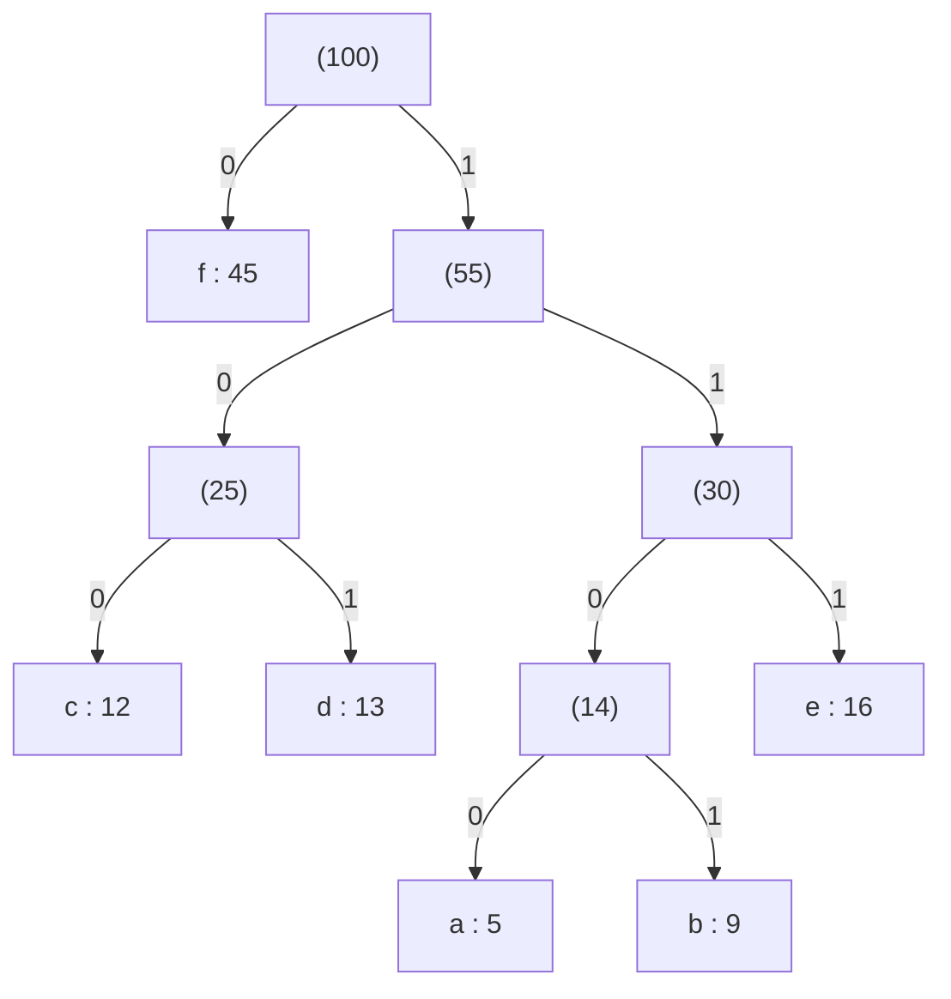

# Greedy Algorithms

> [!abstract] Overview & Paradigm
> A **Greedy Algorithm** builds up a solution step by step, always choosing the option that looks best right now (the locally optimal choice), without reconsidering earlier decisions. It operates under the principle that making locally optimal choices at every stage leads to a globally optimal solution.

---

## 0. Fundamental Concepts

### Core Properties Required for Greedy Optimality

1. **Greedy Choice Property**: A globally optimal solution can be reached by choosing the locally optimal option at each step, without revisiting past choices.
2. **Optimal Substructure**: An optimal solution to the overall problem contains within it optimal solutions to its subproblems.

> [!info] General Greedy Strategy
> 1. **Define the greedy criterion**: Pick a measure to rank candidates (e.g., value/weight ratio $\frac{v_i}{w_i}$, finish time $f_i$, profit $p_i$, start time $s_i$, frequency $f_i$).
> 2. **Sort or order the input**: Arrange candidates by that criterion, usually in $O(n \log n)$ time.
> 3. **Iterate and choose**: Walk through candidates in sorted order; take each one if it keeps the solution feasible.
> 4. **Never reconsider**: Once a choice is made (or rejected), it is permanent and no backtracking is performed.

---

## 1. Fractional Knapsack Problem

> [!note] Problem Definition
> Given $n$ items, each with a weight $w_i > 0$ and value $v_i > 0$, and a knapsack of capacity $W$. We want to choose how much of each item to carry (fractions $x_i \in [0, 1]$) to maximize the total value carried without exceeding capacity $W$.
> 
> $$\text{Maximize } \sum_{i=1}^{n} x_i v_i \quad \text{subject to} \quad \sum_{i=1}^{n} x_i w_i \le W \quad \text{where } 0 \le x_i \le 1$$

> [!warning] Contrast: Fractional vs 0/1 Knapsack
> - **Fractional Knapsack**: Items can be broken into arbitrary continuous fractions ($x_i \in [0, 1]$). Solvable greedily in $O(n \log n)$.
> - **0/1 Knapsack**: Each item must be taken whole ($x_i = 1$) or left behind ($x_i = 0$). The greedy approach **fails**; Dynamic Programming ($O(nW)$) or Branch & Bound is required.

### Greedy Criterion
Calculate the value per unit weight $r_i = \frac{v_i}{w_i}$ for each item. Take items in descending order of $r_i$. When an item cannot fit completely, take whatever fraction fills the remaining knapsack capacity.

---

### Worked Example (Step-by-Step)

> [!example]- 📊 Worked Example: Capacity $W = 50$
> **Given Items:**
> 
> | Item | Weight ($w_i$) | Value ($v_i$) | Ratio ($v_i / w_i$) |
> | :---: | :---: | :---: | :---: |
> | **A** | 10 | 60 | 6.0 |
> | **B** | 20 | 100 | 5.0 |
> | **C** | 30 | 120 | 4.0 |
> 
> **Execution Steps:**
> 1. **Compute Ratios & Sort**: 
>    - $r_A = 60/10 = 6.0$
>    - $r_B = 100/20 = 5.0$
>    - $r_C = 120/30 = 4.0$
>    - Sorted Order: Item A $\to$ Item B $\to$ Item C.
> 2. **Process Item A**:
>    - Weight $10 \le 50$ (fits completely).
>    - Take $100\%$ of A: Weight used $= 10$, Value earned $= 60$, Remaining capacity $= 50 - 10 = 40$.
> 3. **Process Item B**:
>    - Weight $20 \le 40$ (fits completely).
>    - Take $100\%$ of B: Weight used $= 10 + 20 = 30$, Value earned $= 60 + 100 = 160$, Remaining capacity $= 40 - 20 = 20$.
> 4. **Process Item C**:
>    - Weight $30 > 20$ (cannot fit whole).
>    - Take fraction $x_C = \frac{\text{Remaining Capacity}}{w_C} = \frac{20}{30} = \frac{2}{3} \approx 66.7\%$.
>    - Value added $= \frac{2}{3} \times 120 = 80$.
>    - Knapsack is now completely full (Weight $= 50$).
> 
> **Final Result:**
> $$\text{Maximum Total Value} = 60 + 100 + 80 = \mathbf{240}$$

---

### Code Implementation (C++)

```cpp
#include <iostream>
#include <vector>
#include <algorithm>

using namespace std;

struct Item {
    int id;
    double weight;
    double value;
    double ratio;
};

pair<double, vector<double>> fractionalKnapsack(vector<Item>& items, double capacity) {
    int n = items.size();
    
    //compute value-to-weight ratios
    for (int i = 0; i < n; i++) {
        items[i].ratio = items[i].value / items[i].weight;
    }

    //sort descending by ratio
    sort(items.begin(), items.end(), [](const Item& a, const Item& b) {
        return a.ratio > b.ratio;
    });

    vector<double> x(n, 0.0);
    double current_weight = 0.0;
    double max_value = 0.0;

    //fill knapsack greedily
    for (int i = 0; i < n; i++) {
        if (current_weight + items[i].weight <= capacity) {
            x[items[i].id] = 1.0;
            current_weight += items[i].weight;
            max_value += items[i].value;
        } else {
            double remaining = capacity - current_weight;
            x[items[i].id] = remaining / items[i].weight;
            max_value += x[items[i].id] * items[i].value;
            current_weight = capacity;
            break; //knapsack full
        }
    }

    return {max_value, x};
}
```

---

### Complexity Analysis & Step-by-Step Derivation

#### Time Complexity: $O(n \log n)$
1. **Ratio Computation**: Iterating through $n$ items to compute $r_i = \frac{v_i}{w_i}$ takes $n \times O(1) = O(n)$ time.
2. **Sorting**: Sorting $n$ items by ratio takes $O(n \log n)$ time using comparison-based sorting (`std::sort`).
3. **Greedy Loop**: We scan through the items at most once, performing $O(1)$ arithmetic operations per item, taking $O(n)$ time.
4. **Total Time**:
   $$T(n) = O(n) + O(n \log n) + O(n) = O(n \log n)$$

#### Space Complexity: $O(n)$
- Storing the items, computed ratios, and the fraction solution vector $x$ takes $O(n)$ auxiliary space.

---

## 2. Activity Selection Problem (Interval Scheduling)

> [!note] Problem Definition
> Given a single shared resource (e.g., a room or processor) and a set of $n$ activities, each with a start time $s_i$ and finish time $f_i$ (interval $[s_i, f_i)$). Select the **largest possible set of mutually compatible activities** (no two selected activities overlap).
> 
> Two activities $i$ and $j$ are compatible if $s_i \ge f_j$ or $s_j \ge f_i$.

---

### Exploring Greedy Criteria & Counter-Examples

Why does **Earliest Finish Time** work while other intuitive strategies fail?

> [!question]- ❌ Counter-Examples: Why Other Sorting Criteria Fail
> 1. **Option 1: Earliest Start Time ($s_i$)**
>    - *Idea*: Pick the activity that starts first.
>    - *Counter-Example*: Activities $(1, 6), (2, 3), (4, 5)$.
>    - Earliest start picks $(1, 6)$, which blocks both $(2, 3)$ and $(4, 5)$.
>    - Result: 1 activity chosen vs optimal 2 activities $\{(2,3), (4,5)\}$.
> 
> 2. **Option 2: Shortest Activity Duration ($f_i - s_i$)**
>    - *Idea*: Pick the shortest activity to leave room for others.
>    - *Counter-Example*: Activities $(5, 8), (1, 6), (7, 15)$.
>    - Shortest duration is $(5, 8)$ (length 3). Picking it conflicts with both $(1, 6)$ and $(7, 15)$.
>    - Result: 1 activity chosen vs optimal 2 activities $\{(1,6), (7,15)\}$.
> 
> 3. **Option 3: Minimum Overlaps / Fewest Conflicts**
>    - *Idea*: Pick the activity that overlaps with the fewest remaining activities.
>    - *Counter-Example*: A central activity overlaps with 2 activities, while other activities on both sides form long overlapping chains. Picking the minimum conflict node can split the timeline in a way that destroys larger independent compatible chains.
> 
> **✅ Correct Greedy Criterion: Earliest Finish Time ($f_i$)**
> By picking the activity that finishes earliest, we free up the resource as soon as possible, leaving the maximum remaining time available for subsequent activities.

---

### Worked Example (From Lecture Slides)

> [!example]- 📊 Worked Example: Scheduling 6 Activities
> **Given Activities:**
> - Activity 1: $[2, 7)$
> - Activity 2: $[3, 4)$
> - Activity 3: $[4.5, 6.5)$
> - Activity 4: $[2.2, 3.5)$
> - Activity 5: $[3.9, 5.7)$
> - Activity 6: $[5.9, 7.5)$
> 
> **Execution Steps:**
> 1. **Sort ascending by finish time ($f_i$):**
>    - Activity 4: $[2.2, \mathbf{3.5})$
>    - Activity 2: $[3, \mathbf{4.0})$
>    - Activity 5: $[3.9, \mathbf{5.7})$
>    - Activity 3: $[4.5, \mathbf{6.5})$
>    - Activity 1: $[2, \mathbf{7.0})$
>    - Activity 6: $[5.9, \mathbf{7.5})$
> 2. **Iterate and Select:**
>    - Always pick first: **Select Activity 4** $[2.2, 3.5)$. $\text{Last Finish} = 3.5$.
>    - Activity 2: Start $3.0 < 3.5$ (overlap $\implies$ skip).
>    - Activity 5: Start $3.9 \ge 3.5$ $\implies$ **Select Activity 5** $[3.9, 5.7)$. $\text{Last Finish} = 5.7$.
>    - Activity 3: Start $4.5 < 5.7$ (overlap $\implies$ skip).
>    - Activity 1: Start $2.0 < 5.7$ (overlap $\implies$ skip).
>    - Activity 6: Start $5.9 \ge 5.7$ $\implies$ **Select Activity 6** $[5.9, 7.5)$. $\text{Last Finish} = 7.5$.
> 
> **Final Selected Set:** $\{4, 5, 6\}$ (Total = 3 activities).

---

### Code Implementation (C++)

```cpp
#include <iostream>
#include <vector>
#include <algorithm>

using namespace std;

struct Activity {
    int id;
    double start;
    double finish;
};

vector<int> activitySelection(vector<Activity>& activities) {
    int n = activities.size();
    if (n == 0) return {};

    //sort activities by finish time ascending
    sort(activities.begin(), activities.end(), [](const Activity& a, const Activity& b) {
        return a.finish < b.finish;
    });

    vector<int> selected;
    
    //always take the earliest finishing activity
    selected.push_back(activities[0].id);
    double last_finish = activities[0].finish;

    //scan through remaining activities
    for (int i = 1; i < n; i++) {
        if (activities[i].start >= last_finish) {
            selected.push_back(activities[i].id);
            last_finish = activities[i].finish;
        }
    }

    return selected;
}
```

---

### Complexity Analysis & Step-by-Step Derivation

#### Time Complexity: $O(n \log n)$
1. **Sorting**: Ordering $n$ activities by finish time takes $O(n \log n)$.
2. **Linear Selection Pass**: We examine each activity once with an $O(1)$ comparison (`start >= last_finish`). Over $n$ items, this is $O(n)$.
3. **Total Time**:
   $$T(n) = O(n \log n) + O(n) = O(n \log n)$$
   *(If activities are pre-sorted, running time is $O(n)$).*

#### Space Complexity: $O(n)$
- $O(n)$ auxiliary space to store input structures and the output array of selected activities.

---

### Proof of Correctness

> [!info] 🧠 1. Intuitive Explanation (Plain English)
> **The Free Time Analogy**: Imagine you want to watch as many movies as possible in a single day. If you pick a movie that ends at 10:00 AM instead of one that ends at 1:00 PM, you free up your schedule 3 hours earlier! 
> By always choosing the movie that finishes earliest, you leave the **maximum possible remaining time** to fit in more movies later. Swapping an optimal schedule's first choice for our earliest-finishing choice can only free up more time, never less.

> [!tip]- 📝 2. Exam-Ready Proof (Short & Concise)
> - **Setup**: Let $G = \{g_1, g_2, \dots, g_m\}$ be the Greedy set and $O = \{r_1, r_2, \dots, r_n\}$ be an Optimal set, both sorted by finish times. Assume $G \ne O$ and $n \ge m$.
> - **First Mismatch**: Let $k$ be the first index where $g_k \ne r_k$. Up to $k-1$, both sets are identical.
> - **Exchange Argument**: Since Greedy picks the earliest finish time among compatible candidates, $f(g_k) \le f(r_k)$. Replacing $r_k$ with $g_k$ in $O$ gives $O' = (O \setminus \{r_k\}) \cup \{g_k\}$. Since $s(r_{k+1}) \ge f(r_k) \ge f(g_k)$, $g_k$ does not conflict with $r_{k+1}$. $O'$ remains valid, compatible, and optimal with $|O'| = n$.
> - **Contradiction**: Repeat this exchange until $O$ contains all elements of $G$. If $n > m$, there must exist an activity $r_{m+1} \in O$ starting after $g_m$. But Greedy only stops when no compatible activity remains, so $r_{m+1}$ cannot exist.
> - **Conclusion**: $m = n \implies |G| = |O|$. Greedy is optimal. $\blacksquare$

> [!success]- 🔬 3. Rigorous Slide Proof (Step-by-Step Mathematical Proof)
> ##### Step 1: Setup
> Let $G = \{g_1, g_2, \dots, g_m\}$ be the set of intervals selected by the greedy algorithm.
> Let $O = \{r_1, r_2, \dots, r_n\}$ be the set of intervals in some optimal solution.
> If $G = O$, then $G$ is already optimal. Assume $G \ne O$.
> Since $O$ is optimal and $G$ is valid, $n \ge m$.
> 
> ##### Step 2: Ordered Sequences
> Write both solutions ordered by finish time:
> $$G = \{g_1, g_2, \dots, g_m\}, \quad O = \{r_1, r_2, \dots, r_n\}$$
> 
> ##### Step 3: The First Mismatch
> Let $k$ be the index of the first interval where the two sequences differ:
> $$G = \{g_1, g_2, \dots, g_{k-1}, \mathbf{g_k}, \dots, g_m\}$$
> $$O = \{g_1, g_2, \dots, g_{k-1}, \mathbf{r_k}, \dots, r_n\}$$
> (The first $k-1$ intervals already agree).
> 
> ##### Step 4: The Exchange
> Both $g_k$ and $r_k$ are compatible with $g_{k-1}$, so start times create no conflict with earlier choices.
> By greedy choice, $g_k$ has the earliest finish time among available compatible intervals, so:
> $$f_{g_k} \le f_{r_k}$$
> Since $r_{k+1}$ starts after $r_k$ finishes ($s_{r_{k+1}} \ge f_{r_k} \ge f_{g_k}$), replacing $r_k$ with $g_k$ in $O$ creates no conflict with $r_{k+1}$.
> After replacement:
> $$O' = \{g_1, g_2, \dots, g_{k-1}, g_k, r_{k+1}, \dots, r_n\}$$
> 
> ##### Step 5: Iteration & Contradiction
> By repeating this process, we can replace all $g_i$ into $O$, yielding:
> $$O = \{g_1, g_2, \dots, g_m, \dots, r_n\}$$
> Suppose, for contradiction, that $O$ contains an interval after $g_m$ that does not conflict with it. By definition, greedy only terminates when no remaining interval is compatible with its last choice. Such an interval would have been selected by greedy and would already belong to $G$, contradicting that it is exclusive to $O$.
> Hence no such interval exists, and $O$ cannot extend past $G$.
> 
> $$\therefore |G| = |O| \implies \text{Greedy is Optimal.} \quad \blacksquare$$

---

## 3. Job Sequencing with Deadlines

> [!note] Problem Definition
> Given $n$ jobs, each taking **exactly 1 unit of time** to execute. Each job $i$ has a deadline $d_i \ge 1$ and a profit $p_i > 0$. At most one job can run in any time slot. A job earns its profit $p_i$ if and only if it completes on or before its deadline (scheduled in slot $t \le d_i$).
> 
> **Goal**: Maximize the total profit from completed jobs.

### Greedy Criterion
1. **Sort all jobs by profit in descending order**.
2. **Scan in profit order**: Take each job in turn (most profitable first).
3. **Find the latest free slot**: Search for the latest available time slot $t$ such that $1 \le t \le d_i$.
4. **Place or skip**: If a free slot exists, schedule the job in that slot; otherwise, skip the job (it cannot earn profit).

---

### Worked Examples (From Lecture Slides)

> [!example]- 📊 Worked Example 1: Four Jobs
> **Input Jobs:**
> 
> | JobID | Deadline | Profit |
> | :---: | :---: | :---: |
> | $a$ | 4 | 20 |
> | $b$ | 1 | 10 |
> | $c$ | 1 | 40 |
> | $d$ | 1 | 30 |
> 
> **Step 1: Sort by Profit Descending**
> 1. Job $c$ (Deadline 1, Profit 40)
> 2. Job $d$ (Deadline 1, Profit 30)
> 3. Job $a$ (Deadline 4, Profit 20)
> 4. Job $b$ (Deadline 1, Profit 10)
> 
> Max deadline $d_{\max} = 4$. Time slots: `[Slot 1, Slot 2, Slot 3, Slot 4]`.
> 
> **Step 2: Slot Placement Trace**
> - **Job $c$**: Deadline 1 $\to$ Slot 1 is free $\to$ **Assign $c$ to Slot 1**. Slots: `[c, empty, empty, empty]`.
> - **Job $d$**: Deadline 1 $\to$ Slot 1 is occupied $\to$ No earlier slot $\to$ **Skip $d$**.
> - **Job $a$**: Deadline 4 $\to$ Slot 4 is free $\to$ **Assign $a$ to Slot 4**. Slots: `[c, empty, empty, a]`.
> - **Job $b$**: Deadline 1 $\to$ Slot 1 is occupied $\to$ No earlier slot $\to$ **Skip $b$**.
> 
> **Output:** Scheduled jobs: $\{c, a\}$ in slots 1 and 4.
> $$\text{Total Profit} = 40 + 20 = \mathbf{60}$$

> [!example]- 📊 Worked Example 2: Five Jobs
> **Input Jobs:**
> 
> | JobID | Deadline | Profit |
> | :---: | :---: | :---: |
> | $a$ | 2 | 100 |
> | $b$ | 1 | 19 |
> | $c$ | 2 | 27 |
> | $d$ | 1 | 25 |
> | $e$ | 3 | 15 |
> 
> **Step 1: Sort by Profit Descending**
> 1. Job $a$ (Deadline 2, Profit 100)
> 2. Job $c$ (Deadline 2, Profit 27)
> 3. Job $d$ (Deadline 1, Profit 25)
> 4. Job $b$ (Deadline 1, Profit 19)
> 5. Job $e$ (Deadline 3, Profit 15)
> 
> Max deadline $d_{\max} = 3$. Time slots: `[Slot 1, Slot 2, Slot 3]`.
> 
> **Step 2: Slot Placement Trace**
> - **Job $a$**: Deadline 2 $\to$ Slot 2 is free $\to$ **Assign $a$ to Slot 2**. Slots: `[empty, a, empty]`.
> - **Job $c$**: Deadline 2 $\to$ Slot 2 is occupied $\to$ check Slot 1 $\to$ Slot 1 is free $\to$ **Assign $c$ to Slot 1**. Slots: `[c, a, empty]`.
> - **Job $d$**: Deadline 1 $\to$ Slot 1 is occupied $\to$ **Skip $d$**.
> - **Job $b$**: Deadline 1 $\to$ Slot 1 is occupied $\to$ **Skip $b$**.
> - **Job $e$**: Deadline 3 $\to$ Slot 3 is free $\to$ **Assign $e$ to Slot 3**. Slots: `[c, a, e]`.
> 
> **Output:** Scheduled jobs: $\{c, a, e\}$ in slots 1, 2, 3.
> $$\text{Total Profit} = 27 + 100 + 15 = \mathbf{142}$$

---

### Code Implementation (C++)

```cpp
#include <iostream>
#include <vector>
#include <algorithm>

using namespace std;

struct Job {
    char id;
    int deadline;
    int profit;
};

pair<vector<char>, int> jobSequencing(vector<Job>& jobs) {
    int n = jobs.size();
    
    //step 1: sort jobs in descending profit order
    sort(jobs.begin(), jobs.end(), [](const Job& a, const Job& b) {
        return a.profit > b.profit;
    });

    int maxDeadline = 0;
    for (const auto& j : jobs) {
        maxDeadline = max(maxDeadline, j.deadline);
    }

    //slots 1..maxDeadline (-1 means empty)
    vector<char> slot(maxDeadline + 1, '-'); 
    int totalProfit = 0;
    int jobsScheduled = 0;

    //step 2: scan jobs in profit order
    for (const auto& j : jobs) {
        //step 3: find latest free slot i with i <= deadline
        for (int i = min(maxDeadline, j.deadline); i >= 1; i--) {
            if (slot[i] == '-') {
                //step 4: place it
                slot[i] = j.id;
                totalProfit += j.profit;
                jobsScheduled++;
                break;
            }
            //else: slot taken, try next earlier slot
        }
        //if no free slot found, job is skipped
    }

    return {slot, totalProfit};
}
```

---

### Complexity Analysis & Step-by-Step Derivation

#### 1. Sorting Jobs: $O(n \log n)$
- Sorting $n$ jobs by profit in descending order costs $O(n \log n)$.

#### 2. Naive Slot Search: $O(n \cdot d)$
- For each of the $n$ jobs, we perform a backward scan from $\min(d_{\max}, d_i)$ down to 1.
- In the worst case, this linear backward scan takes $O(d)$ steps per job, where $d = \min(n, \max d_i)$.
- Across all $n$ jobs:
  $$T_{\text{naive}}(n) = O(n \log n) + O(n \cdot d) = O(n \cdot d)$$
- If deadlines are large ($d \approx n$), worst-case time is **$O(n^2)$**.

#### 3. Disjoint-Set Union (Union-Find) Speedup: $O(n \log n)$
- We can maintain a Disjoint-Set (DSU) where the representative of slot $t$ points to the **latest available free slot $\le t$**.
- When slot $t$ is filled, we union $t$ with $t - 1$.
- Each slot lookup takes nearly $O(1)$ time ($O(\alpha(n))$ with path compression).
- Total time with Union-Find speedup:
  $$T_{\text{DSU}}(n) = O(n \log n) + O(n \cdot \alpha(n)) = O(n \log n)$$

#### Space Complexity: $O(n + d)$
- $O(n)$ to store jobs $+ O(d)$ for slot tracking array/DSU.

---

### Proof of Correctness

> [!info] 🧠 1. Intuitive Explanation (Plain English)
> **The Procrastination Analogy**: To maximize earnings, you prioritize the highest-paying tasks. But **you shouldn't do a task earlier than necessary!** By postponing each high-paying task to the absolute latest available slot before its deadline, you lock in the big reward while leaving all earlier slots wide open for tighter-deadline tasks.

> [!tip]- 📝 2. Exam-Ready Proof (Short & Concise)
> - **Setup**: Let $I$ be Greedy's job set and $J$ be an Optimal set. Assume $I \ne J$.
> - **Alignment**: Align shared jobs so every shared job occupies the exact same slot in both schedules (shifting to earlier slots is always deadline-safe).
> - **Profit Comparison**: Let $a$ be the highest-profit job in $I \setminus J$ placed in slot $s$ of $I$, and let $b$ be the job in slot $s$ of $J$. Since Greedy processes jobs by descending profit, if $\text{profit}(b) > \text{profit}(a)$, Greedy would have considered $b$ before $a$. Since slot $s$ was free when Greedy placed $a$, it was also free when $b$ was examined, so Greedy would have placed $b$ in slot $s$, implying $b \in I$. Contradiction! Thus $\text{profit}(a) \ge \text{profit}(b)$.
> - **Swap**: Replace $b$ with $a$ in slot $s$ of $J$. The new schedule $J' = (J \setminus \{b\}) \cup \{a\}$ has $\text{profit}(J') \ge \text{profit}(J)$.
> - **Conclusion**: Repeat swaps for all differing jobs until $J = I$. $\text{profit}(I) = \text{profit}(J) \implies$ Greedy is optimal. $\blacksquare$

> [!success]- 🔬 3. Rigorous Slide Proof (Step-by-Step Mathematical Proof)
> ##### Slide 1/5: Setup
> Let $J =$ the set of jobs in an optimal solution.
> Let $I =$ the set of jobs selected by the greedy method.
> We need to show that $I$ and $J$ have the same total profit.
> If $I = J$, there is nothing to prove, so assume $I \ne J$.
> **Goal**: Show $\text{profit}(I) = \text{profit}(J)$, so $I$ is optimal too.
> 
> ##### Slide 2/5: Why a Mismatch Must Exist
> - **Fact**: If a set of jobs can all be scheduled without missing a deadline, then any smaller subset of them can too (removing a job never makes scheduling harder).
> - **$J$ cannot be missing something $I$ has**: If $I$ contained every job of $J$ plus extra profitable jobs, $I$ would earn strictly more than $J$, contradicting $J$'s optimality.
> - **$I$ cannot be missing something $J$ has**: Greedy only skips a job when there is truly no room left for it. If $J$ can fit that job in, greedy never turns down a job it could still fit.
> - **Conclusion**: Neither set can fully contain the other. There must be some job $a$ only in $I$, and some job $b$ only in $J$.
> 
> ##### Slide 3/5: Aligning the Schedules
> A job common to both $I$ and $J$ might sit in a different time slot in each schedule.
> Let $S_i$ be the schedule for $I$, and $S_j$ be the schedule for $J$. We can always rearrange $S_i$ and $S_j$ without changing either one's total profit so that every shared job sits in the same slot in both:
> - If job $a$ is scheduled in slot 2 in $I$ but slot 4 in $J$, move $a$ to slot 4 in $I$ as well.
> - If some other job occupies slot 4 in $I$, move that job to slot 2 instead. Shifting a job to an earlier slot never breaks its deadline, so this is always safe.
> Repeating this produces aligned schedules $S_i$ and $S_j'$ where every common job occupies the same slot.
> 
> ##### Slide 4/5: Comparing Profits
> Let $a$ be the highest-profit job in $I$ but not $J$. After aligning, let $s$ be the slot where $a$ sits in $S_i$, and let $b$ be whichever job (if any) sits in that same slot $s$ in $S_j'$.
> Both placements are valid, so $s \le \text{deadline}(a)$ and $s \le \text{deadline}(b)$.
> 
> Greedy fills slots permanently (the set of occupied slots only grows over time).
> Suppose $\text{profit}(b) > \text{profit}(a)$:
> - Then greedy reached $b$ before $a$.
> - Since slot $s$ is free later at $a$'s turn, it must already have been free earlier at $b$'s turn.
> - Since $s \le \text{deadline}(b)$, greedy would have placed $b$ there.
> - But $b \notin I$, which is a contradiction!
> Therefore, $\mathbf{\text{profit}(a) \ge \text{profit}(b)}$.
> 
> ##### Slide 5/5: The Swap & Conclusion
> Since $\text{profit}(a) \ge \text{profit}(b)$, replacing $b$ with $a$ in slot $s$ cannot reduce total profit:
> $$J' = J \setminus \{b\} \cup \{a\} \quad \text{has } \text{profit}(J') \ge \text{profit}(J)$$
> Repeat this swap for every job that differs between $I$ and $J$. Each swap keeps profit the same or increases it, and after enough swaps, $J$ becomes identical to $I$.
> 
> Since profit never decreased and $J$ was optimal to begin with:
> $$\text{profit}(I) = \text{profit}(J) \implies I \text{ must be optimal too.} \quad \blacksquare$$

---

## 4. Interval Partitioning (Classroom Scheduling)

> [!note] Problem Definition
> Given $n$ lectures, each with a start time $s_i$ and finish time $f_i$, schedule **all** lectures using the **minimum number of classrooms**, such that no two lectures assigned to the same room overlap in time.
> 
> **Depth Definition**: The **depth** $d$ of a set of intervals is the maximum number of lectures that are mutually overlapping at any single point in time.

---

### Naive Solution Idea & Why It Fails

> [!danger] Counter-Example: Naive Room-by-Room Approach Fails
> **Naive Idea**:
> 1. Apply Activity Selection to find the maximum set of non-overlapping lectures for Room 1.
> 2. Repeat Activity Selection on the leftover lectures for Room 2.
> 3. Continue opening new rooms until all lectures are scheduled.
> 
> **Counter-Example from Lecture**:
> Lectures: $(3, 7), (5, 9), (8, 11), (12, 13), (10, 14), (16, 18), (13, 20)$.
> 
> - **Room 1** picks max non-overlapping: $\{(3, 7), (8, 11), (12, 13), (16, 18)\}$
> - **Room 2** picks max leftover: $\{(5, 9), (10, 14)\}$
> - **Room 3** takes remaining: $\{(13, 20)\}$
> $\implies$ **3 rooms used by Naive approach!**
> 
> **Why it's suboptimal**:
> The maximum depth at any single point in time is only **$\text{depth} = 2$**. Only **2 rooms** are actually needed:
> - Room 1: $(3, 7), (8, 11), (12, 13), (13, 20)$
> - Room 2: $(5, 9), (10, 14), (16, 18)$
> 
> The naive approach greedily hoards compatible lectures for Room 1, leaving fragments that force an unnecessary 3rd room.

---

### Correct Greedy Strategy
1. **Sort all lectures by start time ascending ($s_i$)**.
2. **Scan in order**: Take each lecture in turn, earliest start first.
3. **Reuse a free room**: If some already-open room is free (its last lecture finished $\le s_i$), assign the lecture there.
4. **Open a new room**: If no open room is free, allocate a brand-new room for this lecture.

---

### Code Implementation (C++)

```cpp
#include <iostream>
#include <vector>
#include <algorithm>
#include <queue>
#include <unordered_map>

using namespace std;

struct Lecture {
    int id;
    int start;
    int finish;
};

pair<unordered_map<int, int>, int> intervalPartitioning(vector<Lecture>& lectures) {
    int n = lectures.size();
    if (n == 0) return {{}, 0};

    //step 1: sort lectures by start time ascending
    sort(lectures.begin(), lectures.end(), [](const Lecture& a, const Lecture& b) {
        return a.start < b.start;
    });

    //min-heap stores pair<last_finish_time, room_id>
    priority_queue<pair<int, int>, vector<pair<int, int>>, greater<pair<int, int>>> minHeap;
    unordered_map<int, int> roomAssignment;
    int roomCount = 0;

    //step 2: scan each lecture in start-time order
    for (int i = 0; i < n; i++) {
        if (!minHeap.empty() && minHeap.top().first <= lectures[i].start) {
            //step 3: reuse free room (earliest finishing room)
            auto topRoom = minHeap.top();
            minHeap.pop();
            roomAssignment[lectures[i].id] = topRoom.second;
            minHeap.push({lectures[i].finish, topRoom.second});
        } else {
            //step 4: open brand new room
            roomCount++;
            roomAssignment[lectures[i].id] = roomCount;
            minHeap.push({lectures[i].finish, roomCount});
        }
    }

    return {roomAssignment, roomCount};
}
```

---

### Complexity Analysis & Step-by-Step Derivation

#### Time Complexity: $O(n \log n)$
1. **Sorting by Start Time**: Ordering $n$ lectures takes $O(n \log n)$.
2. **Min-Heap Operations**:
   - For each lecture, checking `minHeap.top()` is $O(1)$.
   - `pop()` and `push()` take $O(\log d)$, where $d$ is the number of active rooms ($d \le n$).
   - Across $n$ lectures, heap operations take $O(n \log d) \le O(n \log n)$.
3. **Total Time**:
   $$T(n) = O(n \log n) + O(n \log n) = O(n \log n)$$

#### Space Complexity: $O(n)$
- Min-heap holds at most $d \le n$ rooms $\implies O(d)$.
- `roomAssignment` map takes $O(n)$ space.
- Total Auxiliary Space: $S(n) = O(n)$.

---

### Proof of Correctness

> [!info] 🧠 1. Intuitive Explanation (Plain English)
> **The Bottleneck Analogy**: If at 2:00 PM there are 5 classes happening simultaneously, you physically cannot get away with fewer than 5 rooms. The peak concurrent overlap (depth $d$) is an unavoidable physical limit. 
> Because Greedy sorts by start time and reuses rooms whenever a room finishes, it **only opens a new room when every single open room is currently in use**. Therefore, it never opens more rooms than the peak simultaneous overlap ($d$).

> [!tip]- 📝 2. Exam-Ready Proof (Short & Concise)
> - **Lower Bound**: Let $d$ be the depth (maximum concurrent overlapping lectures). Any valid solution must use at least $d$ rooms because $d$ mutually overlapping lectures cannot share a room.
> - **Upper Bound**: Suppose Greedy uses $d + 1$ rooms, opening room $d + 1$ for lecture $j$.
> - **Contradiction**: Greedy only opens room $d + 1$ if all $d$ existing rooms are currently occupied by lectures that started before $s_j$ and finish after $s_j$. This means lecture $j$ plus $d$ active lectures are running at time $s_j$, creating $d + 1$ mutually overlapping lectures. But the maximum depth is $d$, a contradiction!
> - **Conclusion**: Greedy uses exactly $d$ rooms, matching the theoretical lower bound. $\blacksquare$

> [!success]- 🔬 3. Rigorous Slide Proof (Step-by-Step Mathematical Proof)
> ##### Slide 1/2: Lower Bound
> **Claim**: For any set of lectures $R$, the number of classrooms required is at least the depth of $R$:
> $$\text{Rooms needed} \ge \text{depth}(R)$$
> **Proof**: Any lectures that are mutually in conflict must be scheduled in different rooms. That alone forces at least $\text{depth}(R)$ rooms to be used.
> 
> ##### Slide 2/2: The Greedy Bound Is Tight
> Let $d$ be the depth of $R$.
> **Claim**: The greedy algorithm uses exactly $d$ rooms.
> **Proof**:
> 1. Suppose, for contradiction, greedy used more than $d$ rooms. Let $j$ be the first lecture scheduled into room $d+1$.
> 2. Since lectures are processed in order of start time, there must already be $d$ lectures underway at that moment ($s_j$), one occupying each of the other $d$ rooms, all in conflict with $j$.
> 3. But that means $d+1$ lectures are mutually in conflict at once, contradicting the fact that the depth is only $d$.
> 4. So greedy never needs more than $d$ rooms, matching the lower bound exactly.
> 
> $$\therefore \text{Greedy Room Count} = d = \text{Optimal Room Count.} \quad \blacksquare$$

---

## 5. Huffman Encoding

> [!note] Problem Definition
> Given a text string of symbols with known frequencies $C = \{c_1, c_2, \dots, c_n\}$, find a variable-length **prefix-free binary code** for each symbol that minimizes the total length of the encoded string:
> 
> $$\text{Minimize } B(T) = \sum_{c \in C} \text{freq}(c) \cdot d_T(c)$$
> where $d_T(c)$ is the depth (code length) of character $c$ in binary tree $T$.

---

### Key Concepts

> [!info] Why Prefix-Free Matters
> A **prefix-free code** ensures that no code word is a prefix of any other code word. This allows immediate, unambiguous decoding without special delimiter characters.
> 
> *Example of Ambiguity without Prefix-Free:*
> - Let $a = 0, b = 1, c = 01$.
> - Decode message: `0101`
> - Ambiguous decodings: Is it `a, b, a, b` ($0, 1, 0, 1$) or `c, c` ($01, 01$)? Both are valid!
> - A prefix-free code guarantees every message decodes to **exactly one** answer.

> [!example] Comparing Encodings for Text "abcc"
> - **Encoding 1**: $a = 0, b = 10, c = 11 \implies \text{String: } 0101111$ (7 bits)
> - **Encoding 2**: $c = 0, a = 10, b = 11 \implies \text{String: } 101100$ (6 bits)
> - *Takeaway*: Both are prefix-free, but Encoding 2 is shorter because the more frequent symbol ($c$) gets the shortest code ($0$).

> [!abstract] Optimal Tree Structure
> - To be prefix-free, **characters must sit only at the leaves** of the binary tree. Internal nodes never represent characters.
> - High-frequency characters sit closer to the root (shorter codes).
> - Low-frequency characters sit deeper in the tree (longer codes).

---

### The Greedy Algorithm
1. **Build leaves**: Create a leaf node for each character with its frequency, insert all into a min-priority queue (min-heap).
2. **Extract two smallest**: Repeatedly remove the two nodes with the lowest frequencies.
3. **Merge into a parent**: Create a new internal node whose frequency is their sum, make the two extracted nodes its children, and insert it back into the heap.
4. **Repeat $n - 1$ times**: When only one node remains, it is the root of the Huffman tree. (Left branch = `0`, Right branch = `1`).

---

### Worked Example (6 Characters from Lecture Slides)

> [!example]- 📊 Worked Example: 6 Characters (Total Frequency = 100)
> **Given Character Frequencies:**
> $f: 45, \quad e: 16, \quad d: 13, \quad c: 12, \quad b: 9, \quad a: 5$
> 
> **Step-by-Step Merges:**
> 
> 1. **Initial Min-Heap**: $\{a(5), b(9), c(12), d(13), e(16), f(45)\}$
> 2. **Merge 1**: Extract $a(5)$ and $b(9) \to$ Create parent $(14)$ with children $a, b$.
>    - Heap: $\{c(12), d(13), (14), e(16), f(45)\}$
> 3. **Merge 2**: Extract $c(12)$ and $d(13) \to$ Create parent $(25)$ with children $c, d$.
>    - Heap: $\{(14), e(16), (25), f(45)\}$
> 4. **Merge 3**: Extract $(14)$ and $e(16) \to$ Create parent $(30)$ with children $(14), e$.
>    - Heap: $\{(25), (30), f(45)\}$
> 5. **Merge 4**: Extract $(25)$ and $(30) \to$ Create parent $(55)$ with children $(25), (30)$.
>    - Heap: $\{f(45), (55)\}$
> 6. **Merge 5**: Extract $f(45)$ and $(55) \to$ Create Root $(100)$.



> **Final Code Table & Bit Length Calculation:**
> 
> | Character | Frequency | Code | Bits (Depth) | Weighted Bits ($\text{Freq} \times \text{Bits}$) |
> | :---: | :---: | :---: | :---: | :---: |
> | **f** | 45 | `0` | 1 | $45 \times 1 = 45$ |
> | **e** | 16 | `111` | 3 | $16 \times 3 = 48$ |
> | **d** | 13 | `101` | 3 | $13 \times 3 = 39$ |
> | **c** | 12 | `100` | 3 | $12 \times 3 = 36$ |
> | **b** | 9 | `1101` | 4 | $9 \times 4 = 36$ |
> | **a** | 5 | `1100` | 4 | $5 \times 4 = 20$ |
> | **Total** | **100** | | | **224 bits** |
> 
> *(Contrast with fixed-length 3-bit encoding: $100 \times 3 = 300$ bits. Huffman saves $76$ bits, a $25.3\%$ reduction!)*

---

### Code Implementation (C++)

```cpp
#include <iostream>
#include <vector>
#include <string>
#include <queue>
#include <unordered_map>

using namespace std;

struct Node {
    char ch;
    int freq;
    Node* left;
    Node* right;

    Node(char character, int frequency) {
        ch = character;
        freq = frequency;
        left = right = nullptr;
    }
};

struct Compare {
    bool operator()(Node* a, Node* b) {
        return a->freq > b->freq;
    }
};

//step 2: build huffman tree using min-heap
Node* buildHuffmanTree(const unordered_map<char, int>& freqMap) {
    priority_queue<Node*, vector<Node*>, Compare> minHeap;

    //step 1: create leaf nodes and push to heap - O(n)
    for (auto pair : freqMap) {
        minHeap.push(new Node(pair.first, pair.second));
    }

    //perform n - 1 merges - O(n log n)
    while (minHeap.size() > 1) {
        Node* x = minHeap.top(); minHeap.pop(); //lowest-freq
        Node* y = minHeap.top(); minHeap.pop(); //2nd lowest-freq

        Node* z = new Node('\0', x->freq + y->freq);
        z->left = x;
        z->right = y;

        minHeap.push(z);
    }

    return minHeap.top(); //root of huffman tree
}

//step 3: generate prefix codes via tree traversal - O(n)
void assignCodes(Node* root, string code, unordered_map<char, string>& codeTable) {
    if (!root) return;

    if (!root->left && !root->right) {
        codeTable[root->ch] = (code == "") ? "0" : code;
        return;
    }

    assignCodes(root->left, code + "0", codeTable);
    assignCodes(root->right, code + "1", codeTable);
}

//step 5: decode bitstring bit by bit
string decodeBitstring(Node* root, const string& bitstring) {
    string result = "";
    Node* curr = root;

    for (char bit : bitstring) {
        if (bit == '0') curr = curr->left;
        else curr = curr->right;

        if (!curr->left && !curr->right) {
            result += curr->ch;
            curr = root; //restart at root
        }
    }

    return result;
}
```

---

### Complexity Analysis & Step-by-Step Derivation

#### Time Complexity: $O(n \log n)$
1. **Building Initial Heap**: Inserting $n$ leaf nodes into a priority queue takes $O(n)$ using bottom-up heapify (or $O(n \log n)$ via $n$ pushes).
2. **Merging Loop**:
   - The loop runs exactly $n - 1$ times to create $n - 1$ internal nodes.
   - In each iteration: 2 `pop` operations $+ 1$ `push` operation on a heap of size $\le n \implies O(\log n)$.
   - Merging cost: $(n - 1) \times O(\log n) = O(n \log n)$.
3. **Code Assignment Traversal**: A DFS traversal of a binary tree with $2n - 1$ nodes takes $O(n)$ time.
4. **Encoding/Decoding Text of Length $N$**: Takes $O(N)$ time.
5. **Total Tree Construction Time**:
   $$T(n) = O(n \log n)$$

#### Space Complexity: $O(n)$
- Tree has $n$ leaves $+ (n - 1)$ internal nodes $= 2n - 1$ total nodes $\implies O(n)$ memory.
- Min-heap stores at most $n$ nodes $\implies O(n)$.
- Code lookup map has $n$ entries $\implies O(n)$.
- Total Auxiliary Space: $S(n) = O(n)$.

---

### Proof of Correctness

> [!info] 🧠 1. Intuitive Explanation (Plain English)
> **The Deepest Sibling Analogy**: Highly frequent letters (like 'E') should stay at the top with 1 or 2 bits, while rare letters (like 'Z') can go deep down. 
> Huffman pairs the two absolute rarest characters together at the bottom of the tree as sibling leaves. Merging them into a single combined symbol reduces the problem size by 1. By induction, doing this recursively builds the optimal tree shape at every scale.

> [!tip]- 📝 2. Exam-Ready Proof (Short & Concise)
> - **Sibling Lemma**: Let $x, y$ be the two lowest frequency characters. There exists an optimal tree where $x$ and $y$ are sibling leaves at maximum depth. (Swapping $x, y$ with any deeper leaves cannot increase cost because $x, y$ have the smallest frequencies).
> - **Cost Recurrence**: Let $T$ be the tree for $n$ symbols, and $T'$ be the tree after replacing sibling leaves $x, y$ with parent $z$ of frequency $f(x) + f(y)$. Then:
>   $$\text{Cost}(T) = \text{Cost}(T') + f(x) + f(y)$$
> - **Induction Step**: By induction hypothesis, Huffman produces an optimal tree $T'$ for the $n-1$ symbols. Since $\text{Cost}(T) = \text{Cost}(T') + f(x) + f(y)$, the resulting tree $T$ must also be optimal for $n$ symbols. $\blacksquare$

> [!success]- 🔬 3. Rigorous Slide Proof (Step-by-Step Mathematical Proof)
> ##### Slide 1/3: Setup
> Proof by induction on the number of symbols $n$:
> - **Base case**: $n \le 2$ (with only 1 or 2 symbols, only one possible tree shape exists, which is trivially optimal).
> - **Inductive hypothesis**: Assume the claim holds for any sequence of $n - 1$ frequencies.
> - We show it then also holds for any sequence of $n$ frequencies.
> - **Goal**: Show $\text{cost}(H) = \text{cost}(G)$, where $H$ is an optimal tree and $G$ is the tree our algorithm builds.
> 
> ##### Slide 2/3: The Reduction
> Let $f_1 \le f_2 \le \dots \le f_n$ be the frequencies.
> There is an optimal tree $H$ where the two smallest, $f_1$ and $f_2$, are siblings (proved next). Our algorithm's tree $G$ also makes them siblings, since it merges the two smallest frequencies first.
> 
> Remove $f_1$ and $f_2$ from both trees, and make their parent a new leaf with frequency $(f_1 + f_2)$. This gives smaller trees $H'$ and $G'$, each with $n - 1$ elements.
> By the inductive hypothesis:
> $$\text{cost}(H') = \text{cost}(G')$$
> Since $\text{cost}(H) = \text{cost}(H') + f_1 + f_2$ and $\text{cost}(G) = \text{cost}(G') + f_1 + f_2$, it follows that:
> $$\text{cost}(H) = \text{cost}(G)$$
> 
> ##### Slide 3/3: Proof of the Sibling Claim
> **Claim**: Some optimal tree has the two smallest-frequency symbols, $w$ and $y$, as siblings.
> **Proof**: Take any optimal tree. If $w$ and $y$ are already siblings, done. Otherwise, look at whoever currently sits next to $w$; exactly one of three cases holds:
> 1. **Some other symbol $z$ is $w$'s sibling**: Since $y$ has the second-smallest frequency, $\text{freq}(z) \ge \text{freq}(y)$. Swap $z$ and $y$'s positions in the tree. This pairs $w$ with $y$ and costs no more than before, since $y$ is no heavier than $z$.
> 2. **$w$ has no sibling at all (an "only child")**: Remove $w$'s parent and attach $w$ directly to its grandparent. This moves $w$ one level shallower, strictly decreasing the cost. That contradicts optimality, so this case can never actually occur.
> 3. **$w$'s sibling is a subtree containing some deeper leaf $z$**: Since $\text{freq}(w) \le \text{freq}(z)$ but $w$ sits shallower than $z$, swapping their positions puts the lighter symbol deeper, strictly decreasing the cost. Again, this contradicts optimality, so this case cannot occur either.
> 
> $$\therefore \text{Huffman Tree } G \text{ is Optimal.} \quad \blacksquare$$

---

## 6. Summary Comparison Table

| Algorithm | Greedy Criterion | Time Complexity | Space Complexity | Optimality Proof Method |
| :--- | :--- | :--- | :--- | :--- |
| **Fractional Knapsack** | Ratio $v_i / w_i$ descending | $O(n \log n)$ | $O(n)$ | Greedy choice property |
| **Activity Selection** | Finish time $f_i$ ascending | $O(n \log n)$ | $O(n)$ | Exchange argument (contradiction) |
| **Job Sequencing** | Profit $p_i$ descending (latest slot) | $O(n \log n)$ with DSU | $O(n + d)$ | 5-step swap & alignment argument |
| **Interval Partitioning** | Start time $s_i$ ascending | $O(n \log n)$ | $O(n)$ | Lower bound vs tight bound (depth $d$) |
| **Huffman Encoding** | Frequency $f_i$ ascending (merge lowest 2) | $O(n \log n)$ | $O(n)$ | Structural induction & sibling lemma |
