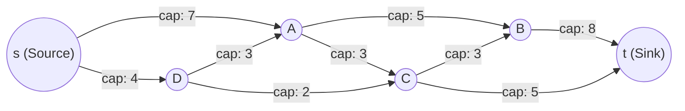
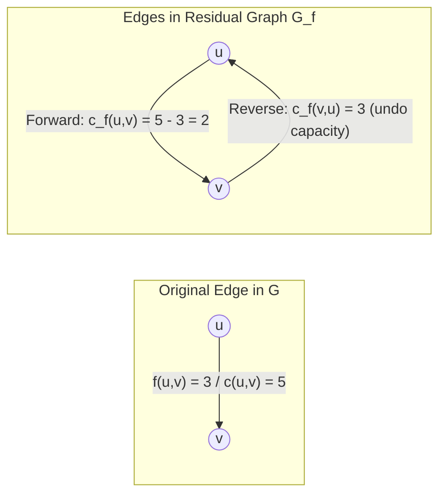
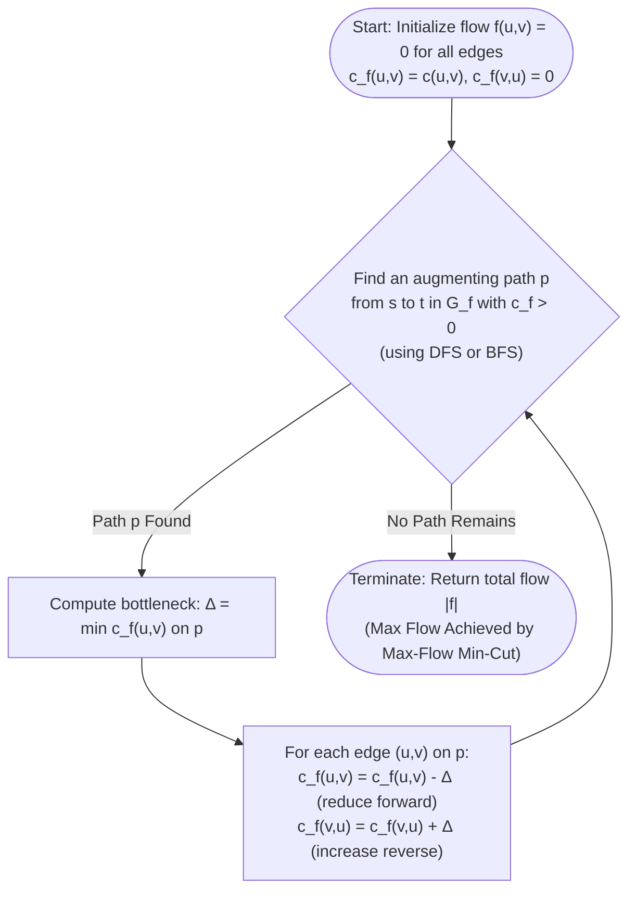
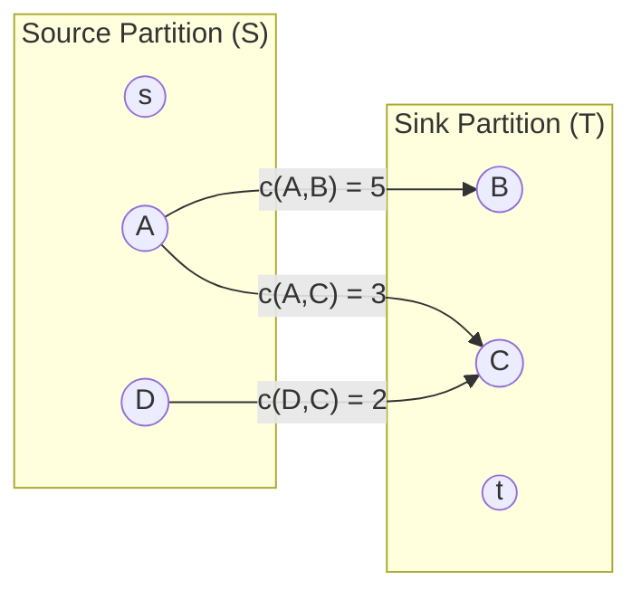
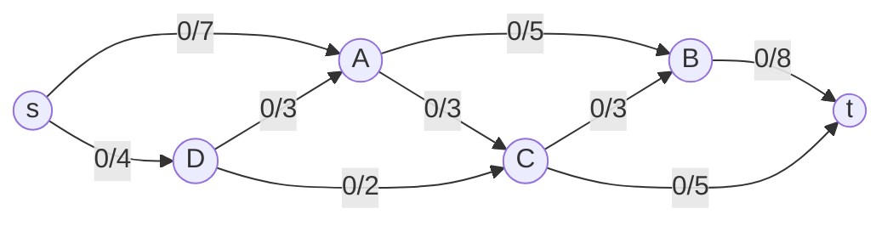

# 🌊 Maximum Flow (Max Flow) — Master Exam & Intuition Guide

> [!abstract] Lecture & Syllabus Overview (CSE 4403: Lecture 22)
> - **Instructor**: Anika Farzana, Department of CSE, Islamic University of Technology.
> - **Core Topics**: Problem Formulation, Greedy Limitations, Residual Networks ($G_f$), Augmenting Paths, Ford-Fulkerson Method, Edmonds-Karp Algorithm, Max-Flow Min-Cut Duality, and Formal Complexity Proofs (Lemma 1 & Lemma 2).
> - **Exam Target**: Full conceptual clarity, hand-simulation precision, complexity derivations, and 3-tier proof mastery.

---

## 1. Problem Formulation & Core Definitions

### 💡 Physical Intuition: The Pipeline Network
Imagine an interconnected system of pipes delivering water from a reservoir (the **Source** $s$) to a treatment facility (the **Sink** $t$). 
- Each pipe has a physical diameter that restricts the maximum volume of water passing through it per second (**Capacity**).
- Water cannot build up, leak, or magically appear at intermediate junctions (**Flow Conservation**).
- **The Core Question**: What is the maximum volume of water we can push through the network from $s$ to $t$ per unit time without bursting any pipe?



---

### 📐 Mathematical Formulation

Given a directed graph $G = (V, E)$ with:
1. A designated **Source** $s \in V$ (generates flow, no net inflow).
2. A designated **Sink** $t \in V$ (absorbs flow, no net outflow).
3. Each directed edge $(u, v) \in E$ has a non-negative **Capacity** $c(u, v) \ge 0$. If $(u, v) \notin E$, then $c(u, v) = 0$.

A **Flow** is a real-valued function $f: V \times V \to \mathbb{R}$ satisfying two fundamental axioms:

> [!note] 1. Capacity Constraint
> For every directed edge $(u, v) \in E$:
> $$0 \le f(u, v) \le c(u, v)$$
> *The flow along an edge cannot be negative and cannot exceed the physical capacity of the pipe.*

> [!note] 2. Flow Conservation
> For every intermediate vertex $v \in V \setminus \{s, t\}$:
> $$\sum_{u \in V} f(u, v) = \sum_{w \in V} f(v, w)$$
> *Total inflow arriving at node $v$ must strictly equal the total outflow departing from $v$. Intermediate nodes cannot store or generate flow.*

### 🎯 Objective Function
Maximize the **total net flow value** $|f|$, defined as the net flow leaving the source $s$ (which mathematically equals the net flow entering the sink $t$):
$$|f| = \sum_{v \in V} f(s, v) - \sum_{u \in V} f(u, s) = \sum_{u \in V} f(u, t) - \sum_{w \in V} f(t, w)$$

---

## 2. Why Greedy Fails & The Residual Graph Concept

### ❌ The Greedy Pitfall: The Point of No Return
Why can't we simply find paths from $s$ to $t$ greedily and push flow until no paths exist? 

> [!warning]- ❌ Counter-Example: Why Plain Greedy Fails
> Consider the classic diamond network:
> - $s \to A$ (cap 1), $s \to B$ (cap 1)
> - $A \to t$ (cap 1), $B \to t$ (cap 1)
> - Cross-edge: $A \to B$ (cap 1)
> 
> ```mermaid
> flowchart LR
>     s(("s")) -->|"1"| A(("A"))
>     s -->|"1"| B(("B"))
>     A -->|"1"| B
>     A -->|"1"| t(("t"))
>     B -->|"1"| t
> ```
> 
> If a greedy algorithm naively chooses the zigzag path $s \to A \to B \to t$ and pushes $1$ unit of flow:
> - $s \to A$ is fully saturated ($1/1$).
> - $A \to B$ is fully saturated ($1/1$).
> - $B \to t$ is fully saturated ($1/1$).
> 
> **Result**: No more paths exist. The greedy algorithm terminates with total flow $= 1$.
> **The True Optimum**: Send $1$ unit along $s \to A \to t$ and $1$ unit along $s \to B \to t$, achieving total flow $= \mathbf{2}$.
> 
> **The Core Realization**: A purely greedy algorithm makes irreversible mistakes. We need an algorithmic mechanism to **"undo"** or **"reroute"** previous flow assignments!

---

### 🔄 The Residual Network ($G_f$) & Reverse Edges

To allow the algorithm to change its mind and reroute flow, we construct a **Residual Graph** $G_f = (V, E_f)$.

For every directed edge $(u, v)$ in the original graph $G$:
1. **Forward Residual Edge $(u, v)$**:
   $$c_f(u, v) = c(u, v) - f(u, v)$$
   *Represents the remaining available capacity to push **more** flow forward.*

2. **Reverse Residual Edge $(v, u)$**:
   $$c_f(v, u) = f(u, v)$$
   *Represents the amount of existing flow that we are allowed to **cancel / push back / reroute**.*



> [!tip]- 💡 What Does Pushing Flow on a Reverse Edge Actually Mean?
> Pushing flow on a reverse edge $(v, u)$ in $G_f$ does **not** mean sending physical water backwards.
> It means:
> 1. Decreasing the positive forward flow $f(u, v)$ in the original graph.
> 2. Redirecting the inflow that previously went into $u$ toward an alternative neighbor.
> 3. Supplying $v$ from an alternative upstream neighbor.
> 
> *Algebraically*: Pushing $\Delta$ along $(v, u)$ in $G_f$ updates the flow in $G$ via:
> $$f(u, v) \gets f(u, v) - \Delta$$
> Flow conservation is strictly preserved at both $u$ and $v$!

---

### 🛤️ Augmenting Paths & Bottlenecks

> [!note] Definitions
> - **Augmenting Path ($p$)**: Any simple directed path from source $s$ to sink $t$ in the residual network $G_f$ where every edge has strictly positive residual capacity ($c_f(u, v) > 0$).
> - **Bottleneck Capacity ($c_f(p)$ or $\Delta$)**: The minimum residual capacity along the augmenting path:
>   $$c_f(p) = \min_{(u, v) \in p} c_f(u, v)$$
> - **Critical Edge**: Any edge $(u, v)$ on path $p$ that achieves the minimum ($c_f(u, v) = c_f(p)$). After augmenting, its residual capacity drops to $0$ and it disappears from $G_f$.

---

## 3. The Ford-Fulkerson Method

### ⚙️ Algorithmic Blueprint



---

### 💻 Pseudocode (Lecture Slide 5)

```text
FORD-FULKERSON(G, s, t):
    for each edge (u, v) in E:
        residual(u, v) = c(u, v)      //forward: starts at full capacity
        residual(v, u) = 0            //reverse: starts at 0

    while there is a path p from s to t with residual(u, v) > 0 on p:
        bottleneck = min( residual(u, v) for (u, v) in p )

        for each edge (u, v) in p:
            residual(u, v) -= bottleneck   //less room to push forward
            residual(v, u) += bottleneck   //more room to undo it later

    return total flow out of s   //sum of c(s, v) - residual(s, v)
```

---

### ⚠️ The Pathological Flaw of DFS-Based Ford-Fulkerson

> [!warning]- 🚨 Why DFS Path Selection Can Be Catastrophically Slow
> Consider the following network with large integer capacity $M = 10^6$:
> 
> ```mermaid
> flowchart LR
>     s(("s")) -->|"M = 10^6"| A(("A"))
>     s -->|"M = 10^6"| B(("B"))
>     A -->|"1"| B
>     A -->|"M = 10^6"| t(("t"))
>     B -->|"M = 10^6"| t
> ```
> 
> If DFS repeatedly alternates its path selection:
> 1. Iteration 1: $s \to A \to B \to t \implies \Delta = 1$. Cross-edge $A \to B$ is saturated; reverse edge $B \to A$ opens with capacity 1. Total flow $= 1$.
> 2. Iteration 2: $s \to B \to A \to t$ (using reverse edge $B \to A$) $\implies \Delta = 1$. Total flow $= 2$.
> 3. Iteration 3: $s \to A \to B \to t \implies \Delta = 1$. Total flow $= 3$.
> 
> The algorithm requires **$2 \times 10^6$ iterations** to send the maximum flow of $2 \times 10^6$, despite the network having only 4 vertices and 5 edges!
> 
> **Irrational Capacities**: If capacities are irrational numbers, Ford-Fulkerson with DFS may run in an **infinite loop** and converge to an incorrect value strictly smaller than the true maximum flow!

---

### 📜 Proof: Ford-Fulkerson Running Time ($O(E \cdot f)$)

*(Slide 6 contains this proof)*

> [!tip]- Version 1: Intuitive / Conceptual Explanation
> Think of pushing flow as filling buckets:
> 1. All initial capacities are whole numbers (integers).
> 2. Because you never divide and only add/subtract integers, the bottleneck capacity of every augmenting path is at least $1$ unit.
> 3. Each round increases the total flow by at least $1$.
> 4. If the true maximum flow is $f$, the algorithm cannot possibly run more than $f$ rounds before hitting the ceiling.
> 5. In each round, searching for a path across the graph using DFS or BFS takes work proportional to the number of edges $O(E)$.
> 6. Multiplying $f$ rounds by $O(E)$ work per round gives a total runtime of $O(E \cdot f)$.

> [!abstract]- Version 2: 📝 Exam-Ready Writing (Write this on the exam)
> **Claim:** If all edge capacities are integers, Ford-Fulkerson terminates in $O(E \cdot f)$ time, where $f$ is the value of the maximum flow.
> 
> **Proof:**
> 1. **Integer Invariant:** All capacities $c(u, v)$ are integers. By induction, all residual capacities $c_f(u, v)$ remain integers throughout execution.
> 2. **Minimum Step Bound:** For any augmenting path $p$, the bottleneck capacity $c_f(p) = \min_{(u, v) \in p} c_f(u, v)$ is an integer $\ge 1$.
> 3. **Bound on Augmentations:** Since each augmentation increases the total flow $|f|$ by at least $1$, and the flow cannot exceed the maximum flow value $f$, the algorithm executes at most $f$ augmentations.
> 4. **Cost per Iteration:** Finding an augmenting path using DFS or BFS on the residual graph $G_f = (V, E_f)$ with $|E_f| \le 2|E|$ edges costs $O(V + E) = O(E)$ time. Updating capacities along the path costs $O(V) \le O(E)$.
> 5. **Total Complexity:** 
>    $$\text{Total Time} = (\text{Number of Augmentations}) \times (\text{Cost per Augmentation}) = O(f) \times O(E) = \mathbf{O(E \cdot f)}$$ $\blacksquare$

> [!note]- Version 3: Exact Slide/Formal Version (Lecture Slide 6)
> **Claim:** If all edge capacities are integers, Ford–Fulkerson terminates in $O(E \cdot f)$ time, where $f$ is the value of the maximum flow.
> 
> Each augmenting path has bottleneck capacity $c_f(p) = \min c_f(u, v)$, where $(u, v) \in p$. Since every residual capacity is an integer $\ge 1$ whenever the edge is usable, the bottleneck is always an integer $\ge 1$.
> 
> So every augmentation increases the total flow value by at least 1. Because the flow value can never exceed $f$ (the max flow), the algorithm performs at most $f$ augmentations before no augmenting path remains.
> 
> Each augmentation searches for a path with one BFS or DFS over the residual graph, which has $O(E)$ edges, so each search costs $O(E)$.
> 
> $$\text{Total time} = (\text{number of augmentations}) \times (\text{cost per augmentation}) = O(f) \times O(E) = O(E \cdot f)$$

---

## 4. Max-Flow Min-Cut Theorem & Finding the Min-Cut

### ✂️ What is an $s$-$t$ Cut?

> [!note] Formal Cut Definition
> An **$s$-$t$ Cut** $(S, T)$ is a partition of the vertex set $V$ into two disjoint subsets $S$ and $T = V \setminus S$ such that:
> $$s \in S \quad \text{and} \quad t \in T$$
> 
> The **Capacity of the Cut** $c(S, T)$ is the sum of capacities of edges originating in $S$ and pointing into $T$:
> $$c(S, T) = \sum_{u \in S, v \in T} c(u, v)$$
> *(Crucial note: Edges going from $T$ back to $S$ do NOT add to the cut capacity).*



---

### ⚖️ Weak Duality & The Max-Flow Min-Cut Theorem

> [!abstract] Weak Duality Principle
> For **any** valid flow $f$ and **any** valid $s$-$t$ cut $(S, T)$:
> $$|f| \le c(S, T)$$
> *The flow passing from $s$ to $t$ cannot exceed the capacity of any bottleneck barrier dividing $s$ and $t$.*

> [!note] The Max-Flow Min-Cut Rule (Lecture Slides 3 & 4)
> **When no augmenting path remains in the residual graph, the flow is maximum.**
> 
> Formally, the maximum value of an $s$-$t$ flow strictly equals the minimum capacity of an $s$-$t$ cut:
> $$\mathbf{\text{Maximum Flow Value} = \text{Minimum Cut Capacity}}$$

---

### 💡 Intuitive Short Proof of Correctness (Why No Augmenting Path $\implies$ Max Flow)

*(Note: The slide states this theorem as a fundamental property. Here is the clean, intuitive proof for understanding:)*

> [!tip]- 💡 Intuitive Short Proof (The Cut Bottleneck Duality)
> 1. When the algorithm stops, $t$ is completely unreachable from $s$ in the residual graph $G_f$.
> 2. Let $S$ be the set of all nodes reachable from $s$ in $G_f$, and $T = V \setminus S$ be everything else.
> 3. Because you cannot step from $S$ into $T$ in $G_f$:
>    - Every forward pipe crossing from $S \to T$ must have residual capacity $c_f(u, v) = 0$, meaning it is **100% full** ($f(u, v) = c(u, v)$).
>    - Every reverse pipe crossing from $T \to S$ must have residual capacity $c_f(v, u) = 0$, meaning it carries **zero flow** ($f(v, u) = 0$).
> 4. Hence, the net flow crossing the boundary from $S$ to $T$ equals the **exact total forward capacity of the cut**: $|f| = c(S, T)$.
> 5. Since no flow can ever exceed any cut capacity ($|f| \le c(S, T)$ by weak duality), hitting exact equality means our flow is the **absolute maximum possible**, and this cut is the **tightest possible bottleneck (minimum cut)**.

---

### 🔍 How to Extract the Minimum Cut from the Final Residual Graph

> [!tip] Step-by-Step Procedure to Identify $(S, T)$
> 1. Run the flow algorithm until termination (no augmenting path in $G_f$).
> 2. Perform a **BFS or DFS starting from source $s$** in the final residual graph $G_f$, traversing only edges with residual capacity $c_f(u, v) > 0$.
> 3. Define:
>    - $S = \{\text{all vertices reachable from } s \text{ in } G_f\}$
>    - $T = V \setminus S$ (all unreachable vertices, including $t$).
> 4. The **Minimum Cut Edges** are the directed edges $(u, v)$ in the **original graph $G$** such that $u \in S$ and $v \in T$.
> 5. **Verification**: Calculate $\sum_{u \in S, v \in T} c(u, v)$. It will exactly equal $|f|_{\max}$!

---

## 5. The Edmonds-Karp Algorithm ($O(V \cdot E^2)$)

### 🚀 The Core Innovation: BFS Shortest Paths

Edmonds-Karp is an implementation of Ford-Fulkerson with **one simple, decisive modification**:
> **Always choose the augmenting path with the FEWEST edges (the shortest path in terms of edge count), found by running standard Breadth-First Search (BFS) on $G_f$.**

### 🌟 Why BFS Fixes Everything
1. **Guaranteed Polynomial Time**: It terminates in at most $O(V \cdot E)$ augmentations.
2. **Capacity-Independent Runtime**: The runtime depends **strictly** on $|V|$ and $|E|$, completely eliminating susceptibility to large numbers or irrational capacities.
3. **Total Running Time**: 
   $$\text{Total Time} = (\text{Max Augmentations}) \times (\text{Cost per BFS}) = O(V \cdot E) \times O(E) = \mathbf{O(V \cdot E^2)}$$

---

### 💻 Pseudocode (Lecture Slide 8)

```text
EDMONDS-KARP(G, s, t):
    for each edge (u, v) in E:
        residual(u, v) = c(u, v)
        residual(v, u) = 0

    while BFS(Gf, s, t) finds a path p:      //shortest path, fewest edges
        bottleneck = min( residual(u, v) for (u, v) in p )

        for each edge (u, v) in p:
            residual(u, v) -= bottleneck
            residual(v, u) += bottleneck

    return total flow out of s

BFS(Gf, s, t):
    //standard breadth-first search on the residual graph Gf
    //returns the s-t path using the fewest edges, or "none"
```

---

### 🔬 Edmonds-Karp Complexity Proof: Lemma 1 & Lemma 2

*(Slides 9 & 10 contain these proofs)*

#### 📜 Lemma 1: Monotonicity of Shortest Path Distances

Let $\delta_i(v)$ denote the shortest-path distance (number of edges) from source $s$ to vertex $v$ in the residual graph $G_f$ after $i$ augmentations.

> [!tip]- Lemma 1 — Version 1: Intuitive / Conceptual Explanation
> When you augment flow along a BFS shortest path:
> - Some forward edges get saturated and disappear (removing edges can only make paths longer or equal, never shorter).
> - Some reverse edges $(v, u)$ appear. But remember: the forward edge $(u, v)$ was on the shortest path, meaning $v$ was *further away* from $s$ than $u$ ($\text{dist}(v) = \text{dist}(u) + 1$).
> - So the reverse edge $(v, u)$ points **backwards toward $s$**. 
> - Using a backward-pointing edge to reach $u$ would take $\text{dist}(v) + 1 = \text{dist}(u) + 2$ steps, which is longer than the original distance to $u$!
> - Therefore, reverse edges can never create a "shortcut" to any node. Distances from $s$ can only stay the same or grow larger.

> [!abstract]- Lemma 1 — Version 2: 📝 Exam-Ready Writing (Write this on the exam)
> **Lemma 1:** For all vertices $v \in V$, the shortest path distance $\delta(v)$ from source $s$ in $G_f$ is monotonically non-decreasing after each augmentation:
> $$\delta_{i+1}(v) \ge \delta_i(v) \quad \forall v \in V$$
> 
> **Proof by Contradiction:**
> 1. Suppose there exists a vertex whose distance strictly decreases after an augmentation. Let $v$ be the vertex with the minimum $\delta_{i+1}(v)$ such that $\delta_{i+1}(v) < \delta_i(v)$.
> 2. Let $u$ be the vertex immediately preceding $v$ on the shortest path from $s$ to $v$ in $G_{f, i+1}$, so $(u, v) \in E_{f, i+1}$ and:
>    $$\delta_{i+1}(v) = \delta_{i+1}(u) + 1$$
> 3. By the minimal choice of $v$, vertex $u$ did not decrease in distance: $\delta_{i+1}(u) \ge \delta_i(u)$.
> 4. **Case A: $(u, v) \in E_{f, i}$ (edge already existed before augmentation):**
>    $$\delta_i(v) \le \delta_i(u) + 1 \le \delta_{i+1}(u) + 1 = \delta_{i+1}(v)$$
>    This contradicts our assumption that $\delta_{i+1}(v) < \delta_i(v)$.
> 5. **Case B: $(u, v) \notin E_{f, i}$ (edge was created by the $i$-th augmentation):**
>    The edge $(u, v)$ must be the reverse of an edge $(v, u)$ augmented at step $i$. Since Edmonds-Karp uses BFS shortest paths:
>    $$\delta_i(u) = \delta_i(v) + 1$$
>    Substituting gives:
>    $$\delta_{i+1}(v) = \delta_{i+1}(u) + 1 \ge \delta_i(u) + 1 = (\delta_i(v) + 1) + 1 = \delta_i(v) + 2$$
>    This contradicts $\delta_{i+1}(v) < \delta_i(v)$.
> 6. Therefore, no vertex distance can decrease: $\delta_{i+1}(v) \ge \delta_i(v)$ for all $v$. $\blacksquare$

> [!note]- Lemma 1 — Version 3: Exact Slide/Formal Version (Lecture Slide 9)
> Edmonds-Karp always augments along a shortest $s$-$t$ path (fewest edges) in the residual graph, found by BFS.
> 
> Let $\delta_i(v)$ denote the BFS distance from $s$ to $v$ in the residual graph after $i$ augmentations.
> 
> **Lemma 1 (distances never decrease):** For every vertex $v$, $\delta_i(v)$ is non-decreasing as $i$ increases ($\delta_{i+1}(v) \ge \delta_i(v)$).
> 
> **Sketch:** Augmenting along a shortest path can only add reverse edges that point “backward” toward $s$. Using such a reverse edge later would require a shorter route than BFS already found earlier, which contradicts $\delta$ being a shortest-path distance at that earlier step.
> 
> This monotonicity is the key fact used to bound how many times any single edge can be the bottleneck of an augmenting path.

---

#### 📜 Lemma 2: Critical Edge Bound & Overall $O(V \cdot E^2)$ Complexity

> [!tip]- Lemma 2 — Version 1: Intuitive / Conceptual Explanation
> 1. An edge $(u, v)$ is **critical** when it is the bottleneck. When you push flow through it, it runs out of capacity and disappears from $G_f$.
> 2. How can $(u, v)$ ever come back? The only way is if flow is pushed in the opposite direction along $(v, u)$ in some future round.
> 3. For $(u, v)$ to be on a BFS shortest path initially, $v$ was 1 step further from $s$ than $u$ ($\text{dist}(v) = \text{dist}(u) + 1$).
> 4. For $(v, u)$ to be used later, $u$ must be 1 step further from $s$ than $v$ ($\text{dist}'(u) = \text{dist}'(v) + 1$).
> 5. Since distances never decrease (Lemma 1), $u$'s new distance is at least $(\text{dist}(u) + 1) + 1 = \text{dist}(u) + 2$.
> 6. Every time an edge disappears and reappears as critical, its starting node $u$ is pushed **at least 2 steps further away** from $s$.
> 7. Since a node can only be at most $|V|-1$ steps away before reaching $t$, it can only jump by 2 at most $|V|/2$ times.
> 8. With $O(E)$ total edges, the total number of critical events (and augmentations) is $O(V \cdot E)$. Each BFS costs $O(E)$, yielding $O(V \cdot E^2)$ total time!

> [!abstract]- Lemma 2 — Version 2: 📝 Exam-Ready Writing (Write this on the exam)
> **Lemma 2:** During the execution of Edmonds-Karp, each directed edge $(u, v)$ can become critical at most $\frac{|V|}{2} = O(V)$ times.
> 
> **Proof:**
> 1. **First Critical Event (Step $i$):**
>    Since $(u, v)$ is on the BFS shortest path:
>    $$\delta_i(v) = \delta_i(u) + 1$$
>    Because $(u, v)$ is critical, its residual capacity becomes 0 and it disappears from $G_f$.
> 
> 2. **Restoration of Edge $(u, v)$ (Step $j > i$):**
>    Edge $(u, v)$ cannot reappear in $G_f$ until flow is pushed along the reverse edge $(v, u)$. For $(v, u)$ to be on the BFS shortest path at step $j$:
>    $$\delta_j(u) = \delta_j(v) + 1$$
> 
> 3. **Applying Lemma 1 (Monotonicity):**
>    Since distances never decrease, $\delta_j(v) \ge \delta_i(v)$. Substituting $\delta_i(v) = \delta_i(u) + 1$:
>    $$\delta_j(u) = \delta_j(v) + 1 \ge \delta_i(v) + 1 = (\delta_i(u) + 1) + 1 = \delta_i(u) + 2$$
> 
> 4. **Subsequent Critical Event (Step $k > j$):**
>    For $(u, v)$ to become critical again at step $k$, $\delta_k(u) \ge \delta_j(u) \ge \delta_i(u) + 2$.
>    Between any two critical events for edge $(u, v)$, $\delta(u)$ must increase by at least **2**.
> 
> 5. **Bounding Critical Events:**
>    - The distance $\delta(u)$ begins at $\ge 0$ and cannot exceed $|V|-2$ while $u$ is on an augmenting path to $t$ ($u \neq t$).
>    - Hence, the number of critical events for $(u, v)$ is bounded by:
>      $$\frac{|V| - 2}{2} + 1 \le \frac{|V|}{2} = O(V)$$
> 
> 6. **Overall Time Complexity:**
>    - The residual graph contains at most $2|E| = O(E)$ directed edges.
>    - Total critical edge events $\le 2|E| \times O(V) = O(V \cdot E)$.
>    - Each augmentation saturates at least one critical edge $\implies$ at most $O(V \cdot E)$ total augmentations.
>    - Each augmentation runs one BFS in $O(V + E) = O(E)$ time.
>    - Total Time Complexity:
>      $$\mathbf{\text{Total Time} = O(V \cdot E) \times O(E) = O(V \cdot E^2)}$$ $\blacksquare$

> [!note]- Lemma 2 — Version 3: Exact Slide/Formal Version (Lecture Slide 10)
> An edge $(u, v)$ is critical in an augmentation if it is the bottleneck, so it disappears from the residual graph afterward.
> 
> **Lemma 2 (each edge is critical $O(V)$ times):** When $(u, v)$ is critical, $\delta(v) = \delta(u) + 1$. For $(u, v)$ to become usable again, flow must later be pushed back along $(v, u)$, requiring $\delta'(u) = \delta'(v) + 1$ at that later point.
> 
> So the second time:
> $$\delta'(u) = \delta'(v) + 1$$
> Also by Lemma 1, $\delta'(v) \ge \delta(v)$.
> Adding 1 to both sides:
> $$\delta'(v) + 1 \ge \delta(v) + 1 \implies \delta'(u) \ge \delta(v) + 1 \implies \delta'(u) \ge (\delta(u) + 1) + 1 \implies \delta'(u) \ge \delta(u) + 2$$
> 
> So between any two consecutive times $(u, v)$ is critical, $\delta(u)$ has gone up by at least 2. Since $\delta(v)$ never decreases (Lemma 1), this jump of $\ge 2$ keeps happening every time $(u, v)$ becomes critical again.
> 
> $\delta(u)$ can only take the $V$ possible values $0, 1, \dots, V-1$. Starting from $\delta(u) \ge 0$ and rising by $\ge 2$ each time, it can hit at most about $V/2$ distinct values before running out. So $(u, v)$ can be critical at most $O(V)$ times.
> 
> There are $O(E)$ edges, so total critical-edge events and hence number of augmentations is $O(V \cdot E)$. Each augmentation costs $O(E)$ for its BFS.
> 
> $$\text{Total time} = (\text{number of augmentations}) \times (\text{cost per augmentation}) = O(V \cdot E) \times O(E) = O(V \cdot E^2)$$

---

## 6. Step-by-Step Worked Simulation (Lecture Slides 11–19)

Let's execute a complete hand simulation on the exact 6-node network from Lecture Slides 11–19.

### 🌐 Initial Graph Network
- **Vertices**: $V = \{s, A, B, C, D, t\}$ ($|V| = 6$)
- **Directed Edges & Capacities**:
  - $s \to A: 7$
  - $s \to D: 4$
  - $D \to A: 3$
  - $D \to C: 2$
  - $A \to B: 5$
  - $A \to C: 3$
  - $C \to B: 3$
  - $C \to t: 5$
  - $B \to t: 8$



---

### 📝 Step-by-Step Iteration Walkthrough

> [!example]- 🔹 Iteration 1: Path $s \to A \to B \to t$
> 1. **BFS Shortest Path**: $s \to A \to B \to t$ (length = 3 edges).
> 2. **Available Residual Capacities**:
>    - $c_f(s, A) = 7$
>    - $c_f(A, B) = 5$
>    - $c_f(B, t) = 8$
> 3. **Bottleneck**: $\Delta_1 = \min(7, 5, 8) = \mathbf{5}$.
> 4. **Edge Updates**:
>    - $s \to A$: Flow becomes $5/7$. Forward residual $c_f = 2$, reverse residual $c_f(A, s) = 5$.
>    - $A \to B$: Flow becomes $5/5$ (**Saturated / Critical Edge**). Forward residual $c_f = 0$, reverse residual $c_f(B, A) = 5$.
>    - $B \to t$: Flow becomes $5/8$. Forward residual $c_f = 3$, reverse residual $c_f(t, B) = 5$.
> 5. **Total Flow**: $|f| = \mathbf{5}$.

> [!example]- 🔹 Iteration 2: Path $s \to D \to A \to C \to t$
> 1. **BFS Shortest Path**: $s \to D \to A \to C \to t$ (length = 4 edges).
> 2. **Available Residual Capacities**:
>    - $c_f(s, D) = 4$
>    - $c_f(D, A) = 3$
>    - $c_f(A, C) = 3$
>    - $c_f(C, t) = 5$
> 3. **Bottleneck**: $\Delta_2 = \min(4, 3, 3, 5) = \mathbf{3}$.
> 4. **Edge Updates**:
>    - $s \to D$: Flow becomes $3/4$. Forward $c_f = 1$, reverse $c_f(D, s) = 3$.
>    - $D \to A$: Flow becomes $3/3$ (**Saturated / Critical Edge**). Forward $c_f = 0$, reverse $c_f(A, D) = 3$.
>    - $A \to C$: Flow becomes $3/3$ (**Saturated / Critical Edge**). Forward $c_f = 0$, reverse $c_f(C, A) = 3$.
>    - $C \to t$: Flow becomes $3/5$. Forward $c_f = 2$, reverse $c_f(t, C) = 3$.
> 5. **Total Flow**: $|f| = 5 + 3 = \mathbf{8}$.

> [!example]- 🔹 Iteration 3: Path $s \to D \to C \to B \to t$
> 1. **BFS Shortest Path**: $s \to D \to C \to B \to t$ (length = 4 edges).
> 2. **Available Residual Capacities**:
>    - $c_f(s, D) = 1$
>    - $c_f(D, C) = 2$
>    - $c_f(C, B) = 3$
>    - $c_f(B, t) = 3$
> 3. **Bottleneck**: $\Delta_3 = \min(1, 2, 3, 3) = \mathbf{1}$.
> 4. **Edge Updates**:
>    - $s \to D$: Flow becomes $4/4$ (**Saturated / Critical Edge**). Forward $c_f = 0$, reverse $c_f(D, s) = 4$.
>    - $D \to C$: Flow becomes $1/2$. Forward $c_f = 1$, reverse $c_f(C, D) = 1$.
>    - $C \to B$: Flow becomes $1/3$. Forward $c_f = 2$, reverse $c_f(B, C) = 1$.
>    - $B \to t$: Flow becomes $6/8$. Forward $c_f = 2$, reverse $c_f(t, B) = 6$.
> 5. **Total Flow**: $|f| = 8 + 1 = \mathbf{9}$.

> [!example]- 🔹 Iteration 4: Path $s \to A \to D \to C \to t$ (Reverse Edge Magic!)
> 1. **BFS Shortest Path**: $s \to A \to D \to C \to t$ (length = 4 edges).
>    - Notice that $(A, D)$ is a **reverse edge** of the original edge $D \to A$!
> 2. **Available Residual Capacities**:
>    - $c_f(s, A) = 2$ (forward)
>    - $c_f(A, D) = 3$ (**reverse edge**: $f(D, A) = 3$)
>    - $c_f(D, C) = 1$ (forward)
>    - $c_f(C, t) = 2$ (forward)
> 3. **Bottleneck**: $\Delta_4 = \min(2, 3, 1, 2) = \mathbf{1}$.
> 4. **Edge Updates**:
>    - $s \to A$: Flow increases from $5 \to 6/7$. Forward $c_f = 1$, reverse $c_f(A, s) = 6$.
>    - $A \to D$ (Reverse): Pushing 1 unit on reverse edge $(A, D)$ **decreases** flow on original $D \to A$ from $3 \to 2/3$! Forward $c_f(D, A)$ becomes $1$, reverse $c_f(A, D)$ becomes $2$.
>    - $D \to C$: Flow increases from $1 \to 2/2$ (**Saturated / Critical Edge**). Forward $c_f = 0$, reverse $c_f(C, D) = 2$.
>    - $C \to t$: Flow increases from $3 \to 4/5$. Forward $c_f = 1$, reverse $c_f(t, C) = 4$.
> 5. **Total Flow**: $|f| = 9 + 1 = \mathbf{10}$.

> [!example]- 🔹 Iteration 5: Termination Check & Reachability Analysis
> 1. Run BFS from $s$ in residual graph $G_f$:
>    - From $s$: $c_f(s, A) = 1 > 0 \implies \text{Node } A \text{ is reachable}$. Edge $s \to D$ has $c_f = 0$.
>    - From $A$: Forward edges $A \to B$ ($c_f=0$) and $A \to C$ ($c_f=0$) are saturated. But reverse edge $A \to D$ has $c_f = 2 > 0 \implies \text{Node } D \text{ is reachable}$.
>    - From $D$: Edge $D \to A$ has $c_f=1$ (already visited). Edge $D \to C$ has $c_f=0$ (saturated).
>    - No other outgoing edges with $c_f > 0$ exist from $\{s, A, D\}$.
> 2. **Sink $t$ is NOT reachable from $s$ in $G_f$!**
> 3. **Algorithm Terminates.** Maximum Flow $= \mathbf{10}$.

---

### 📊 Complete Simulation Summary Table (Lecture Slide 19)

| Iteration | Augmenting Path Found | Bottleneck ($\Delta$) | Flow Along Path | Total Accumulated Flow | Notes & Critical Edges |
| :---: | :---| :---: | :---: | :---: | :---|
| **1** | $s \to A \to B \to t$ | **5** | $\min(7, 5, 8) = 5$ | **5** | $A \to B$ saturated |
| **2** | $s \to D \to A \to C \to t$ | **3** | $\min(4, 3, 3, 5) = 3$ | **8** | $D \to A, A \to C$ saturated |
| **3** | $s \to D \to C \to B \to t$ | **1** | $\min(1, 2, 3, 3) = 1$ | **9** | $s \to D$ saturated |
| **4** | $s \to A \to D \to C \to t$ | **1** | $\min(2, 3, 1, 2) = 1$ | **10** | Uses reverse edge $A \to D$; $D \to C$ saturated |
| **5** | *None (no path in $G_f$)* | — | — | **10 (MAX)** | **Terminates** |

---

### ✂️ Finding the Minimum Cut on this Graph

Let's extract the Minimum $s$-$t$ Cut from the final residual state:
1. **Reachable set from $s$ in $G_f$**: 
   $$S = \{s, A, D\}$$
2. **Unreachable set**: 
   $$T = V \setminus S = \{B, C, t\}$$
3. **Cross-Edges from $S$ to $T$ in the original graph $G$**:
   - Edge $(A, B)$ with capacity $c(A, B) = 5$ (Flow $= 5/5$)
   - Edge $(A, C)$ with capacity $c(A, C) = 3$ (Flow $= 3/3$)
   - Edge $(D, C)$ with capacity $c(D, C) = 2$ (Flow $= 2/2$)
4. **Cut Capacity Calculation**:
   $$\text{Capacity } c(S, T) = c(A, B) + c(A, C) + c(D, C) = 5 + 3 + 2 = \mathbf{10}$$
5. **Verification**:
   $$\text{Max Flow Value } (|f| = 10) = \text{Min Cut Capacity } (c(S, T) = 10) \quad \checkmark$$

---

## 7. C++ Implementation (Exam & Lab Reference)

> [!example]- Edmonds-Karp Implementation (Adjacency Matrix — Ideal for Exams & $V \le 500$)
> ```cpp
> #include <iostream>
> #include <vector>
> #include <queue>
> #include <algorithm>
> 
> using namespace std;
> 
> const int INF = 1e9;
> 
> //standard bfs finding shortest augmenting path
> int bfs(int s, int t, const vector<vector<int>>& capacity, vector<int>& parent, int n) {
>     fill(parent.begin(), parent.end(), -1);
>     parent[s] = -2; //mark source as visited
>     queue<pair<int, int>> q;
>     q.push({s, INF});
> 
>     while(!q.empty()) {
>         int cur = q.front().first;
>         int flow = q.front().second;
>         q.pop();
> 
>         for(int next = 0; next < n; next++) {
>             //traverse if unvisited and residual capacity > 0
>             if(parent[next] == -1 && capacity[cur][next] > 0) {
>                 parent[next] = cur;
>                 int new_flow = min(flow, capacity[cur][next]);
>                 if(next == t) return new_flow; //found path to sink
>                 q.push({next, new_flow});
>             }
>         }
>     }
>     return 0; //no augmenting path left
> }
> 
> int edmondsKarp(int s, int t, vector<vector<int>>& capacity, int n) {
>     int flow = 0;
>     vector<int> parent(n);
>     int new_flow;
> 
>     //augment while a path exists in residual graph
>     while((new_flow = bfs(s, t, capacity, parent, n)) > 0) {
>         flow += new_flow;
>         int cur = t;
>         while(cur != s) {
>             int prev = parent[cur];
>             capacity[prev][cur] -= new_flow; //decrease forward capacity
>             capacity[cur][prev] += new_flow; //increase reverse capacity
>             cur = prev;
>         }
>     }
> 
>     return flow;
> }
> 
> int main() {
>     int n = 6; //nodes 0:s, 1:A, 2:B, 3:C, 4:D, 5:t
>     vector<vector<int>> capacity(n, vector<int>(n, 0));
> 
>     //mapping: s=0, A=1, B=2, C=3, D=4, t=5
>     capacity[0][1] = 7; //s -> A
>     capacity[0][4] = 4; //s -> D
>     capacity[4][1] = 3; //D -> A
>     capacity[4][3] = 2; //D -> C
>     capacity[1][2] = 5; //A -> B
>     capacity[1][3] = 3; //A -> C
>     capacity[3][2] = 3; //C -> B
>     capacity[3][5] = 5; //C -> t
>     capacity[2][5] = 8; //B -> t
> 
>     int s = 0, t = 5;
>     cout << "Maximum Flow: " << edmondsKarp(s, t, capacity, n) << "\n"; //prints 10
>     return 0;
> }
> ```

> [!example]- Edmonds-Karp Scalable Implementation (Adjacency List — Competitive Programming)
> ```cpp
> #include <iostream>
> #include <vector>
> #include <queue>
> #include <algorithm>
> 
> using namespace std;
> 
> const int INF = 1e9;
> 
> struct Edge {
>     int to;
>     int capacity;
>     int flow;
>     int rev_index; //index of reverse edge in adj[to]
> };
> 
> vector<vector<Edge>> adj;
> 
> //add directed edge with corresponding residual reverse edge
> void addEdge(int from, int to, int cap) {
>     Edge a = {to, cap, 0, (int)adj[to].size()};
>     Edge b = {from, 0, 0, (int)adj[from].size()};
>     adj[from].push_back(a);
>     adj[to].push_back(b);
> }
> 
> int bfs(int s, int t, vector<int>& parent_node, vector<int>& parent_edge, int n) {
>     fill(parent_node.begin(), parent_node.end(), -1);
>     parent_node[s] = -2;
>     queue<pair<int, int>> q;
>     q.push({s, INF});
> 
>     while(!q.empty()) {
>         int u = q.front().first;
>         int flow = q.front().second;
>         q.pop();
> 
>         for(int i = 0; i < (int)adj[u].size(); i++) {
>             Edge& e = adj[u][i];
>             int v = e.to;
>             int rem_cap = e.capacity - e.flow;
>             if(parent_node[v] == -1 && rem_cap > 0) {
>                 parent_node[v] = u;
>                 parent_edge[v] = i;
>                 int new_flow = min(flow, rem_cap);
>                 if(v == t) return new_flow;
>                 q.push({v, new_flow});
>             }
>         }
>     }
>     return 0;
> }
> 
> int maxFlow(int s, int t, int n) {
>     int total_flow = 0;
>     vector<int> parent_node(n);
>     vector<int> parent_edge(n);
>     int push;
> 
>     while((push = bfs(s, t, parent_node, parent_edge, n)) > 0) {
>         total_flow += push;
>         int cur = t;
>         while(cur != s) {
>             int p = parent_node[cur];
>             int edge_idx = parent_edge[cur];
>             adj[p][edge_idx].flow += push;
>             int rev_idx = adj[p][edge_idx].rev_index;
>             adj[cur][rev_idx].flow -= push;
>             cur = p;
>         }
>     }
>     return total_flow;
> }
> 
> int main() {
>     int n = 6;
>     adj.resize(n);
> 
>     //mapping: s=0, A=1, B=2, C=3, D=4, t=5
>     addEdge(0, 1, 7);
>     addEdge(0, 4, 4);
>     addEdge(4, 1, 3);
>     addEdge(4, 3, 2);
>     addEdge(1, 2, 5);
>     addEdge(1, 3, 3);
>     addEdge(3, 2, 3);
>     addEdge(3, 5, 5);
>     addEdge(2, 5, 8);
> 
>     cout << "Max Flow: " << maxFlow(0, 5, n) << "\n"; //prints 10
>     return 0;
> }
> ```

---

## 8. Complexity Summary & Exam Quick-Reference

### 📊 Algorithm Comparison Table (Lecture Slide 20)

| Algorithm | Augmenting Path Strategy | Path Finding Cost | Max Augmentations | Total Time Complexity | Space Complexity | Capacity Dependency |
|:---|:---|:---:|:---:|:---:|:---:|:---:|
| **Ford-Fulkerson** | Any path (DFS / BFS) | $O(E)$ | $\le f$ (max flow value) | $\mathbf{O(E \cdot f)}$ | $O(V + E)$ | **Yes** (Slow for large $f$) |
| **Edmonds-Karp** | Shortest path (BFS) | $O(E)$ | $\le O(V \cdot E)$ | $\mathbf{O(V \cdot E^2)}$ | $O(V + E)$ | **No** (Polynomial) |
| **Dinic's Algorithm** | Level Graph + Blocking Flow | $O(E)$ per path | $\le O(V)$ phases | $\mathbf{O(V^2 \cdot E)}$ | $O(V + E)$ | **No** (Competitive Standard) |

### 💾 Space Complexity Breakdown
- **Adjacency Matrix**: $O(V^2)$ auxiliary space.
- **Adjacency List**: $O(V + E)$ auxiliary space.
- **BFS Queue & Parent Arrays**: $O(V)$ space.
- **Total Space**: $\mathbf{O(V + E)}$ (or $O(V^2)$ with matrix).

---

### 📝 Exam Hand-Simulation Strategy (For the 2-Hour Exam)

> [!tip] How to Simulate Max Flow Quickly Under Exam Pressure
> 1. **Draw a Dual-Arrow Matrix or Keep a Clean Table**: 
>    For each iteration, write down:
>    - **Path selected** (e.g., $s \to A \to B \to t$).
>    - **Bottleneck calculation**: $\Delta = \min(\dots)$.
>    - **Flow update**: Old Flow $+ \Delta =$ New Flow.
> 2. **Track Residual Changes Immediately**:
>    - Forward capacity: subtract $\Delta$.
>    - Reverse capacity: add $\Delta$.
> 3. **Watch Out for Reverse Edges**: If you use an edge in the opposite direction of the original graph arrow, you are **reducing flow** on that original edge.
> 4. **Don't Forget Min-Cut**: If the question asks for the min cut, run DFS/BFS from $s$ on the final residual graph. Write down $S = \{\dots\}$, $T = \{\dots\}$, list the crossing edges from $S \to T$, and sum their original capacities. Confirm $\sum = |f|$.
