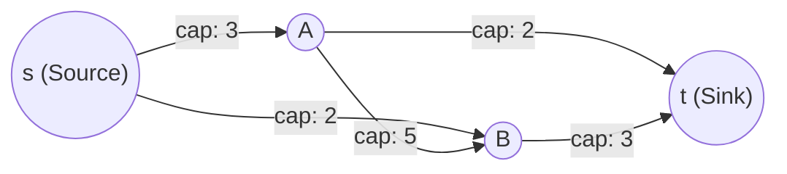
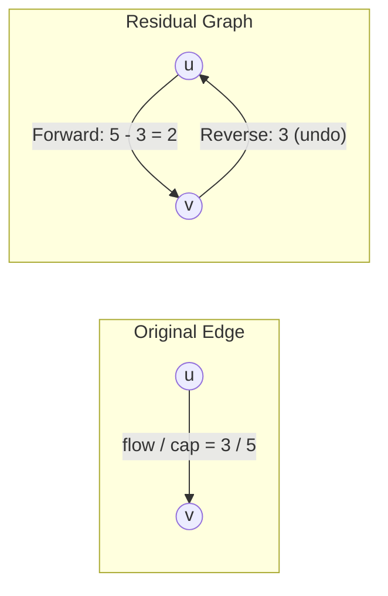
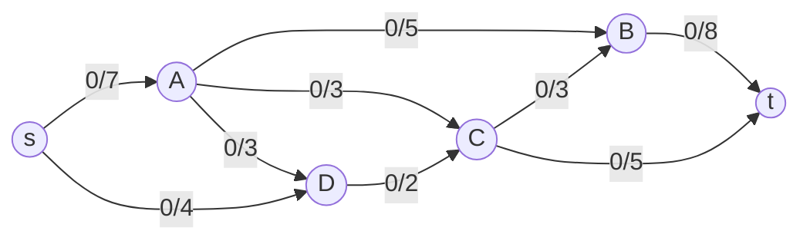

---
tags:
  - computer-science
  - algorithms
  - graph-theory
  - max-flow
  - edmonds-karp
  - ford-fulkerson
---

# 🌊 Maximum Flow (Max Flow) — Ultimate Study & Intuition Guide

## 1. Problem Definition & Core Concepts

### 💡 Real-World Framing
Imagine a network of water pipes, a highway traffic grid, or internet routing cables. Every connection has a maximum throughput (capacity). The **Maximum Flow Problem** asks:
> *How much total flow (water, traffic, data packets) can we push from a starting point (source $s$) to an ending destination (sink $t$) per unit time without overflowing any pipe?*



---

### 📐 Formal Definition

Given a directed graph $G = (V, E)$ with:
* A designated **Source** $s \in V$ (produces flow).
* A designated **Sink** $t \in V$ (consumes flow).
* Each directed edge $(u, v) \in E$ has a non-negative capacity $c(u, v) \ge 0$. If there is no edge between $u$ and $v$, $c(u, v) = 0$.

A **flow** is a function $f: V \times V \to \mathbb{R}$ satisfying two fundamental constraints:

1. **Capacity Limit (Capacity Constraint):**
   $$0 \le f(u, v) \le c(u, v) \quad \forall (u, v) \in E$$
   *Flow on any edge cannot exceed its capacity and cannot be negative.*

2. **Flow Conservation:**
   $$\sum_{u \in V} f(u, v) = \sum_{w \in V} f(v, w) \quad \forall v \in V \setminus \{s, t\}$$
   *For every intermediate node $v$, total incoming flow must equal total outgoing flow. Flow cannot pool or vanish at intermediate nodes.*

### 🎯 The Goal
Maximize the **total flow value** $|f|$ leaving the source (which equals the total flow entering the sink):
$$|f| = \sum_{v \in V} f(s, v) = \sum_{u \in V} f(u, t)$$

---

## 2. Deep Intuition: Why Greedy Fails & Why We Need Residual Graphs

### ❌ The Greedy Pitfall
If you greedily pick random paths and push maximum possible flow through them, you can easily get stuck in a sub-optimal configuration.

> [!example]- Why Simple Greedy Fails (The Trap)
> Consider the graph:
> - $s \to A$ (capacity 1), $s \to B$ (capacity 1)
> - $A \to t$ (capacity 1), $B \to t$ (capacity 1)
> - $A \to B$ (capacity 1)
> 
> ```mermaid
> flowchart LR
>     s(("s")) -->|1| A(("A"))
>     s(("s")) -->|1| B(("B"))
>     A -->|1| B
>     A -->|1| t(("t"))
>     B -->|1| t
> ```
> 
> If our greedy algorithm accidentally chooses the path $s \to A \to B \to t$ and pushes $1$ unit of flow:
> - $s \to A$ is saturated ($1/1$).
> - $A \to B$ is saturated ($1/1$).
> - $B \to t$ is saturated ($1/1$).
> 
> Now, no more flow can be sent! The total flow achieved is **$1$**.
> But the optimal routing is $s \to A \to t$ ($1$ unit) and $s \to B \to t$ ($1$ unit), giving a total max flow of **$2$**.
> 
> **Key realization:** We need a mechanism to **"undo"** or **"reroute"** a bad decision made earlier!

---

### 🔄 The Residual Graph ($G_f$) & Reverse Edges

To allow the algorithm to change its mind and undo bad choices, we build a **Residual Graph** $G_f = (V, E_f)$.

For every edge $(u, v)$ in the original graph:
1. **Forward Residual Edge $(u, v)$:**
   $$c_f(u, v) = c(u, v) - f(u, v)$$
   *Represents how much **more** flow we can push in the original forward direction.*

2. **Reverse Residual Edge $(v, u)$:**
   $$c_f(v, u) = f(u, v)$$
   *Represents how much flow we can **push back / cancel / undo**.*



> [!note]- How Does Pushing Flow on a Reverse Edge Work in Practice?
> Suppose node $D$ sent 3 units of flow to node $A$ along $(D, A)$.
> Later, we find a path in the residual graph that traverses the reverse edge $(A, D)$ with 1 unit of flow.
> 
> Pushing 1 unit on $(A, D)$ in $G_f$ means:
> - Decreasing $f(D, A)$ from $3$ to $2$ in the original graph.
> - Freeing up 1 unit of flow arriving at $A$ (which can now go to $C$ instead).
> - Freeing up 1 unit of capacity at $D$ (which can now go to $C$ directly from $D$).
> 
> Net result: We rerouted flow without violating flow conservation at $A$ or $D$!

---

### 🛤️ Augmenting Paths & Bottleneck Capacity

* **Augmenting Path ($p$):** A simple directed path from $s$ to $t$ in the residual graph $G_f$ where every edge has residual capacity $c_f(u, v) > 0$.
* **Bottleneck Capacity ($c_f(p)$):** The minimum residual capacity along the augmenting path:
  $$c_f(p) = \min_{(u, v) \in p} c_f(u, v)$$
* When we push $c_f(p)$ along $p$, at least one edge on $p$ becomes **saturated** ($c_f(u, v) = 0$) and is called the **critical edge**.
* When no augmenting path remains from $s$ to $t$ in $G_f$, the flow is **maximum** (by the Max-Flow Min-Cut theorem).

---

## 3. The Ford-Fulkerson Method

### ⚙️ Algorithm Steps
1. **Initialize:** Set flow $f(u, v) = 0$ for all edges. The residual capacities start at $c_f(u, v) = c(u, v)$ and $c_f(v, u) = 0$.
2. **Find Augmenting Path:** Find any path $p$ from $s$ to $t$ in $G_f$ with $c_f(u, v) > 0$ using DFS or BFS.
3. **Augment Flow:**
   - Compute bottleneck $\Delta = \min_{(u, v) \in p} c_f(u, v)$.
   - For every edge $(u, v)$ on $p$:
     - $c_f(u, v) \gets c_f(u, v) - \Delta$ (less room forward)
     - $c_f(v, u) \gets c_f(v, u) + \Delta$ (more room to undo later)
4. **Repeat:** Repeat steps 2–3 until no path from $s$ to $t$ exists in $G_f$.
5. **Return:** Total flow out of $s$: $\sum_{(s, v)} (c(s, v) - c_f(s, v))$.

---

### 💻 Pseudocode

```text
FORD-FULKERSON(G, s, t):
    for each edge (u, v) in E:
        residual(u, v) = c(u, v)   // forward edge starts at full capacity
        residual(v, u) = 0          // reverse edge starts at 0

    while there is a path p from s to t with residual(u, v) > 0 on p:
        bottleneck = min( residual(u, v) for (u, v) in p )
        for each edge (u, v) in p:
            residual(u, v) -= bottleneck  // decrease forward residual capacity
            residual(v, u) += bottleneck  // increase reverse residual capacity

    return total flow out of s // sum of (c(s, v) - residual(s, v))
```

---

### ⏱️ Time Complexity Analysis: $O(E \cdot f)$

> [!abstract]- Detailed Complexity Proof for Ford-Fulkerson
> **Claim:** If all capacities are integers, Ford-Fulkerson terminates in $O(E \cdot f)$ time, where $f$ is the maximum flow value.
> 
> **Proof:**
> 1. **Integer Invariant:** Edge capacities are integers. When we initialize, all residual capacities are integers.
> 2. **Minimum Augmentation Step:** Since residual capacities are integers $\ge 1$ for usable edges, the bottleneck $c_f(p) = \min_{(u, v) \in p} c_f(u, v)$ is always an integer $\ge 1$.
> 3. **Bound on Iterations:** Every augmentation increases the total flow by at least $1$. Since the maximum possible flow is $f$, the algorithm can perform at most $f$ augmentations.
> 4. **Cost per Iteration:** Finding a path using DFS or BFS in a graph with $V$ vertices and $E$ edges takes $O(V + E) = O(E)$ time (assuming every vertex is reachable on a path towards $t$). Updating edge capacities along the path takes $O(V) \le O(E)$ time.
> 5. **Total Running Time:**
>    $$\text{Total Time} = (\text{Number of Augmentations}) \times (\text{Cost per Augmentation}) = O(f) \times O(E) = O(E \cdot f)$$

> [!warning] The Pathological Flaw of Plain Ford-Fulkerson
> - If capacities are large integers (e.g., $c = 10^9$), Ford-Fulkerson using DFS might alternate back and forth augmenting by just $1$ each step, taking $2 \times 10^9$ iterations!
> - If capacities are **irrational numbers**, Ford-Fulkerson with DFS may **never terminate**, and worse, it can converge to an incorrect flow value far below the true maximum.

---

## 4. The Edmonds-Karp Algorithm (The Shortest Path Optimization)

### 🚀 What is Edmonds-Karp?
Edmonds-Karp is an implementation of Ford-Fulkerson with **one simple, powerful rule**:
> **Always choose the augmenting path with the FEWEST edges (shortest path in terms of edge count), found by running a standard Breadth-First Search (BFS) on $G_f$.**

No other changes are made!

### 🌟 Why BFS Fixes Everything
1. **Guaranteed Polynomial Time:** Terminating in $O(V \cdot E)$ augmentations.
2. **Capacity Independent:** The runtime depends **only** on $|V|$ and $|E|$, completely unaffected by large or irrational capacity numbers.
3. **Total Time Complexity:**
   $$\text{Total Time} = O(V \cdot E) \times O(E) = O(V \cdot E^2)$$

---

### 💻 Pseudocode

```text
EDMONDS-KARP(G, s, t):
    for each edge (u, v) in E:
        residual(u, v) = c(u, v)
        residual(v, u) = 0

    while BFS(Gf, s, t) finds a shortest path p: // path with fewest edges
        bottleneck = min( residual(u, v) for (u, v) in p )
        for each edge (u, v) in p:
            residual(u, v) -= bottleneck
            residual(v, u) += bottleneck

    return total flow out of s

BFS(Gf, s, t):
    // standard BFS from s looking for t
    // considers only edges with residual(u, v) > 0
    // returns path p with minimum edge count, or NULL if unreachable
```

---

## 5. 🔬 In-Depth Proof of Edmonds-Karp Complexity ($O(V \cdot E^2)$)

This is one of the most classic proofs in graph algorithms. Let's break it down into two intuitive lemmas.

### 📜 Lemma 1: Shortest Path Distances Never Decrease (Monotonicity)

Let $\delta_i(v)$ denote the shortest-path distance (number of edges) from source $s$ to vertex $v$ in the residual graph $G_f$ after $i$ augmentations.

> [!abstract]- Lemma 1: For all vertices $v \in V$, $\delta_{i+1}(v) \ge \delta_i(v)$
> 
> **Intuition:**
> When we augment flow along a shortest path $p$, what changes in the residual graph?
> - Some forward edges on $p$ may be saturated and disappear. (Removing edges cannot create shorter paths).
> - Some reverse edges $(v, u)$ are introduced or have their capacity increased.
> 
> Does introducing a reverse edge $(v, u)$ create a shortcut from $s$?
> No! Because $(u, v)$ was on the shortest path before, we know:
> $$\delta_i(v) = \delta_i(u) + 1$$
> The reverse edge points backward towards $s$ (from $v$ back to $u$).
> If a new path to $u$ were to use this reverse edge $(v, u)$, its distance to $u$ would be:
> $$\delta_{i+1}(v) + 1 \ge \delta_i(v) + 1 = (\delta_i(u) + 1) + 1 = \delta_i(u) + 2$$
> This is strictly longer than the original distance $\delta_i(u)$!
> Therefore, no reverse edge can ever decrease the distance from $s$ to any vertex.
> 
> **Conclusion:** Shortest path distances from $s$ are monotonically non-decreasing over time:
> $$\delta_{i+1}(v) \ge \delta_i(v) \quad \forall v \in V$$

---

### 📜 Lemma 2: Each Edge Can Be Critical at Most $O(V)$ Times

An edge $(u, v)$ is **critical** in an augmenting path if it determines the bottleneck ($c_f(u, v) = \text{bottleneck}$). After augmentation, its residual capacity drops to $0$ and it **disappears** from $G_f$.

> [!abstract]- Lemma 2: Any edge $(u, v)$ can become critical at most $\frac{|V|}{2}$ times
> 
> **Proof Step-by-Step:**
> 1. **First Critical Event (at augmentation $i$):**
>    Since $(u, v)$ is on the BFS shortest path:
>    $$\delta_i(v) = \delta_i(u) + 1$$
>    Because $(u, v)$ is critical, it is saturated and disappears from $G_f$.
> 
> 2. **Reappearance of $(u, v)$ (at a later augmentation $j > i$):**
>    The edge $(u, v)$ cannot be used again until flow is pushed in the opposite direction along $(v, u)$, which restores some capacity to $(u, v)$.
>    For $(v, u)$ to be on the shortest augmenting path at step $j$, BFS must satisfy:
>    $$\delta_j(u) = \delta_j(v) + 1$$
> 
> 3. **Applying Lemma 1 (Distances never decrease):**
>    We know $\delta_j(v) \ge \delta_i(v)$. Substituting this in:
>    $$\delta_j(u) = \delta_j(v) + 1 \ge \delta_i(v) + 1$$
>    Since $\delta_i(v) = \delta_i(u) + 1$:
>    $$\delta_j(u) \ge (\delta_i(u) + 1) + 1 = \delta_i(u) + 2$$
> 
> 4. **Second Critical Event (at augmentation $k > j$):**
>    For $(u, v)$ to become critical again at step $k$, we must have $\delta_k(u) \ge \delta_j(u) \ge \delta_i(u) + 2$.
> 
> 5. **Bounding the Count:**
>    - Between any two times that edge $(u, v)$ becomes critical, its distance from source $\delta(u)$ **must increase by at least 2**.
>    - The distance $\delta(u)$ starts at $\ge 0$ and can be at most $|V| - 2$ (since the path cannot exceed $|V|-1$ vertices before reaching $t$, $u \neq t$).
>    - If $\delta(u) \ge |V|$, the node becomes unreachable from $s$.
>    - Therefore, $\delta(u)$ can only increase by 2 at most:
>      $$\frac{|V| - 2}{2} + 1 \le \frac{|V|}{2} = O(V) \text{ times}$$

---

### 🏁 Final Complexity Calculation

1. **Total Number of Critical Edge Events:**
   - In any connected graph, there are at most $2|E|$ directed edges in the residual graph (forward and reverse).
   - Each edge can be critical at most $O(V)$ times.
   - Total critical edge events across the entire algorithm $\le 2|E| \times O(V) = O(V \cdot E)$.
2. **Total Number of Augmentations:**
   - Every augmentation has at least one critical edge.
   - Hence, the total number of augmenting paths is bounded by $O(V \cdot E)$.
3. **Cost per Augmentation:**
   - Running BFS to find the shortest path takes $O(V + E) = O(E)$.
4. **Total Time Complexity:**
   $$\text{Total Time} = (\text{Total Augmentations}) \times (\text{Cost of BFS}) = O(V \cdot E) \times O(E) = \mathbf{O(V \cdot E^2)}$$

---

## 6. Step-by-Step Worked Example (From Lecture Slides)

Let's trace the network from the lecture (Reference: `cp-algorithms.com` network with 6 nodes $\{s, A, B, C, D, t\}$ and 9 directed edges).



---

### 📝 Iteration Trace

| Iteration | Augmenting Path Found | Residual Capacities on Edges | Bottleneck ($\Delta$) | Total Flow After Augmentation | Notes |
|:---:|:---|:---|:---:|:---:|:---|
| **1** | $s \to A \to B \to t$ | $s \to A: 7$<br>$A \to B: 5$<br>$B \to t: 8$ | **5** | **5** | $A \to B$ becomes saturated ($5/5$) |
| **2** | $s \to D \to A \to C \to t$ | $s \to D: 4$<br>$D \to A: 3$<br>$A \to C: 3$<br>$C \to t: 5$ | **3** | **8** | $D \to A$ and $A \to C$ saturated ($3/3$) |
| **3** | $s \to D \to C \to B \to t$ | $s \to D: 1$<br>$D \to C: 2$<br>$C \to B: 3$<br>$B \to t: 3$ | **1** | **9** | $s \to D$ becomes saturated ($4/4$) |
| **4** | $s \to A \to D \to C \to t$ | $s \to A: 2$<br>**$A \to D$ (rev): 3**<br>$D \to C: 1$<br>$C \to t: 2$ | **1** | **10** | **Uses reverse edge $(A, D)$** to cancel 1 unit of flow from $D \to A$ |
| **5** | *None* | No path with $c_f > 0$ from $s$ to $t$ | — | **10 (MAX)** | **Algorithm Terminates** |

---

### 🔍 Deep Dive into Iteration 4 (The Reverse Edge Magic!)

> [!example]- Understanding Iteration 4 Step-by-Step
> In Iteration 2, we sent 3 units of flow from $D \to A$.
> In Iteration 4:
> - Residual capacity on $s \to A$ is $7 - 5 = 2$.
> - Residual capacity on reverse edge $A \to D$ is $f(D, A) = 3$.
> - Residual capacity on $D \to C$ is $2 - 1 = 1$.
> - Residual capacity on $C \to t$ is $5 - 3 = 2$.
> 
> The bottleneck is $\min(2, 3, 1, 2) = 1$.
> 
> When we push 1 unit along $s \to A \to D \to C \to t$:
> 1. $s \to A$ flow increases from $5$ to $6$.
> 2. $D \to A$ flow **decreases** from $3$ to $2$ (we pushed along reverse edge $A \to D$).
> 3. $D \to C$ flow increases from $1$ to $2$.
> 4. $C \to t$ flow increases from $3$ to $4$.
> 
> **Why is this valid?**
> - Node $A$ receives 6 from $s$, sends 5 to $B$ and 1 to $C$ ($6 = 5 + 1$). Flow is conserved!
> - Node $D$ receives 4 from $s$, sends 2 to $A$ and 2 to $C$ ($4 = 2 + 2$). Flow is conserved!
> - Total flow reaching $t$: $6$ (from $B$) $+ 4$ (from $C$) $= \mathbf{10}$.

---

## 7. 💻 C++ Implementation (Edmonds-Karp)

Here are clean, easy-to-read, competitive-programming-ready implementations in C++.

> [!example]- Edmonds-Karp C++ Implementation (Adjacency Matrix — Best for $V \le 500$)
> ```cpp
> #include <iostream>
> #include <vector>
> #include <queue>
> #include <algorithm>
> 
> using namespace std;
> 
> const int INF = 1e9;
> 
> //edmonds-karp max flow implementation
> int bfs(int s, int t, const vector<vector<int>>& capacity, vector<int>& parent, int n) {
>     fill(parent.begin(), parent.end(), -1);
>     parent[s] = -2; //mark source as visited
>     queue<pair<int, int>> q;
>     q.push({s, INF});
> 
>     while(!q.empty()) {
>         int cur = q.front().first;
>         int flow = q.front().second;
>         q.pop();
> 
>         for(int next = 0; next < n; next++) {
>             //if unvisited and residual capacity > 0
>             if(parent[next] == -1 && capacity[cur][next] > 0) {
>                 parent[next] = cur;
>                 int new_flow = min(flow, capacity[cur][next]);
>                 if(next == t) return new_flow; //reached sink
>                 q.push({next, new_flow});
>             }
>         }
>     }
>     return 0; //no augmenting path
> }
> 
> int maxFlow(int s, int t, vector<vector<int>>& capacity, int n) {
>     int flow = 0;
>     vector<int> parent(n);
>     int new_flow;
> 
>     //augment while path exists
>     while((new_flow = bfs(s, t, capacity, parent, n)) > 0) {
>         flow += new_flow;
>         int cur = t;
>         while(cur != s) {
>             int prev = parent[cur];
>             capacity[prev][cur] -= new_flow; //decrease forward capacity
>             capacity[cur][prev] += new_flow; //increase reverse capacity
>             cur = prev;
>         }
>     }
> 
>     return flow;
> }
> 
> int main() {
>     int n = 6; //nodes 0:s, 1:A, 2:B, 3:C, 4:D, 5:t
>     vector<vector<int>> capacity(n, vector<int>(n, 0));
> 
>     //mapping: s=0, A=1, B=2, C=3, D=4, t=5
>     //add edges with capacities
>     capacity[0][1] = 7; //s -> A
>     capacity[0][4] = 4; //s -> D
>     capacity[1][2] = 5; //A -> B
>     capacity[1][3] = 3; //A -> C
>     capacity[1][4] = 3; //A -> D
>     capacity[4][3] = 2; //D -> C
>     capacity[3][2] = 3; //C -> B
>     capacity[3][5] = 5; //C -> t
>     capacity[2][5] = 8; //B -> t
> 
>     int s = 0, t = 5;
>     cout << "Maximum Flow: " << maxFlow(s, t, capacity, n) << "\n"; //outputs 10
>     return 0;
> }
> ```

---

> [!example]- Edmonds-Karp C++ Implementation (Adjacency List — Scalable for Sparse Graphs)
> ```cpp
> #include <iostream>
> #include <vector>
> #include <queue>
> #include <algorithm>
> 
> using namespace std;
> 
> const int INF = 1e9;
> 
> struct Edge {
>     int to;
>     int capacity;
>     int flow;
>     int rev_index; //index of reverse edge in adj[to]
> };
> 
> vector<vector<Edge>> adj;
> 
> //add directed edge with residual reverse edge
> void addEdge(int from, int to, int cap) {
>     Edge a = {to, cap, 0, (int)adj[to].size()};
>     Edge b = {from, 0, 0, (int)adj[from].size()};
>     adj[from].push_back(a);
>     adj[to].push_back(b);
> }
> 
> int bfs(int s, int t, vector<int>& parent_node, vector<int>& parent_edge, int n) {
>     fill(parent_node.begin(), parent_node.end(), -1);
>     parent_node[s] = -2;
>     queue<pair<int, int>> q;
>     q.push({s, INF});
> 
>     while(!q.empty()) {
>         int u = q.front().first;
>         int flow = q.front().second;
>         q.pop();
> 
>         for(int i = 0; i < (int)adj[u].size(); i++) {
>             Edge& e = adj[u][i];
>             int v = e.to;
>             int rem_cap = e.capacity - e.flow;
>             if(parent_node[v] == -1 && rem_cap > 0) {
>                 parent_node[v] = u;
>                 parent_edge[v] = i;
>                 int new_flow = min(flow, rem_cap);
>                 if(v == t) return new_flow;
>                 q.push({v, new_flow});
>             }
>         }
>     }
>     return 0;
> }
> 
> int edmondsKarp(int s, int t, int n) {
>     int total_flow = 0;
>     vector<int> parent_node(n);
>     vector<int> parent_edge(n);
>     int push;
> 
>     while((push = bfs(s, t, parent_node, parent_edge, n)) > 0) {
>         total_flow += push;
>         int cur = t;
>         while(cur != s) {
>             int p = parent_node[cur];
>             int edge_idx = parent_edge[cur];
>             adj[p][edge_idx].flow += push;
>             int rev_idx = adj[p][edge_idx].rev_index;
>             adj[cur][rev_idx].flow -= push;
>             cur = p;
>         }
>     }
>     return total_flow;
> }
> 
> int main() {
>     int n = 6;
>     adj.resize(n);
> 
>     //mapping: s=0, A=1, B=2, C=3, D=4, t=5
>     addEdge(0, 1, 7);
>     addEdge(0, 4, 4);
>     addEdge(1, 2, 5);
>     addEdge(1, 3, 3);
>     addEdge(1, 4, 3);
>     addEdge(4, 3, 2);
>     addEdge(3, 2, 3);
>     addEdge(3, 5, 5);
>     addEdge(2, 5, 8);
> 
>     cout << "Max Flow: " << edmondsKarp(0, 5, n) << "\n"; //outputs 10
>     return 0;
> }
> ```

---

## 8. Complexity Summary & Quick Comparison

| Algorithm | Augmentation Method | Total Augmentations | Time Complexity | Space Complexity | Best Use Case |
|:---|:---|:---:|:---:|:---:|:---|
| **Ford-Fulkerson** | Any path (DFS / BFS) | $\le f$ (max flow value) | $O(E \cdot f)$ | $O(V + E)$ | Small flow values ($f$), simple theory |
| **Edmonds-Karp** | Shortest path (BFS) | $\le O(V \cdot E)$ | $O(V \cdot E^2)$ | $O(V + E)$ | General graphs, no capacity dependence |
| **Dinic's Algorithm** | Level Graph + Blocking Flow | $\le O(V)$ phases | $O(V^2 \cdot E)$ | $O(V + E)$ | Standard for competitive programming |

### 💾 Space Complexity Breakdown
- **Adjacency Matrix:** $O(V^2)$ space to store capacities and flows between all pairs of nodes.
- **Adjacency List:** $O(V + E)$ space (each edge stores its capacity, flow, and reverse edge pointer).
- **Auxiliary BFS Space:** $O(V)$ space for the queue and `parent` / `visited` arrays.
- **Total Space:** **$O(V + E)$** (or $O(V^2)$ when using matrix).
