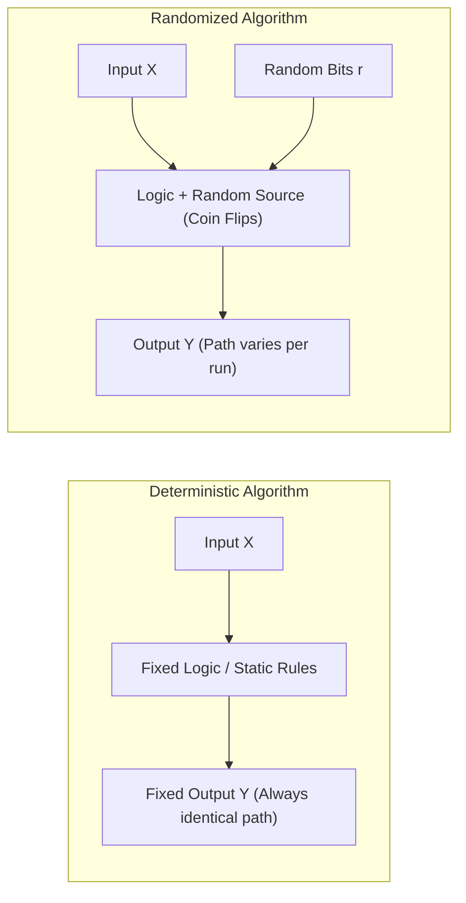
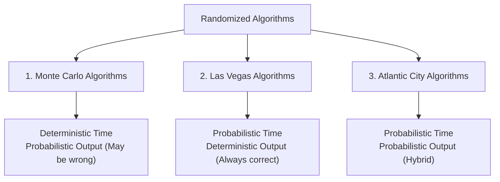
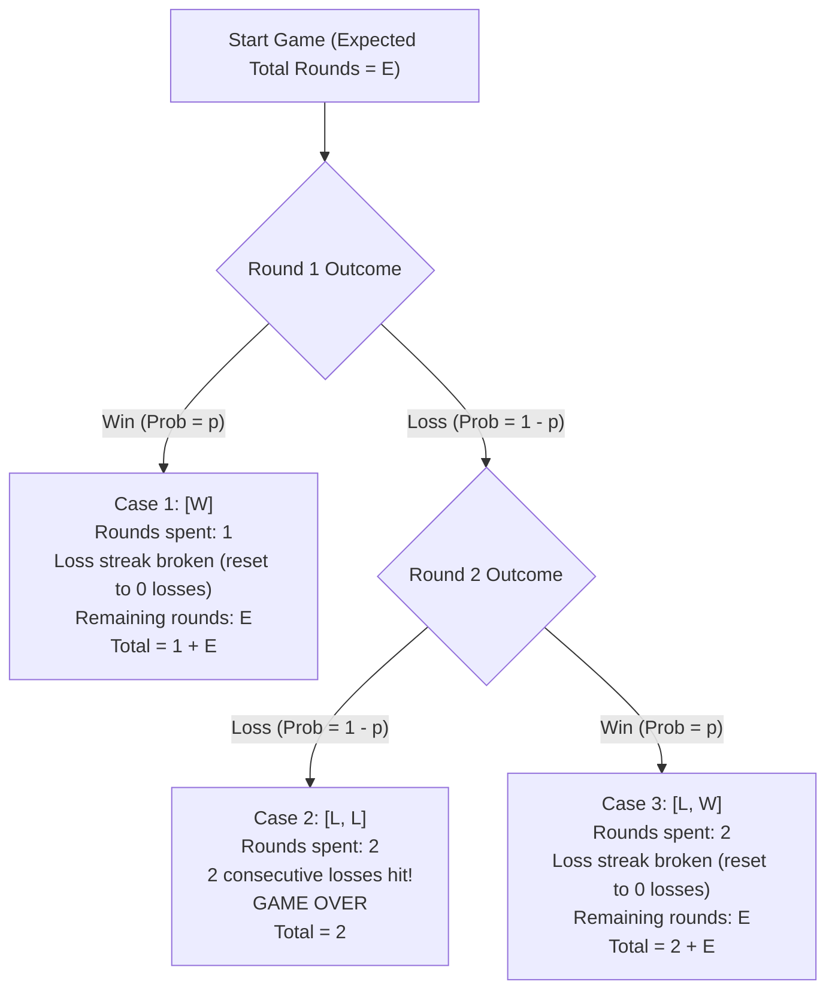
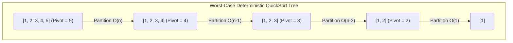
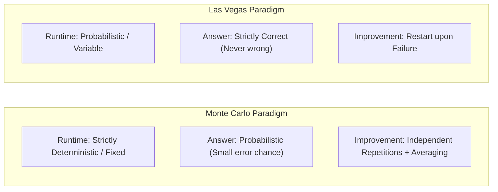

# 🎲 Randomized Algorithms — Master Exam & Intuition Guide

> [!abstract] Lecture & Syllabus Overview (CSE 4403: Lecture 23)
> - **Instructor**: Anika Farzana, Junior Lecturer, Department of CSE, Islamic University of Technology (IUT).
> - **Core Topics**: Deterministic vs. Randomized Computation, Classification (**Monte Carlo**, **Las Vegas**, **Atlantic City**), Combinatorial Explosions (Ulam's Solitaire), Monte Carlo $\pi$ Approximation, Expected Value Recurrences (Two Consecutive Losses Game), Las Vegas 8-Queens Placement, Randomized QuickSort, and 3-Tier Proofs of Correctness & Complexity.
> - **Exam Target**: Absolute conceptual mastery, recurrence solving, hand-simulation execution, complexity derivations, and 3-tier proof presentation.

---

## 1. What is a Randomized Algorithm?

### 💡 Core Intuition: Flipping Coins in Code
In traditional **deterministic algorithms**, given the exact same input, the program follows the exact same execution path every single time. If an adversary knows your deterministic strategy, they can craft a malicious input that forces your algorithm into its worst-case behavior (e.g., feeding an already-sorted array into QuickSort).

A **randomized algorithm** introduces an auxiliary source of randomness. During execution, it draws random numbers $r \in \{1, 2, \dots, R\}$ (e.g., flipping a fair coin or rolling a die) and uses those values to make branching decisions.



### 🔑 Key Characteristics
1. **Random Choice at Decision Points**: Rather than always picking a fixed element (like `arr[0]` or `arr[high]`), the algorithm draws a random index $r$ uniformly and acts on it.
2. **Independent Recursion**: In recursive algorithms (such as QuickSort), a **fresh, independent random choice** is generated at every recursion level. Past coin flips do not constrain future flips.
3. **Run-to-Run Variance**: Running the exact same code on the exact same input twice can result in different execution traces, different comparison counts, or slightly different running times.

---

## 2. Classification: The Three Families of Randomized Algorithms

Randomized algorithms are categorized based on what aspect of the algorithm is probabilistic: **Running Time**, **Correctness of Output**, or **Both**.



### 📊 Master Comparison Matrix

| Dimension | Monte Carlo Algorithm | Las Vegas Algorithm | Atlantic City Algorithm |
| :--- | :--- | :--- | :--- |
| **Running Time** | **Deterministic / Strictly Bounded** (always finishes in fixed steps) | **Probabilistic / Variable** (depends on random choices) | **Probabilistic** (runs fast with high probability) |
| **Correctness** | **Probabilistic** (correct with probability $1 - \epsilon$; may return an incorrect answer) | **Deterministic / Guaranteed** (if it produces an output, it is **100% correct**) | **Probabilistic** (correct with probability $\ge 0.75$) |
| **Failure Mode** | Returns an **incorrect/approximate value** without warning | Returns **FAILURE / No Answer** (or takes longer to finish) | May timeout or return an incorrect answer |
| **How to Improve** | Run multiple times and **average / take majority vote** to reduce error | Run repeatedly until a solution is found (**restart upon failure**) | Run multiple independent rounds |
| **Slide Examples** | 1. Approximating $\pi$<br>2. Solitaire Probability<br>3. Expected Rounds Simulation | 1. 8-Queens Random Placement<br>2. Randomized QuickSort | Theoretical hybrid (combines features of both) |

> [!tip]- 💡 How to Remember the Difference Instantly
> - **Las Vegas**: Like a high-end casino — if you win a jackpot, the payout is 100% real cash (never counterfeit/wrong), but you cannot predict *how long* you will play before hitting it.
> - **Monte Carlo**: Like a rapid spy mission with a strict countdown timer — you are guaranteed to finish before the timer hits 0:00, but there is a small chance your Intel estimate is slightly inaccurate.

---

## 3. The Origins of Monte Carlo & Combinatorial Explosion

### 3.1 Small Sample Space: The Fair Die (Slide 4)
When a sample space $S$ is small and finite, we can compute exact probabilities by straightforward manual enumeration:
- **Experiment**: Throw a single fair 6-sided die.
- **Sample Space**: $S = \{1, 2, 3, 4, 5, 6\} \implies |S| = 6$.
- **Favorable Event (Even Number)**: $E = \{2, 4, 6\} \implies |E| = 3$.
- **Exact Probability**:
  $$P(\text{even}) = \frac{|E|}{|S|} = \frac{3}{6} = 0.5 \quad (50\%)$$

---

### 3.2 Combinatorial Explosion: Stanisław Ulam's Solitaire Problem (Slide 5)
In the late 1940s, Polish-American mathematician **Stanisław Ulam** (while recovering from encephalitis surgery playing Canfield Solitaire) asked a deceptively simple question:
> *"What is the exact probability of successfully winning a game of Solitaire from a randomly shuffled 52-card deck?"*

#### ❌ Why Exact Combinatorial Enumeration Fails:
A standard deck of 52 cards has $52!$ possible permutations:
$$52! = 52 \times 51 \times 50 \times \dots \times 1 \approx 8.0658 \times 10^{67} \approx 10^{68}$$

> [!warning] Just How Incomprehensibly Large is $10^{68}$?
> - Total human population on Earth $\approx 10^{10}$ people.
> - Total seconds elapsed since the Big Bang $\approx 13.8 \text{ billion years} \approx 4.35 \times 10^{17} \text{ seconds}$.
> - If **every single person on Earth** spent **every single second since the Big Bang** checking 1 deck permutation per second:
>   $$\text{Total checks} = 10^{10} \times 10^{17} = 10^{27} \text{ permutations}$$
>   $$10^{27} \ll 10^{68} \quad (\text{Less than } 0.0000000000000000000000000000000000000001\%)$$
> Exact counting by hand or brute force exhaustive computer search is physically impossible in our universe!

#### 💡 Ulam's Breakthrough (The Monte Carlo Method):
Rather than trying to enumerate all $10^{68}$ configurations analytically:
1. **Simulate** $T$ independent random games of Solitaire on a computer (e.g., $T = 1,000,000$).
2. **Count** the number of won games $W$.
3. **Estimate** the winning probability as:
   $$P(\text{win}) \approx \frac{W}{T}$$
By the **Law of Large Numbers**, as $T \to \infty$, the empirical sample fraction $\frac{W}{T}$ converges to the true underlying probability. Ulam, along with John von Neumann and Nicholas Metropolis, formalized this at Los Alamos (code-named *Monte Carlo* after the Monaco gambling casino).

---

## 4. Monte Carlo Case Study 1: Approximating $\pi$ via Geometric Sampling

### 4.1 The Geometric Setup (Slide 7)
Consider a 2D Cartesian plane where a circle of radius $r$ is inscribed inside a square bounding box of side length $2r$.

```
         +-----------------------+  (x = +r, y = +r)
         |       . * * * .       |
         |    *             *    |
         |  *                 *  |
         | *      (0,0)        * |  Radius = r
         |  *                 *  |  Square Side = 2r
         |    *             *    |
         |       . * * * .       |
         +-----------------------+  (x = -r, y = -r)
```

1. **Area of the Bounding Square**:
   $$\text{Area}_{\text{square}} = (2r) \times (2r) = 4r^2$$
2. **Area of the Inscribed Circle**:
   $$\text{Area}_{\text{circle}} = \pi r^2$$
3. **Ratio of Areas ($x$)**:
   $$x = \frac{\text{Area}_{\text{circle}}}{\text{Area}_{\text{square}}} = \frac{\pi r^2}{4r^2} = \frac{\pi}{4}$$
4. **Solving for $\pi$**:
   $$\pi = 4x$$

> [!important] The Core Idea
> If we can estimate the area ratio $x$ by throwing uniform random points at the square and counting what fraction lands inside the circle, multiplying that fraction by $4$ immediately yields an approximation of $\pi$!

---

### 4.2 Algorithm & Pseudocode (Slide 8-9)

For simplicity, let $r = 1$ (the unit circle centered at $(0, 0)$).
- A point $(x, y)$ is chosen uniformly at random inside the square $[-1, 1] \times [-1, 1]$.
- A point lands inside or on the boundary of the unit circle if and only if its Euclidean distance from the origin satisfies:
  $$\sqrt{x^2 + y^2} \le 1 \iff x^2 + y^2 \le 1$$

```text
APPROXIMATE-PI(T):
    C = 0                               //count of points landing inside circle
    for i = 1 to T:
        generate random x, y in [-1, 1] //uniform continuous random coordinates
        if x^2 + y^2 <= 1:              //inside unit circle condition
            C = C + 1                   //increment circle hit count
    return 4 * (C / T)                  //approximate pi = 4 * ratio
```

---

### 4.3 Step-by-Step Simulation Trace

Let's simulate `APPROXIMATE-PI(T = 8)`:

| Iteration $i$ | Generated Point $(x, y)$ | Distance Squared $x^2 + y^2$ | $x^2 + y^2 \le 1$? | Inside Count $C$ | Running $\pi \approx 4 \times \frac{C}{i}$ |
| :---: | :---: | :---: | :---: | :---: | :---: |
| 1 | $(0.2, 0.5)$ | $0.04 + 0.25 = 0.29$ | **Yes** ($\le 1$) | 1 | $4 \times (1/1) = 4.000$ |
| 2 | $(0.9, 0.8)$ | $0.81 + 0.64 = 1.45$ | **No** ($> 1$) | 1 | $4 \times (1/2) = 2.000$ |
| 3 | $(-0.4, 0.6)$ | $0.16 + 0.36 = 0.52$ | **Yes** ($\le 1$) | 2 | $4 \times (2/3) = 2.667$ |
| 4 | $(0.7, -0.7)$ | $0.49 + 0.49 = 0.98$ | **Yes** ($\le 1$) | 3 | $4 \times (3/4) = 3.000$ |
| 5 | $(-0.8, -0.7)$ | $0.64 + 0.49 = 1.13$ | **No** ($> 1$) | 3 | $4 \times (3/5) = 2.400$ |
| 6 | $(0.1, -0.3)$ | $0.01 + 0.09 = 0.10$ | **Yes** ($\le 1$) | 4 | $4 \times (4/6) = 2.667$ |
| 7 | $(-0.5, -0.5)$ | $0.25 + 0.25 = 0.50$ | **Yes** ($\le 1$) | 5 | $4 \times (5/7) = 2.857$ |
| 8 | $(0.3, 0.4)$ | $0.09 + 0.16 = 0.25$ | **Yes** ($\le 1$) | 6 | $4 \times (6/8) = \mathbf{3.000}$ |

As $T$ grows to $10,000$ or $1,000,000$, $\pi \approx 3.14159...$

---

### 4.4 Complexity & Convergence Analysis

- **Time Complexity**: The loop runs strictly $T$ times. Generating 2 random numbers and checking $x^2 + y^2 \le 1$ takes $O(1)$ constant time.
  $$\text{Total Time Complexity} = O(T)$$
- **Space Complexity**: Only a few scalar variables (`C`, `i`, `x`, `y`) are stored.
  $$\text{Auxiliary Space Complexity} = O(1)$$
- **Convergence / Error Bound**:
  By the Central Limit Theorem, the standard error of the Monte Carlo estimate scales with $O\left(\frac{1}{\sqrt{T}}\right)$.
  - To gain **1 additional decimal digit of precision**, $T$ must increase by a factor of $100$.

---

### 4.5 Proof of Correctness (3 Versions)

#### 🔹 1. Intuitive Version (Easy to Understand)
> [!note]- 1. Intuitive Proof
> Imagine throwing thousands of tiny darts randomly at a square board. Because every location on the board has an equal chance of being hit, the fraction of darts that land inside the circle will naturally match the fraction of the board covered by the circle.
> Since the circle covers $\frac{\pi r^2}{4r^2} = \frac{\pi}{4}$ of the square's area, multiplying our sample fraction by 4 gives an estimate of $\pi$. Throwing more darts smooths out random fluctuations.

#### 🔹 2. Exam-Ready Version (Concise & Rigorous for Exam Writing)
> [!note]- 2. Exam-Ready Proof
> **Theorem**: `APPROXIMATE-PI(T)` produces an unbiased estimator $\hat{\pi}$ whose expected value is $\pi$.
> 
> **Proof**:
> 1. Let $(X_i, Y_i)$ be independent uniform random variables chosen over $[-1, 1] \times [-1, 1]$.
> 2. Define indicator random variable $I_i$:
>    $$I_i = \begin{cases} 1 & \text{if } X_i^2 + Y_i^2 \le 1 \\ 0 & \text{otherwise} \end{cases}$$
> 3. The probability that a uniformly distributed point lands in the circle is the ratio of areas:
>    $$P(I_i = 1) = \frac{\text{Area(Circle)}}{\text{Area(Square)}} = \frac{\pi \cdot 1^2}{2 \cdot 2} = \frac{\pi}{4}$$
> 4. Expected value of $I_i$: $E[I_i] = P(I_i = 1) = \frac{\pi}{4}$.
> 5. Total hits $C = \sum_{i=1}^T I_i$. By Linearity of Expectation:
>    $$E[C] = \sum_{i=1}^T E[I_i] = T \cdot \frac{\pi}{4}$$
> 6. The estimator returned is $\hat{\pi} = 4 \cdot \frac{C}{T}$. Taking expectation:
>    $$E[\hat{\pi}] = 4 \cdot \frac{E[C]}{T} = 4 \cdot \frac{T \cdot \frac{\pi}{4}}{T} = \pi$$
> 7. By the Strong Law of Large Numbers, $\lim_{T \to \infty} \hat{\pi} = \pi$ almost surely. $\blacksquare$

#### 🔹 3. Actual Slide Proof (From Slide 7-8)
> [!note]- 3. Actual Slide Proof
> *Take a circle of radius $r$ inscribed in a square of side length $2r$. The ratio of the circle's area to the square's area depends only on $\pi$:*
> $$x = \frac{\pi r^2}{4 r^2} = \frac{\pi}{4} \implies \pi = 4x$$
> *A point $(x, y)$ lies inside the unit circle exactly when its distance satisfies $\sqrt{x^2 + y^2} \le 1$. The fraction of points landing inside approximates the area ratio $x$. Returning $4 \cdot (C/T)$ recovers $\pi$.*

---

## 5. Discrete Probability & Expected Value Foundations

### 5.1 What is Expected Value? (Slide 11)
The **Expected Value ($EV$ or $E[X]$)** of a discrete random variable $X$ is the probability-weighted average of all its possible outcomes:
$$E[X] = \sum_{i} x_i \cdot P(X = x_i)$$

#### 💼 Slide Example: Business Project Evaluation
- **Project A**:
  - $40\%$ chance of $\$2,000$ profit
  - $60\%$ chance of $\$500$ profit
  $$EV(\text{Project A}) = 0.4 \times \$2000 + 0.6 \times \$500 = \$800 + \$300 = \mathbf{\$1,100}$$
- **Project B**:
  - $30\%$ chance of $\$3,000$ profit
  - $70\%$ chance of $\$200$ profit
  $$EV(\text{Project B}) = 0.3 \times \$3000 + 0.7 \times \$200 = \$900 + \$140 = \mathbf{\$1,040}$$
- **Conclusion**: Project A has a higher expected return ($1100 > 1040$), even though Project B has a higher best-case jackpot.

---

## 6. Monte Carlo Case Study 2: Expected Number of Rounds (Two Consecutive Losses)

### 6.1 Problem Setup (Slide 10)
Consider an infinite-horizon sequential game:
- The game is played round after round.
- Each round is **won** with probability $p$, and **lost** with probability $1 - p$.
- Rounds are mutually **independent**.
- **Game Termination Condition**: The game stops immediately the first time the player records **two consecutive losses** ($LL$).
- **Goal**: Find $E$, the expected total number of rounds played before the game ends.

---

### 6.2 Analytical Derivation via Recurrence (Slides 12-13)

We condition on the outcomes of the first one or two rounds. Since the events partition the sample space completely, we apply the **Law of Total Expectation**.



#### 🔍 Detailed Case Analysis:
1. **Case 1: First round is a Win ($W$)**
   - **Probability**: $p$
   - **Rounds spent so far**: $1$
   - **State**: Winning resets the loss streak to $0$. The game effectively restarts from scratch.
   - **Expected total rounds**: $1 + E$

2. **Case 2: First round is a Loss, Second round is a Loss ($LL$)**
   - **Probability**: $(1 - p) \times (1 - p) = (1 - p)^2$
   - **Rounds spent so far**: $2$
   - **State**: Two consecutive losses condition is satisfied $\implies$ **Game Over immediately!**
   - **Expected total rounds**: $2$

3. **Case 3: First round is a Loss, Second round is a Win ($LW$)**
   - **Probability**: $(1 - p) \times p = p(1 - p)$
   - **Rounds spent so far**: $2$
   - **State**: The win in round 2 breaks the losing streak (back to $0$ losses). The game restarts from scratch.
   - **Expected total rounds**: $2 + E$

---

### 6.3 Step-by-Step Algebraic Solution (Slide 12)

Setting up the recurrence equation from the law of total expectation:
$$E = p \cdot (1 + E) + (1 - p)^2 \cdot 2 + p(1 - p) \cdot (2 + E)$$

Let's expand each term systematically:
$$E = p + pE + 2(1 - p)^2 + 2p(1 - p) + p(1 - p)E$$

Group all terms containing $E$ on the left-hand side:
$$E - pE - p(1 - p)E = p + 2(1 - p)^2 + 2p(1 - p)$$

Factor out $E$ on the LHS:
$$E \cdot [1 - p - p(1 - p)] = p + 2(1 - p)\left[(1 - p) + p\right]$$

Simplify the expressions inside brackets:
- On the LHS:
  $$1 - p - p(1 - p) = (1 - p) - p(1 - p) = (1 - p)(1 - p) = (1 - p)^2$$
- On the RHS, notice that $[(1 - p) + p] = 1$:
  $$\text{RHS} = p + 2(1 - p)(1) = p + 2 - 2p = 2 - p$$

Equating LHS and RHS:
$$E \cdot (1 - p)^2 = 2 - p$$

Solving for $E$:
$$\mathbf{E = \frac{2 - p}{(1 - p)^2}}$$

---

### 6.4 Sanity Checks & Boundary Value Analysis

> [!tip] Always verify extreme values on exam questions!
> 1. **$p = 0$ (Guaranteed loss every round, $1 - p = 1$)**:
>    $$E = \frac{2 - 0}{(1 - 0)^2} = \frac{2}{1} = \mathbf{2} \text{ rounds}$$
>    *Intuition*: You lose Round 1 and Round 2 immediately. Total = 2. Matches reality!
> 2. **$p = 0.5$ (Fair coin toss)**:
>    $$E = \frac{2 - 0.5}{(1 - 0.5)^2} = \frac{1.5}{0.25} = \mathbf{6} \text{ rounds}$$
> 3. **$p \to 1$ (Almost always win)**:
>    $$E = \lim_{p \to 1} \frac{2 - p}{(1 - p)^2} = \frac{1}{0^+} = \mathbf{+\infty}$$
>    *Intuition*: You almost never get two losses in a row; the game goes on virtually forever.

---

### 6.5 Monte Carlo Simulation Algorithm (Slide 14)

```text
EXPECTED-ROUNDS(p, N):
    total = 0                           //accumulates total rounds across all games
    for i = 1 to N:                     //simulate N complete games
        nloss = 0                       //current consecutive loss streak
        nround = 0                      //rounds played in current game
        while nloss != 2:               //run until 2 consecutive losses
            nround = nround + 1         //play a round
            r = random value in [0, 1]  //uniform random number
            if r > p:                   //event of loss (probability 1 - p)
                nloss = nloss + 1       //increment consecutive loss streak
            else:                       //event of win (probability p)
                nloss = 0               //reset streak to 0
        total = total + nround          //add game length to total
    return total / N                    //empirical average rounds
```

- **Time Complexity**: $O(N \cdot E) = O\left(N \cdot \frac{2-p}{(1-p)^2}\right)$
- **Space Complexity**: $O(1)$

---

### 6.6 Pros and Cons of Monte Carlo Methods (Slide 15)

| Advantages | Drawbacks |
| :--- | :--- |
| **No Deep Math Required**: Highly complex analytical integrals or recurrences can be bypassed completely. | **Slow Convergence**: High runtime when events are rare or $p \to 1$ ($O(1/\sqrt{N})$ rate). |
| **Rapid Implementation**: Very quick and simple to code and test. | **Zero Theoretical Insight**: Produces only a numeric answer without explaining *why* the relationship holds. |
| **Domain Agnostic**: Works on arbitrary systems (finance, physics, routing) where equations are intractable. | **No Reusability**: Changing $p$ requires a complete, expensive re-run from scratch. Conclusions do not generalize algebraically. |

---

### 6.7 Proof of Recurrence (3 Versions)

#### 🔹 1. Intuitive Version (Easy to Understand)
> [!note]- 1. Intuitive Proof
> Every game either starts with a Win (takes 1 round and resets your progress back to square one), or starts with a Loss. If it starts with a Loss, the next round either finishes the game immediately (a second Loss, ending at 2 rounds) or resets your progress (a Win, taking 2 rounds before putting you back to square one).
> Weighting each of these 3 scenarios by their probabilities gives the balance equation for expected rounds.

#### 🔹 2. Exam-Ready Version (Full Recurrence Derivation for Exam)
> [!note]- 2. Exam-Ready Proof
> **Problem**: Find the expected rounds $E$ until 2 consecutive losses in a sequence of independent Bernoulli trials with success probability $p$.
> 
> **Proof**:
> Condition on the first one or two trials:
> 1. Event $A_1 = \{W\}$ (Win on round 1): $P(A_1) = p$. Rounds spent $= 1$. Expected remaining rounds $= E$. Total $= 1 + E$.
> 2. Event $A_2 = \{LL\}$ (Loss on round 1, Loss on round 2): $P(A_2) = (1-p)^2$. Game terminates. Total $= 2$.
> 3. Event $A_3 = \{LW\}$ (Loss on round 1, Win on round 2): $P(A_3) = p(1-p)$. Rounds spent $= 2$. Expected remaining rounds $= E$. Total $= 2 + E$.
> 
> By the Law of Total Expectation:
> $$E = P(A_1)(1 + E) + P(A_2)(2) + P(A_3)(2 + E)$$
> $$E = p(1 + E) + 2(1 - p)^2 + p(1 - p)(2 + E)$$
> Expanding and collecting $E$:
> $$E[1 - p - p(1 - p)] = p + 2(1 - p)[(1 - p) + p]$$
> $$E(1 - p)^2 = p + 2(1 - p) = 2 - p$$
> $$E = \frac{2 - p}{(1 - p)^2} \quad \blacksquare$$

#### 🔹 3. Actual Slide Proof (From Slide 12)
> [!note]- 3. Actual Slide Proof
> *Conditioning on the outcome of the first two rounds gives a recurrence for $E$:*
> $$E = (1+E)\cdot p + 2\cdot(1-p)(1-p) + (2+E)\cdot(1-p)\cdot p$$
> $$E = \frac{2 - p}{(1 - p)^2}$$
> *Where $E =$ Expected number of rounds until two consecutive losses, $p =$ winning probability in a single round.*

---

## 7. Las Vegas Case Study 1: The 8-Queens Problem

### 7.1 Problem Definition
Place $8$ queens on an $8 \times 8$ chessboard such that **no two queens attack each other**.
- No two queens can share the same **Row**.
- No two queens can share the same **Column**.
- No two queens can share the same **Diagonal** ($|row_1 - row_2| = |col_1 - col_2|$).

```
   1   2   3   4   5   6   7   8
 +---+---+---+---+---+---+---+---+
1| . | . | . | Q | . | . | . | . |  (Queen at row 1, col 4)
 +---+---+---+---+---+---+---+---+
2| . | Q | . | . | . | . | . | . |  (Queen at row 2, col 2)
 +---+---+---+---+---+---+---+---+
3| . | . | . | . | . | . | . | Q |  (Queen at row 3, col 8)
 +---+---+---+---+---+---+---+---+
4| . | . | . | . | . | Q | . | . |  (Queen at row 4, col 6)
 +---+---+---+---+---+---+---+---+
5| Q | . | . | . | . | . | . | . |  (Queen at row 5, col 1)
 +---+---+---+---+---+---+---+---+
6| . | . | . | . | . | . | Q | . |  (Queen at row 6, col 7)
 +---+---+---+---+---+---+---+---+
7| . | . | . | . | Q | . | . | . |  (Queen at row 7, col 5)
 +---+---+---+---+---+---+---+---+
8| . | . | Q | . | . | . | . | . |  (Queen at row 8, col 3)
 +---+---+---+---+---+---+---+---+
```

---

### 7.2 Las Vegas Placement Algorithm (Slide 16-17)

Instead of exhaustive deterministic backtracking (which can explore massive sterile subtrees), the **Las Vegas approach** places queens greedily at random row-by-row:

```text
LAS-VEGAS-8-QUEENS():
    while true:                         //restart until complete valid placement
        board = empty 8x8 array
        success = true
        
        for k = 1 to 8:                 //place queen in row k
            valid_cols = []
            for col = 1 to 8:
                if queen at (k, col) does not attack board[1..k-1]:
                    valid_cols.append(col)
                    
            if valid_cols is EMPTY:     //dead end reached
                success = false
                break                   //report failure and restart
                
            chosen_col = pick uniformly at random from valid_cols
            board[k] = chosen_col       //place queen
            
        if success == true:
            return board                //full valid placement found!
```

---

### 7.3 Why is this Algorithm Las Vegas?

> [!important] The Las Vegas Guarantee
> 1. **Zero False Positives**: It **never** returns an illegal chessboard configuration. Every placement is verified row by row.
> 2. **Failure Allowed**: If the random choices lead to a dead-end at row $k < 8$, the algorithm flags failure and simply restarts.
> 3. **Variable Running Time**: A single trial is extremely fast ($O(n^2)$ time), and on average it succeeds after a modest number of random restarts.

---

## 8. Las Vegas Case Study 2: Randomized QuickSort

### 8.1 The Fatal Flaw of Deterministic QuickSort

In deterministic QuickSort (e.g., choosing `pivot = arr[high]`):
- **Best / Average Case**: The pivot splits the array roughly in half $\implies T(n) = 2T(n/2) + O(n) = \Theta(n \log n)$.
- **The Adversarial Vulnerability**: If the input is already sorted in ascending or descending order, picking `arr[high]` splits the array into sizes $n-1$ and $0$.
  $$T(n) = T(n-1) + T(0) + O(n) \implies T(n) = \sum_{i=1}^n i = \mathbf{\Theta(n^2)}$$



---

### 8.2 The Randomized Solution: Random Pivot Selection (Slides 18-21)

Instead of a fixed position, pick a random index $r \in [low, high]$ uniformly, swap `arr[r]` with `arr[high]`, and proceed with standard partitioning.

```text
QUICKSORT(arr, low, high):
    if low < high:
        pi = PARTITION-RANDOM(arr, low, high) //find random pivot position
        QUICKSORT(arr, low, pi - 1)          //recursively sort left subarray
        QUICKSORT(arr, pi + 1, high)         //recursively sort right subarray

PARTITION-RANDOM(arr, low, high):
    r = random integer between low and high   //uniform random index
    swap arr[r] and arr[high]                //place chosen pivot at end
    return PARTITION(arr, low, high)         //run standard Lomuto partition

PARTITION(arr, low, high):
    pivot = arr[high]                        //pivot is now at high
    i = low                                  //boundary for elements smaller than pivot
    for j = low to high - 1:
        if arr[j] < pivot:
            swap arr[i] and arr[j]           //place smaller element in left partition
            i = i + 1
    swap arr[i] and arr[high]                //place pivot at its final sorted index
    return i                                 //return pivot index
```

---

### 8.3 Why Randomizing the Pivot Changes Everything (Slide 21)

> [!note] The Magic of Runtime Randomness
> - In deterministic QuickSort, the worst-case behavior is tied to **specific input orders** (e.g. sorted arrays).
> - In Randomized QuickSort, the choice of pivot is determined by **independent coin flips during runtime**.
> - **No fixed input can reliably trigger $O(n^2)$ time!** Even if an adversary hands you an already-sorted array, the algorithm chooses pivots uniformly at random with equal probability $\frac{1}{n}$.
> - The expected running time becomes **$\mathbf{\Theta(n \log n)}$ for EVERY input**.

---

### 8.4 Complexity Analysis of Randomized QuickSort

| Metric | Complexity | Explanation / Probability |
| :--- | :---: | :--- |
| **Worst-Case Time** | $O(n^2)$ | Occurs only if the random number generator picks the extreme minimum or maximum element at *every single level* of recursion. Probability is $\frac{2^n}{n!} \approx 0$. |
| **Best-Case Time** | $\Omega(n \log n)$ | Occurs when the random pivot splits the array exactly in half at every step ($T(n) = 2T(n/2) + O(n)$). |
| **Expected Average-Case Time** | $\mathbf{\Theta(n \log n)}$ | Expected over all possible internal random choices for *any* input. |
| **Worst-Case Space** | $O(n)$ | Maximum call-stack depth if unbalanced partitions occur. |
| **Expected Space** | $O(\log n)$ | Expected call-stack depth due to balanced expected tree height. |

---

### 8.5 Proof of Expected Time Complexity (3 Versions)

#### 🔹 1. Intuitive Version (Lucky vs. Unlucky Split Intuition)
> [!note]- 1. Intuitive Proof
> Even if our random pivot does not split the array exactly $50/50$, suppose it produces an unbalanced $90/10$ split.
> The recurrence becomes:
> $$T(n) \le T(0.9n) + T(0.1n) + O(n)$$
> The recursion tree has depth $\log_{1/0.9} n = O(\log n)$. Since each level of the recursion tree does at most $O(n)$ total partition work across all subproblems, the total running time remains:
> $$\text{Depth} \times \text{Work per level} = O(\log n) \times O(n) = \mathbf{O(n \log n)}$$
> A split is "balanced enough" at least $50\%$ of the time, so on average, the depth is strictly bounded by $O(\log n)$.

#### 🔹 2. Exam-Ready Version (Formal Indicator Random Variable Proof)
> [!note]- 2. Exam-Ready Proof
> **Theorem**: The expected running time of Randomized QuickSort on an array of $n$ elements is $O(n \log n)$.
> 
> **Proof**:
> 1. The running time of QuickSort is dominated by the total number of pairwise comparisons made in `PARTITION`.
> 2. Let the sorted elements of the array be $z_1 < z_2 < \dots < z_n$. Let $Z_{ij} = \{z_i, z_{i+1}, \dots, z_j\}$.
> 3. Define indicator random variable $X_{ij} = I\{z_i \text{ is compared to } z_j\}$.
>    - Two elements $z_i$ and $z_j$ are compared **if and only if** the first pivot chosen from set $Z_{ij}$ is either $z_i$ or $z_j$.
>    - If any intermediate element $z_k$ ($i < k < j$) is chosen as pivot first, $z_i$ and $z_j$ are separated into different subproblems and will **never** be compared.
> 4. Since the pivot is chosen uniformly at random, every element in $Z_{ij}$ has an equal probability $\frac{1}{|Z_{ij}|} = \frac{1}{j - i + 1}$ of being chosen first:
>    $$P(X_{ij} = 1) = \frac{2}{j - i + 1}$$
> 5. Total expected comparisons $E[X]$:
>    $$E[X] = \sum_{i=1}^{n-1} \sum_{j=i+1}^n E[X_{ij}] = \sum_{i=1}^{n-1} \sum_{j=i+1}^n \frac{2}{j - i + 1}$$
> 6. Let $k = j - i + 1$:
>    $$E[X] = \sum_{i=1}^{n-1} \sum_{k=2}^{n-i+1} \frac{2}{k} \le 2 \sum_{i=1}^n \sum_{k=1}^n \frac{1}{k} = 2n \cdot H_n$$
> 7. Since $H_n = \ln n + O(1)$, we have:
>    $$E[X] \le 2n \ln n + O(n) = \mathbf{O(n \log n)} \quad \blacksquare$$

#### 🔹 3. Actual Slide Proof (From Slide 20-21)
> [!note]- 3. Actual Slide Proof
> *Randomizing the pivot removes the dependence on input order. No fixed input can reliably trigger the $O(n^2)$ worst case, so the expected running time becomes $O(n \log n)$.*

---

## 9. Comprehensive Comparison: Monte Carlo vs. Las Vegas



| Property | Monte Carlo | Las Vegas |
| :--- | :--- | :--- |
| **Primary Guarantee** | Guarantees **time bound** | Guarantees **correctness** |
| **Risk** | Risk of incorrect output | Risk of long runtime / timeout |
| **Decision Rule** | Accept output of fixed budget | Keep running until correct solution produced |
| **Example Problems** | Estimating $\pi$, Primality testing (Miller-Rabin), Game state evaluation | Randomized QuickSort, Randomized QuickSelect, 8-Queens |

---

## 10. Exam Pitfalls & High-Yield Questions

> [!warning] Exam Pitfall 1: "Does Randomized QuickSort eliminate the $O(n^2)$ worst case?"
> **NO!** The worst-case time complexity of Randomized QuickSort is still mathematically $O(n^2)$. What randomization eliminates is the **worst-case input**. No specific array ordering can force $O(n^2)$ time; worst case only happens if the random number generator itself makes astronomically unlucky choices at every single recursive step.

> [!warning] Exam Pitfall 2: "Can a Las Vegas algorithm return an incorrect solution?"
> **NEVER.** A Las Vegas algorithm either returns the exact correct answer or reports failure / continues running. It never outputs a wrong answer.

> [!warning] Exam Pitfall 3: "In the expected rounds game, why is Case 1 total rounds $(1 + E)$ instead of just $E$?"
> Because playing that first winning round consumed **1 physical round** of game time! Once that round is won, your streak is reset to 0, and from this fresh state, you still expect to play $E$ additional rounds. Thus, total expected rounds for that branch is $1 + E$.
