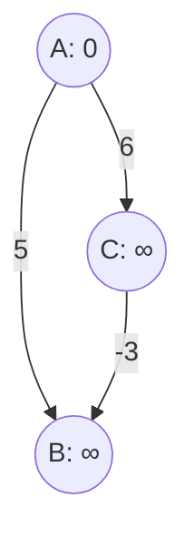
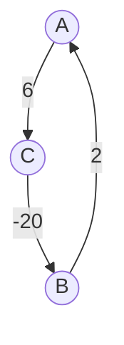

## Overview
Given a **weighted directed/undirected graph** and a **source vertex**, the goal of a Single-Source Shortest Path (SSSP) algorithm is to find the shortest path distances from the source vertex to all other vertices in the graph.

Two well-known single-source shortest path algorithms:
1. **Dijkstra’s Algorithm** (Uses Greedy approach)
2. **Bellman-Ford Algorithm** (Uses Dynamic Programming approach)

---

## 1. Dijkstra’s Algorithm

> [!info] Characteristics
> - **Approach:** Greedy Algorithm.
> - **Constraint:** Solves SSSP only for graphs with **non-negative edge weights**.
> - **Application:** Widely used in networking protocols such as Open Shortest Path First (OSPF).

### 💻 Pseudocode
Based on the lecture slides, this implementation uses a **Min-Priority Queue** (PQ) and allows duplicate nodes in the queue, handling them with a `vis` (visited) array.

```python
# G: The graph, source: The starting vertex
DIJKSTRA(G, source):
    # 1. Initialization
    for each vertex v in G:
        dist[v] ← ∞
        vis[v] ← 0
    
    dist[source] ← 0
    
    # 2. Priority Queue Setup
    # Create a min-priority queue PQ where priority is based on dist[]
    PQ.push({0, source})
    
    # 3. Main Loop
    while PQ is not empty:
        node ← PQ.pop()
        d ← node.first      # Current shortest distance to u
        u ← node.second     # Current vertex
        
        # If we have already finalized the shortest path for u, skip
        if vis[u] == 1: 
            continue
            
        vis[u] ← 1          # Mark vertex as visited/finalized
        
        # 4. Edge Relaxation
        for each neighbor v of u:
            if vis[v] == 1: 
                continue
                
            # If a shorter path to v is found through u
            if d + weight(u, v) < dist[v]:
                dist[v] ← d + weight(u, v) 
                PQ.push({dist[v], v})
                
    return dist[]
```

---

### ⏱️ Time & Space Complexity Derivation

#### Time Complexity: $O((V+E) \log V)$
To calculate the time complexity, we break down the algorithm step-by-step assuming the Priority Queue (PQ) is implemented using a standard **Binary Min-Heap**:

1. **Initialization:** Setting up the `dist` and `vis` arrays takes $O(V)$ time.
2. **Priority Queue Operations:**
   - In the worst case, every edge relaxation can result in pushing a new distance-vertex pair into the PQ. This means the PQ can grow to size $E$.
   - The time to push or pop from a heap of size $E$ is $O(\log E)$.
   - Since $E \le V^2$ in a simple graph, $\log E \le \log(V^2) = 2 \log V$. Therefore, heap operations take $O(\log V)$ time.
3. **While Loop (Extract Min):** We pop nodes from the PQ. Since we skip already visited nodes (`if vis[u] == 1: continue`), we process exactly $V$ unique nodes. Popping takes $O(V \log V)$.
4. **For Loop (Edge Relaxation):** Over the entire execution of the algorithm, the inner loop iterates through the neighbors of each popped vertex. This means it iterates exactly once for every edge in the graph, resulting in $E$ iterations.
   - Pushing to the PQ during relaxation takes $O(\log V)$ time.
   - Total time for all edge relaxations: $O(E \log V)$.

**Total Time Complexity:** 
$$O(V) + O(V \log V) + O(E \log V) \implies O((V+E)\log V)$$

#### Space Complexity
The space complexity depends heavily on how the graph is represented in memory:

> [!check] Scenario A: Adjacency List (Slide Standard) -> $O(V + E)$
> - **Graph Representation:** An adjacency list stores $V$ vertices and $E$ edges. Space: $O(V + E)$.
> - **Arrays:** The `dist` and `vis` arrays each take $O(V)$ space.
> - **Priority Queue:** In the slide's implementation, we push to the PQ without updating existing keys (lazy deletion). The PQ can hold up to $E$ elements. Space: $O(E)$.
> - **Total Space:** $O(V + E) + O(V) + O(E) = \mathbf{O(V + E)}$

> [!note] Scenario B: Adjacency Matrix -> $O(V^2)$
> - If the graph was represented using a 2D array (Adjacency Matrix), the graph itself would take $V \times V$ space. 
> - **Total Space:** $O(V^2) + O(V) + O(E) = \mathbf{O(V^2)}$

*(Since the slide states $O(V+E)$, it assumes the standard Adjacency List representation).*

---

### ⚠️ Problem with Negative Edges (Why Dijkstra Fails)

Dijkstra assumes that once a vertex is popped from the Priority Queue, its shortest distance is **finalized**. This is because all edge weights are positive, meaning any longer path would only increase the distance. **Negative edges break this greedy assumption.**

Consider the following example from the slides:
*Source = A*



**Step-by-step failure:**
1. **Initial:** PQ has `{0, A}`. `dist[A] = 0`.
2. **Pop A:** Update neighbors B and C. 
   - `dist[B] = 5`, push `{5, B}` to PQ.
   - `dist[C] = 6`, push `{6, C}` to PQ.
3. **Pop B (Greedy Choice):** `node = {5, B}`. 
   - B is marked as `visited`. 
   - Dijkstra assumes the shortest path to B is exactly 5.
4. **Pop C:** `node = {6, C}`.
   - Check neighbors of C. C has an edge to B with weight `-3`.
   - `dist[C] + weight(C, B) = 6 + (-3) = 3`.
   - $3 < dist[B] (5)$. The true optimal distance to B is **3** (Path: A $\rightarrow$ C $\rightarrow$ B).
   - *However*, because B is already marked as `visited` (`vis[B] == 1`), Dijkstra skips it. 

> [!failure] Conclusion
> The distance of B was locked in at **5** and never updated to the correct optimal distance of **3**. Dijkstra **failed** to find the correct shortest path because the negative edge created a cheaper route after the node was finalized.

***

## 2. Bellman-Ford Algorithm

> [!info] Characteristics
> - **Approach:** Dynamic Programming.
> - **Capabilities:** Unlike Dijkstra, it **can handle negative edge weights** and **detect negative edge cycles**.
> - **Application:** Used in the **RIP (Routing Information Protocol)**. 
>   - Routers periodically share routing tables with neighbors to update shortest paths.
>   - Routers do *not* need to know the complete network topology.
>   - Principle: *"If my neighbor knows a better route, I update mine."*

### 💻 Pseudocode (With Negative Cycle Detection)
Unlike Dijkstra's Greedy approach, Bellman-Ford relaxes **all** edges repeatedly. The shortest path in a graph with $V$ vertices can have at most $V-1$ edges. Therefore, relaxing all edges $V-1$ times guarantees finding the shortest path. 

The lecture slide cleverly combines the $V-1$ relaxations and the cycle detection into a single loop that runs exactly $V$ times (`range(V)`).

```python
# V: Number of vertices, edges: List of all edges (u, v, weight)
BELLMAN_FORD(V, edges, source):
    # 1. Initialization
    dist = array of size V, filled with 100000000 (Infinity)
    dist[source] = 0
    
    # 2. Edge Relaxation
    # Relaxation of all edges V times. 
    # (V - 1) times to find shortest path, 1 additional time to detect negative cycle.
    for i in range(V):
        for edge in edges:
            u, v, wt = edge
            
            # If the source node has been reached and a shorter path exists
            if dist[u] != 100000000 and dist[u] + wt < dist[v]:
                
                # 3. Negative Cycle Detection
                # If distances are still updating on the V-th relaxation (i == V - 1),
                # it means a negative weight cycle exists.
                if i == V - 1:
                    return [-1]  # Indicates failure due to negative cycle
                
                # Update shortest distance to node v
                dist[v] = dist[u] + wt
                
    return dist
```

---

### ⏱️ Time & Space Complexity Derivation

#### Time Complexity: $O(V \times E)$
To calculate the time complexity, we analyze the nested loops in the algorithm:

1. **Initialization:** Creating and initializing the `dist` array takes $O(V)$ time.
2. **Outer Loop:** The loop `for i in range(V):` runs exactly $V$ times.
3. **Inner Loop:** The loop `for edge in edges:` iterates over every single edge in the graph. There are $E$ edges.
4. **Relaxation Operation:** The condition check (`if dist[u] != inf...`) and the assignment (`dist[v] = ...`) take constant time $O(1)$.
   
**Calculation:** 
- The inner loop does $O(1)$ work $E$ times $\implies O(E)$ time per outer loop iteration.
- The outer loop runs $V$ times.
- Total time for the nested loops $= V \times O(E) = O(V \times E)$.

**Total Time Complexity:** $O(V) + O(V \times E) \implies \mathbf{O(V \times E)}$

#### Space Complexity
The algorithm's **auxiliary** space (extra space required beyond the input) is just the `dist` array. 

> [!check] Auxiliary Space -> $O(V)$
> - The `dist` array stores one integer value for each vertex.
> - Space required: $\mathbf{O(V)}$.

If we include the space required to **store the graph itself** (as requested):

> [!note] Graph Storage: Edge List / Adjacency List -> $O(V + E)$
> - Bellman-Ford typically takes an array of edges (`Edge List`). Storing $E$ edges takes $O(E)$ space. Storing the $V$ vertices takes $O(V)$ space.
> - Total Space: $\mathbf{O(V + E)}$.

> [!warning] Graph Storage: Adjacency Matrix -> $O(V^2)$
> - If the graph is provided as a 2D array, it takes $V \times V$ space.
> - Total Space: $\mathbf{O(V^2)}$.

*(The lecture slide strictly states **Space Complexity: $O(V)$**, meaning it is only counting the extra `dist` array needed for the DP state, assuming the graph is simply given).*

---

### 🔄 Problem: Negative Weight Cycle
A **negative weight cycle** is a cycle in a graph where the sum of the edge weights is a negative number. 

> [!danger] Why is this a problem?
> In the presence of a negative weight cycle, the **shortest path doesn't exist**. With each traversal of the cycle, the total shortest path keeps decreasing toward $-\infty$.

**Slide Example:**
Consider this cycle: `A -> C -> B -> A`



**Step-by-step trace of the cycle:**
- Path `A -> C`: Distance = $6$
- Path `A -> C -> B`: Distance = $6 + (-20) = -14$
- Path `A -> C -> B -> A`: Distance = $-14 + 2 = \mathbf{-12}$
- If we go around again: `A -> C -> B -> A -> C -> B -> A` = $-12 - 12 = \mathbf{-24}$
- The distance will infinitely decrease. Bellman-Ford detects this on the $V$-th pass because the distances will *still* be successfully relaxing!

---

## 3. Dijkstra vs. Bellman-Ford Comparison

Here is a summary of the differences between the two algorithms:

| Feature | Dijkstra | Bellman-Ford |
| :--- | :--- | :--- |
| **Negative edge handling** | No | Yes |
| **Negative cycle detection** | No | Yes |
| **Faster** | **Yes** ($O((V+E)\log V)$) | No ($O(V \times E)$) |
| **Algorithm Type** | Greedy | Dynamic Programming (DP) |
| **Relax all edges repeatedly** | No (Relaxes neighbors of popped node) | **Yes** (Relaxes all $E$ edges $V$ times) |

*** 

> **End of Lecture Notes 05+06**

