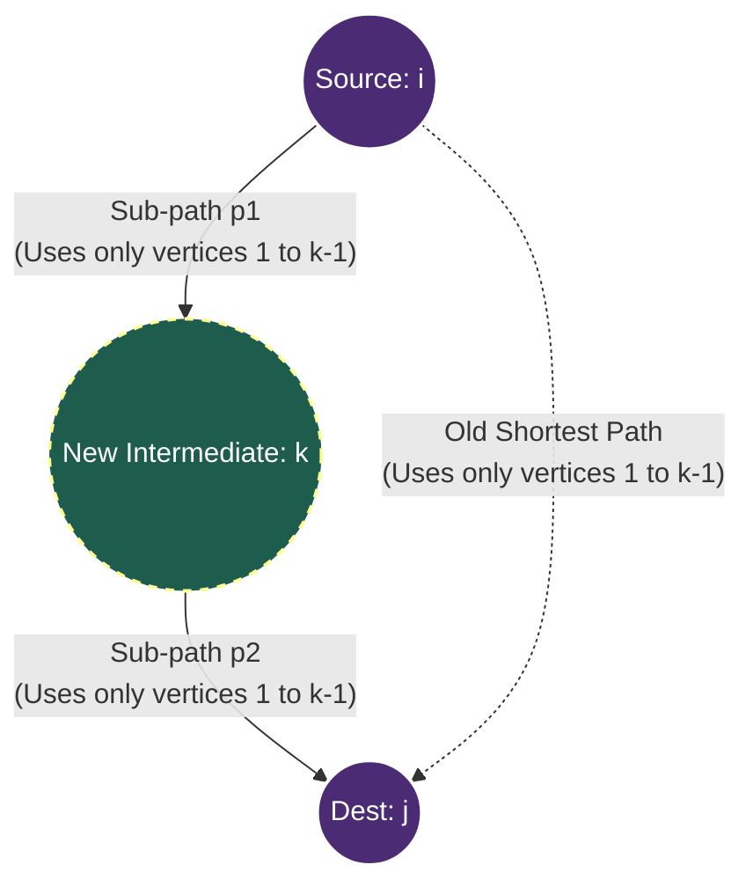

***

# Floyd-Warshall All-Pairs Shortest Path: Correctness Proof

> [!abstract] Overview
> The **Floyd-Warshall algorithm** is a classic Dynamic Programming algorithm used to find the shortest paths between *all pairs* of vertices in a weighted directed graph. Unlike Dijkstra's, it can handle negative edge weights, provided there are **no negative-weight cycles**.
> 
> This note breaks down the correctness proof of the algorithm, combining rigorous mathematical induction with an intuitive "stepping-stone" approach.

---

## 1. Setup and Definitions

Before proving the algorithm works, we need to establish the rules of our graph and what exactly we are trying to find.

> [!info] Graph Setup
> - Let $G = (V, E, w)$ be a weighted directed graph.
> - $w : E \rightarrow \mathbb{R}$ means edges can have arbitrary real-valued weights (positive or negative).
> - **Crucial Assumption:** $G$ contains *no negative-weight cycles*.
> - Let $n = |V|$ be the total number of vertices. We identify the vertices with the set $\{1, 2, \dots, n\}$.

### Defining the Shortest Path
For any path $p = \langle v_0, v_1, \dots, v_k \rangle$, its total weight $w(p)$ is simply the sum of the weights of all its edges. The true shortest-path distance from vertex $i$ to vertex $j$ is denoted as $\delta(i, j)$.

$$
\delta(i, j) = 
\begin{cases} 
\min\{w(p) : p \text{ is a path from } i \text{ to } j\} & \text{if a path exists,} \\
\infty & \text{otherwise.}
\end{cases}
$$

### The Concept of "Intermediate Vertices"
An **intermediate vertex** on a path is any vertex that is *neither* the starting vertex (source) *nor* the ending vertex (destination). It is just a vertex you pass through along the way.

> [!def] The Core Matrix Definition: $d^{(k)}[i][j]$
> For $k \in \{0, 1, \dots, n\}$, we define a value:
> $d^{(k)}[i][j] =$ the weight of the shortest path from $i$ to $j$ where **all intermediate vertices** are forced to belong to the set $\{1, 2, \dots, k\}$.

**The Key Observation:**
When $k = n$, the set of allowed intermediate vertices is $\{1, 2, \dots, n\}$, which is *all* the vertices in the graph. Therefore, there are no longer any restrictions! 
Because of this, $d^{(n)}[i][j] = \delta(i, j)$. If we can correctly compute up to $k=n$, we have solved the all-pairs shortest path problem.

---

## 2. The Intuitive Approach

Instead of getting bogged down in the notation immediately, let's look at the algorithm's logic intuitively. 

> [!idea] The "Stepping Stone" Analogy
> Imagine you are trying to find the cheapest flight from City $i$ to City $j$. 
> 
> You are building your flight network in stages. At stage $k$, you are newly allowed to use **City $k$** as a layover (a stepping stone). You already know the cheapest routes using Cities $1$ through $k-1$. 
> 
> Now that City $k$ is open for business, you have a simple choice to make for every pair of cities $(i, j)$:
> 
> 1. **Ignore City $k$:** The new layover doesn't help. The cheapest route remains the one you already found using only cities $1$ to $k-1$.
> 2. **Use City $k$:** You realize it's cheaper to fly from City $i$ to City $k$, and then from City $k$ to City $j$.

Because you are using the optimal routes for the sub-journeys ($i \rightarrow k$ and $k \rightarrow j$), combining them gives you the new optimal route. This is the essence of Dynamic Programming.

### Visualizing the Choice
Here is a visual representation of how a path breaks down when we decide to route through vertex $k$. Notice how the big path $p$ is split into two smaller sub-paths, $p_1$ and $p_2$.



If the solid lines ($p_1 + p_2$) add up to less distance than the dotted line (the old path), the algorithm updates the shortest distance matrix.

***
## 3. The Algorithm

The algorithm systematically builds up the shortest paths by slowly increasing the pool of allowed intermediate vertices. 

### Pseudocode
Here is the formal algorithm as provided in the text. Notice the simple, beautiful structure of three nested loops.

```text
Algorithm 1: Floyd-Warshall(G)
1: Initialize: for all i, j ∈ V:
           d[i][j] ←  0        if i = j
                      w(i, j)  if (i, j) ∈ E
                      ∞        otherwise
2: for k = 1 to n do                ▷ allow vertex k as a new intermediate
3:     for i = 1 to n do
4:         for j = 1 to n do
5:             if d[i][k] + d[k][j] < d[i][j] then
6:                 d[i][j] ← d[i][k] + d[k][j]    ▷ route through k is shorter
7:             end if
8:         end for
9:     end for
10: end for
11: return d
```

### C++ Implementation
While the pseudocode is our primary focus, here is how you would typically write the core loop in C++. The logic is identical.

```cpp
// Assuming d is a 2D vector initialized as per step 1 above.
// n is the number of vertices.

for (int k = 1; k <= n; k++) {
    for (int i = 1; i <= n; i++) {
        for (int j = 1; j <= n; j++) {
            // If the path through k is cheaper, update it!
            // (Note: In real C++, you must guard against integer overflow 
            // when adding two "infinity" values, but the logic remains the same).
            if (d[i][k] + d[k][j] < d[i][j]) {
                d[i][j] = d[i][k] + d[k][j];
            }
        }
    }
}
```

---

## 4. Formal Correctness Proof

Now we prove mathematically that the algorithm does what it claims to do. 

> [!tip] The Logical Proof (The Expanding Layovers)
> Let's prove this without heavy induction math. The algorithm works by gradually unlocking cities you can use as "layovers".
> 1. **The Setup:** Initially, you are allowed zero layovers. You can only take direct flights.
> 2. **The Decision:** When City $k$ is unlocked as a potential new layover, any optimal route between $i$ and $j$ faces a simple binary choice: either it uses City $k$, or it doesn't.
> 3. **The Trap (No negative cycles):** If the optimal route *does* use City $k$, it will fly from $i$ to $k$, and then from $k$ to $j$. Crucially, because there are no negative cycles to spin around in, the route will only visit City $k$ exactly once.
> 4. **The Guarantee:** Because it only visits $k$ once, the two halves of the trip ($i \to k$ and $k \to j$) can only use the *previously unlocked* cities (cities 1 through $k-1$). Since our matrix already holds the perfect, optimal answers for routes using cities 1 to $k-1$, adding those two optimal halves together mathematically guarantees the perfect answer for the newly expanded map.
> 
> **Conclusion:** By unlocking cities one by one, step $n$ unlocks the final city. Since every optimal route in the graph must just use some combination of the $n$ cities, checking this binary choice at every step mathematically guarantees we find the absolute shortest path for every pair.

> [!theorem] Theorem 1 (Formal Algebraic Proof)
> When the Floyd-Warshall algorithm terminates, the matrix $d$ contains the true shortest path distances. Mathematically: $d[i][j] = \delta(i, j)$ for every pair $i, j \in V$.

To prove this theorem, we rely on a **Loop Invariant**—a condition that is true before a loop starts, and remains true after every single iteration.

> [!theorem] Lemma 1 (The Loop Invariant)
> After the $k$-th iteration of the outer loop (where $k = 0, 1, \dots, n$), the value stored in the matrix for every pair $i, j$ is exactly the shortest path allowing only intermediates up to $k$. 
> $$d[i][j] = d^{(k)}[i][j]$$

### The Proof (By Strong Induction on $k$)

We will prove Lemma 1 using mathematical induction.

> [!example] Base Case ($k = 0$)
> **Scenario:** The loop hasn't started yet. No intermediate vertices are allowed.
> **Logic:** If you can't use intermediate vertices, a path is either:
> 1. A trivial path of length $0$ (staying at the same vertex: $i = j$).
> 2. A single direct edge between $i$ and $j$.
> 
> Looking at Step 1 of the pseudocode, the matrix is initialized to exactly these values ($0$ for diagonals, $w(i,j)$ for direct edges, and $\infty$ if no edge exists). 
> **Conclusion:** $d[i][j] = d^{(0)}[i][j]$ holds true.

**Inductive Hypothesis:** 
Assume the lemma holds true after the $(k-1)$-th iteration. This means $d[i][j]$ currently holds $d^{(k-1)}[i][j]$ for all pairs.

**Inductive Step:**
Now we run the $k$-th iteration. We must show that the matrix updates to hold $d^{(k)}[i][j]$. Let's look at the true shortest path from $i$ to $j$ that uses intermediates in the set $\{1, \dots, k\}$. 
There are exactly two possibilities:

> [!abstract] Case 1: The shortest path DOES NOT use $k$.
> If the best path doesn't even need the new vertex $k$, then all of its intermediate vertices still lie strictly in the old set $\{1, \dots, k-1\}$. 
> Therefore, its weight is exactly what we already found in the previous iteration: $d^{(k-1)}[i][j]$. The algorithm correctly does nothing to $d[i][j]$.

> [!abstract] Case 2: The shortest path DOES use $k$.
> Let $p = \langle i, \dots, k, \dots, j \rangle$ be this shortest path. 
> We can split path $p$ at vertex $k$ into two smaller sub-paths:
> - $p_1 = \langle i, \dots, k \rangle$
> - $p_2 = \langle k, \dots, j \rangle$
> 
> **The Critical Question:** Could vertex $k$ appear *more than once* inside $p_1$ or $p_2$?
> **The Answer:** NO. If $k$ appeared inside $p_1$, it would mean $p_1$ forms a closed loop (a cycle) starting at $k$, wandering around, and coming back to $k$. Because our graph has **no negative cycles**, this loop must have a weight $\ge 0$. If we remove this useless non-negative loop, the path becomes strictly shorter (or stays the same), which contradicts the fact that $p$ is the *absolute shortest* path. The same logic applies to $p_2$.
> 
> Since $k$ only appears exactly once as the bridge between $p_1$ and $p_2$, all the other intermediate vertices in $p_1$ and $p_2$ must belong to the old set $\{1, \dots, k-1\}$.
> 
> Therefore:
> - The weight of $p_1 = d^{(k-1)}[i][k]$
> - The weight of $p_2 = d^{(k-1)}[k][j]$
> 
> The total weight of this path is just the sum of the two sub-paths: $d[i][k] + d[k][j]$.

### Wrapping up the Lemma
In the $k$-th iteration, the algorithm calculates the minimum of Case 1 and Case 2:
$$d^{(k)}[i][j] = \min \Big( d[i][j], \;\; d[i][k] + d[k][j] \Big)$$

This matches Line 5 and 6 of our pseudocode perfectly. The invariant is maintained.

> [!success] Proof of Theorem 1
> Because Lemma 1 holds for every step, we can fast-forward to the very end of the algorithm, where $k = n$.
> After all $n$ iterations, $d[i][j] = d^{(n)}[i][j]$. 
> Since $d^{(n)}[i][j]$ represents the shortest path allowing *all* $n$ vertices as intermediates, it is the absolute shortest path possible. 
> Therefore, $d[i][j] = \delta(i, j)$. The proof is complete! ■

***

## 5. Negative-Cycle Detection

Throughout the proof, we relied heavily on the assumption that the graph has no negative cycles. But what if we don't know whether the graph has a negative cycle before we run the algorithm?

Floyd-Warshall can actually be used to *detect* them!

> [!theorem] Corollary 1 (Negative-Cycle Detection)
> After the algorithm terminates, the graph $G$ contains a negative cycle **if and only if** the main diagonal of the distance matrix contains a negative number (i.e., $d[v][v] < 0$ for some vertex $v \in V$).

### The Proof

We must prove this in both directions:

**1. If a negative cycle exists $\Rightarrow$ The diagonal will be negative**
Suppose $G$ contains a negative-weight cycle $C = \langle v, v_1, \dots, v_m, v \rangle$. 
The weight of this cycle is $w(C) < 0$. 
Because a cycle starting and ending at $v$ is technically a "closed walk" from $v$ back to $v$, the algorithm will eventually consider it when checking paths. Therefore, the shortest distance from $v$ to $v$ will be updated to be at least as low as $w(C)$. 
Thus, $d[v][v] \le w(C) < 0$.

**2. If the diagonal is negative $\Rightarrow$ A negative cycle exists**
Suppose $d[v][v] < 0$ for some vertex $v$.
This means the algorithm found a path that starts at $v$, wanders through the graph, and comes back to $v$ with a total cost of less than zero. A path from $v$ to $v$ is a cycle (or a walk containing cycles). If the total weight is negative, at least one of the cycles along that walk *must* have a negative weight. (If all cycles were non-negative, you could just remove them and get the base path cost of $0$, which is the distance of staying at $v$ without moving).

> [!warning] Why Negative Cycles Break the Algorithm
> Look back at **Case 2** of the inductive proof. We claimed that the sub-paths $p_1$ and $p_2$ would not repeat vertex $k$. If a negative cycle exists, this logic shatters. A path could hit vertex $k$, jump into the negative cycle, spin around it infinitely to drive the cost down to $-\infty$, and then continue to the destination. The algorithm's finite matrix cannot represent $-\infty$, so the values output for those paths are mathematically invalid.

---

## 6. Complexity Analysis

Floyd-Warshall is famous for its elegance, which translates directly into very simple complexity analysis.

> [!info] Time Complexity: $O(n^3)$
> The algorithm consists of exactly three nested `for` loops (for $k$, for $i$, for $j$).
> Each loop runs exactly $n$ times (where $n = |V|$).
> Inside the innermost loop, the algorithm performs a simple addition and comparison, which is an $O(1)$ constant time operation.
> 
> $$T(n) = n \times n \times n \times O(1) = O(n^3)$$

> [!info] Space Complexity: $O(n^2)$
> The algorithm requires an $n \times n$ 2D array/matrix to store the distances between every pair of vertices.
> *(Note: If you also want to reconstruct the actual paths later, you need a second $n \times n$ "predecessor" matrix. This adds another $O(n^2)$ space, but $O(n^2) + O(n^2)$ still simplifies to $O(n^2)$ overall space complexity).*

---

## 7. Comparison with Other Algorithms

Why use Floyd-Warshall over other shortest-path algorithms? It depends entirely on your graph's density and edge weights.

| Algorithm | Graph Type | Time Complexity | Scope |
| :--- | :--- | :--- | :--- |
| **Dijkstra** *(with binary heap)* | Non-negative weights only | $O((|V| + |E|) \log |V|)$ | Single Source |
| **Bellman-Ford** | Any weights (detects negative cycles) | $O(|V| \cdot |E|)$ | Single Source |
| **Floyd-Warshall** | Any weights (detects negative cycles) | $O(|V|^3)$ | **All Pairs** |

### The "Dense vs. Sparse" Dilemma
You might wonder: *Could I just run Bellman-Ford from every single vertex to get All-Pairs shortest paths?*
- Yes! If you run Bellman-Ford $V$ times, the time complexity becomes $O(|V| \cdot (|V| \cdot |E|)) = O(|V|^2 \cdot |E|)$.
- **On a sparse graph** (where edges are few, $|E| \approx |V|$), running Bellman-Ford $V$ times takes $O(|V|^3)$, which ties Floyd-Warshall.
- **On a dense graph** (where most vertices are connected to each other, $|E| \approx |V|^2$), running Bellman-Ford $V$ times takes $O(|V|^4)$. Here, Floyd-Warshall completely dominates with its guaranteed $O(|V|^3)$ time. 

> [!tip] Rule of Thumb
> Use **Floyd-Warshall** when dealing with **dense graphs** where you need the distance between *every* possible pair of nodes, especially if negative edge weights are present!

***
