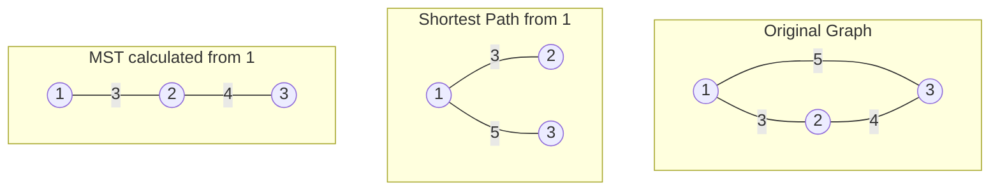

# Graph-4: Minimum Spanning Tree (MST)

## 🌳 What is a Spanning Tree?
A spanning tree of an undirected, connected graph is:
- A subgraph that connects **ALL** vertices together.
- Contains **no cycles**.
- Has exactly $V - 1$ edges (where $V$ is the number of vertices).

> [!example] Basic Graph vs Spanning Tree
> ```mermaid
> graph TD
>     %% Original Graph
>     subgraph Original Graph G
>         A1((A)) --- C1((C))
>         A1 --- B1((B))
>         C1 --- B1
>     end
>     
>     %% Spanning Tree
>     subgraph Spanning Tree Example
>         A2((A)) --- C2((C))
>         A2 --- B2((B))
>     end
> ```
> *Notice how the edge between C and B is removed to prevent a cycle, leaving exactly $V-1 = 2$ edges.*

---

## 📉 What is a Minimum Spanning Tree (MST)?
An MST is a spanning tree where the **total edge weight is minimized**.
- Used to connect everything at the lowest possible cost (e.g., laying network cables, road networks).
- Formal definition: *"A minimum spanning tree for a weighted, connected, undirected graph is a spanning tree with a weight less than or equal to the weight of every other spanning tree."*
- **Weight of MST** = Sum of all edges included in the tree.

### 🆚 MST vs Shortest Path (Dijkstra's)
While Dijkstra's algorithm finds the shortest path from a *single source* to all other nodes, an MST minimizes the *overall* connection cost of the entire graph.

> [!important] The Core Difference
> - **Dijkstra (Shortest Path):** Chooses an edge $(u,v)$ if: 
>   `cost[u] + weight(u,v) < cost[v]`
> - **Prim's (MST):** Chooses an edge $(u,v)$ if:
>   `weight(u,v) < cost[v]`

**Visual Example of the Difference:**

*In the Shortest Path, reaching node 3 directly from 1 costs 5 (vs 3+4=7 via node 2). But in the MST, we want the cheapest overall network, so we use edges 3 and 4 (Total Cost = 7) instead of 3 and 5 (Total Cost = 8).*

---

## 🥇 Prim’s Algorithm

Prim's algorithm builds the MST step-by-step by always picking the cheapest edge that connects an *unvisited* vertex to the growing MST.

### Algorithm Steps:
1. Start with any vertex, mark it as visited.
2. Look at all edges originating from the visited vertices.
3. Pick the **minimum weight edge** that leads to an **unvisited vertex**.
4. Add that vertex to the MST.
5. Repeat steps 2–4 until all vertices are visited.

### 💻 Pseudocode
Here is the pseudocode combining the generic logic and the Priority Queue (PQ) implementation from the lecture.

```text
Prims(G, source):
    // 1. Initialization
    for each vertex v in G:
        cost[v] ← ∞
        vis[v] ← 0
    
    cost[source] ← 0
    // PQ stores pairs of {weight, vertex}
    PQ.push({0, source})  
    res ← 0  // to store total MST weight

    // 2. Process nodes
    while PQ is not empty:
        node ← PQ.pop()
        wt ← node.first
        u ← node.second
        
        // Ignore if already included in MST
        if vis[u] == 1: 
            continue
            
        vis[u] ← 1
        res += wt
        
        // 3. Explore neighbors
        for each neighbor v of u:
            if vis[v] == 1: 
                continue
            // If edge weight is less than current known cost to reach v
            if G[u][v] < cost[v]: 
                cost[v] = G[u][v]
                PQ.push({G[u][v], v})
                
    return res
```

---

## ⏱️ Complexity Analysis: Prim's Algorithm

> [!abstract] Final Complexity
> - **Time Complexity:** $\mathcal{O}((V+E) \log V)$
> - **Space Complexity:** $\mathcal{O}(V+E)$

### 1. Time Complexity Derivation: Step-by-Step
Let $V$ be the number of vertices and $E$ be the number of edges.

1. **Initialization:** Setting up the `cost` and `vis` arrays takes $\mathcal{O}(V)$ time.
2. **Priority Queue (PQ) Operations:** 
    - The `while` loop pops elements from the PQ. In the worst case, every edge might be pushed into the PQ. So, the PQ can hold up to $E$ elements.
    - Extracting the minimum element (`PQ.pop()`) takes $\mathcal{O}(\log E)$ time.
    - Since $E \le V^2$ for any simple graph, $\log(E) \le \log(V^2) = 2 \log V$. Therefore, $\mathcal{O}(\log E)$ is asymptotically equivalent to $\mathcal{O}(\log V)$.
    - The outer `while` loop runs at most $E$ times, so `pop()` operations take $\mathcal{O}(E \log V)$ total.
3. **Neighbor Traversal (Inner Loop):**
    - Over the entire algorithm, the `for` loop iterates through all adjacent edges for every popped vertex. The total number of iterations across all vertices is bounded by $2E$ (since each edge connects two vertices).
    - Pushing a new neighbor into the PQ takes $\mathcal{O}(\log V)$ time.
    - Total time for pushing into PQ is $\mathcal{O}(E \log V)$.

**Total Time Complexity:**
$$ \text{Total Time} = \mathcal{O}(V) + \mathcal{O}(E \log V) + \mathcal{O}(E \log V) = \mathcal{O}((V+E) \log V) $$
*(Note: If the graph is fully connected, $E \ge V$, this simplifies to $\mathcal{O}(E \log V)$).*

### 2. Space Complexity Derivation: Step-by-Step
1. **Graph Representation:** Storing the graph using an adjacency list takes $\mathcal{O}(V + E)$ space.
2. **Arrays:** The `cost` array and `vis` array each take $\mathcal{O}(V)$ space.
3. **Priority Queue:** In the worst case (dense graph), the priority queue might store all edges before they get popped, taking $\mathcal{O}(E)$ space.

**Total Space Complexity:**
$$ \text{Total Space} = \mathcal{O}(V + E) + \mathcal{O}(V) + \mathcal{O}(E) = \mathcal{O}(V + E) $$

---
**Next Note:** [[8. Disjoint Set Union and Kruskal's Algorithm]]