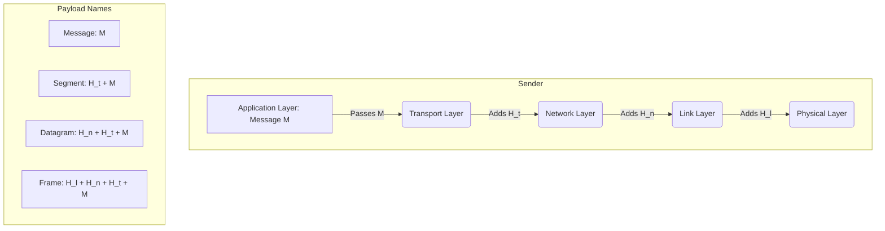

***

# Chapter 1: Computer Networks and the Internet

> [!abstract] Overview
> This chapter provides a "feel" and "big picture" of computer networking and the Internet. It covers the terminology, the edge and core of the network, performance metrics (delay, loss, throughput), layered architecture (OSI and TCP/IP), network security, and a brief history of the Internet.

---

## 1. What is the Internet?
The Internet is a computer network that interconnects billions of computing devices throughout the world. It can be viewed from two different perspectives: a **"nuts and bolts"** (hardware/software) view, and a **"services"** view.

### A "Nuts and Bolts" View
*   **Computing Devices (Hosts / End Systems):** Devices connected to the network (e.g., PCs, smartphones, servers, IoT devices like web-enabled toasters or security cameras). They run network applications at the Internet's "edge".
*   **Communication Links:** The physical pathways that carry data. Made of fiber, copper, radio, or satellite. 
    *   *Bandwidth:* The transmission rate of the link.
*   **Packet Switches:** Devices that forward packets (chunks of data) through the network. The two main types are **routers** (typically used in the network core) and **link-layer switches** (typically used in access networks).
*   **Networks:** A collection of devices, routers, and links managed by an organization.
*   **Internet:** A "network of networks". It is made up of interconnected Internet Service Providers (ISPs).
*   **Internet Standards:** Maintained by the **IETF** (Internet Engineering Task Force) in **RFCs** (Request for Comments).

### A "Services" View
*   **Infrastructure:** The Internet provides the infrastructure that allows distributed applications (Web, streaming, email, games, e-commerce) to function.
*   **Programming Interface (API):** It provides a "socket interface" (hooks) to distributed applications. This allows sending/receiving programs to "connect" to the Internet and use its transport services, much like the postal service provides a specific set of rules to send a letter.

> [!info] What is a Protocol?
> All communication activity in the Internet is governed by protocols. 
> **Definition:** A protocol defines the **format** and **order** of messages sent and received among network entities, and the **actions taken** on message transmission or receipt.
> *   *Human Protocol Analogy:* Saying "Hi" -> Wait for "Hi" -> Asking "What's the time?" -> Getting the time.
> *   *Network Protocol:* Sending a TCP connection request -> Receiving a TCP connection response -> Sending an HTTP GET request -> Receiving a file.

---

## 2. The Network Edge
The network edge consists of the hosts (clients and servers) that sit at the edge of the Internet. Servers are increasingly housed in massive **data centers**.

### Access Networks and Physical Media
How do we connect end systems to the edge router?

#### 1. Residential Access Networks
*   **Cable-based Access (HFC - Hybrid Fiber Coax):** 
    *   Uses the cable television infrastructure.
    *   **FDM (Frequency Division Multiplexing):** Different channels are transmitted in different frequency bands (Data, TV, Control).
    *   *Asymmetric:* Downstream rate (up to 40 Mbps - 1.2 Gbps) is higher than upstream rate (30-100 Mbps).
    *   **Shared medium:** Homes share the access network to the cable headend (CMTS - Cable Modem Termination System).
*   **Digital Subscriber Line (DSL):**
    *   Uses the *existing* local telephone line to a central office DSLAM (DSL Access Multiplexer).
    *   Voice and data are transmitted at different frequencies over a **dedicated** line to the central office.
    *   *Asymmetric:* 24-52 Mbps downstream, 3.5-16 Mbps upstream.
*   **Home Networks:** Typically a combination of a broadband modem (cable/DSL), a router/firewall, and a WiFi wireless access point.

#### 2. Enterprise Access Networks (Institutional)
*   Used in companies, universities, etc.
*   A mix of wired and wireless link technologies connecting switches and routers.
*   **Ethernet:** Wired access at 100 Mbps, 1 Gbps, or 10 Gbps.
*   **WiFi:** Wireless access points (802.11 b/g/n) providing 11, 54, or 450 Mbps.
*   **Data Center Networks:** High-bandwidth links connecting massive server clusters.

#### 3. Wireless Access Networks
Connects end systems to a router via a base station (access point).
*   **Wireless LANs (WLANs):** Typically within a building (~100 ft). e.g., WiFi.
*   **Wide-Area Cellular:** Provided by a mobile cellular network operator (10s of km). e.g., 4G/5G cellular networks.

### Physical Media
A **bit** propagates between a transmitter and a receiver via a physical link.
*   **Guided Media:** Signals propagate in solid media (copper, fiber, coax).
    *   *Twisted Pair (TP):* Two insulated copper wires. Category 5 (100 Mbps - 1 Gbps), Category 6 (10 Gbps).
    *   *Coaxial Cable:* Two concentric copper conductors, bidirectional, broadband (multiple frequency channels).
    *   *Fiber Optic Cable:* Glass fiber carrying light pulses. High-speed (10s-100s Gbps), low error rate, immune to electromagnetic noise.
*   **Unguided Media:** Signals propagate freely (e.g., radio).
    *   *Radio:* Carried in electromagnetic spectrum. Broadcast/half-duplex. Subject to reflection, obstruction, and interference. (e.g., WiFi, Cellular, Bluetooth, Satellite).

---

## 3. The Network Core
The network core is the mesh of interconnected routers. Data is transferred through the core using two fundamental approaches: **Packet Switching** and **Circuit Switching**.

### Two Key Network-Core Functions
1.  **Routing (Global Action):** Determines the source-destination path taken by packets using routing algorithms.
2.  **Forwarding (Local Action):** Also known as "switching". Moving arriving packets from a router's input link to the appropriate output link based on a local forwarding table.

### Packet Switching vs. Circuit Switching
*   **Packet Switching:** Hosts break application-layer messages into smaller chunks known as **packets** (of length $L$ bits). The network forwards these packets from one router to the next at a transmission rate $R$.
    *   *Store-and-Forward:* The *entire* packet must arrive at the router before it can be transmitted onto the next link.
    *   *Queueing and Loss:* If the arrival rate of packets to a link exceeds the transmission rate for a period of time, packets will **queue** (wait) in router buffers. If the buffer memory fills up, arriving packets are **dropped (lost)**.
    *   *Pros/Cons:* Better resource sharing and handles bursty data well. However, it can suffer from variable delays (queueing), congestion, and packet loss. Requires protocols for reliable data transfer and congestion control.
*   **Circuit Switching:** End-to-end resources (buffers, transmission rate) are allocated and **reserved** for a "call" between source and destination.
    *   *No sharing:* Dedicated resources. Provides circuit-like (guaranteed) performance.
    *   *Multiplexing:* **FDM** (Frequency bands) and **TDM** (Time slots).
    *   *Pros/Cons:* Guaranteed performance/bandwidth and constant transmission rate. However, resources can sit idle (wasted capacity) and requires setup time.

> [!example] Packet Switching Math (Homework Problem)
> **Scenario:** 1 Gbps link. Users require 100 Mbps when active, but are only active 10% of the time ($p = 0.1$).
> *   **Circuit Switching:** Can support exactly $1 \text{ Gbps} / 100 \text{ Mbps} = 10 \text{ users}$.
> *   **Packet Switching:** Suppose there are $N = 35$ users. What is the probability that >10 users are active simultaneously?
> 
> We use the Binomial Distribution: $$P(X = k) = \binom{n}{k} p^k (1-p)^{n-k}$$
> Where $n=35$, $k=1$ (for 1 user active).
> To find the probability of >10 users being active:
> $$P(X > 10) = 1 - P(X \le 10)$$
> $$P(X \le 10) = P(0) + P(1) + \dots + P(10) = 0.9995$$
> $$P(X > 10) = 1 - 0.9995 = 0.0004$$
> *Conclusion:* Packet switching supports 35 users with a mere $0.04\%$ chance of congestion, vastly outperforming circuit switching's hard limit of 10 users.

### Internet Structure: "Network of Networks"
Given millions of access ISPs, how do we connect them together? Connecting each ISP directly creates $O(N^2)$ connections (doesn't scale).

*   **Tier-1 Commercial ISPs:** Small number of well-connected large networks (e.g., AT&T, Sprint, Level 3). They have national and international coverage.
*   **Regional ISPs:** Connect access nets to Tier-1 ISPs.
*   **Internet Exchange Points (IXP):** Meeting points where multiple ISPs can peer together directly to save costs.
*   **Content Provider Networks:** Private networks (e.g., Google, Microsoft, Netflix) that connect their data centers directly to the Internet, often bypassing Tier-1/regional ISPs to bring content closer to end users.

---

## 4. Performance: Delay, Loss, and Throughput

### Four Sources of Packet Delay
The total nodal delay ($d_{nodal}$) is the sum of four components:
$$d_{nodal} = d_{proc} + d_{queue} + d_{trans} + d_{prop}$$

*   **Constant vs Variable Delays:** Transmission ($d_{trans}$) and Propagation ($d_{prop}$) delays are largely constant for a given link. Queueing ($d_{queue}$) is variable depending on network congestion.

1.  **Nodal Processing ($d_{proc}$):** Check bit errors, determine output link. (Usually < microseconds).
2.  **Queueing Delay ($d_{queue}$):** Time waiting at output link for transmission. Depends on router congestion level.
3.  **Transmission Delay ($d_{trans}$):** Time required to push the packet's bits onto the link.
    *   $L = \text{packet length (bits)}$, $R = \text{link transmission rate (bps)}$
    *   $$d_{trans} = \frac{L}{R}$$
4.  **Propagation Delay ($d_{prop}$):** Time for a signal to physically travel through the medium to the next router.
    *   $d = \text{length of physical link}$, $s = \text{propagation speed in medium } (\sim2 \times 10^8 \text{ m/sec})$
    *   $$d_{prop} = \frac{d}{s}$$

> [!warning] $d_{trans}$ vs $d_{prop}$ (The Caravan Analogy)
> *   **Analogy:** Cars = bits; Caravan (10 cars) = packet; Toll booth = router; Highway = link. 
> *   Toll booth service time (12 sec/car) = transmission rate ($d_{trans}$). 
> *   Car speed (100 km/hr) = propagation speed ($d_{prop}$).
> *   *Scenario 1:* 100km/hr cars, 12sec/car service. Time to push caravan through = $12 \times 10 = 120$ sec (2 min). Time to travel to next booth = $100km / 100km/hr = 1$ hr. Total time = 62 minutes.
> *   *Scenario 2:* Cars propagate at 1000 km/hr, but toll booth takes 1 min/car. Will cars arrive at the 2nd booth before all cars are serviced at the 1st? **Yes!** After 7 minutes, the first car arrives at the 2nd booth, while 3 cars are still stuck at the 1st booth. (Bits of a packet can arrive at a router before the whole packet is transmitted).

### Queueing Delay and Traffic Intensity
Let $a =$ average packet arrival rate, $L =$ packet length, and $R =$ link bandwidth.
*   **Traffic Intensity = $La / R$**
    *   If $La/R \sim 0$: Average queueing delay is small.
    *   If $La/R \rightarrow 1$: Average queueing delay becomes very large.
    *   If $La/R > 1$: More work arriving than can be serviced. Average delay approaches infinity (packet loss occurs).

### Traceroute and "Real" Internet Delays
*   **Traceroute:** A program that provides delay measurements from a source to routers along the end-to-end path. It sends packets with increasing Time-to-Live (TTL) values. Routers return packets to the sender, allowing the sender to measure round-trip time.

### Throughput and Bandwidth-Delay Product
*   **Throughput:** The rate (bits/time unit) at which bits are transferred from sender to receiver (instantaneous or average).
*   **Bottleneck Link:** The link on the end-to-end path that constrains the end-to-end throughput. In a simple path with a server link ($R_s$) and a client link ($R_c$), throughput is $\min(R_s, R_c)$. 
*   *In a shared network:* Throughput is $\min(R_c, R_s, R_{shared}/N)$ where $N$ is the number of connections sharing the backbone link.
*   **Bandwidth-Delay Product (BDP):** Calculated as $R \times d_{prop}$. It represents the "number of bits that fit on the link" at any given time.

---

## 5. Protocol Layers and Service Models

Networks are complex systems with many pieces. To organize the network architecture, designers use **Layering**.

### Why Layering?
*   **Explicit structure:** Allows identification and relationship of complex system pieces.
*   **Modularity:** Eases maintenance and updating. Changing a layer's service *implementation* is transparent to the rest of the system, as long as it provides the same service to the layer above it.
*   *Drawbacks:* Potential duplication of lower-layer functionality (e.g., error recovery at multiple levels), and violating separation of layers if one layer needs data from another.

### The Internet Protocol Stack (5 Layers)

| Layer | Name | Function | PDU (Packet Name) | Examples |
| :--- | :--- | :--- | :--- | :--- |
| **5** | **Application** | Supporting network applications. | Message | HTTP, SMTP, DNS |
| **4** | **Transport** | Process-to-process data transfer. | Segment | TCP, UDP |
| **3** | **Network** | Routing of datagrams from source to destination. | Datagram | IP, Routing Protocols |
| **2** | **Link** | Data transfer between neighboring network elements. | Frame | Ethernet, WiFi, PPP |
| **1** | **Physical** | Moving individual "bits" on the wire. | Bit | Copper, Fiber, Radio |

*(Note: The **ISO/OSI Reference Model** includes 7 layers, adding **Presentation** (L6 - encryption, compression) and **Session** (L5 - synchronization, checkpointing) between Application and Transport. In the Internet stack, these are either handled by the Application layer or omitted if not needed).*

### Encapsulation
As data moves down the stack at the sender, each layer adds its own **header** to the payload received from the layer above.

*   A router processes up to the **Network** layer.
*   A link-layer switch processes up to the **Link** layer.
*   End systems (hosts) process all 5 layers.

---

## 6. Network Security
The Internet was originally designed based on a model of "mutually trusting users attached to a transparent network"—meaning security was not initially built-in. Today, we must retroactively defend against malicious actors.

### Common Threats
1.  **Malware:** Malicious software that can enter a host to delete files or install spyware.
    *   *Self-replicating:* Seeks entry into other hosts exponentially.
    *   *Botnets:* Networks of compromised devices controlled by bad guys, used for spam or DDoS attacks.
2.  **Denial of Service (DoS):** Attackers make resources (server, bandwidth) unavailable to legitimate traffic by overwhelming it with bogus traffic.
    *   *Distributed DoS (DDoS):* Attack emanates from multiple, distributed compromised sources (botnet) simultaneously, making it hard to block a single upstream router.
    *   *Bandwidth Flooding:* Overwhelming the target's access link with traffic.
    *   *Connection Flooding:* Establishing many bogus TCP connections to consume the target's host resources.
3.  **Packet Interception (Sniffing):** Promiscuous network interfaces (especially on shared broadcast media like WiFi or Ethernet) read/record all packets passing by, including passwords. (e.g., Wireshark).
4.  **Fake Identity (IP Spoofing):** Injecting packets into the network with a false/forged source IP address to masquerade as a trusted user.
5.  **Man-in-the-Middle (MitM):** Intercepting and potentially altering communications between two parties who believe they are directly communicating.

### Lines of Defense
*   **Authentication:** Proving you are who you say you are.
*   **Confidentiality:** Via encryption.
*   **Integrity Checks:** Digital signatures to prevent/detect tampering.
*   **Access Restrictions:** Password-protected VPNs.
*   **Firewalls:** Specialized "middleboxes" in access and core networks that filter incoming packets to restrict senders/receivers and detect/react to DoS attacks.

---
 

# Exam Quick Reference

## Definitions Table
| Term | Definition |
| :--- | :--- |
| **Bandwidth** | The transmission rate of a communication link (bits per second). |
| **Bandwidth-Delay Product (BDP)** | Represents the "number of bits that fit on the link" ($R \times d_{prop}$). |
| **Bottleneck Link** | The link on a path that constrains the end-to-end throughput. |
| **Circuit Switching** | Dedicated end-to-end network resources reserved for the duration of a connection. |
| **Encapsulation** | The process of adding layer-specific headers to a payload as it moves down the protocol stack. |
| **FDM** | Frequency Division Multiplexing; dividing the spectrum of a link into different frequency bands. |
| **Forwarding** | A local router action moving a packet from an input link to the appropriate output link. |
| **Guided Media** | Physical media where signals propagate in solid materials (e.g., twisted pair, fiber optics). |
| **Hosts / End Systems** | Devices sitting at the "edge" of the Internet running network applications. |
| **ISP** | Internet Service Provider; provides network access to end systems and other networks. |
| **IXP** | Internet Exchange Point; physical infrastructure where ISPs peer to exchange traffic. |
| **Packet Switching** | Breaking data into chunks (packets) and forwarding them based on destination addresses; shares network resources. |
| **Protocol** | Defines the format, order, and actions of messages exchanged between network entities. |
| **Routing** | A global network action determining the path a packet takes from source to destination. |
| **TDM** | Time Division Multiplexing; dividing link time into slots and assigning slots to connections. |
| **Throughput** | The rate at which bits are successfully transferred from sender to receiver. |
| **Traceroute** | A program that provides delay measurements from a source to routers along the end-to-end path. |
| **Unguided Media** | Media where signals propagate freely (e.g., radio waves, Wi-Fi). |

 

## Formulas & Things to Remember
| Category | Formula / Concept | Details |
| :--- | :--- | :--- |
| **Nodal Delay** | $d_{nodal} = d_{proc} + d_{queue} + d_{trans} + d_{prop}$ | Total time a packet spends at a single router node. |
| **Transmission Delay** | $d_{trans} = \frac{L}{R}$ | $L$ = Packet length (bits), $R$ = Transmission rate/Bandwidth (bps). Time to push the packet onto the wire. |
| **Propagation Delay** | $d_{prop} = \frac{d}{s}$ | $d$ = physical distance, $s$ = propagation speed ($\sim 2 \times 10^8$ m/s). Time for a bit to travel through the medium. |
| **Bandwidth-Delay Product** | $BDP = R \times d_{prop}$ | Represents the "number of bits that fit on the link". |
| **Traffic Intensity** | $I = \frac{L \cdot a}{R}$ | $a$ = average arrival rate. If $I \to 1$, $d_{queue}$ gets huge. If $I > 1$, packets drop. |
| **TCP/IP Layers** | **A**pplication, **T**ransport, **N**etwork, **L**ink, **P**hysical | Mnemonic: **A**ll **T**hose **N**etwork **L**inks **P**hysically connect. |
| **OSI Layers** | Application, Presentation, Session, Transport, Network, Link, Physical | Mnemonic: **A**ll **P**eople **S**eem **T**o **N**eed **D**ata **P**rocessing (Data Link = Link). |
| **Data Units by Layer** | Application $\rightarrow$ **Message** Transport $\rightarrow$ **Segment** Network $\rightarrow$ **Datagram** Link $\rightarrow$ **Frame** Physical $\rightarrow$ **Bits** | Crucial terminology for what data is called at each protocol layer. |