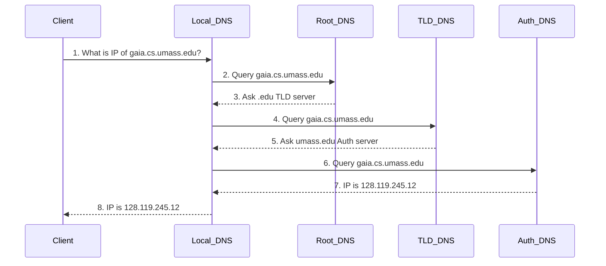

***

# 🌐 Chapter 2: Application Layer
**Tags:** #computer-networking #application-layer #http #dns #smtp #p2p #socket-programming #exam-prep

## 1. Principles of Network Applications
Network applications are the core reason computer networks exist. They run on **end systems** (hosts) and communicate over the network core. You do not write application software for network-core devices (like routers or switches) because they operate at lower layers (Network layer and below).

### 1.1 Application Architectures
> [!info] Client-Server vs. Peer-to-Peer (P2P)
> - **Client-Server:** An always-on host (server) with a permanent IP address services requests from many intermittently connected hosts (clients). *Examples: Web (HTTP), Email (SMTP).* Requires data centers for scaling.
> - **Peer-to-Peer (P2P):** Minimal or no reliance on dedicated servers. Arbitrary end systems (peers) directly communicate. Highly scalable but complex to manage due to IP changes and intermittent connections. *Examples: BitTorrent.*

### 1.2 Processes and Sockets
- **Process:** A program running within a host. 
- **Socket:** The "door" between the application process and the end-to-end transport protocol (controlled by the OS).
- **Addressing:** To send a message, a process needs an **IP Address** (identifies the host) and a **Port Number** (identifies the specific process/socket on that host).
	- *Web server (HTTP):* Port 80
	- *Mail server (SMTP):* Port 25

### 1.3 Transport Services (TCP vs. UDP)
> [!note] Transport Protocol Characteristics
> **TCP Service:**
> - Reliable data transfer (no loss).
> - Connection-oriented (handshake required).
> - Flow control & Congestion control.
> - *Does NOT provide:* Timing or minimum throughput guarantees.
> 
> **UDP Service:**
> - Unreliable data transfer (loss tolerant).
> - Connectionless (no handshake).
> - Fast, no congestion control throttling.
> - *Used for:* Streaming, DNS, fast real-time games.

---

## 2. The Web and HTTP
The **HyperText Transfer Protocol (HTTP)** is the Web's application-layer protocol. It uses a client/server model and runs over **TCP**.

> [!warning] HTTP is Stateless
> The server maintains no information about past client requests. If you ask for the same file twice, it sends it twice without remembering you.

### 2.1 HTTP Connections
1. **Non-persistent HTTP (HTTP/1.0):** 
   - A new TCP connection is opened for *each* requested object.
   - **Response Time:** $2 \times RTT + \text{file transmission time}$ (One RTT to establish TCP, one RTT for HTTP request/response).
2. **Persistent HTTP (HTTP/1.1):**
   - Server leaves TCP connection open after sending a response.
   - Multiple objects can be sent over a single TCP connection (pipelining).

### 2.2 HTTP Message Format
HTTP messages are written in ASCII. The lines are separated by a Carriage Return and Line Feed (`\r\n`). The header section ends with a blank line (`\r\n\r\n`).

**Request Methods:** `GET`, `POST` (submits data in body), `HEAD` (requests headers only), `PUT` (uploads file), `DELETE`.
**Status Codes:** 
- `200 OK`: Success
- `301 Moved Permanently`: Object moved, new location provided
- `400 Bad Request`: Syntax error
- `404 Not Found`: Object doesn't exist

### 2.3 Cookies (Maintaining State)
Since HTTP is stateless, **Cookies** are used to maintain sessions (e.g., shopping carts, targeted ads).
**4 Components of Cookies:**
1. `Set-cookie:` header line in the HTTP *response*.
2. `Cookie:` header line in the HTTP *request*.
3. A cookie file kept on the user's end system.
4. A back-end database at the Web site.

> [!example] 3rd Party Cookies (Targeted Ads)
> Websites include ads from a 3rd party (e.g., `AdX.com`). Even if you visit `nytimes.com`, your browser makes an HTTP GET to `AdX.com` for the ad. AdX drops a cookie on your machine. Later, you visit `socks.com` (which also uses AdX). Your browser sends the AdX cookie. AdX now knows your browsing history across multiple sites and serves targeted ads.

### 2.4 Web Caching (Proxy Servers)
Web caches satisfy client requests without involving the origin server, reducing response time and saving access link bandwidth.
- **Conditional GET:** Cache sends `If-modified-since: <date>` to the server. If the file hasn't changed, the server replies with `304 Not Modified` and an empty body, saving bandwidth.

### 2.5 HTTP/2 and HTTP/3
- **HTTP/2 Objective:** Decrease delay in multi-object requests.
- **HOL (Head-of-Line) Blocking in HTTP/1.1:** A large object blocks smaller objects from being transmitted over the same TCP connection.
- **HTTP/2 Solution:** Breaks messages into **frames** and interleaves them over a single TCP connection.
- **HTTP/3:** Runs over **QUIC (UDP-based)** to provide faster connection setup and eliminate TCP-level HOL blocking caused by packet loss.

---

## 3. Electronic Mail (SMTP & IMAP)
### 3.1 Components
1. **User Agent:** Mail reader (Outlook, Apple Mail).
2. **Mail Server:** Holds the message queue and user mailboxes.
3. **SMTP (Simple Mail Transfer Protocol):** Port 25, uses TCP.

### 3.2 SMTP vs HTTP
| SMTP | HTTP |
| :--- | :--- |
| **Push** protocol (Sender pushes to receiver) | **Pull** protocol (Client pulls from server) |
| Requires messages to be **7-bit ASCII** | Can handle binary data directly |
| Places all objects in one multipart message | Sends each object in its own response message |

### 3.3 Mail Access Protocols
SMTP is only used to *send* mail. To *retrieve* mail from a server, clients use:
- **IMAP:** Keeps messages on the server, allows folder management.
- **HTTP:** Used by web-based clients (Gmail, Yahoo).

---

## 4. DNS: The Internet's Directory Service
**DNS (Domain Name System)** translates human-readable hostnames (e.g., `www.google.com`) into IP addresses (e.g., `142.250.190.46`). Runs on **UDP Port 53**.

### 4.1 Why not centralize DNS?
Single point of failure, massive traffic volume, geographic distance delays, and maintenance nightmare. Therefore, it is **distributed and hierarchical**.

### 4.2 DNS Hierarchy
1. **Root DNS Servers:** Points to TLD servers.
2. **TLD (Top-Level Domain) Servers:** Responsible for `.com`, `.org`, `.edu`, etc. Points to Authoritative servers.
3. **Authoritative DNS Servers:** Organization's own DNS server housing specific IP mappings.
4. **Local DNS Server:** Your ISP's resolver. Acts as a proxy, fetching data on your behalf.


*(The above is an **Iterated Query**)*

### 4.3 DNS Records (Resource Records - RR)
Format: `(Name, Value, Type, TTL)`
- **Type A:** Name = Hostname, Value = IP Address
- **Type NS:** Name = Domain, Value = Hostname of authoritative DNS server
- **Type CNAME:** Name = Alias, Value = Canonical (real) name
- **Type MX:** Name = Alias, Value = Canonical name of mail server

---

## 5. P2P File Distribution (BitTorrent)
### 5.1 Scalability Math: Client-Server vs P2P
Let $F$ = file size, $N$ = number of peers, $u_s$ = server upload rate, $d_{min}$ = slowest peer download rate, $u_i$ = peer upload rate.

- **Client-Server Time:** Server must upload $N$ copies.
  $$D_{cs} = \max\left\{ \frac{N \cdot F}{u_s}, \frac{F}{d_{min}} \right\}$$
  *(Time increases linearly with $N$)*

- **P2P Time:** Server uploads once, peers help upload.
  $$D_{p2p} = \max\left\{ \frac{F}{u_s}, \frac{F}{d_{min}}, \frac{N \cdot F}{u_s + \sum u_i} \right\}$$
  *(Self-scaling: as $N$ increases, $\sum u_i$ also increases)*

### 5.2 BitTorrent Mechanics
- **Tracker:** Server that tracks peers in the torrent.
- **Chunks:** Files are divided into 256KB chunks.
- **Rarest First:** Peers request chunks that are the rarest in the swarm first.
- **Tit-for-Tat (Unchoking):** Alice sends chunks to the top 4 peers that are sending her data at the highest rate. Every 30 seconds, she *optimistically unchokes* a random peer to find potentially better partners.

---

## 6. Video Streaming and CDNs
### 6.1 DASH (Dynamic Adaptive Streaming over HTTP)
- **Server:** Divides video into chunks, encodes each chunk at multiple bit rates (qualities). Stores a **manifest file** containing URLs for the chunks.
- **Client:** Estimates bandwidth, consults manifest, and dynamically requests chunks of appropriate quality via HTTP GET.

### 6.2 CDNs (Content Distribution Networks)
Instead of one mega-server, CDNs store copies of videos at multiple geographically distributed sites.
- **Enter Deep (Akamai):** Deploy server clusters deep into access ISPs all over the world (close to users).
- **Bring Home (Limelight):** Build larger clusters at a smaller number of Internet Exchange Points (IXPs).

---

## 7. Socket Programming (Python)
> [!abstract] Key Python Socket Methods
> - `socket(AF_INET, SOCK_DGRAM)` -> Creates **UDP** Socket
> - `socket(AF_INET, SOCK_STREAM)` -> Creates **TCP** Socket
> - `bind(('', port))` -> Server links socket to a port.
> - `listen(1)` -> TCP Server waits for connection.
> - `accept()` -> TCP Server creates a *new dedicated socket* for the client.
> - `settimeout(time)` -> Prevents infinite waiting (useful for handling packet loss).

---

# 🎓 Exam Preparation & Q&A (From Midterm)


### Q1: Raw HTTP & Custom Protocols
**Scenario:** Analyzing a raw HTTP GET request and extending it.
**Questions:**
1. *Why is the browser type needed in an HTTP request message?*
   **Answer:** The server may need to send different versions of the same object to different browsers (e.g., mobile vs. desktop versions, or compatibility adjustments).
2. *We want to extend HTTP to send multiple resource requests in one message. Custom method: `BATCH`, JSON body. Write the raw HTTP request.*
   **Answer:**
   ```http
   BATCH / HTTP/1.49\r\n
   Host: api.example.com\r\n
   User-Agent: xHTTP-Client/1.0\r\n
   Accept: application/json\r\n
   Content-Type: application/json\r\n
   Content-Length: 89\r\n
   Connection: keep-alive\r\n
   \r\n
   [
     "/users/123/profile",
     "/posts?sort=newest&limit=10",
     "/static/images/logo.png"
   ]\r\n
   ```
   *(Note the mandatory `\r\n` line breaks, the blank line before the body, and the Content-Length matching the payload).*

### Q2: DNS & Domain Registration (Glue Records)
**Scenario:** Registering `alliutians.com` with authoritative server `dns.alliutians.com` (IP: 212.212.212.1).
**Question:** *What will be the TLD server involved, and what entries are made?*
**Answer:** 
The TLD server is the **.com TLD nameserver**. It requires two entries (Resource Records):
1. **NS Record:** `alliutians.com IN NS dns.alliutians.com` (Tells resolvers who handles this domain).
2. **A Record (Glue Record):** `dns.alliutians.com IN A 212.212.212.1` (Prevents a circular dependency so the resolver actually knows the IP of the nameserver).

### Q3: Why does TCP use a 3-way handshake instead of a 2-way handshake?
**Answer:** A simple 2-way handshake cannot guarantee:
1. **Mutual Confirmation:** The client never knows if the server actually saw its SYN before data flows.
2. **Sequence Number Acknowledgment:** One side's initial sequence number (ISN) remains unacknowledged, risking misordering.
3. **Half-Open Resilience:** If the server crashes right after replying, the client thinks the connection is open while the server doesn't.
4. **Spoofing Protection:** Without a final ACK, an attacker only needs to guess one sequence number to inject traffic.

### Q4: UDP Checksum Calculation (1s Complement)
**Scenario:** Add three 8-bit bytes using 1s complement: `01010011`, `01100110`, `01110100`.
**Process:**
1. Add Byte 1 and Byte 2:
   `01010011` + `01100110` = `10111001`
2. Add result to Byte 3:
   `10111001` + `01110100` = `1 00101101` (Note the overflow carry bit '1')
3. Add the carry bit back around (End-around carry):
   `00101101` + `1` = `00101110` (Sum $S$)
4. **Checksum** is the 1s complement (invert all bits) of $S$:
   `11010001`
*Receiver validation:* Adds all 4 bytes (data + checksum). If the result is `11111111`, there is no detected error.

### Q5: Circuit Switching Congestion Probability Math (From Chapter 1 / Midterm Q1)
**Scenario:** 5 Mbps link. Users need 1 Mbps. Active 60% of the time. 
*Circuit Switching:* Supports exactly $\frac{5}{1} = 5$ users.
*Packet Switching Probability of Congestion:* 
If $N$ users are supported, congestion happens if $>5$ users transmit simultaneously.
$$P(X > 5) = 1 - P(X \le 5) = 1 - \sum_{k=0}^{5} \binom{N}{k} (0.6)^k (0.4)^{N-k}$$
For congestion $< 20\%$, test values for $N$. If $N=6$, $P \approx 0.046$. If $N=7$, $P \approx 0.158$. If $N=8$, $P \approx 0.315$. Max users = 7.