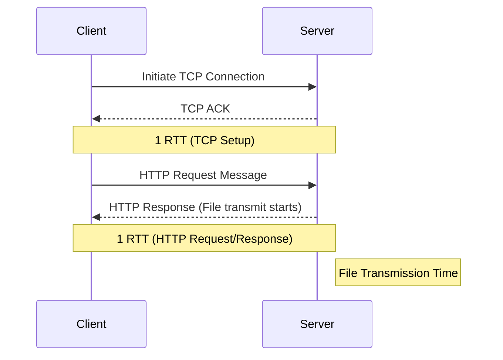
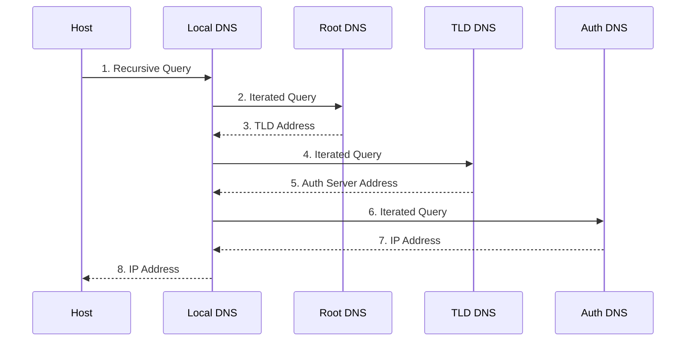

***

# 🌐 Chapter 2: Application Layer
**Tags:** #computer-networking #application-layer #http #dns #p2p #socket-programming #exam-prep

> [!info] Chapter Goals
> - **Conceptual and Implementation Aspects:** Understand network application protocols, transport-layer service models, client-server, and peer-to-peer (P2P) paradigms.
> - **Examine Popular Protocols:** HTTP and DNS.
> - **Network Application Programming:** Socket API (UDP and TCP).

## 1. Principles of Network Applications
Network applications run on **end systems** (hosts) and communicate over the network core. You do not write application software for network-core devices (like routers or switches) because they operate at lower layers.

### 1.1 Application Architectures
> [!info] Core Paradigms
> - **Client-Server:** Centralized infrastructure where an always-on host (server) with a permanent IP services asynchronous requests from intermittently connected clients (e.g., Web/HTTP). Requires data centers for scaling.
> - **Peer-to-Peer (P2P):** Decentralized infrastructure. Arbitrary end systems (peers) directly communicate. Highly scalable (self-scalability) but complex to manage due to IP changes and intermittent connections. *Example: BitTorrent.*

> [!abstract] Stateful vs. Stateless Protocols
> - **Stateless Protocols:** The server retains zero information regarding historical client requests (e.g., native HTTP).
> - **Stateful Protocols:** The server actively maintains connection tracking variables and operational state histories.

### 1.2 Processes and Sockets
- **Process:** A program running within a host. 
  - **Client Process:** Initiates the communication.
  - **Server Process:** Waits to be contacted.
- **Socket:** The "door" or software-defined API between the application process and the end-to-end transport protocol.
- **Addressing:** To send a message, a process needs an **IP Address** (identifies host) and a **Port Number** (identifies process/socket).
	- *Web server (HTTP):* Port 80

### 1.3 Transport Services Available to Applications
Applications require different transport services depending on their nature:

| Application | Data Loss | Throughput | Time Sensitive? |
| :--- | :--- | :--- | :--- |
| **File transfer / download** | No loss | Elastic | No |
| **Web documents** | No loss | Elastic | No |
| **Real-time audio/video** | Loss-tolerant | Audio: 5Kbps-1Mbps<br>Video: 10Kbps-5Mbps | Yes, 100s msec |
| **Interactive games** | Loss-tolerant | Few Kbps+ | Yes, 100s msec |
| **Smartphone messaging** | No loss | Elastic | Yes and no |

> [!note] Protocol Selection Matrix: TCP vs. UDP
> | **Metric** | **UDP (SOCK_DGRAM)** | **TCP (SOCK_STREAM)** |
> | :--- | :--- | :--- |
> | **Connection State** | **Connectionless** | **Connection-Oriented** (Handshake) |
> | **Reliability** | Unreliable ("best effort") | Guaranteed reliable, in-order delivery |
> | **Flow/Congestion Control** | None | Yes (throttles transmission) |

> [!tip] Securing TCP (TLS)
> Vanilla TCP/UDP sends data in cleartext. **Transport Layer Security (TLS)** is implemented in the *application layer* to provide encrypted TCP connections, data integrity, and end-point authentication.

---

## 2. The Web and HTTP
**HTTP (HyperText Transfer Protocol)** is the Web's application-layer protocol, running over **TCP** (port 80).
> [!warning] HTTP is Stateless
> The server maintains no information about past client requests.

### 2.1 HTTP Connections
1. **Non-persistent HTTP (HTTP/1.0):** 
   - At most *one* object is sent over a TCP connection before it is closed.
2. **Persistent HTTP (HTTP/1.1):**
   - Server leaves TCP connection open after sending a response, enabling multiple objects to be sent over a single TCP connection.

> [!math] Response Time Calculation (Non-Persistent)
> Let **RTT (Round-Trip Time)** be the time for a small packet to travel from client to server and back.
> $$ \text{Total Response Time} = 2 \times RTT + \text{File Transmission Time} $$



### 2.2 HTTP Message Formats
#### 1. HTTP Request Message
- **Request Line:** Method (`GET`, `POST`, `HEAD`, `PUT`, `DELETE`), URL, HTTP version.
- **Header Lines:** E.g., `Host:`, `User-Agent:`, `Accept-Language:`, `Connection: keep-alive`.
- **Entity Body:** Empty for `GET`, contains user input data for `POST`.

#### 2. HTTP Response Message
- **Status Line:** Protocol version, Status Code, Status Phrase.
- **Header Lines:** E.g., `Date:`, `Server:`, `Last-Modified:`, `Content-Length:`.
- **Entity Body:** The requested data (e.g., the HTML file).

**Common Status Codes:** `200 OK`, `301 Moved Permanently`, `400 Bad Request`, `404 Not Found`, `505 HTTP Version Not Supported`.

### 2.3 Cookies (Maintaining State)
Since HTTP is stateless, **Cookies** are used to maintain sessions (e.g., shopping carts, targeted ads).
**4 Components:** `Set-cookie:` header (response), `Cookie:` header (request), local cookie file, back-end database.

> [!warning] Privacy and GDPR
> Cookies permit sites (and third-party ad networks) to learn extensive details about users' browsing history. Under GDPR regulations, users must be given explicit control over whether or not cookies are allowed.

### 2.4 Web Caching (Proxy Servers)
Web caches satisfy client requests without involving the origin server, reducing response time and bandwidth.
- **Conditional GET:** Cache sends `If-modified-since: <date>`. Origin replies with `HTTP/1.1 304 Not Modified` and empty body if unchanged.

<details>
<summary><b>View Caching Math Example</b></summary>

**Scenario:** 
- Access link rate = 1.54 Mbps. Object size = 100K bits. Request rate = 15/sec.
- Access link traffic intensity = $(15 \times 100\text{K}) / 1.54\text{M} = 0.97$.
- *Problem:* 0.97 utilization causes massive queueing delay.

**Solution:** Install a local Web cache with a 0.4 hit rate.
- *New access link utilization:* $0.6 \times 0.97 = 0.58$ (queueing delay drops significantly).
- *New average delay:* $0.6 \times (\text{Delay origin}) + 0.4 \times (\text{Delay cache}) \approx 1.2\text{ s}$.

</details>

### 2.5 HTTP Evolution
- **HTTP/1.1 HOL Blocking:** A large object blocks smaller objects (Head-of-Line Blocking) over the same TCP connection.
- **HTTP/2:** Mitigates HOL blocking by breaking messages into **frames** and interleaving them.
- **HTTP/3:** Adds security, per-object error/congestion control, and operates over **UDP (QUIC)**.

---

## 3. DNS: The Internet's Directory Service
**DNS (Domain Name System)** translates hostnames to IP addresses. Runs on **UDP Port 53**.

### 3.1 Why not centralize DNS?
A centralized DNS would not scale due to:
- Single point of failure.
- Massive traffic volume.
- Distant centralized database (high latency).
- Maintenance nightmare.

### 3.2 DNS Hierarchy
1. **Root DNS Servers** $\rightarrow$ **TLD Servers** (`.com`, `.edu`) $\rightarrow$ **Authoritative DNS Servers** (Org's own DNS).
2. **Local DNS Server:** ISP's proxy that forwards queries into the hierarchy.

### 3.3 DNS Resolution: Iterated vs. Recursive
- **Iterated Query:** The contacted server replies with the name of the *next* server to contact. *Most common across the hierarchy.*
- **Recursive Query:** Puts the burden of name resolution entirely on the contacted name server. *Used mostly between host and Local DNS.*



### 3.4 DNS Caching & Records
Once a name server learns a mapping, it caches it (with a Time-To-Live, TTL). 
**Format:** `(Name, Value, Type, TTL)`
- **Type A:** Name = Hostname, Value = IP Address
- **Type NS:** Name = Domain, Value = Hostname of authoritative DNS
- **Type CNAME:** Name = Alias, Value = Canonical (real) name
- **Type MX:** Name = Alias, Value = Canonical name of mail server

---

## 4. P2P File Distribution (BitTorrent)

### 4.1 Client-Server vs. P2P Scalability Math
For distributing a file of size $F$ to $N$ peers:
- **Client-Server Distribution Time ($D_{c-s}$):** Increases linearly with $N$.
  $$ D_{c-s} \ge \max\left\{ \frac{NF}{u_s}, \frac{F}{d_{min}} \right\} $$
- **P2P Distribution Time ($D_{P2P}$):** Self-scaling. As $N$ increases, total upload capacity ($\sum u_i$) also increases.
  $$ D_{P2P} \ge \max\left\{ \frac{F}{u_s}, \frac{F}{d_{min}}, \frac{NF}{u_s + \sum u_i} \right\} $$

### 4.2 BitTorrent Mechanics
- **Tracker:** Infrastructure node tracking peers in the torrent.
- **Chunks:** Files divided into chunks (e.g., 256KB).
- **Rarest First:** Peers request the rarest chunks in the swarm first.
- **Tit-for-Tat (Trading):** 
	- Evaluated every 10 seconds: Alice sends chunks to the four peers sending to her at the highest rate (unchoked).
	- Every 30 seconds: Alice randomly selects another peer and *optimistically unchokes* them to explore better partners.

---

## 5. Socket Programming (Python)
A **socket** is the interface between the application and transport layers.

### 5.1 Socket Programming with UDP
- **No connection** between client and server.
- Sender explicitly attaches destination IP and port to each packet.

<details>
<summary><b>View Python UDP Example</b></summary>

*Client (`UDPClient.py`):*
```python
from socket import *
clientSocket = socket(AF_INET, SOCK_DGRAM) #udp socket
clientSocket.sendto(message.encode(), (serverName, serverPort))
modifiedMessage, serverAddress = clientSocket.recvfrom(2048)
clientSocket.close()
```

*Server (`UDPServer.py`):*
```python
from socket import *
serverSocket = socket(AF_INET, SOCK_DGRAM)
serverSocket.bind(('', 12000)) #bind to specific port
while True:
    message, clientAddress = serverSocket.recvfrom(2048)
    #process message...
    serverSocket.sendto(modifiedMessage.encode(), clientAddress)
```

</details>

### 5.2 Socket Programming with TCP
- **Connection-oriented:** Handshake required before sending data.
- Server TCP creates a **new, dedicated socket** for each contacting client.

<details>
<summary><b>View Python TCP Example</b></summary>

*Client (`TCPClient.py`):*
```python
from socket import *
clientSocket = socket(AF_INET, SOCK_STREAM) #tcp socket
clientSocket.connect((serverName, serverPort)) #3-way handshake
clientSocket.send(sentence.encode()) #drops bytes into the pipe, no ip/port needed here
modifiedSentence = clientSocket.recv(1024)
clientSocket.close()
```

*Server (`TCPServer.py`):*
```python
from socket import *
serverSocket = socket(AF_INET, SOCK_STREAM)
serverSocket.bind(('', 12000))
serverSocket.listen(1) #listening (welcoming socket)

while True:
    connectionSocket, addr = serverSocket.accept() #dedicated socket for client
    sentence = connectionSocket.recv(1024).decode()
    #process message...
    connectionSocket.send(capitalizedSentence.encode())
    connectionSocket.close() #closes this specific client's socket
```

</details>

### 5.3 Timeouts and Error Handling
Prevent processes from waiting forever if a packet is lost.

<details>
<summary><b>View Error Handling Example</b></summary>

```python
connectionSocket.settimeout(10) #set 10 second timeout
try:
    message = connectionSocket.recv(1024)
except timeout:
    print("No data received within 10 seconds.")
```

</details>

---

## 6. Midterm Exam Preparation & Q&A

> [!question]- Q1: The Socket Multiplexing Trap
> **What happens if a developer tries to `recv()` on a TCP `serverSocket` instead of the `connectionSocket` returned by `accept()`?**
> The welcoming socket (`serverSocket`) only manages transport connection requests via `listen()`. It has no data transport buffers. Calling `recv()` throws an attribute error or blocks indefinitely. The server cannot multiplex because it isn't using the client-specific port mappings assigned to the connection socket.

> [!question]- Q2: Stateful vs Stateless Implementations
> **Classify HTTP and FTP.**
> - **HTTP is Stateless:** Server retains no record of past transactions.
> - **FTP is Stateful:** Actively tracks session state and user directories over a control connection.

> [!question]- Q3: Why TCP 3-Way Handshake?
> **Why not a 2-way handshake?**
> A 2-way handshake cannot guarantee sequence number acknowledgment or half-open resilience (if the server crashes after replying, client thinks connection is open). It also leaves systems vulnerable to sequence spoofing.

> [!question]- Q4: Device-Specific DNS
> **Why should a lightweight device use Recursive resolution?**
> Recursive resolution offloads the heavy lifting (iteratively querying root, TLD, and authoritative servers) to the Local DNS, saving battery and processing power on the lightweight device.

---

## 7. Quick Reference Tables

### 📖 Definitions Table
| Term | Definition |
| :--- | :--- |
| **Process** | A program running within a host system. |
| **Socket** | The software API ("door") between the application layer and the transport layer. |
| **TLS** | Transport Layer Security; implemented in the application layer to provide encrypted TCP connections. |
| **Non-persistent HTTP** | Opens a new TCP connection for every single object requested. |
| **Persistent HTTP** | Leaves TCP connection open, allowing multiple pipelined requests. |
| **Cookies** | HTTP mechanisms used to maintain state and track user sessions across stateless requests. |
| **Conditional GET** | Cache validation request using `If-modified-since` to save bandwidth. |
| **Iterated Query** | DNS query where the server replies with the next server to contact. |
| **Recursive Query** | DNS query where the server fully resolves the mapping on behalf of the client. |
| **Welcoming Socket** | TCP server socket dedicated exclusively to listening for incoming handshakes (`listen()`). |
| **Connection Socket** | Dedicated TCP socket spawned by `accept()` for direct communication with a single client. |
| **P2P Architecture** | Decentralized model where peers request and transmit files among themselves directly. |
| **CNAME Record** | A DNS alias record pointing one domain name to another canonical name. |

### 🧮 Important Formulas
| Formula Concept | Equation / Math |
| :--- | :--- |
| **HTTP/1.0 Response Time** | $2 \times RTT + \text{file transmission time}$ |
| **P2P Distribution Time** | $D_{p2p} = \max\left\{ \frac{F}{u_s}, \frac{F}{d_{min}}, \frac{N \cdot F}{u_s + \sum u_i} \right\}$ |
| **Client-Server Distribution Time** | $D_{cs} = \max\left\{ \frac{N \cdot F}{u_s}, \frac{F}{d_{min}} \right\}$ |

***
