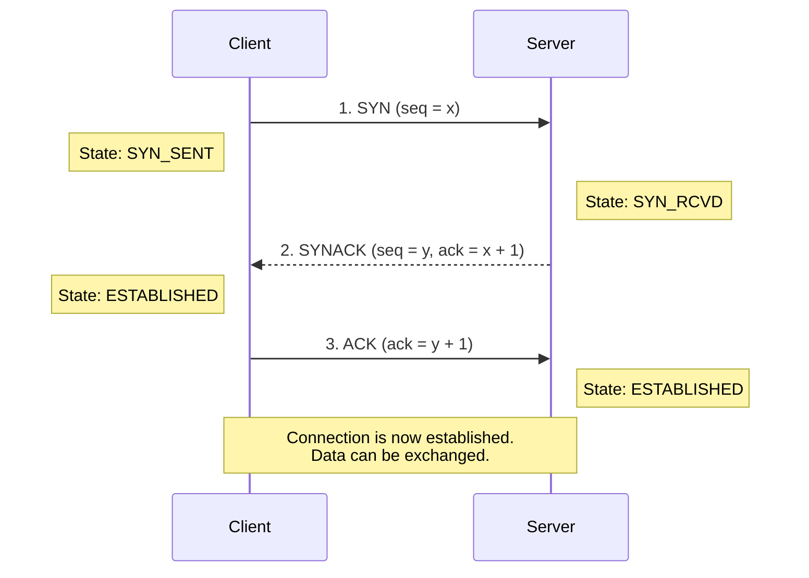
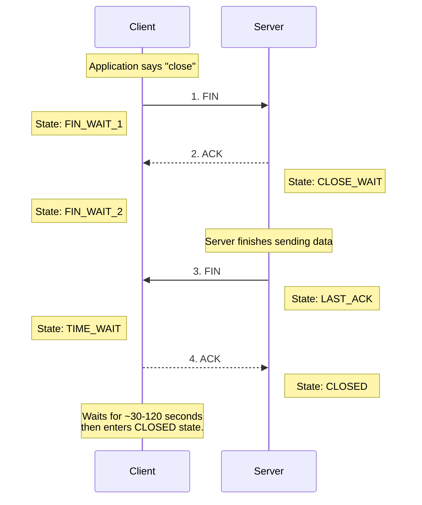

***

# Chapter 3: The Transport Layer

## 1. Transport Layer Overview
The primary goal of the transport layer is to provide **logical communication** between application processes running on different hosts. From the perspective of the application, it appears as though the hosts are physically connected, regardless of the underlying network infrastructure.

*   **Sender Actions:** Takes application messages, breaks them into smaller chunks called **segments**, and passes them down to the network layer.
*   **Receiver Actions:** Reassembles the incoming segments into complete messages and passes them up to the appropriate application process.

### Transport vs. Network Layer
*   **Network Layer:** Provides logical communication between **hosts** (computers/devices).
*   **Transport Layer:** Provides logical communication between **processes** (applications running on those hosts). It relies on the network layer but enhances its capabilities.

> [!example] The Household Analogy
> Imagine 12 kids in Ann's house sending letters to 12 kids in Bill's house.
> *   **Hosts (End Systems) =** The houses
> *   **Processes =** The kids
> *   **Application Messages =** The letters inside the envelopes
> *   **Network-Layer Protocol =** The postal service (delivers mail from house to house)
> *   **Transport-Layer Protocol =** Ann and Bill (they collect mail from siblings and distribute incoming mail to the correct sibling)

---

## 2. Multiplexing and Demultiplexing
Since a single host can run multiple network applications simultaneously, the transport layer needs a mechanism to direct incoming data to the correct application **socket**.

*   **Multiplexing (Sender):** Gathering data from multiple application sockets, encapsulating it with transport headers, and passing it to the network layer.
*   **Demultiplexing (Receiver):** Reading the transport header of incoming segments to direct the data to the correct receiving socket.

> [!example] Multiplexing/Demultiplexing in Action
> Imagine a computer running a web browser (Firefox) and a media streamer (Netflix) simultaneously. 
> * **Multiplexing:** The transport layer takes the HTTP request from Firefox and the streaming data request from Netflix, adds a transport header to each (containing their unique source ports), and hands them to the network layer to be sent out over the same connection.
> * **Demultiplexing:** When responses arrive, the transport layer reads the destination port in the header. Data destined for port 80/443 might go to Firefox, while data for another specific port goes to Netflix.

### How Demultiplexing Works
Host devices receive IP datagrams, extract the transport-layer segment, and use **Port Numbers** to direct the data.
*   Port numbers are 16-bit integers.
*   Ports $0 - 1023$ are "well-known" ports (e.g., HTTP uses 80, HTTPs uses 443).

**Connectionless Demultiplexing (UDP):**
*   A UDP socket is identified by a **2-tuple**: `(Destination IP, Destination Port)`.
*   If two segments arrive from *different* source IPs or source ports, but have the *same* destination IP and port, they are directed to the **same socket**.

**Connection-Oriented Demultiplexing (TCP):**
*   A TCP socket is identified by a **4-tuple**: `(Source IP, Source Port, Destination IP, Destination Port)`.
*   The receiver uses all four values to direct the segment. Two segments from different source IPs/ports aimed at the same destination IP/port will be directed to **different sockets** (which is how a web server handles multiple concurrent clients).

---

## 3. Connectionless Transport: UDP (User Datagram Protocol)
UDP is a "bare-bones", "no-frills" Internet transport protocol. It provides a **best-effort** service, meaning segments can be lost or delivered out of order. 

**Why use UDP?**
1.  **No connection setup delay:** TCP requires a handshake; UDP just blasts data immediately.
2.  **Simple:** No connection state needs to be maintained at the sender or receiver.
3.  **Small header size:** UDP adds only 8 bytes of overhead (TCP adds 20 bytes).
4.  **No congestion control:** UDP sends data as fast as the application generates it, which is ideal for time-sensitive applications (like streaming or VoIP) that prefer minor data loss over delayed packets.

**Common UDP Use Cases:**
*   Streaming multimedia applications (loss tolerant, rate sensitive).
*   DNS (Domain Name System).
*   SNMP (Simple Network Management Protocol).
*   HTTP/3 (which adds reliability and congestion control on top of UDP at the application layer).

### UDP Segment Structure
| Source Port (16 bits)          | Destination Port (16 bits) |
| :----------------------------- | :------------------------- |
| **Length (16 bits)**           | **Checksum (16 bits)**     |
| **Application Data (Payload)** | *(Variable length)*        |

### UDP Checksum
The checksum is used for basic error detection (e.g., flipped bits during transmission).
*   **Sender:** Treats the segment contents as a sequence of 16-bit integers. It adds these integers together. If there is a carry-out from the most significant bit, it is wrapped around and added to the result. The final sum is inverted (1's complement) and placed in the checksum field.
*   **Receiver:** Adds all the 16-bit words (including the checksum). If no errors occurred, the sum should be all `1`s. If any `0`s are present, an error is detected.

> [!example]- Walkthrough: UDP Checksum Calculation Example
> Suppose we want to calculate the checksum for three 16-bit words:
> 
> *   **Word 1:** `0110011001100000` (Hex: `6660`)
> *   **Word 2:** `0101010101010101` (Hex: `5555`)
> *   **Word 3:** `1000111100001100` (Hex: `8F0C`)
> 
> #### 1. Sender Side Calculation
> 
> First, we add the first two words:
> ```text
>   0110 0110 0110 0000  (Word 1)
> + 0101 0101 0101 0101  (Word 2)
> ---------------------
>   1011 1011 1011 0101  (Sum: 0xBBB5)
> ```
> 
> Next, we add the third word to that sum:
> ```text
>   1011 1011 1011 0101  (Running Sum)
> + 1000 1111 0000 1100  (Word 3)
> ---------------------
>  10100 1010 1100 0001  (Sum: 0x14AC1)
> ```
> 
> Since we got a carry-out of `1` (which exceeds the 16-bit limit), we wrap it around and add it to the LSB (least significant bit):
> ```text
>   0100 1010 1100 0001  (16-bit Sum)
> +                   1  (Wrapped Carry-out)
> ---------------------
>   0100 1010 1100 0010  (Final Sum: 0x4AC2)
> ```
> 
> Finally, we invert all the bits (1's complement) to obtain the checksum:
> ```text
>   0100 1010 1100 0010  (Final Sum)
>   ↓ (Inverting all bits)
>   1011 0101 0011 1101  (Checksum: 0xB53D)
> ```
> The sender transmits this checksum (`0xB53D`) along with the data words.
> 
> #### 2. Receiver Side Verification
> 
> The receiver adds all three data words and the received checksum:
> ```text
>   0110 0110 0110 0000  (Word 1)
>   0101 0101 0101 0101  (Word 2)
>   1000 1111 0000 1100  (Word 3)
> + 1011 0101 0011 1101  (Checksum)
> ---------------------
>  11111 1111 1111 1110  (Sum: 0x1FFFE)
> ```
> 
> Wrapping around the carry-out of `1`:
> ```text
>   1111 1111 1111 1110  (16-bit Sum)
> +                   1  (Wrapped Carry-out)
> ---------------------
>   1111 1111 1111 1111  (Result: all 1s)
> ```
> 
> Since the final sum is all `1`s, the receiver concludes that no single-bit transmission errors occurred.


> [!warning] Weak Protection
> UDP checksums provide very weak protection. If two separate bits flip in a way that cancels each other out mathematically, the checksum will remain unchanged, and the error will go undetected.

---

## 4. Principles of Reliable Data Transfer (RDT)
Network layers are inherently unreliable. The transport layer must implement protocols to guarantee that data is delivered without corruption, loss, or reordering. We build this understanding incrementally.

### The Evolution of RDT
1.  **rdt 1.0 (Perfect Channel):** 
    *   Assumes the underlying channel never corrupts or loses packets. The sender just sends, and the receiver just receives.
2.  **rdt 2.0 (Channel with Bit Errors):**
    *   Introduces **Checksums** to detect errors.
    *   Introduces **ACKs** (Positive Acknowledgements) and **NAKs** (Negative Acknowledgements) to provide receiver feedback.
    *   Introduces **Retransmissions** (ARQ - Automatic Repeat reQuest) if a NAK is received.
    *   *Flaw:* What if the ACK/NAK itself gets corrupted? The sender won't know what to do.
3.  **rdt 2.1 (Handling Corrupted ACKs/NAKs):**
    *   Introduces **Sequence Numbers** (0 and 1) to packets. If an ACK/NAK is corrupted, the sender simply retransmits the packet. The receiver uses the sequence number to determine if the packet is new data or a duplicate.
4.  **rdt 2.2 (NAK-Free Protocol):**
    *   Instead of NAKs, the receiver simply sends an ACK for the *last correctly received packet*. The sender recognizes a duplicate ACK as an implicit NAK and retransmits the current packet.
5.  **rdt 3.0 (Channel with Errors AND Loss):**
    *   Also known as the **Alternating-Bit Protocol**.
    *   Introduces a **Countdown Timer**. If a packet or its ACK is completely lost in the network, the sender waits for a reasonable amount of time. If the timer expires, the sender retransmits the packet.

### Pipelining
Stop-and-wait protocols (like rdt 3.0) have terrible performance. 
$$ U_{sender} = \frac{L/R}{RTT + L/R} $$
*(Where $U_{sender}$ is utilization, $L$ is packet length, $R$ is link transmission rate, and $RTT$ is round-trip time).*

> [!tip] **Intuition: Why does this formula work?**
> Utilization is just: **"what fraction of time are you actually busy?"**
> $$U_{sender} = \frac{\text{busy time}}{\text{total cycle time}} = \frac{L/R}{L/R + RTT}$$
> One "cycle" of stop-and-wait looks like this:
> ```
> Time ──────────────────────────────────────────────►
> 
> |◄── L/R ──►|◄──────────── RTT ────────────────►|
> [ SENDING  ]  [        doing nothing...          ]
>              packet traveling ──►  ACK traveling ◄──
> ```
> - **L/R** — time spent pushing bits onto the wire. This is the **only time you're working**.
> - **RTT** — idle time waiting for the packet to arrive and the ACK to come back.
> - One full cycle = `L/R + RTT`, but you were only busy for `L/R`.
> 
> **Example:** If `L/R = 0.008ms` and `RTT = 30ms`:
> $$U_{sender} = \frac{0.008}{30 + 0.008} \approx 0.00027 = 0.027\%$$
> You're using the link **0.027%** of the time — the rest is idle waiting. It's like spending 1 second writing a letter, then waiting 30 minutes for a reply before writing the next one.

> [!tip] **Intuition: How does Pipelining help?**
> Instead of sending one packet and waiting, you send **multiple packets back-to-back**. While you're waiting for the first ACK, packets 2 and 3 are already on their way — so you keep the "pipe" full instead of leaving it empty. The tradeoff: you need more sequence numbers (to tell packets apart) and buffers (to hold unACKed packets for possible resend).

To fix this, we use **Pipelining**: allowing the sender to transmit multiple packets without waiting for individual ACKs. This requires larger sequence numbers and buffering at the sender/receiver.

#### Go-Back-N (GBN) vs. Selective Repeat (SR)
| Feature          | Go-Back-N (GBN) (followed in class (mostly))                             | Selective Repeat (SR)                                             |
| :--------------- | :----------------------------------------------------------------------- | :---------------------------------------------------------------- |
| **Window**       | Sender maintains a window of $N$ unACKed packets.                        | Sender maintains window of $N$. Receiver also maintains a window. |
| **ACK Type**     | **Cumulative ACKs**: ACK $n$ means *all* packets up to $n$ are received. | **Individual ACKs**: ACKs explicitly target one specific packet.  |
| **Timer**        | Single timer for the oldest unACKed packet.                              | Separate logical timer for *each* unACKed packet.                 |
| **On Timeout**   | Retransmits the missing packet AND all subsequent packets in the window. | Retransmits ONLY the specifically lost/timeout packet.            |
| **Out-of-Order** | Receiver discards out-of-order packets.                                  | Receiver buffers out-of-order packets.                            |

---

## 5. Connection-Oriented Transport: TCP
TCP provides a robust, reliable data transfer service over the unreliable IP network.

### TCP Characteristics
*   **Point-to-Point:** One sender, one receiver.
*   **Reliable, In-Order Byte Stream:** No message boundaries; data is viewed as a continuous stream of bytes.
*   **Pipelined:** Uses congestion and flow control to dynamically set the window size.
*   **Full-Duplex:** Bidirectional data flow within the same connection.
*   **Connection-Oriented:** Requires a handshaking process before data transfer.

### TCP Segment Structure
*   **Sequence Number:** The byte-stream number of the *first byte* in the segment's data.
*   **Acknowledgement Number:** The sequence number of the ***next byte* the receiver expects to get** (TCP uses cumulative ACKs).
*   **Receive Window:** Used for flow control (indicates how many bytes the receiver is willing to accept).
*   **Flags:** `ACK` (acknowledgment is valid), `RST` (reset connection), `SYN` (setup connection), `FIN` (teardown connection).

### TCP RTT Estimation and Timeout
Timeouts must be longer than the RTT, but RTT fluctuates. TCP uses an Exponential Weighted Moving Average (EWMA) to smooth out RTT estimations:

$$ EstimatedRTT = (1 - \alpha) \cdot EstimatedRTT + \alpha \cdot SampleRTT $$
*(Typical value for $\alpha$ is 0.125 -> (1/8) )*  

TCP also calculates the safety margin (variance in RTT): (DevRTT -> Jitter)
$$ DevRTT = (1 - \beta) \cdot DevRTT + \beta \cdot |SampleRTT - EstimatedRTT| $$
*(Typical value for $\beta$ is 0.25)*

The final timeout interval is set as:
$$ TimeoutInterval = EstimatedRTT + 4 \cdot DevRTT $$

### TCP Reliable Data Transfer
TCP implements a hybrid approach to reliability (resembling both GBN and SR).
*   **Retransmission Scenarios:** TCP will retransmit data if the timer expires. However, if multiple packets are sent and one ACK is lost, a later cumulative ACK can prevent a timeout (e.g., if ACK 100 is lost but ACK 120 arrives before the timeout, TCP knows everything up to 120 was received).
*   **Fast Retransmit:** Timeouts can be long. If a sender receives **3 duplicate ACKs** for the same data, it assumes the packet immediately following was lost and retransmits it instantly, *before* the timer expires.

> [!info] TCP Receiver ACK Generation Policy
> *   **In-order arrival (expected seq #):** Delayed ACK. Wait up to 500ms for next segment. If none, send ACK.
> *   **In-order arrival (one ACK pending):** Immediately send a single cumulative ACK for both segments.
> *   **Out-of-order arrival (gap detected):** Immediately send duplicate ACK, indicating seq # of next expected byte.
> *   **Arrival filling a gap:** Immediately send ACK if the segment starts at the lower end of the gap.
> 
> <details>
> <summary><b>Deep Dive: Understanding the ACK Scenarios with Examples</b></summary>
> 
> The overall philosophy: **when things are fine, be lazy (save bandwidth). When something's wrong, be loud and immediate.**
> 
> **1. In-order arrival, nothing pending $\rightarrow$ Delayed ACK**
> *   *Scenario:* Segment 100 arrives (exactly what you expected).
> *   *Action:* TCP thinks, "Cool, got it. But maybe the next segment is right behind it. Let me wait up to 500ms before ACKing — if the next one arrives, I can ACK both at once and save bandwidth." Starts a timer.
> *   *Analogy:* It's like getting a text from a friend — you wait a beat to see if they send a follow-up before replying.
> 
> **2. In-order arrival, one ACK already pending $\rightarrow$ Immediate cumulative ACK**
> *   *Scenario:* You were already waiting (from scenario 1), and now segment 200 arrives too.
> *   *Action:* TCP immediately sends `ACK 300` (meaning "I have everything up to byte 299"). One ACK covers **both** segments.
> 
> **3. Out-of-order arrival (gap) $\rightarrow$ Immediate duplicate ACK**
> *   *Scenario:* You expected segment 100, but segment 300 arrived instead. Bytes 100–299 are missing.
> *   *Action:* TCP immediately sends `ACK 100` (duplicate ACK) — "I still need byte 100!". This is TCP's way of telling the sender **"you skipped something."** (3 duplicate ACKs trigger fast retransmit).
> 
> **4. Gap-filling segment arrives $\rightarrow$ Immediate ACK**
> *   *Scenario:* Segment 100 finally arrives, filling the gap.
> *   *Action:* TCP immediately sends `ACK 400` (because now bytes 100–399 are contiguous). No waiting, TCP wants the sender to know ASAP that the gap is resolved.
> 
> </details>

### TCP Flow Control
Flow control prevents the sender from overflowing the receiver's application buffer.
*   The receiver advertises its available buffer space in the `rwnd` (Receive Window) field of the TCP header.
*   `rwnd` = `RcvBuffer` - `[LastByteRcvd - LastByteRead]`
*   The sender limits its unacknowledged data (in-flight data) to the `rwnd` value.

> [!example] The Water Bucket Analogy
> Imagine the receiver has a bucket (`RcvBuffer`) that holds 1000 bytes of data. 
> *   The sender is a hose pouring data into the bucket. `LastByteRcvd` tracks the total amount poured in so far.
> *   The application is someone scooping data out of the bucket to process it. `LastByteRead` tracks the total amount scooped out so far.
> 
> The formula `[LastByteRcvd - LastByteRead]` represents **how much data is currently sitting in the bucket** (data that has arrived from the network but hasn't been read by the application yet).
> 
> So, `rwnd = 1000 - [data currently in the bucket]`. 
> 
> **Example Walkthrough:**
> 1. The receiver allocates a 1000-byte buffer (`RcvBuffer` = 1000).
> 2. The sender transmits 400 bytes. The receiver gets them.
>    * `LastByteRcvd` = 400
>    * The application hasn't read anything yet (`LastByteRead` = 0).
>    * Data in bucket = 400 - 0 = 400 bytes.
>    * `rwnd` = 1000 - 400 = **600 bytes**. The receiver tells the sender "I have 600 bytes of free space."
> 3. The application finally wakes up and reads 150 bytes from the buffer.
>    * `LastByteRcvd` = 400 (unchanged)
>    * `LastByteRead` = 150
>    * Data in bucket = 400 - 150 = 250 bytes.
>    * `rwnd` = 1000 - 250 = **750 bytes**. The receiver tells the sender "I now have 750 bytes of free space."
> 
> **Edge Case:** What if `rwnd` hits 0? The sender stops sending data. However, to prevent a deadlock (where the sender waits forever because it missed the receiver's update that space opened up), the sender will periodically send a 1-byte "probe" segment to prompt the receiver to reply with its current `rwnd`.

### TCP Connection Management
Before exchanging data, TCP performs a handshake to agree on parameters (like starting sequence numbers).

> [!question] Why not a 2-way handshake?
> A 2-way handshake ("Let's talk" $\rightarrow$ "OK") can fail due to variable network delays and message reordering. For example, a delayed connection request could arrive long after the client has given up, causing the server to open a "half-open connection" and potentially accept old, duplicated data. A 3-way handshake prevents this.
> 
> <details>
> <summary><b>Deep Dive: Why Exactly Does a 2-Way Handshake Fail?</b></summary>
> 
> The core problem: in a 2-way handshake, the server considers the connection **established** the moment it sends its "OK" reply. It immediately allocates memory (buffers) and variables. This creates severe vulnerabilities when packets are delayed or duplicated.
> 
> **Edge Case 1: The "Half-Open" Connection (Resource Wasting)**
> 
> A client's connection request gets stuck in a congested router. The client times out and retries — the second attempt succeeds, data is exchanged, and the connection closes. Later, that first delayed request finally arrives at the server.
> 
> ```mermaid
> sequenceDiagram
>     participant Client
>     participant Server
> 
>     Note over Client,Server: Connection Attempt 1
>     Client->>Server: SYN (seq=x) [Gets delayed in network]
>     Note over Client: Client times out waiting for reply
>     
>     Note over Client,Server: Connection Attempt 2 (Success)
>     Client->>Server: SYN (seq=y)
>     Server-->>Client: OK (ack=y+1)
>     Note over Client,Server: ...Data exchanged, connection closed...
>     
>     Note over Client,Server: The Ghost of Attempt 1 Arrives
>     Server->>Server: Receives delayed SYN (seq=x)
>     Server-->>Client: OK (ack=x+1)
>     Note right of Server: Server thinks connection is OPEN!<br/>Allocates memory, waits for data.
>     
>     Note left of Client: Client didn't request this.<br/>Ignores the server's reply.
>     Note over Server: Server is stuck holding a "half-open"<br/>connection indefinitely.
> ```
> 
> **Result:** The server wastes RAM and processing power on a dead connection. If thousands of delayed requests arrive (or are maliciously crafted), the server runs out of resources and crashes.
> 
> ---
> 
> **Edge Case 2: The "Phantom Data" Problem (Data Corruption)**
> 
> Even more dangerous — what if both a connection request AND a data packet from an old session were delayed?
> 
> ```mermaid
> sequenceDiagram
>     participant Client
>     participant Server
> 
>     Note over Client,Server: Original session (long ago)
>     Client->>Server: SYN (seq=x) [DELAYED]
>     Client->>Server: Data: "Buy 1000 shares" [DELAYED]
>     Note over Client: Client times out, reconnects,<br/>finishes business, goes to sleep.
>     
>     Note over Client,Server: Hours later...
>     Server->>Server: Receives delayed SYN (seq=x)
>     Server-->>Client: OK (ack=x+1)
>     Note right of Server: Server opens connection!
>     
>     Server->>Server: Receives delayed Data packet
>     Note right of Server: Server accepts data:<br/>"Buy 1000 shares"
>     Note over Server: The application processes an<br/>unintended, outdated command!
> ```
> 
> <details>
> <summary><b>Wait, why did the client send data before the connection was ACKed?</b></summary>
> 
> It didn't! The diagram simplifies the "Original session" for readability. In reality, the client didn't break the rules. Those "delayed" packets are actually **delayed duplicates** created by network timeouts:
> 
> 1. Client sends `SYN`. It gets delayed.
> 2. Client times out, retransmits `SYN`, gets an `OK` from the server.
> 3. Client sends `Data`. It gets delayed.
> 4. Client times out, retransmits `Data`. The server processes it, and they close the connection.
> 
> The original delayed `SYN` and delayed `Data` packets are still floating around in the network. Hours later, when they finally arrive, the server is tricked into thinking it's a brand new connection request followed by brand new data.
> 
> </details>
> 
> **Result:** The server accepts stale data as part of a brand-new valid conversation. The application could execute an old command — leading to catastrophic logical errors.
> 
> ---
> 
> **How the 3-Way Handshake Fixes Both Cases**
> 
> With a 3-way handshake, the server stays in a **provisional state** (`SYN_RCVD`) after sending the `SYNACK`. It does NOT hand the connection to the application until the client sends the final `ACK`.
> 
> When the client receives a `SYNACK` for a connection it doesn't remember starting, it replies with a **`RST` (Reset)** — telling the server to abort.
> 
> ```mermaid
> sequenceDiagram
>     participant Client
>     participant Server
> 
>     Note over Server: Hours later...
>     Server->>Server: Receives delayed SYN (seq=x)
>     Server-->>Client: SYNACK (ack=x+1)
>     Note right of Server: State: SYN_RCVD<br/>(waiting for confirmation)
>     
>     Note left of Client: I didn't send a SYN<br/>with seq=x recently!
>     Client->>Server: RST (Reset Connection)
>     
>     Note right of Server: Server aborts.<br/>No resources wasted,<br/>no phantom data accepted.
> ```
> 
> **Summary of 2-Way Handshake Disadvantages:**
> 1. Server **cannot distinguish** between a fresh request and an old, delayed duplicate.
> 2. **Resource Exhaustion** — servers allocate memory for "dead" connections.
> 3. **Data Integrity Failures** — old data segments can be mistakenly accepted as new data.
> 
> The 3rd step (the final ACK) is the client saying: *"Yes, I actually meant to send that request just now, and I agree to the sequence numbers we're using."*
> 
> </details>

#### Three-Way Handshake


#### Closing a Connection
Either side can initiate a close using the `FIN` flag.



> [!note] The `TIME_WAIT` State
> The client waits for a specific duration after sending the final ACK. This is to ensure that if its final ACK is lost, it is still around to catch the retransmitted `FIN` from the server and reply again.

> [!note] The `LAST_ACK` State
> The server enters this state after it has sent its own `FIN` and is waiting for the final `ACK` from the client. Once the server receives that final `ACK`, it transitions to the `CLOSED` state and completely releases all resources. If the final `ACK` gets lost, the server will eventually time out and retransmit its `FIN` (which the client in `TIME_WAIT` will catch and acknowledge again).