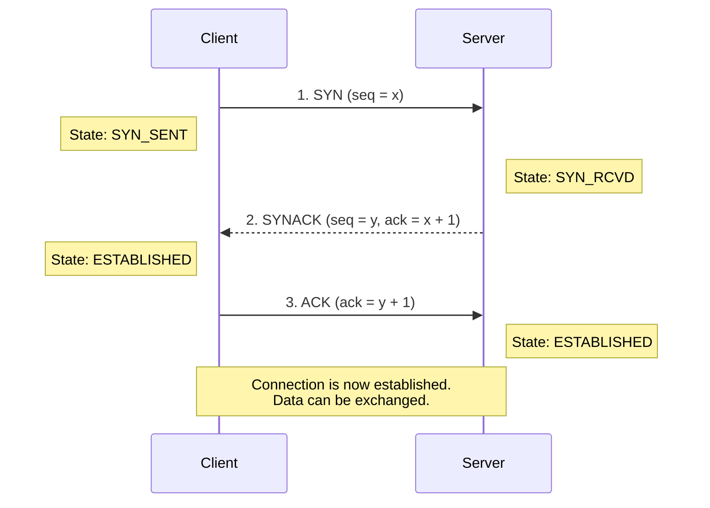
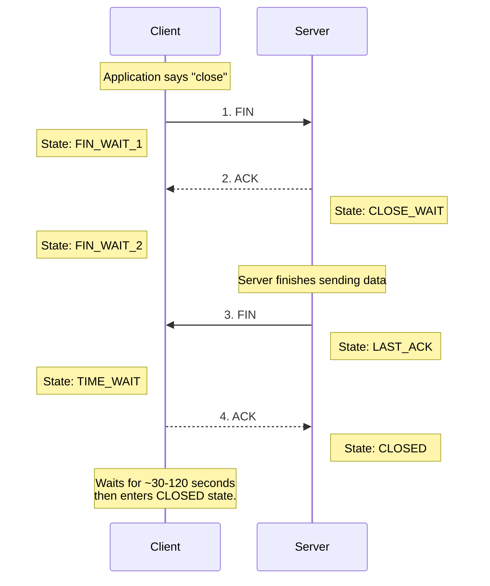

***

# Chapter 3: The Transport Layer

## 1. Transport Layer Overview
The primary goal of the transport layer is to provide **logical communication** between application processes running on different hosts. From the perspective of the application, it appears as though the hosts are physically connected, regardless of the underlying network infrastructure.

*   **Sender Actions:** Takes application messages, breaks them into smaller chunks called **segments**, and passes them down to the network layer.
*   **Receiver Actions:** Reassembles the incoming segments into complete messages and passes them up to the appropriate application process.

### Transport vs. Network Layer
*   **Network Layer:** Provides logical communication between **hosts** (computers/devices).
*   **Transport Layer:** Provides logical communication between **processes** (applications running on those hosts). It relies on the network layer but enhances its capabilities.

> [!example] The Household Analogy
> Imagine 12 kids in Ann's house sending letters to 12 kids in Bill's house.
> *   **Hosts (End Systems) =** The houses
> *   **Processes =** The kids
> *   **Application Messages =** The letters inside the envelopes
> *   **Network-Layer Protocol =** The postal service (delivers mail from house to house)
> *   **Transport-Layer Protocol =** Ann and Bill (they collect mail from siblings and distribute incoming mail to the correct sibling)

---

## 2. Multiplexing and Demultiplexing
Since a single host can run multiple network applications simultaneously, the transport layer needs a mechanism to direct incoming data to the correct application **socket**.

*   **Multiplexing (Sender):** Gathering data from multiple application sockets, encapsulating it with transport headers, and passing it to the network layer.
*   **Demultiplexing (Receiver):** Reading the transport header of incoming segments to direct the data to the correct receiving socket.

### How Demultiplexing Works
Host devices receive IP datagrams, extract the transport-layer segment, and use **Port Numbers** to direct the data.
*   Port numbers are 16-bit integers.
*   Ports $0 - 1023$ are "well-known" ports (e.g., HTTP uses 80, HTTPs uses 443).

**Connectionless Demultiplexing (UDP):**
*   A UDP socket is identified by a **2-tuple**: `(Destination IP, Destination Port)`.
*   If two segments arrive from *different* source IPs or source ports, but have the *same* destination IP and port, they are directed to the **same socket**.

**Connection-Oriented Demultiplexing (TCP):**
*   A TCP socket is identified by a **4-tuple**: `(Source IP, Source Port, Destination IP, Destination Port)`.
*   The receiver uses all four values to direct the segment. Two segments from different source IPs/ports aimed at the same destination IP/port will be directed to **different sockets** (which is how a web server handles multiple concurrent clients).

---

## 3. Connectionless Transport: UDP (User Datagram Protocol)
UDP is a "bare-bones", "no-frills" Internet transport protocol. It provides a **best-effort** service, meaning segments can be lost or delivered out of order. 

**Why use UDP?**
1.  **No connection setup delay:** TCP requires a handshake; UDP just blasts data immediately.
2.  **Simple:** No connection state needs to be maintained at the sender or receiver.
3.  **Small header size:** UDP adds only 8 bytes of overhead (TCP adds 20 bytes).
4.  **No congestion control:** UDP sends data as fast as the application generates it, which is ideal for time-sensitive applications (like streaming or VoIP) that prefer minor data loss over delayed packets.

### UDP Segment Structure
| Source Port (16 bits) | Destination Port (16 bits) |
| :--- | :--- |
| **Length (16 bits)** | **Checksum (16 bits)** |
| \multicolumn{2}{|c|}{**Application Data (Payload)**} |

### UDP Checksum
The checksum is used for basic error detection (e.g., flipped bits during transmission).
*   **Sender:** Treats the segment contents as a sequence of 16-bit integers. It adds these integers together. If there is a carry-out from the most significant bit, it is wrapped around and added to the result. The final sum is inverted (1's complement) and placed in the checksum field.
*   **Receiver:** Adds all the 16-bit words (including the checksum). If no errors occurred, the sum should be all `1`s. If any `0`s are present, an error is detected.

> [!warning] Weak Protection
> UDP checksums provide very weak protection. If two separate bits flip in a way that cancels each other out mathematically, the checksum will remain unchanged, and the error will go undetected.

---

## 4. Principles of Reliable Data Transfer (RDT)
Network layers are inherently unreliable. The transport layer must implement protocols to guarantee that data is delivered without corruption, loss, or reordering. We build this understanding incrementally.

### The Evolution of RDT
1.  **rdt 1.0 (Perfect Channel):** 
    *   Assumes the underlying channel never corrupts or loses packets. The sender just sends, and the receiver just receives.
2.  **rdt 2.0 (Channel with Bit Errors):**
    *   Introduces **Checksums** to detect errors.
    *   Introduces **ACKs** (Positive Acknowledgements) and **NAKs** (Negative Acknowledgements) to provide receiver feedback.
    *   Introduces **Retransmissions** (ARQ - Automatic Repeat reQuest) if a NAK is received.
    *   *Flaw:* What if the ACK/NAK itself gets corrupted? The sender won't know what to do.
3.  **rdt 2.1 (Handling Corrupted ACKs/NAKs):**
    *   Introduces **Sequence Numbers** (0 and 1) to packets. If an ACK/NAK is corrupted, the sender simply retransmits the packet. The receiver uses the sequence number to determine if the packet is new data or a duplicate.
4.  **rdt 2.2 (NAK-Free Protocol):**
    *   Instead of NAKs, the receiver simply sends an ACK for the *last correctly received packet*. The sender recognizes a duplicate ACK as an implicit NAK and retransmits the current packet.
5.  **rdt 3.0 (Channel with Errors AND Loss):**
    *   Also known as the **Alternating-Bit Protocol**.
    *   Introduces a **Countdown Timer**. If a packet or its ACK is completely lost in the network, the sender waits for a reasonable amount of time. If the timer expires, the sender retransmits the packet.

### Pipelining
Stop-and-wait protocols (like rdt 3.0) have terrible performance. 
$$ U_{sender} = \frac{L/R}{RTT + L/R} $$
*(Where $U_{sender}$ is utilization, $L$ is packet length, $R$ is link transmission rate, and $RTT$ is round-trip time).*

To fix this, we use **Pipelining**: allowing the sender to transmit multiple packets without waiting for individual ACKs. This requires larger sequence numbers and buffering at the sender/receiver.

#### Go-Back-N (GBN) vs. Selective Repeat (SR)
| Feature | Go-Back-N (GBN) | Selective Repeat (SR) |
| :--- | :--- | :--- |
| **Window** | Sender maintains a window of $N$ unACKed packets. | Sender maintains window of $N$. Receiver also maintains a window. |
| **ACK Type** | **Cumulative ACKs**: ACK $n$ means *all* packets up to $n$ are received. | **Individual ACKs**: ACKs explicitly target one specific packet. |
| **Timer** | Single timer for the oldest unACKed packet. | Separate logical timer for *each* unACKed packet. |
| **On Timeout** | Retransmits the missing packet AND all subsequent packets in the window. | Retransmits ONLY the specifically lost/timeout packet. |
| **Out-of-Order** | Receiver discards out-of-order packets. | Receiver buffers out-of-order packets. |

---

## 5. Connection-Oriented Transport: TCP
TCP provides a robust, reliable data transfer service over the unreliable IP network.

### TCP Characteristics
*   **Point-to-Point:** One sender, one receiver.
*   **Reliable, In-Order Byte Stream:** No message boundaries; data is viewed as a continuous stream of bytes.
*   **Pipelined:** Uses congestion and flow control to dynamically set the window size.
*   **Full-Duplex:** Bidirectional data flow within the same connection.
*   **Connection-Oriented:** Requires a handshaking process before data transfer.

### TCP Segment Structure
*   **Sequence Number:** The byte-stream number of the *first byte* in the segment's data.
*   **Acknowledgement Number:** The sequence number of the *next byte* the receiver expects to get (TCP uses cumulative ACKs).
*   **Receive Window:** Used for flow control (indicates how many bytes the receiver is willing to accept).
*   **Flags:** `ACK` (acknowledgment is valid), `RST` (reset connection), `SYN` (setup connection), `FIN` (teardown connection).

### TCP RTT Estimation and Timeout
Timeouts must be longer than the RTT, but RTT fluctuates. TCP uses an Exponential Weighted Moving Average (EWMA) to smooth out RTT estimations:

$$ EstimatedRTT = (1 - \alpha) \cdot EstimatedRTT + \alpha \cdot SampleRTT $$
*(Typical value for $\alpha$ is 0.125)*

TCP also calculates the safety margin (variance in RTT):
$$ DevRTT = (1 - \beta) \cdot DevRTT + \beta \cdot |SampleRTT - EstimatedRTT| $$
*(Typical value for $\beta$ is 0.25)*

The final timeout interval is set as:
$$ TimeoutInterval = EstimatedRTT + 4 \cdot DevRTT $$

### TCP Reliable Data Transfer
TCP implements a hybrid approach to reliability (resembling both GBN and SR).
*   **Retransmission Scenarios:** TCP will retransmit data if the timer expires. However, if multiple packets are sent and one ACK is lost, a later cumulative ACK can prevent a timeout (e.g., if ACK 100 is lost but ACK 120 arrives before the timeout, TCP knows everything up to 120 was received).
*   **Fast Retransmit:** Timeouts can be long. If a sender receives **3 duplicate ACKs** for the same data, it assumes the packet immediately following was lost and retransmits it instantly, *before* the timer expires.

### TCP Flow Control
Flow control prevents the sender from overflowing the receiver's application buffer.
*   The receiver advertises its available buffer space in the `rwnd` (Receive Window) field of the TCP header.
*   `rwnd` = `RcvBuffer` - `[LastByteRcvd - LastByteRead]`
*   The sender limits its unacknowledged data (in-flight data) to the `rwnd` value.

### TCP Connection Management
Before exchanging data, TCP performs a handshake to agree on parameters (like starting sequence numbers).

#### Three-Way Handshake

#### Closing a Connection
Either side can initiate a close using the `FIN` flag.

> [!note] The `TIME_WAIT` State
> The client waits for a specific duration after sending the final ACK. This is to ensure that if its final ACK is lost, it is still around to catch the retransmitted `FIN` from the server and reply again.