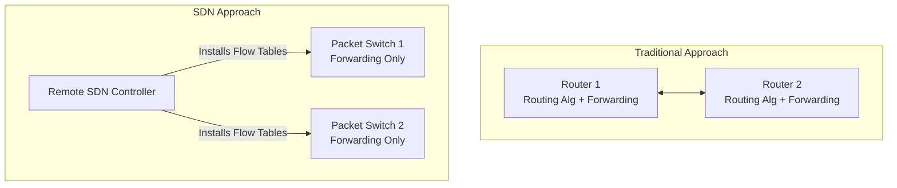

***
# Network Layer (Data Plane)

> [!info] Chapter Overview
> The network layer is responsible for host-to-host communication. It can be conceptually decomposed into two interacting parts: the **Data Plane** (per-router forwarding) and the **Control Plane** (network-wide routing). 

## 1. Network-Layer Services and Protocols
The network layer protocols are present in *every* Internet device (hosts and routers).
* **Sender:** Encapsulates transport-layer segments into network-layer *datagrams* and passes them down to the link layer.
* **Receiver:** Extracts segments from datagrams and delivers them up to the transport layer.
* **Routers:** Examine header fields in all IP datagrams passing through them and move datagrams from input ports to output ports to transfer them along an end-to-end path.

---

## 2. Two Key Network-Layer Functions

> [!important] Forwarding vs. Routing
> The terms *forwarding* and *routing* are often used interchangeably, but they refer to two very distinct functions in the network layer.

1. **Forwarding (Data Plane):** The process of moving a packet from a router's input link to the appropriate router output link. 
	* *Timescale:* Nanoseconds (implemented in hardware).
	* *Analogy:* Getting through a single highway interchange.
2. **Routing (Control Plane):** The process of determining the end-to-end route or path taken by packets from source to destination.
	* *Timescale:* Seconds (implemented in software/algorithms).
	* *Analogy:* Planning the entire trip from source to destination on a map.

### Data Plane vs. Control Plane

#### The Data Plane
* **Local, per-router function.**
* Determines how a datagram arriving on a router input port is forwarded to a router output port.
* Uses the **forwarding table** to look up the destination address and find the appropriate output link.

#### The Control Plane
* **Network-wide logic.**
* Determines how a datagram is routed among routers along the end-to-end path.
* **Two Approaches to Control Plane:**
	1. **Traditional Routing Algorithms:** Routing algorithm components are implemented monolithically in *each and every router*, communicating with each other to compute forwarding tables.
	2. **Software-Defined Networking (SDN):** A logically centralized, physically separate **Remote Controller** computes and distributes the forwarding tables to "dumb" routers.

---

## 3. Network Service Models

A network service model defines the characteristics of end-to-end delivery of packets between sending and receiving hosts.

**Potential Services we might want:**
* *For individual datagrams:* Guaranteed delivery, guaranteed delivery with bounded delay (e.g., < 40 msec).
* *For a flow of datagrams:* In-order delivery, guaranteed minimum bandwidth, restrictions on inter-packet spacing.

### The Internet's Service Model: Best-Effort

| Network Architecture | Service Model | Bandwidth Guarantee | Loss Guarantee | Order Guarantee | Timing Guarantee |
| -------------------- | ------------- | ------------------- | -------------- | --------------- | ---------------- |
| **Internet**         | **Best effort**| **None**            | **No**         | **No**          | **No**           |
| ATM                  | CBR           | Constant rate       | Yes            | Yes             | Yes              |
| ATM                  | ABR           | Guaranteed minimum  | No             | Yes             | No               |

> [!warning] The Internet "Best Effort" Service Model
> Provides **NO guarantees** on:
> 1. Successful datagram delivery to the destination.
> 2. Timing or order of delivery.
> 3. Bandwidth available to the end-to-end flow.

**Reflections on Best-Effort Success:**
Why has such a "terrible" service model been so successful?
* **Simplicity:** The minimal mechanisms required have allowed the Internet to be widely deployed.
* **Bandwidth Provisioning:** Sufficient bandwidth makes performance for real-time apps "good enough" most of the time.
* **Distributed Services:** CDNs and replicated datacenters bring content closer to the user, masking delay and loss.
* **Elasticity:** Transport-layer congestion control (TCP) adapts to the network state.

> [!abstract]- ⚠️ Off-Topic: Alternative Network Service Models (QoS, DiffServ, IntServ, ATM)
> **Aliases:** QoS Models, DiffServ, IntServ, ATM
> **Tags:** #networking/layer3 #qos #service-models
> 
> # Alternative Network Service Models
> 
> > [!summary] TL;DR
> > While the Internet defaults to a Best-Effort model (no guarantees), these alternative models were designed to provide Quality of Service (QoS).
> 
> ## The Big Three Alternatives
> 
> ### Differentiated Services (DiffServ)
> - **How it works:** "Soft" QoS. Routers mark packet headers to categorize traffic (e.g., VoIP gets priority over background downloads).
> - **Real-World Use:** High. Widely used by ISPs and corporate networks to manage traffic congestion.
> 
> ### Integrated Services (IntServ)
> - **How it works:** "Hard" QoS. Uses RSVP to explicitly reserve bandwidth and memory across every single router on a path for a specific data stream.
> - **Real-World Use:** Low/Niche. Too resource-heavy to scale on the global Internet; restricted to highly controlled private/military networks.
> 
> ### Asynchronous Transfer Mode (ATM)
> - **How it works:** A totally different architecture from IP. Sends data in fixed 53-byte "cells" to mathematically guarantee Constant Bit Rates (CBR).
> - **Real-World Use:** Obsolete. Formerly the telecom backbone of the 90s, now entirely replaced by high-speed Ethernet and IP networks.
> 
> > [!info] Modern Hybrids
> > Because the Internet's Best-Effort model won, engineers built tools on top of it to mimic guaranteed services. Today, [[MPLS]] (virtual circuits over IP) and [[5G Network Slicing]] provide ATM-like reliability over modern infrastructure.

---

## 4. Destination-Based Forwarding & Longest Prefix Match

When a router uses destination-based forwarding, it looks up the IP address in a range of addresses. Since storing all 4 billion IP addresses in a table is impossible, routers match **prefixes**.

### Longest Prefix Matching (LPM)
When looking for a forwarding table entry for a given destination address, the router uses the **longest address prefix** that matches the destination address.

**Example Table:**

| Destination Address Range Prefix      | Link Interface |
| ------------------------------------- | :------------: |
| `11001000 00010111 00010*** ********` |       0        |
| `11001000 00010111 00011000 ********` |       1        |
| `11001000 00010111 00011*** ********` |       2        |
| `otherwise`                           |       3        |

**Example Lookups:**
1. Destination: `11001000 00010111 00010110 10100001`
   * Matches Prefix 0 (first 21 bits match). **Forwards to Interface 0**.
2. Destination: `11001000 00010111 00011000 10101010`
   * Matches Prefix 1 (24 bits) AND Prefix 2 (21 bits).
   * **Rule applied:** *Longest prefix match*. Since 24 bits > 21 bits, it matches Prefix 1. **Forwards to Interface 1**.

> [!note] Hardware Implementation
> Longest prefix matching is often performed using **TCAMs** (Ternary Content Addressable Memories). An address is presented to the TCAM, and it retrieves the matching address in **one clock cycle**, regardless of table size.

---

## 5. IPv4 Datagram Format

The IPv4 datagram consists of a header and a data payload. The standard header size is 20 bytes.

<table>
  <thead>
    <tr>
      <th style="width: 12.5%;">Bit 0-3</th>
      <th style="width: 12.5%;">4-7</th>
      <th style="width: 25%;">8-15</th>
      <th style="width: 50%;">16-31</th>
    </tr>
  </thead>
  <tbody>
    <tr>
      <td align="center"><strong>Version</strong></td>
      <td align="center"><strong>Header Len</strong></td>
      <td align="center"><strong>Type of Service (TOS)</strong></td>
      <td align="center"><strong>Total Datagram Length (bytes)</strong></td>
    </tr>
    <tr>
      <td colspan="3" align="center"><strong>16-bit Identifier</strong></td>
      <td align="center"><strong>Flags</strong> &nbsp;|&nbsp; <strong>13-bit Fragment Offset</strong></td>
    </tr>
    <tr>
      <td colspan="2" align="center"><strong>Time-to-Live (TTL)</strong></td>
      <td align="center"><strong>Upper-layer Protocol</strong></td>
      <td align="center"><strong>Header Checksum</strong></td>
    </tr>
    <tr>
      <td colspan="4" align="center"><strong>32-bit Source IP Address</strong></td>
    </tr>
    <tr>
      <td colspan="4" align="center"><strong>32-bit Destination IP Address</strong></td>
    </tr>
    <tr>
      <td colspan="4" align="center"><strong>Options (if any)</strong></td>
    </tr>
    <tr>
      <td colspan="4" align="center"><strong>Data Payload (typically TCP or UDP segment)</strong></td>
    </tr>
  </tbody>
</table>

### Key Fields Breakdown:
* **Version (4 bits):** IP protocol version (IPv4 = 4).
* **Header Length (4 bits):** Length of header in 32-bit words (typically 5 words = 20 bytes).
* **Type of Service:** Used for diffserv/ECN.
* **Datagram Length (16 bits):** Total length of datagram (Max 64K bytes, typically $\le$ 1500 bytes).
* **Identifier, Flags, Fragment Offset:** Used for IP fragmentation and reassembly.
* **Time-to-Live (TTL):** Remaining max hops. Decremented by 1 at each router. If it hits 0, the packet is dropped. Prevents infinite loops.
* **Upper-Layer Protocol:** The protocol of the payload (e.g., $6$ for TCP, $17$ for UDP). Acts as the "glue" binding network and transport layers.
* **Header Checksum:** Aids router in detecting bit errors in the IP header.
* **IP Addresses:** 32-bit source and destination addresses.

> [!bug] Datagram Overhead
> An application-layer message transmitted over TCP/IP carries a minimum of **40 bytes of overhead**: 
> * 20 bytes of TCP Header (In Transport Layer)
> * 20 bytes of IPv4 Header (In Network Layer  32 * 5 bits -> 4 * 5 Bytes)

---

## 6. IP Addressing and Subnetting 

> [!important] Crucial Lab & Exam Concept
> IP addresses are associated with **interfaces**, *not* just the host/router itself.

* **IP Address:** A 32-bit identifier associated with each host or router interface.
* **Interface:** The physical connection boundary between the host/router and the physical link.
	* Routers typically have multiple interfaces.
	* Hosts typically have one or two (e.g., wired Ethernet, Wi-Fi).

**Dotted-Decimal Notation:**
32-bit binary addresses are grouped into four 8-bit bytes (octets), separated by dots.
* Binary: `11011111 00000001 00000001 00000001`
* Decimal: `223.1.1.1`

### 6.1 What is a Subnet?
A **subnet** (or IP network) is a network of device interfaces that can physically reach each other **without passing through an intervening router**.

IP addresses have structure:
1. **Subnet Part (Network Prefix):** High-order bits. Devices in the same subnet share these bits.
2. **Host Part:** Low-order bits. Identifies the specific device within that subnet.

#### The Subnetting Recipe:
To define the subnets in a given topology:
1. Detach each interface from its host or router, creating "islands" of isolated networks.
2. Each isolated network is called a **subnet**.

*(Example from slides: A router connecting 3 separate Ethernet networks forms 3 distinct subnets. If routers are connected point-to-point, the link between those two routers is ALSO a subnet).*

### 6.2 CIDR (Classless InterDomain Routing)
Pronounced "cider". CIDR generalizes the notion of subnet addressing. 

**Format:** `a.b.c.d/x`
* $x$ represents the number of bits in the **subnet portion** of the address (the prefix).
* $32 - x$ represents the number of bits available for the **host portion**.

**Example:** `200.23.16.0/23`
* Binary representation: `11001000 00010111 0001000` (`23` bits for subnet) `0 00000000` (`9` bits for hosts).
* Because $32 - 23 = 9$ bits are left for the host part, this subnet can technically hold $2^9 = 512$ addresses (minus reserved addresses like the broadcast address and network address).

#### Subnet Mask
The `/x` notation is also called the subnet mask. For example, a `/24` subnet mask means the first 24 bits are the network prefix. 
* A `/24` subnet mask in dotted-decimal is `255.255.255.0`.
* An IP address of `223.1.1.0/24` means any device from `223.1.1.1` to `223.1.1.254` belongs to this exact same subnet.

> [!example] Route Aggregation (Summarization)
> Because of CIDR, an ISP can advertise a single aggregated prefix to the global internet. 
> For example, an ISP owns `200.23.16.0/20`. It can divide this block into 8 smaller blocks (Organizations 0 through 7) starting from `200.23.16.0/23` up to `200.23.30.0/23`. 
> To the outside Internet, the ISP just says: *"Send me anything beginning with `200.23.16.0/20`"*, drastically shrinking the size of global routing tables.