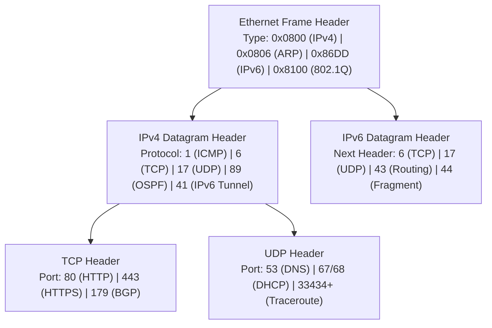

# CSE 4411 Final Exam Master Blueprint & Formula Sheet

> [!abstract] Executive Summary (Official Final Syllabus)
> This document is the **single-source master reference** for the CSE 4411 Final Examination. It consolidates all mathematical formulas, protocol header comparison matrices, and high-frequency "Why" questions across:
> - **Chapter 4:** DHCP, NAT, and IPv6 / Tunneling
> - **Chapter 5:** Routing Algorithms (Dijkstra, Bellman-Ford), OSPF, BGP-4, ICMP & Traceroute
> - **Chapter 6:** Error Detection (CRC), MAC Protocols (ALOHA, CSMA/CD), ARP, Ethernet, VLANs (802.1Q)
> - **Physical Layer:** Line Coding Schemes, Block Coding (4B/5B), Scrambling (B8ZS/HDB3), PCM / Quantization

---

## 🗺️ Master 5-Layer Protocol Architecture

| Protocol Layer | Protocol Data Unit (PDU) | Primary Addressing Scheme | Core Final Syllabus Protocols | Forwarding / Hardware Device |
| :--- | :--- | :--- | :--- | :--- |
| **5. Application** | **Message** | Domain Names / URIs | HTTP, DNS, DHCP, BGP (via TCP) | Host Endpoints, Proxies |
| **4. Transport** | **Segment** / **Datagram** | Port Numbers (16 bits: $0 - 65,535$) | TCP, UDP | Host OS, NAT Tables |
| **3. Network** | **Datagram** / **Packet** | IP Addresses (32-bit IPv4 / 128-bit IPv6) | IPv4, IPv6, ICMP, OSPF | **Routers**, Layer 3 Switches |
| **2. Data Link** | **Frame** | MAC Addresses (48-bit IEEE Hex) | Ethernet (802.3), 802.1Q VLANs, ARP | **Layer 2 Switches**, Bridges, NICs |
| **1. Physical** | **Bit** | Voltage Pulses / Optical Photons | Manchester, NRZ, AMI, 2B1Q, MLT-3, PCM | Hubs, Repeaters, Transceivers, PHY |

---

## 🧮 Master Mathematical Formula Sheet

### 1. Network Layer (Data Plane: DHCP to IPv6 - Kurose Ch 4)
- **IPv6 Payload Length:**
  $$\text{Payload Length} = \text{Total Datagram Bytes} - 40\text{ (Base Header)}$$
- **IPv6-in-IPv4 Tunneling Overhead:**
  $$\text{Total Packet Size} = 20\text{ (Outer IPv4)} + 40\text{ (Inner IPv6)} + \text{Data Payload}$$
- **NAT 16-bit Port Capacity:**
  $$\text{Max Simultaneous Connections per Public IP} \approx 65,536 - 1024 = \mathbf{64,512}$$

---

### 2. Network Layer (Control Plane - Kurose Ch 5)
- **Bellman-Ford Distance Vector Equation:**
  $$d_x(y) = \min_{v \in \text{Neighbors}(x)} \{ c(x, v) + d_v(y) \}$$
- **Dijkstra Link-State Relaxation:**
  $$D(v) = \min(D(v), D(w) + c(w, v))$$
- **Link-State Time Complexity:**
  $$\text{Min-Heap Implementation} = O(|E| + |V| \log |V|)$$

---

### 3. Link Layer & LANs (Kurose Ch 6)
- **CRC Modulo-2 Arithmetic:**
  $$R = \text{remainder}\left( \frac{D \cdot 2^r}{G} \right), \quad \text{Transmitted Frame} = D \cdot 2^r \oplus R$$
- **Pure ALOHA Maximum Efficiency:**
  $$S_{max} = \frac{1}{2e} \approx \mathbf{18.4\%}$$
- **Slotted ALOHA Maximum Efficiency:**
  $$S_{max} = \frac{1}{e} \approx \mathbf{36.8\%}$$
- **CSMA/CD Minimum Frame Size:**
  $$L_{min} \ge 2 \cdot t_{prop} \times R = \frac{2 \cdot d_{max} \cdot R}{v}$$
- **Binary Exponential Backoff Slot Multiplier:**
  $$K \in \{0, 1, 2, \dots, 2^{\min(m, 10)} - 1\} \quad (\text{Wait time } = K \times 512\text{ bit times})$$

---

### 4. Physical Layer: Digital Transmission (Forouzan Ch 4)
- **PCM Nyquist Sampling Rate:**
  $$f_s \ge 2 f_{max}$$
- **PCM Bit Rate:**
  $$N = f_s \times n_b = 2 f_{max} \times n_b \quad (\text{bps})$$
- **Signal-to-Quantization-Noise Ratio (SQNR):**
  $$\text{SNR}_{dB} = 6.02 n_b + 1.76\text{ dB}$$
- **Quantization Step Size & Error:**
  $$\Delta = \frac{V_{max} - V_{min}}{2^{n_b}}, \quad |e_q| \le \frac{\Delta}{2}$$

---

## 📦 Master Protocol Demultiplexing & Header Key Matrix

---

## 🎯 Top 10 High-Frequency Exam "Why" Questions

1. **Why does Traceroute use UDP to high ports instead of Ping Echo?**
   - Intermediate routers drop packets on $\text{TTL} = 0$ returning **ICMP Type 11 (TTL Expired)**. When the packet reaches the target host, the closed UDP port triggers **ICMP Type 3 Code 3 (Port Unreachable)**, signaling trace completion.
2. **Why did IPv6 eliminate the Header Checksum?**
   - Link-layer CRC-32 and transport-layer TCP/UDP checksums already provide error protection. Removing the network-layer checksum eliminates CPU recalculation at every router hop.
3. **Why is BGP route selection governed by `LOCAL_PREF` instead of shortest path?**
   - An ISP will route across a longer customer path (which earns revenue) rather than a shorter provider path (which incurs transit fees).
4. **Why does 4B/5B block coding exist?**
   - It guarantees that no encoded bitstream will ever have more than 3 consecutive zeros, preventing clock synchronization loss in NRZ-I without doubling bandwidth like Manchester.
5. **Why does a Self-Learning Switch populate tables using Source MAC?**
   - The switch knows with certainty that the device sending the frame is attached to the port on which that frame just arrived.
6. **Why does ARP send requests as Broadcast but replies as Unicast?**
   - The sender does not know who owns the IP (must query all nodes via Broadcast `FF:FF:FF:FF:FF:FF`). The target node learns the sender's MAC from the query and can reply directly via Unicast.
7. **Why does Hierarchical OSPF use Area 0?**
   - All inter-area traffic must traverse the Backbone Area (Area 0), creating a star topology of areas that mathematically prevents routing loops between different local areas.
8. **Why does Poisoned Reverse fail on 3-node loops?**
   - Poisoned reverse only informs direct 2-node neighbors. In a 3-node loop ($A-B-C$), node $B$ poisons route to $C$, but still announces the path to $A$, which propagates back to $C$.
9. **Why is DHCP Request broadcast instead of unicast?**
   - In networks with multiple DHCP servers, broadcasting the request informs the other servers that their offers were rejected so they can release their reserved IP addresses.
10. **Why does Scrambling (B8ZS/HDB3) have 0% bandwidth overhead compared to 4B/5B?**
    - Scrambling replaces zero sequences with intentional bipolar violations at the same pulse rate ($r=1$), adding no extra bits.

---
#### Navigation
- [[00 - Index|Chapter 4: Network Layer (DHCP to IPv6)]]
- [[00 - Index|Chapter 5: Network Layer (Control Plane)]]
- [[00 - Index|Chapter 6: Link Layer and LANs]]
- [[00 - Index|Physical Layer: Digital Transmission]]
- [[01 - Protocol Header Hex Dump Parsing Master Guide|Protocol Header Hex Dump Master Guide]]
