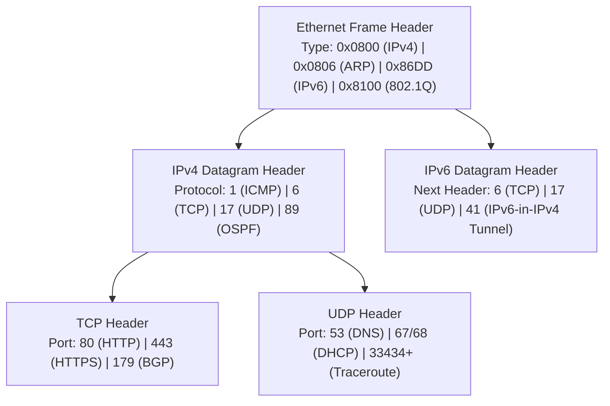

# CSE 4411 Final Exam Master Blueprint & Formula Sheet

> [!abstract] Executive Summary
> This document is the **single-source master reference** for the CSE 4411 Final Examination. It consolidates all mathematical formulas, protocol header comparison matrices, port/protocol mappings, and high-frequency "Why" questions across the entire syllabus.

---

## 🗺️ Master 5-Layer Protocol Architecture

| Protocol Layer | Protocol Data Unit (PDU) | Primary Addressing Scheme | Core Protocols & Technologies | Forwarding / Hardware Device |
| :--- | :--- | :--- | :--- | :--- |
| **5. Application** | **Message** | Domain Names / URIs | HTTP, DNS, DHCP, BGP (via TCP), RIP | Host Endpoints, Proxies, Caches |
| **4. Transport** | **Segment** (TCP) / **Datagram** (UDP) | Port Numbers (16 bits: $0 - 65,535$) | TCP, UDP, QUIC | Host OS, Stateful Firewalls, NAT |
| **3. Network** | **Datagram** / **Packet** | IP Addresses (32-bit IPv4 / 128-bit IPv6) | IPv4, IPv6, ICMP, OSPF, OpenFlow | **Routers**, Layer 3 Switches |
| **2. Data Link** | **Frame** | MAC Addresses (48-bit IEEE Hex) | Ethernet (802.3), 802.1Q VLANs, ARP, PPP | **Layer 2 Switches**, Bridges, NICs |
| **1. Physical** | **Bit** | Voltage Pulses / Optical Photons | Manchester, NRZ, AMI, 2B1Q, MLT-3, PCM | Hubs, Repeaters, Transceivers, PHY |

---

## 🧮 Master Mathematical Formula Sheet

### 1. Network Layer (Data Plane - Kurose Ch 4)
- **IPv4 Maximum Fragment Payload:**
  $$\text{Max Data Payload} = \left\lfloor \frac{\text{MTU} - 20}{8} \right\rfloor \times 8$$
- **IPv4 Fragment Offset (Header Field Value):**
  $$\text{Fragment Offset} = \frac{\text{Byte Offset in Original Datagram}}{8}$$
- **CIDR Host Address Capacity:**
  $$\text{Usable Hosts} = 2^{32 - x} - 2$$
- **Router Buffer Sizing (Stanford Rule for $N$ TCP flows):**
  $$B = \frac{\text{RTT} \times C}{\sqrt{N}}$$
- **Weighted Fair Queuing (WFQ) Throughput Share:**
  $$\text{Throughput Share}_i = R \times \frac{w_i}{\sum_{j \in \text{Active}} w_j}$$

---

### 2. Network Layer (Control Plane - Kurose Ch 5)
- **Bellman-Ford Distance Vector Equation:**
  $$d_x(y) = \min_{v \in \text{Neighbors}(x)} \{ c(x, v) + d_v(y) \}$$
- **Dijkstra Link-State Relaxation:**
  $$D(v) = \min(D(v), D(w) + c(w, v))$$
- **Link-State Time Complexity:**
  $$\text{Min-Heap Implementation} = O(|E| + |V| \log |V|)$$

---

### 3. Link Layer & LANs (Kurose Ch 6)
- **CRC Modulo-2 Arithmetic:**
  $$R = \text{remainder}\left( \frac{D \cdot 2^r}{G} \right), \quad \text{Transmitted Frame} = D \cdot 2^r \oplus R$$
- **Pure ALOHA Maximum Efficiency:**
  $$S_{max} = \frac{1}{2e} \approx \mathbf{18.4\%}$$
- **Slotted ALOHA Maximum Efficiency:**
  $$S_{max} = \frac{1}{e} \approx \mathbf{36.8\%}$$
- **CSMA/CD Minimum Frame Size:**
  $$L_{min} \ge 2 \cdot t_{prop} \times R = \frac{2 \cdot d_{max} \cdot R}{v}$$
- **Binary Exponential Backoff Slot Multiplier:**
  $$K \in \{0, 1, 2, \dots, 2^{\min(m, 10)} - 1\} \quad (\text{Wait time } = K \times 512\text{ bit times})$$

---

### 4. Physical Layer: Digital Transmission (Forouzan Ch 4)
- **Signal Rate / Baud Rate ($S$):**
  $$S = c \times N \times \frac{1}{r} \quad (\text{in baud, average } c = 1/2)$$
- **Minimum Channel Bandwidth ($B_{min}$):**
  $$B_{min} = S_{avg} = c \times N \times \frac{1}{r} \quad (\text{Hz})$$
- **Nyquist Maximum Bit Rate (Noiseless Channel):**
  $$\text{BitRate}_{max} = 2 \times B \times \log_2(L) \quad (\text{bps})$$
- **Shannon Channel Capacity (Noisy Channel):**
  $$C = B \times \log_2(1 + \text{SNR}) \quad (\text{where } \text{SNR} = 10^{\text{SNR}_{dB}/10})$$
- **PCM Nyquist Sampling Rate:**
  $$f_s \ge 2 f_{max}$$
- **PCM Bit Rate:**
  $$N = f_s \times n_b = 2 f_{max} \times n_b \quad (\text{bps})$$
- **Signal-to-Quantization-Noise Ratio (SQNR):**
  $$\text{SNR}_{dB} = 6.02 n_b + 1.76\text{ dB}$$
- **Asynchronous Serial Framing Overhead:**
  $$\text{Overhead \%} = \frac{\text{Start} + \text{Stop} + \text{Parity Bits}}{\text{Total Bits}} \times 100\%$$

---

## 📦 Master Protocol Demultiplexing & Header Key Matrix

---

## 🎯 Top 10 High-Frequency Exam "Why" Questions

1. **Why does Traceroute use UDP to high ports instead of Ping Echo?**
   - Intermediate routers drop packets on $\text{TTL} = 0$ returning **ICMP Type 11 (TTL Expired)**. When the packet reaches the target host, the closed UDP port triggers **ICMP Type 3 Code 3 (Port Unreachable)**, signaling trace completion.
2. **Why did IPv6 eliminate the Header Checksum?**
   - Link-layer CRC-32 and transport-layer TCP/UDP checksums already provide error protection. Removing the network-layer checksum eliminates CPU recalculation at every router hop, drastically boosting forwarding throughput.
3. **Why is Fragment Offset scaled by 8 bytes?**
   - The 13-bit offset field can only represent up to 8191. Scaling by 8 ($8191 \times 8 = 65,528$) allows it to cover the full 65,535-byte maximum IP datagram size.
4. **Why is BGP route selection governed by `LOCAL_PREF` instead of shortest path?**
   - The Internet is commercial; an ISP will route across a longer customer path (which earns revenue) rather than a shorter provider path (which incurs transit fees).
5. **Why can't CSMA/CD be used in 802.11 Wi-Fi?**
   - A wireless radio's own transmission overwhelms its receiver, preventing it from detecting incoming collisions while transmitting. (Wi-Fi uses **CSMA/CA** with RTS/CTS instead).
6. **Why does 4B/5B block coding exist?**
   - It guarantees that no encoded bitstream will ever have more than 3 consecutive zeros, preventing clock synchronization loss in NRZ-I without doubling bandwidth like Manchester.
7. **Why does a Self-Learning Switch populate tables using Source MAC?**
   - The switch knows with certainty that the device sending the frame is attached to the port on which that frame just arrived.
8. **Why does ARP send requests as Broadcast but replies as Unicast?**
   - The sender does not know who owns the IP (must query all nodes via Broadcast `FF:FF:FF:FF:FF:FF`). The target node learns the sender's MAC from the query and can reply directly via Unicast.
9. **Why does Hierarchical OSPF use Area 0?**
   - All inter-area traffic must traverse the Backbone Area (Area 0), creating a star topology of areas that mathematically prevents routing loops between different local areas.
10. **Why does Poisoned Reverse fail on 3-node loops?**
    - Poisoned reverse only informs direct 2-node neighbors. In a 3-node loop ($A-B-C$), node $B$ poisons route to $C$, but still announces the path to $A$, which propagates back to $C$.

---
#### Navigation
- [[00 - Index|Chapter 4: Network Layer - Data Plane]]
- [[00 - Index|Chapter 5: Network Layer - Control Plane]]
- [[00 - Index|Chapter 6: Link Layer and LANs]]
- [[00 - Index|Physical Layer: Digital Transmission]]
