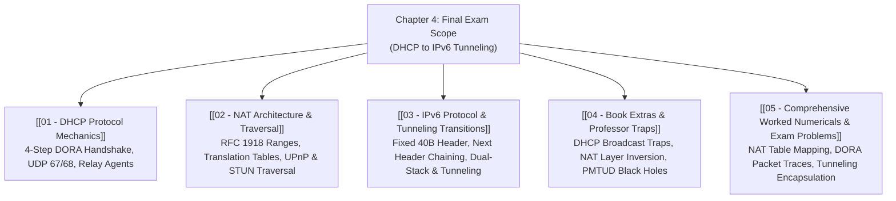

# Chapter 4: Network Layer (DHCP to IPv6 Tunneling)

> [!abstract] Final Exam Roadmap (Official Scope)
> For the CSE 4411 Final Examination, the Chapter 4 scope strictly spans **from DHCP to IPv6 Tunneling**:
> 1. **DHCP (Dynamic Host Configuration Protocol):** The 4-step DORA handshake, UDP ports 67/68, network parameter bootstrapping, and DHCP Relay Agents.
> 2. **NAT (Network Address Translation):** RFC 1918 private address ranges, NAT translation tables, 16-bit port capacity, traversal techniques (UPnP/STUN), and architectural controversies.
> 3. **IPv6 Protocol:** The fixed 40-byte base header layout, removed fields (checksum & router fragmentation), and transition mechanisms (**Dual-Stack & IPv6-in-IPv4 Tunneling**).

---

## 🗺️ Visual Navigation Map

---

## 📑 Note Registry

| # | Note Document | Core Question Answered | High-Yield Topics |
| :---: | :--- | :--- | :--- |
| **01** | [[01 - DHCP Protocol Mechanics]] | *How does a joining host dynamically bootstrap its IP configuration?* | 4-step DORA (Discover, Offer, Request, ACK), UDP Ports 67/68, Lease Renewal, DHCP Relay |
| **02** | [[02 - NAT Architecture & Traversal]] | *How do private home devices share a single public IP address?* | RFC 1918 Private Ranges, NAPT Translation Tables, Port Capacity ($>60,000$), UPnP / STUN Traversal |
| **03** | [[03 - IPv6 Protocol & Tunneling Transitions]] | *Why did IPv6 change header format and how does tunneling bridge IPv4 networks?* | 40-byte Fixed Base Header, Removed Checksum/Fragmentation, Dual-Stack & IPv6-in-IPv4 Tunneling |
| **04** | [[04 - Book Extras & Professor Traps]] | *What subtle edge cases do professors test on DHCP, NAT, and IPv6?* | Why DHCP Request is Broadcast, NAT Layer Inversion, PMTUD ICMPv6 Black Holes |
| **05** | [[05 - Comprehensive Worked Numericals & Exam Problems]] | *How do you solve NAT translation and IPv6 tunneling problems step-by-step?* | NAT table state tracking, DORA header parameter extraction, Tunneling byte overhead |

---
#### Navigation
Next → [[01 - DHCP Protocol Mechanics]]
