# Chapter 4: Network Layer — Data Plane

> [!abstract] Executive Summary & Roadmap
> The **Network Layer: Data Plane** encompasses the per-router, per-packet physical and logical machinery responsible for determining how an arriving datagram on an input link is switched and forwarded to the appropriate output link. 
> 
> While the **Control Plane** (Chapter 5) computes end-to-end network paths (routing), the **Data Plane** operates entirely at nanosecond hardware line speeds within individual routers (forwarding).

---

## 🗺️ Master Visual Navigation Map

```mermaid
flowchart TD
    Ch4["Chapter 4: Network Layer - Data Plane"]
    
    Ch4 --> Sec1["[[01 - Data Plane vs Control Plane]]<br>Service Models & Forwarding vs Routing"]
    Ch4 --> Sec2["[[02 - Router Architecture & Switching Fabrics]]<br>Input Ports, Fabrics (Memory/Bus/Crossbar) & HOL Blocking"]
    Ch4 --> Sec3["[[03 - Queuing, Buffering & Scheduling]]<br>Buffer Sizing Math, Drop Policies & Packet Schedulers"]
    Ch4 --> Sec4["[[04 - IP Datagram Format & Fragmentation]]<br>IPv4 Header Layout & Multi-Fragment Math"]
    Ch4 --> Sec5["[[05 - IP Addressing, Subnets & CIDR]]<br>CIDR Carving, Subnetting Math & Longest Prefix Match"]
    Ch4 --> Sec6["[[06 - DHCP Protocol Mechanics]]<br>4-Step DORA Handshake, UDP 67/68 & Scenarios"]
    Ch4 --> Sec7["[[07 - NAT Architecture & Traversal]]<br>Translation Tables, Port Mapping & UPnP/STUN Traversal"]
    Ch4 --> Sec8["[[08 - IPv6 Protocol & Tunneling Transitions]]<br>128-bit Addressing, Header Changes & Dual-Stack Tunneling"]
    Ch4 --> Sec9["[[09 - Generalized Forwarding & SDN (OpenFlow)]]<br>Match + Action Flow Tables & Multi-Layer Forwarding"]
    Ch4 --> Sec10["[[10 - Middleboxes & Internet Architecture]]<br>Firewalls, IDS, Caches & Architectural Debates"]
    Ch4 --> Sec11["[[11 - Book Extras & Professor Traps]]<br>Hidden Edge Cases, MTU Traps & Exam Pitfalls"]
    Ch4 --> Sec12["[[12 - Comprehensive Worked Numericals & Exam Problems]]<br>Step-by-Step Numerical Practice Set"]
```

---

## 📑 Detailed Note Registry

| # | Note Document | Core Question Answered | High-Yield Topics |
| :---: | :--- | :--- | :--- |
| **01** | [[01 - Data Plane vs Control Plane]] | *What is the fundamental divide between forwarding and routing?* | Data Plane vs Control Plane, Best-Effort Service Model, Forwarding Tables |
| **02** | [[02 - Router Architecture & Switching Fabrics]] | *How does a hardware router switch packets at multi-gigabit line rates?* | Input Port Processing, Memory/Bus/Crossbar Fabrics, Head-of-Line (HOL) Blocking |
| **03** | [[03 - Queuing, Buffering & Scheduling]] | *What happens when traffic surges and queues overflow?* | Buffer Sizing Rule-of-Thumb ($RTT \cdot C / \sqrt{N}$), RED Drop Policy, FIFO, Priority, RR, WFQ |
| **04** | [[04 - IP Datagram Format & Fragmentation]] | *How is an IPv4 datagram constructed and sliced over low-MTU links?* | 20B Header Fields, Identification, Flags (DF/MF), Offset in 8-byte units |
| **05** | [[05 - IP Addressing, Subnets & CIDR]] | *How is the 32-bit address space hierarchically partitioned?* | CIDR notation ($/x$), Subnet Masking, Address Allocation, Longest Prefix Match (TCAM) |
| **06** | [[06 - DHCP Protocol Mechanics]] | *How does a device dynamically bootstrap network configuration?* | 4-step DORA (Discover, Offer, Request, ACK), UDP Ports 67 & 68, Lease Renewal |
| **07** | [[07 - NAT Architecture & Traversal]] | *How do private home networks share a single public IP address?* | RFC 1918 Private Ranges, NAT Translation Tables, Port Capacity, NAT Traversal (STUN/UPnP) |
| **08** | [[08 - IPv6 Protocol & Tunneling Transitions]] | *Why did IPv6 change the header format and how is migration handled?* | 40-byte Fixed Header, Next Header Chaining, Dual-Stack IPv4/IPv6 Tunneling |
| **09** | [[09 - Generalized Forwarding & SDN (OpenFlow)]]| *How does OpenFlow replace rigid destination-based routing tables?* | Match + Action Paradigm, Flow Tables, Wildcard Matching across L2/L3/L4 |
| **10** | [[10 - Middleboxes & Internet Architecture]] | *How do middleboxes alter the classic "Dumb Core, Smart Edge" model?* | Firewalls, Proxies, IDSs, Load Balancers, Architectural Violations |
| **11** | [[11 - Book Extras & Professor Traps]] | *What obscure edge cases do professors test from the textbook?* | Zero-offset traps, Header checksum recalculation, Route aggregation ambiguity |
| **12** | [[12 - Comprehensive Worked Numericals & Exam Problems]] | *How do you solve exam numericals with 100% accuracy?* | Fragmentation walkthroughs, CIDR block allocation, WFQ scheduling rounds |

---

## 🎯 Exam Strategy & Grade Maximizer
1. **Always calculate fragmentation offsets in 8-byte blocks**: $\text{Offset} = \frac{\text{Byte Offset}}{8}$.
2. **Never drop the 20-byte IP header** when calculating data payload capacity over an MTU link: $\text{Max Payload} = \lfloor \frac{\text{MTU} - 20}{8} \rfloor \times 8$.
3. **Longest Prefix Matching**: Always match the destination IP against the table entry with the **largest prefix length** (most specific subnet).

---
#### Navigation
Next → [[01 - Data Plane vs Control Plane]]
