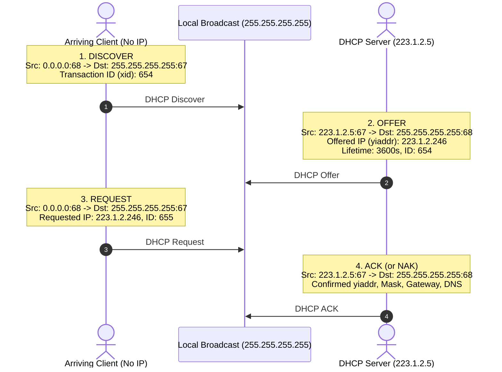

# 01 - DHCP Protocol Mechanics

> [!abstract] Key Takeaway
> **DHCP (Dynamic Host Configuration Protocol - RFC 2131)** is an application-layer protocol running over **UDP (Ports 67 & 68)** that automatically configures joining hosts with:
> 1. Allocated Client IP Address (`yiaddr` - "your IP address")
> 2. Subnet Mask (e.g., `255.255.255.0` or `/24`)
> 3. First-Hop Router IP (Default Gateway)
> 4. Local DNS Server IP Address

---

## 1. The 4-Step DORA Handshake



---

## 2. Header & Payload Dissection Across DORA

| DORA Step | Message Type | Source IP | Destination IP | Source / Dest Port | Key DHCP Payload Fields |
| :---: | :--- | :---: | :---: | :---: | :--- |
| **D** | **DHCP Discover** | `0.0.0.0` | `255.255.255.255` | `68` $\to$ `67` | `xid = 654`, Client MAC: `00:22:6B:45:1F:B1` |
| **O** | **DHCP Offer** | `223.1.2.5` | `255.255.255.255` | `67` $\to$ `68` | `xid = 654`, `yiaddr = 223.1.2.246`, Lease: `3600s` |
| **R** | **DHCP Request** | `0.0.0.0` | `255.255.255.255` | `68` $\to$ `67` | `xid = 655`, Server ID: `223.1.2.5`, Requested IP: `223.1.2.246` |
| **A** | **DHCP ACK** | `223.1.2.5` | `255.255.255.255` | `67` $\to$ `68` | `xid = 655`, `yiaddr = 223.1.2.246`, Netmask: `/24`, Gateway: `223.1.2.1`, DNS: `8.8.8.8` |

---

## 3. Four Core Configuration Parameters Delivered

Upon receiving the **DHCP ACK**, the client operating system configures its local network stack:
1. **Allocated Client IP Address:** Unique unicast IP (e.g., `192.168.1.100`).
2. **Subnet Mask:** Defines the local subnet boundary (e.g., `255.255.255.0`).
3. **First-Hop Router (Default Gateway):** Router interface IP needed to reach external networks (e.g., `192.168.1.1`).
4. **Local DNS Server IP:** Needed to resolve human-readable domain names to IP addresses (e.g., `8.8.8.8`).

---

## 4. DHCP Relay Agent (Multi-Subnet Architecture)

```mermaid
flowchart LR
    Client["Client (Subnet A)"] -->|Broadcast Discover (255.255.255.255)| Router["Router / DHCP Relay Agent<br>(ip helper-address 10.0.0.5)"]
    Router -->|Unicast Discover (10.0.0.5)| Server["Central DHCP Server<br>(Subnet C: 10.0.0.5)"]
```

> [!info] Why DHCP Relay Agents are Required
> Because routers **block broadcast traffic by default**, a local router configured with an `ip helper-address` intercepts broadcast DHCP Discovers and forwards them as **unicast UDP datagrams** to a centralized DHCP server.

---

## 5. "Why" Questions & Exam Traps

> [!warning] Exam Trap: Why is DHCP Request (Step 3) broadcast instead of unicast?
> **Answer:**
> In networks with **multiple DHCP servers**, an arriving client receives multiple DHCP Offers. When the client chooses one offer, broadcasting the DHCP Request notifies **all other DHCP servers** that their offers were not accepted, allowing them to release those reserved IP addresses back into their available pools.

> [!question] Why does DHCP use UDP instead of TCP?
> **Answer:**
> TCP requires a 3-way handshake (`SYN`, `SYN-ACK`, `ACK`), which requires both endpoints to already possess valid, unique unicast IP addresses. Because a newly joining host has no IP address, TCP cannot establish a connection; broadcast UDP is required.

---
#### Navigation
← Previous: [[00 - Index]] | Next: [[02 - NAT Architecture & Traversal]] →
