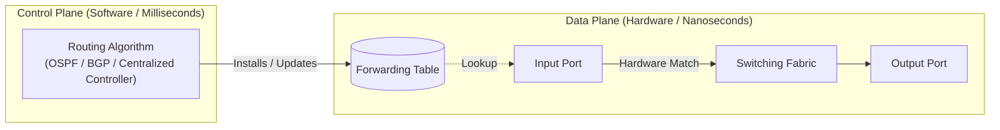
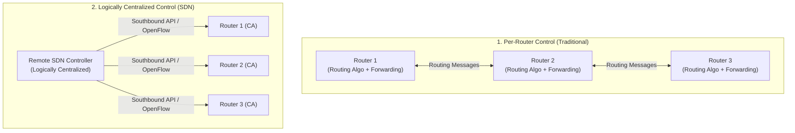

# 01 - Data Plane vs Control Plane

> [!abstract] Key Takeaway
> The network layer is divided into two distinct planes:
> - **Data Plane (Forwarding):** Local, per-router function implemented in **hardware (nanoseconds)** that moves packets from an input link interface to the appropriate output link interface.
> - **Control Plane (Routing):** Network-wide logic implemented in **software (milliseconds/seconds)** that determines the end-to-end path taken by packets from source to destination.

---

## 1. Core Concept & Intuitive Mental Model

```
           [ ROAD TRIP ANALOGY ]
==================================================
 Routing (Control Plane)  : Planning the route on a map
 Forwarding (Data Plane)  : Passing through an interchange
==================================================
```

- **Forwarding (Data Plane):** When a driver arrives at a roundabout, they look at the local overhead exit sign and immediately take Exit 3. This is an instantaneous, local action.
- **Routing (Control Plane):** Before leaving the driveway, the driver opens Google Maps to compute the entire sequence of highways and turns needed to drive from Dhaka to Chittagong.



---

## 2. Technical Comparison: Data Plane vs Control Plane

| Architectural Dimension | Data Plane (Forwarding) | Control Plane (Routing) |
| :--- | :--- | :--- |
| **Primary Function** | Transfer packet from input port to output port | Determine end-to-end path through network |
| **Scope of Operation** | **Local, per-router** (individual device) | **Network-wide** (coordinated across many devices) |
| **Implementation** | Specialized **Hardware** (ASICs, TCAMs) | General-purpose **Software** (CPU, Linux daemon, SDN controller) |
| **Execution Timescale** | **Nanoseconds** ($\approx 10 - 100\text{ ns}$) | **Milliseconds to Seconds** ($\approx 10\text{ ms} - 10\text{ s}$) |
| **Key Abstraction** | Forwarding Table / Flow Table | Routing Protocol (OSPF, BGP, Bellman-Ford, Dijkstra) |
| **Protocol Layer** | Layer 3 data path | Layer 3 management / Layer 7 application (BGP over TCP) |

---

## 3. Network Service Models

The network layer provides an interface between sending and receiving hosts. Different network architectures define different guarantees (service models).

### Comparison of Service Models

| Network Architecture | Service Model | Bandwidth Guarantee | Loss Guarantee | Order Guarantee | Timing Guarantee | Congestion Feedback |
| :--- | :--- | :---: | :---: | :---: | :---: | :---: |
| **Internet (IP)** | **Best-Effort** | **None** | **None** | **None** (Packets can reorder) | **None** | **None** (Except implicit loss / ECN) |
| **ATM CBR** (Constant Bit Rate) | Constant rate | Constant rate | Yes ($\le \epsilon$) | Yes (Strict in-order) | Strict bound | No congestion |
| **ATM VBR** (Variable Bit Rate) | Guaranteed rate | Guaranteed rate | Yes ($\le \epsilon$) | Yes | Bound | No congestion |
| **ATM ABR** (Available Bit Rate) | Elastic min rate | Minimum rate guaranteed | None | Yes | None | Congestion feedback provided |

> [!info] Why the Internet chose "Best-Effort"
> 1. **Simplicity at the Core:** Routers do not need complex state management, per-flow bandwidth reservation, or admission control.
> 2. **Cheap Hardware:** Best-effort routers are dramatically simpler and faster to build.
> 3. **Flexibility:** Higher-layer protocols at the network edge (e.g., TCP) provide reliability and congestion control as needed, following the **End-to-End Principle**.

---

## 4. Control Plane Architectural Approaches



1. **Traditional Per-Router Control:**
   - Every router runs an individual routing algorithm component (e.g., OSPF, BGP).
   - Routers talk to neighbors to exchange topology/link state and calculate their own forwarding tables.
2. **Logically Centralized Control (Software-Defined Networking - SDN):**
   - A remote controller computes forwarding tables centrally and installs them on routers via a **Control Agent (CA)** using a standardized protocol (such as OpenFlow).

---

## 5. "Why" Questions & Exam Traps

> [!warning] Exam Trap: Forwarding Table vs Routing Table
> - **Routing Table:** Maintained by the **Control Plane** software in RAM. Contains all candidate routes, routing protocol metrics, neighbor states, and administrative distances.
> - **Forwarding Table (FIB - Forwarding Information Base):** Maintained by the **Data Plane** in fast hardware memory (TCAM/SRAM). Contains only the optimized, compressed next-hop mapping used directly to forward arriving packets.

> [!question] High-Frequency Exam Question: Why is forwarding implemented in hardware while routing is in software?
> **Answer:**
> - A 100 Gbps router port receiving minimum-size 64-byte packets processes $\approx 148.8\text{ million packets/second}$, giving a time budget of only **$6.72\text{ nanoseconds}$** per packet. Software CPU lookups cannot keep pace; dedicated ASIC/TCAM hardware is required.
> - Routing calculations (e.g., Dijkstra's algorithm) occur only when topology changes or periodically (every few seconds), allowing ample time for software execution.

---
#### Navigation
← Previous: [[00 - Index]] | Next: [[02 - Router Architecture & Switching Fabrics]] →
