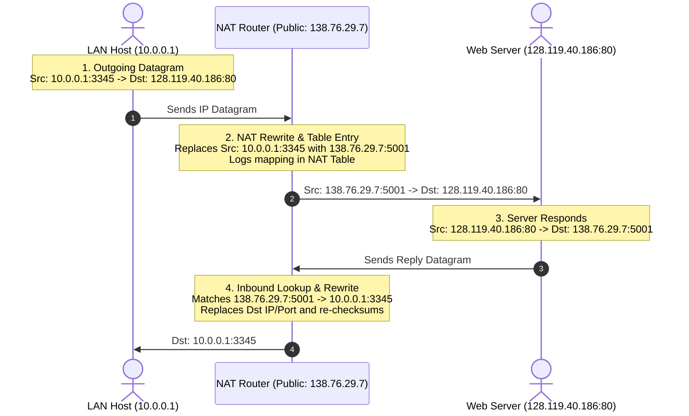
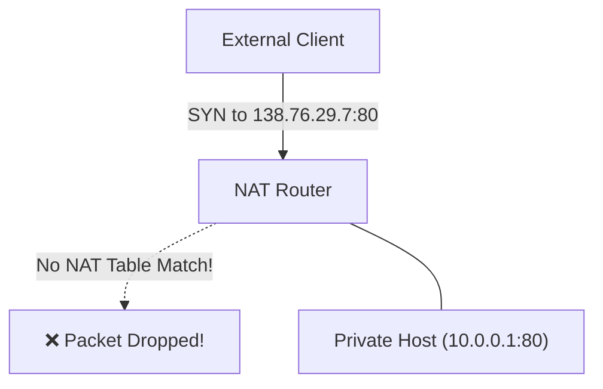

# 02 - NAT Architecture & Traversal

> [!abstract] Key Takeaway
> **NAT (Network Address Translation - RFC 3022)** maps an entire local network of private RFC 1918 IP addresses to a **single public IP address** by translating both IP addresses and Layer 4 **port numbers** (NAPT).

---

## 1. RFC 1918 Private IP Address Spaces

Private address blocks are reserved strictly for internal enterprise/home networks and are **never routed on the public Internet**:

| Private Prefix | Subnet Mask | IP Range | Available Addresses |
| :--- | :--- | :--- | :---: |
| **`10.0.0.0/8`** | `255.0.0.0` | `10.0.0.0` – `10.255.255.255` | $16,777,216$ ($16.7\text{M}$) |
| **`172.16.0.0/12`** | `255.240.0.0` | `172.16.0.0` – `172.31.255.255` | $1,048,576$ ($1.04\text{M}$) |
| **`192.168.0.0/16`** | `255.255.0.0` | `192.168.0.0` – `192.168.255.255` | $65,536$ |

---

## 2. NAT Translation Mechanism (Step-by-Step Flow)

### The NAT Translation Table

| WAN (Public) Side Address | LAN (Private) Side Address | Protocol |
| :---: | :---: | :---: |
| `138.76.29.7, 5001` | `10.0.0.1, 3345` | TCP |
| `138.76.29.7, 5002` | `10.0.0.2, 3345` | TCP |
| `138.76.29.7, 5003` | `10.0.0.3, 4421` | UDP |

- **Capacity:** Because the 16-bit port number field spans $2^{16} = 65,536$ values, a single public IP address can support **$> 60,000$ simultaneous active TCP/UDP connections**.

---

## 3. The NAT Traversal Problem (P2P & Inbound Connections)

> [!warning] The Inbound Connection Failure
> If a client outside the local network attempts to initiate a connection to a private server (e.g., `10.0.0.1:80`) behind NAT, the inbound packet arriving at `138.76.29.7:80` is **immediately dropped** because no entry exists in the NAT table for that incoming port!

### Three Standard NAT Traversal Solutions
1. **Static Port Forwarding:** Administrator manually configures a permanent rule: `(138.76.29.7:80) -> (10.0.0.1:80)`.
2. **UPnP (Universal Plug and Play) / IGD:** Client software behind NAT dynamically requests and leases a public port mapping from the router automatically.
3. **Relay Servers (TURN / STUN):** Both communicating peers establish outbound connections to an intermediate rendezvous server that bridges the traffic.

---

## 4. Architectural Controversies

1. **Layer Inversion:** Routers are strictly **Layer 3 devices**; modifying Layer 4 TCP/UDP port fields violates clean protocol layering.
2. **Violation of the End-to-End Principle:** The Internet architecture assumes hosts communicate directly without stateful middlebox translation.
3. **Impedes P2P Applications:** Breaks direct peer-to-peer applications (VoIP, BitTorrent, WebRTC).

---
#### Navigation
← Previous: [[01 - DHCP Protocol Mechanics]] | Next: [[03 - IPv6 Protocol & Tunneling Transitions]] →
