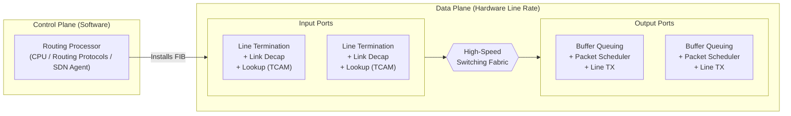
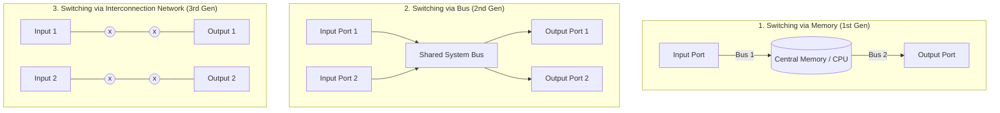

# 02 - Router Architecture & Switching Fabrics

> [!abstract] Key Takeaway
> A high-performance router consists of four primary components:
> 1. **Input Ports:** Perform physical layer termination, link-layer decapsulation, and decentralized hardware table lookup (TCAM).
> 2. **Switching Fabric:** The internal hardware network transferring packets from input ports to output ports.
> 3. **Output Ports:** Store packets in output buffers and schedule them for transmission onto the outgoing physical link.
> 4. **Routing Processor:** The control plane CPU executing routing protocols (OSPF, BGP) and installing forwarding tables into line card hardware.

---

## 1. High-Level Router Architecture



---

## 2. Input Port Processing & Decentralized Forwarding

An input port performs three sequential operations:

```
+------------------+     +-------------------+     +-------------------------+
|  Physical Layer  | --> |  Data Link Layer  | --> | Decentralized Lookup    | --> To Switching
| Line Termination |     |   Decapsulation   |     | & Forwarding (FIB/TCAM) |     Fabric
+------------------+     +-------------------+     +-------------------------+
```

1. **Physical Layer Line Termination:** Converts incoming optical/electrical signals into raw bits.
2. **Data Link Layer Processing:** Checks Ethernet CRC frame checksum, validates MAC address, and decapsulates the Layer 3 IP datagram.
3. **Decentralized Lookup:**
   - A copy of the **Forwarding Information Base (FIB)** is shadowed onto every line card's local memory.
   - **Goal:** Lookup is completed locally on the line card without accessing the central Routing Processor CPU, avoiding central bottlenecks.
   - Uses **TCAM (Ternary Content Addressable Memory)** to perform constant-time $O(1)$ Longest Prefix Match (LPM) lookups in nanoseconds.

---

## 3. Switching Fabrics: The Three Generations

The switching fabric is the heart of the router. It moves packets from input buffers to output buffers.



### Architectural Comparison of Switching Fabrics

| Fabric Type | Architecture & Mechanism | Bandwidth Limitation | Parallel Transfers? | Typical Usage |
| :--- | :--- | :--- | :---: | :--- |
| **Via Memory** | First-generation routers; packet copied to main RAM by CPU and copied out to output port. | **$\le \frac{\text{Memory Bandwidth}}{2}$** (Each packet crosses system bus twice). | ❌ No | Low-end enterprise / soft-routers |
| **Via Bus** | Input port puts packet directly on a shared backplane bus; output port matching destination address reads it. | **Bus Bandwidth ($B$)**; all ports compete for the single bus. | ❌ No (Only 1 packet at a time) | Small branch routers ($< 10\text{ Gbps}$) |
| **Via Interconnection Network (Crossbar)** | $N \times N$ matrix of crosspoint switches connecting $N$ inputs to $N$ outputs; advanced multistage Clos/Banyan networks. | Scalable up to **$N \times R_{line}$** aggregated fabric speed. | ✅ **Yes** (Up to $N$ simultaneous packets to distinct outputs) | High-end core routers (Tbps scale) |

---

## 4. Head-of-Line (HOL) Blocking

> [!warning] Exam Trap: Head-of-Line (HOL) Blocking
> **Definition:** A queued packet in an input port must wait for the switching fabric because its destination output port is busy. Consequently, **all packets queued behind it are blocked**, even if their destination output ports are completely idle.

```
Input Port 1 Queue: [ Dst: Port 2 ]  [ Dst: Port 1 (BLOCKED!) ]
                          │
                          ▼ (Contending for Output 2)
Input Port 2 Queue: [ Dst: Port 2 ]  [ Dst: Port 3 ]

Output Port 1: IDLE! (Yet blocked by packet in Input Port 1)
Output Port 2: BUSY (Handling collision between Input 1 and 2)
```

### Mathematical Bound of HOL Blocking
Under FIFO queueing at input ports with independent, uniformly distributed destination traffic:
$$\text{Max Theoretical Throughput} = 2 - \sqrt{2} \approx 58.58\%$$
*Even with infinitely fast crossbar fabric, input-queued FIFO routers saturate at $\approx 58.6\%$ utilization due to HOL blocking.*

### Solution: Virtual Output Queuing (VOQ)
Instead of a single FIFO queue, each input port maintains **$N$ separate queues** (one for each output port):
- Packets destined for Port 1 do not block behind packets destined for Port 2.
- A centralized arbiter matches inputs to outputs using maximum bipartite matching (e.g., iSLIP algorithm), restoring throughput to $\approx 100\%$.

---

## 5. "Why" Questions & Exam Traps

> [!question] Why does a router need output port buffers even if the switching fabric is $N$ times faster than the line rate?
> **Answer:**
> If $N$ input ports simultaneously receive packets destined for the **exact same output port**, the fabric will switch all $N$ packets to that output port concurrently. Because the output port physical link can only transmit **one packet at a time**, the remaining $N-1$ packets must be queued in the output buffer to prevent packet loss.

---
#### Navigation
← Previous: [[01 - Data Plane vs Control Plane]] | Next: [[03 - Queuing, Buffering & Scheduling]] →
