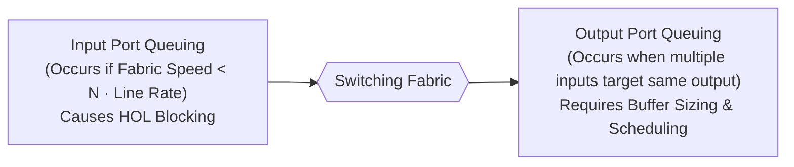
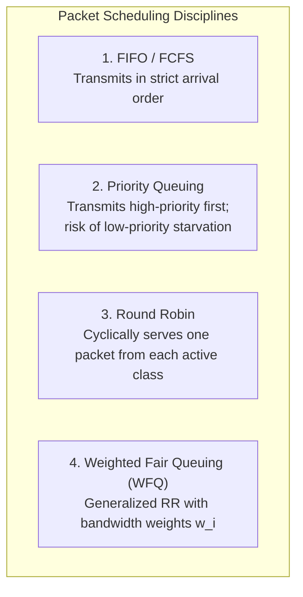

# 03 - Queuing, Buffering & Scheduling

> [!abstract] Key Takeaway
> Router buffers prevent packet loss during transient bursts, but oversized buffers cause **Bufferbloat** (massive latency). 
> Modern networks use **$B = \frac{\text{RTT} \cdot C}{\sqrt{N}}$** for buffer sizing, **Random Early Detection (RED)** for early congestion notification, and **Weighted Fair Queuing (WFQ)** for proportional bandwidth allocation.

---

## 1. Where Does Queuing Occur?



---

## 2. Router Buffer Sizing Mathematics

Buffers are required at output ports to absorb traffic bursts while TCP senders adapt their congestion windows ($cwnd$).

### The Two Buffer Sizing Formulas

1. **Traditional Rule of Thumb (Single TCP Flow):**
   $$B = \text{RTT} \times C$$
   - $\text{RTT}$ = Average Round-Trip Time ($\approx 250\text{ ms}$).
   - $C$ = Link Capacity (e.g., $10\text{ Gbps}$).

2. **Modern Stanford Sizing Rule ($N$ Independent TCP Flows):**
   $$B = \frac{\text{RTT} \times C}{\sqrt{N}}$$
   - When a large number $N$ of desynchronized TCP flows share the bottleneck link, the variance of the aggregate traffic drops by $\sqrt{N}$ due to the Central Limit Theorem.

> [!example]- Worked Problem: Buffer Sizing Calculation
> **Scenario:** A core router output port has capacity $C = 10\text{ Gbps}$ and an average RTT of $200\text{ ms}$. 
> 
> **Question 1:** Calculate required buffer size using the traditional formula.
> $$B = 0.200\text{ s} \times 10 \times 10^9\text{ bps} = 2 \times 10^9\text{ bits} = 250\text{ MB}$$
> 
> **Question 2:** Calculate required buffer size if $N = 400$ independent TCP flows pass through the link.
> $$B = \frac{250\text{ MB}}{\sqrt{400}} = \frac{250\text{ MB}}{20} = 12.5\text{ MB}$$
> *(A $95\%$ reduction in required expensive on-chip SRAM!)*

---

## 3. Bufferbloat & Active Queue Management (AQM)

```
Packets Accumulating in Massive Output Buffer:
[Packet 1] [Packet 2] [Packet 3] ... [Packet 5000] ──► [Slow Bottleneck Link (e.g., ADSL/Cable)]
▲
│
└─ Latency grows from 20ms to 2000ms because TCP only slows down when packets drop!
```

> [!warning] Exam Trap: Bufferbloat
> **Bufferbloat** is the phenomenon where excessively large router buffers stay full under TCP traffic. Because standard TCP increases $cwnd$ until it sees a drop, large buffers delay packet loss, resulting in **seconds of queuing delay** without any throughput improvement.

### Drop Policies: Tail Drop vs RED

| Metric / Property | Tail Drop (Default) | Random Early Detection (RED) |
| :--- | :--- | :--- |
| **Mechanism** | Drops arriving packet only when buffer is $100\%$ full. | Computes average queue length; randomly drops/marks packets with increasing probability as queue grows. |
| **TCP Synchronization** | **Causes Global Synchronization** (all flows drop $cwnd$ simultaneously, collapsing link utilization). | **Prevents Global Synchronization** by signaling individual flows early. |
| **Latency Profile** | High standing queue latency (Bufferbloat). | Low average latency with high link utilization. |

---

## 4. Packet Scheduling Disciplines

Packet scheduling decides **which queued packet to transmit next** onto the physical link. All realistic packet schedulers are **work-conserving** (they never leave the link idle if there is at least one packet waiting).



### Deep Dive: Weighted Fair Queuing (WFQ)

Each queue $i$ is assigned a weight $w_i$. If multiple classes have backlogged packets, Class $i$ receives a guaranteed share of total transmission capacity $R$:

$$\text{Throughput Share}_i = R \times \frac{w_i}{\sum_{j \in \text{Active}} w_j}$$

> [!example]- Step-by-Step Numerical: WFQ Scheduling
> **Problem:** An output link operates at $R = 10\text{ Mbps}$. Three classes of traffic arrive with weights $w_1 = 1$, $w_2 = 2$, and $w_3 = 2$.
> 
> **Question 1:** If all three classes have packets queued, what bandwidth does each receive?
> $$\text{Total Weight} = 1 + 2 + 2 = 5$$
> - $\text{Class 1} = 10\text{ Mbps} \times \frac{1}{5} = 2\text{ Mbps}$
> - $\text{Class 2} = 10\text{ Mbps} \times \frac{2}{5} = 4\text{ Mbps}$
> - $\text{Class 3} = 10\text{ Mbps} \times \frac{2}{5} = 4\text{ Mbps}$
> 
> **Question 2:** If Class 1 queue becomes empty, how is bandwidth dynamically redistributed?
> $$\text{Active Weight} = 2 + 2 = 4$$
> - $\text{Class 2} = 10\text{ Mbps} \times \frac{2}{4} = 5\text{ Mbps}$
> - $\text{Class 3} = 10\text{ Mbps} \times \frac{2}{4} = 5\text{ Mbps}$

---

## 5. "Why" Questions & Exam Traps

> [!question] What is the difference between non-preemptive priority queuing and preemptive priority queuing?
> **Answer:**
> - In **non-preemptive priority queuing** (standard in routers), if transmission of a low-priority packet has already begun on the wire, an arriving high-priority packet must wait until the current transmission finishes.
> - Routers do not interrupt packet transmissions mid-frame because doing so would corrupt the physical frame on the link and waste link bandwidth.

---
#### Navigation
← Previous: [[02 - Router Architecture & Switching Fabrics]] | Next: [[04 - IP Datagram Format & Fragmentation]] →
