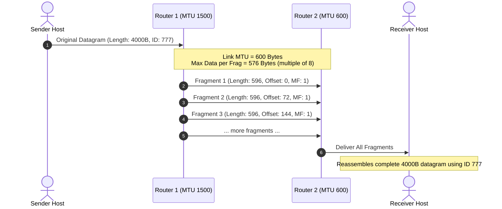

# 04 - IP Datagram Format & Fragmentation

> [!abstract] Key Takeaway
> - The standard IPv4 header is **20 bytes** minimum.
> - When a datagram exceeds the link layer's **Maximum Transmission Unit (MTU)**, it is divided into fragments.
> - **Reassembly occurs only at the final destination host**, never at intermediate routers.
> - **Fragment Offset** is strictly measured in **8-byte (64-bit) units**.

---

## 1. IPv4 Datagram Header Architecture

```
 0                   1                   2                   3
 0 1 2 3 4 5 6 7 8 9 0 1 2 3 4 5 6 7 8 9 0 1 2 3 4 5 6 7 8 9 0 1
+-+-+-+-+-+-+-+-+-+-+-+-+-+-+-+-+-+-+-+-+-+-+-+-+-+-+-+-+-+-+-+-+
|Version|  IHL  |Type of Service|          Total Length         |
+-+-+-+-+-+-+-+-+-+-+-+-+-+-+-+-+-+-+-+-+-+-+-+-+-+-+-+-+-+-+-+-+
|         Identification        |Flags|     Fragment Offset     |
+-+-+-+-+-+-+-+-+-+-+-+-+-+-+-+-+-+-+-+-+-+-+-+-+-+-+-+-+-+-+-+-+
|  Time to Live |    Protocol   |        Header Checksum        |
+-+-+-+-+-+-+-+-+-+-+-+-+-+-+-+-+-+-+-+-+-+-+-+-+-+-+-+-+-+-+-+-+
|                       Source IP Address                       |
+-+-+-+-+-+-+-+-+-+-+-+-+-+-+-+-+-+-+-+-+-+-+-+-+-+-+-+-+-+-+-+-+
|                    Destination IP Address                     |
+-+-+-+-+-+-+-+-+-+-+-+-+-+-+-+-+-+-+-+-+-+-+-+-+-+-+-+-+-+-+-+-+
|                    Options (0 to 40 bytes)                    |
+-+-+-+-+-+-+-+-+-+-+-+-+-+-+-+-+-+-+-+-+-+-+-+-+-+-+-+-+-+-+-+-+
|                            Payload                            |
|                            ...                                |
+-+-+-+-+-+-+-+-+-+-+-+-+-+-+-+-+-+-+-+-+-+-+-+-+-+-+-+-+-+-+-+-+
```

### Field-by-Field Technical Breakdown

| Field Name | Size (Bits) | Description & Exam Nuance |
| :--- | :---: | :--- |
| **Version** | 4 | IP version (`0100` = IPv4, `0110` = IPv6). |
| **IHL (Header Length)** | 4 | Length of header in **4-byte (32-bit) words**. Min value is 5 ($5 \times 4 = 20\text{ bytes}$), max is 15 ($15 \times 4 = 60\text{ bytes}$). |
| **Type of Service (TOS)** | 8 | DiffServ (6 bits) + ECN (2 bits: Explicit Congestion Notification). |
| **Total Length** | 16 | Entire datagram length (Header + Data) in bytes. Maximum size = $2^{16}-1 = 65,535\text{ bytes}$. |
| **Identification** | 16 | Unique ID assigned by sender to associate fragments of the same original datagram. |
| **Flags** | 3 | Bit 0: Reserved (`0`).<br>Bit 1: **DF (Don't Fragment)** — if 1, router must drop packet and send ICMP Type 3 Code 4 if MTU is exceeded.<br>Bit 2: **MF (More Fragments)** — `1` if more fragments follow, `0` if this is the last fragment. |
| **Fragment Offset** | 13 | Position of the fragment data in the original datagram, measured in **8-byte (64-bit) units**. |
| **Time to Live (TTL)** | 8 | Decremented by 1 at every router hop. When $\text{TTL} = 0$, packet is dropped (prevents infinite routing loops). |
| **Protocol** | 8 | Upper-layer demultiplexing key (`6` = TCP, `17` = UDP, `1` = ICMP, `89` = OSPF). |
| **Header Checksum** | 16 | 1's complement sum of 16-bit header words. **Must be recalculated at every router** because TTL changes! |
| **Source / Destination IP** | $32 + 32$ | 32-bit IPv4 endpoints. |

---

## 2. IP Fragmentation Mechanics & Derivations



### The Three Golden Rules of Fragmentation
1. **Header Overhead:** Every fragment gets a new 20-byte IP header copied from the original datagram (with modified Length, MF, and Offset fields).
2. **8-Byte Chunk Divisibility:** The data payload of every intermediate fragment **MUST be an integer multiple of 8 bytes**:
   $$\text{Max Fragment Data Payload} = \left\lfloor \frac{\text{MTU} - 20}{8} \right\rfloor \times 8$$
3. **Offset Calculation:**
   $$\text{Fragment Offset} = \frac{\text{Starting Byte Offset of Payload in Original Datagram}}{8}$$

---

## 3. Step-by-Step Worked Numerical

> [!example]- Comprehensive Worked Example: IP Fragmentation
> **Problem:** An IP datagram with Total Length $= 4000\text{ bytes}$ (20 bytes header $+ 3980\text{ bytes}$ data) arrives at a router whose outgoing link has an **$\text{MTU} = 1500\text{ bytes}$**.
>
> **Step 1: Calculate Maximum Data Payload per Fragment**
> $$\text{Max Data} = \left\lfloor \frac{1500 - 20}{8} \right\rfloor \times 8 = \left\lfloor \frac{1480}{8} \right\rfloor \times 8 = 185 \times 8 = 1480\text{ bytes}$$
>
> **Step 2: Partition the 3980 bytes of Data**
> - Fragment 1: Takes data bytes $[0 \text{ to } 1479]$ (1480 bytes)
> - Fragment 2: Takes data bytes $[1480 \text{ to } 2959]$ (1480 bytes)
> - Fragment 3: Takes data bytes $[2960 \text{ to } 3979]$ (Remaining 1020 bytes)
>
> **Step 3: Construct the Fragment Parameters Table**
>
> | Fragment # | Total Length (Bytes) | Data Payload (Bytes) | Identification | DF Flag | MF Flag | Fragment Offset (Field Value) | Starting Data Byte |
> | :---: | :---: | :---: | :---: | :---: | :---: | :---: | :---: |
> | **Frag 1** | $1480 + 20 = \mathbf{1500}$ | 1480 | $x$ | 0 | **1** | $\frac{0}{8} = \mathbf{0}$ | Byte 0 |
> | **Frag 2** | $1480 + 20 = \mathbf{1500}$ | 1480 | $x$ | 0 | **1** | $\frac{1480}{8} = \mathbf{185}$ | Byte 1480 |
> | **Frag 3** | $1020 + 20 = \mathbf{1040}$ | 1020 | $x$ | 0 | **0** (Last!) | $\frac{2960}{8} = \mathbf{370}$ | Byte 2960 |

---

## 4. "Why" Questions & Exam Traps

> [!warning] Exam Trap: Why is Fragment Offset measured in 8-byte units instead of bytes?
> **Answer:**
> - The Fragment Offset field in the IPv4 header is only **13 bits wide**, capable of representing numbers from $0$ to $2^{13}-1 = 8191$.
> - The maximum IP datagram size is $65,535\text{ bytes}$.
> - If offset was counted in single bytes, 13 bits could only address up to byte 8191. By scaling by 8 bytes ($8191 \times 8 = 65,528\text{ bytes}$), the 13-bit field can span the entire 65,535-byte range!

> [!question] Why does reassembly happen at the destination host rather than at the next router?
> **Answer:**
> 1. In a packet-switched network, different fragments can travel along **different physical paths** to the destination. Intermediate routers may never see all fragments.
> 2. Reassembling at intermediate routers would require massive buffer memory and complex state tracking on core routers, violating the principle of a simple, high-speed network core.

---
#### Navigation
← Previous: [[03 - Queuing, Buffering & Scheduling]] | Next: [[05 - IP Addressing, Subnets & CIDR]] →
