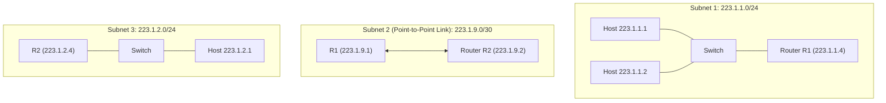

# 05 - IP Addressing, Subnets & CIDR

> [!abstract] Key Takeaway
> - An IP address is a **32-bit identifier** assigned to a network interface (not to a host).
> - **CIDR (Classless InterDomain Routing)** partitions the 32 bits into a Subnet prefix (`/x`) and a Host identifier ($32-x$ bits).
> - **Longest Prefix Matching (LPM)** dictates that a router forwards a packet to the table entry with the most specific (longest) subnet mask.

---

## 1. What is an IP Address and Subnet?

```
IPv4 Address: 223.1.1.1 
Binary:       11011111 . 00000001 . 00000001 . 00000001
              |<--------- Subnet Part --------->|<- Host ->|
```

> [!info] Operational Definition of a Subnet
> To determine the subnets in a network:
> 1. Detach each interface from its host or router.
> 2. The isolated islands of interconnected interfaces that form are the individual **subnets**.
> 3. Point-to-point links connecting two router interfaces also form **distinct subnets**!



---

## 2. CIDR (Classless InterDomain Routing)

Before CIDR (1993), IP addresses were rigidly categorized into **Class A (/8)**, **Class B (/16)**, and **Class C (/24)**, which wasted millions of addresses. CIDR generalized addressing to arbitrary prefix lengths:

$$\text{Format: } a.b.c.d / x$$
- $x$ = Number of bits in the **Subnet Prefix** (Network Mask).
- $32 - x$ = Number of bits in the **Host Identifier**.

### Fundamental Subnet Equations

1. **Total Addresses in Block:**
   $$N_{\text{total}} = 2^{32 - x}$$
2. **Usable Host IP Addresses:**
   $$N_{\text{usable}} = 2^{32 - x} - 2$$
   *(Subtracting 2 because **All 0s** is the Network Address and **All 1s** is the Subnet Directed Broadcast Address).*

---

## 3. Hierarchical Addressing & Route Aggregation

CIDR allows an Internet Service Provider (ISP) to advertise a single summary prefix for hundreds of customer subnets, drastically reducing global BGP routing table size.

```
ISP Block: 200.23.16.0/20 ──► "Send me anything beginning with 200.23.16.0/20"
  ├── Organization 0: 200.23.16.0/23
  ├── Organization 1: 200.23.18.0/23
  ├── Organization 2: 200.23.20.0/23
  └── ...
```

---

## 4. Longest Prefix Matching (LPM)

When an arriving packet matches multiple entries in a forwarding table, the router forwards out the interface corresponding to the **longest (most specific) prefix match**.

### Forwarding Table Example

| Prefix Match Entry | Next-Hop Interface | Prefix Length |
| :--- | :---: | :---: |
| `11001000 00010111 00010000 00000000 /20` (`200.23.16.0/20`) | Interface 0 | 20 bits |
| `11001000 00010111 00011000 00000000 /23` (`200.23.24.0/23`) | Interface 1 | 23 bits |
| `11001000 00010111 00011000 00000000 /24` (`200.23.24.0/24`) | Interface 2 | **24 bits** |
| `otherwise` (Default Route `0.0.0.0/0`) | Interface 3 | 0 bits |

> [!example]- Worked Trace: Destination Address Matching
> **Arriving Packet Destination IP:** `200.23.24.135`
> 
> **Binary Conversion:**
> - `200.23.24.135` = `11001000.00010111.00011000.10000111`
> 
> **Matching Entries:**
> 1. Matches `200.23.16.0/20` (first 20 bits match: `11001000 00010111 0001...`)
> 2. Matches `200.23.24.0/23` (first 23 bits match: `11001000 00010111 0001100...`)
> 3. Matches `200.23.24.0/24` (first 24 bits match: `11001000 00010111 00011000...`)
> 
> **Decision:** Longest prefix is `/24`. Forward packet out **Interface 2**!

---

## 5. Step-by-Step Subnet Carving Numerical

> [!example]- Worked Exam Problem: Carving Subnets
> **Scenario:** An organization is assigned the address block `218.32.0.0/22`. It needs to create 4 equal-sized subnets.
> 
> **Step 1: Determine New Subnet Prefix**
> - Total original prefix length = $22$.
> - To create $4 = 2^2$ subnets, borrow $2$ bits from the host portion.
> - New prefix length $x' = 22 + 2 = \mathbf{24}$ (Subnet mask: `255.255.255.0`).
> 
> **Step 2: Capacity per Subnet**
> - Host bits $= 32 - 24 = 8$ bits.
> - Total addresses per subnet $= 2^8 = 256$.
> - Usable hosts per subnet $= 256 - 2 = \mathbf{254}$.
> 
> **Step 3: Subnet Allocation Table**
> 
> | Subnet # | Network Address | Subnet Mask | Usable Host Range | Broadcast Address |
> | :---: | :--- | :--- | :--- | :--- |
> | **Subnet 1** | `218.32.0.0/24` | `255.255.255.0` | `218.32.0.1` – `218.32.0.254` | `218.32.0.255` |
> | **Subnet 2** | `218.32.1.0/24` | `255.255.255.0` | `218.32.1.1` – `218.32.1.254` | `218.32.1.255` |
> | **Subnet 3** | `218.32.2.0/24` | `255.255.255.0` | `218.32.2.1` – `218.32.2.254` | `218.32.2.255` |
> | **Subnet 4** | `218.32.3.0/24` | `255.255.255.0` | `218.32.3.1` – `218.32.3.254` | `218.32.3.255` |

---

## 6. "Why" Questions & Exam Traps

> [!warning] Exam Trap: How does an ISP handle a customer who moves to a rival ISP but keeps their IP prefix?
> **Answer:**
> - If Organization 1 (`200.23.18.0/23`) leaves ISP A and connects to ISP B, ISP B simply advertises the more specific `/23` route to the world.
> - When Internet routers worldwide receive packets for Org 1, **Longest Prefix Match (LPM)** routes the packet to ISP B (matching `/23`) rather than ISP A's aggregate `/20` advertisement.

---
#### Navigation
← Previous: [[04 - IP Datagram Format & Fragmentation]] | Next: [[06 - DHCP Protocol Mechanics]] →
