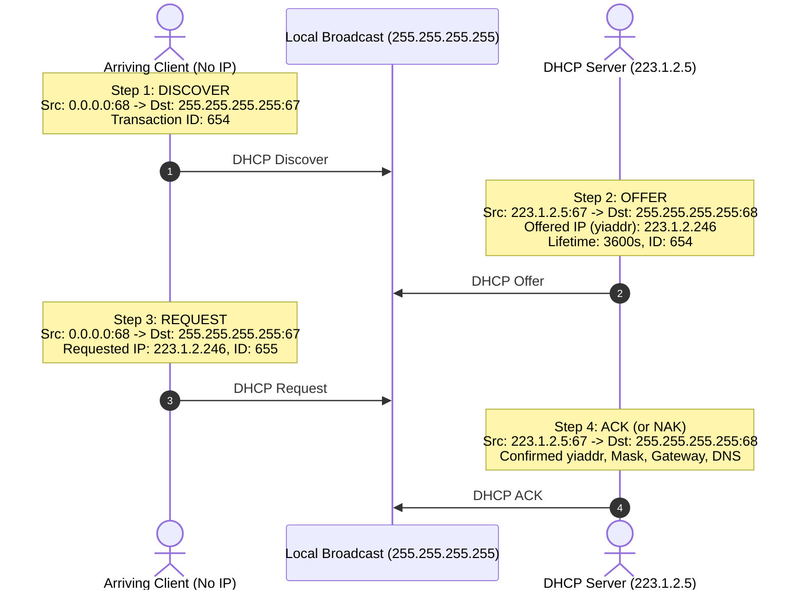
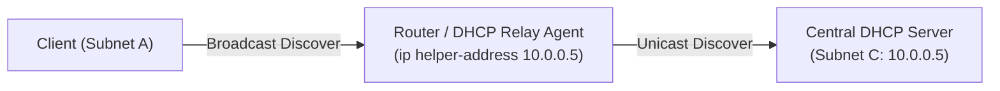

# 06 - DHCP Protocol Mechanics

> [!abstract] Key Takeaway
> **DHCP (Dynamic Host Configuration Protocol)** is an application-layer protocol running over **UDP (Ports 67 and 68)** that automatically configures joining hosts with:
> 1. Allocated IP address (`yiaddr` - "your IP address")
> 2. Subnet Mask
> 3. First-Hop Router IP (Default Gateway)
> 4. Local DNS Server IP Address

---

## 1. The 4-Step DORA Handshake

---

## 2. Deep Dive: Header & Field Analysis Across DORA

| DORA Step | Message Type | Source IP | Destination IP | Source / Dest Port | Key DHCP Payload Fields |
| :---: | :--- | :---: | :---: | :---: | :--- |
| **D** | **DHCP Discover** | `0.0.0.0` | `255.255.255.255` | `68` $\to$ `67` | `xid = 654`, Client MAC: `00:22:6B:45:1F:B1` |
| **O** | **DHCP Offer** | `223.1.2.5` | `255.255.255.255` | `67` $\to$ `68` | `xid = 654`, `yiaddr = 223.1.2.246`, Lease: `3600s` |
| **R** | **DHCP Request** | `0.0.0.0` | `255.255.255.255` | `68` $\to$ `67` | `xid = 655`, Server ID: `223.1.2.5`, Requested IP: `223.1.2.246` |
| **A** | **DHCP ACK** | `223.1.2.5` | `255.255.255.255` | `67` $\to$ `68` | `xid = 655`, `yiaddr = 223.1.2.246`, Netmask: `/24`, Gateway: `223.1.2.1`, DNS: `8.8.8.8` |

---

## 3. DHCP Beyond IP: Four Configuration Parameters Delivered

Upon receiving the **DHCP ACK**, the client configures its network stack with four vital parameters:

1. **Allocated Client IP Address** (`yiaddr` e.g., `192.168.1.100`).
2. **Subnet Mask** (e.g., `255.255.255.0` or `/24`).
3. **First-Hop Router / Default Gateway** (e.g., `192.168.1.1` — needed to forward packets outside the local subnet).
4. **Domain Name System (DNS) Server IP** (e.g., `8.8.8.8` — needed to resolve hostnames to IP addresses).

---

## 4. DHCP Relay Agent (Crossing Subnet Boundaries)

> [!info] The Multi-Subnet Dilemma
> Because DHCP Discover is sent to the broadcast address `255.255.255.255`, and **routers block broadcast packets by default**, a DHCP server would normally be required inside *every single physical subnet*.

- **DHCP Relay Agent:** A router configured with an `ip helper-address` intercepts broadcast DHCP Discovers on Subnet A and converts them into **unicast UDP packets** forwarded directly to the central DHCP Server on Subnet C.

---

## 5. "Why" Questions & Exam Traps

> [!warning] Exam Trap: Why is the DHCP Request (Step 3) broadcast instead of unicast?
> **Answer:**
> In a network with **multiple DHCP servers**, an arriving client may receive multiple DHCP Offers (Step 2). When the client chooses one offer, broadcasting the DHCP Request notifies **all other DHCP servers** that their offers were rejected, allowing them to immediately release those reserved IP addresses back into their allocation pools.

> [!question] Why does DHCP run over UDP instead of TCP?
> **Answer:**
> Establishing a TCP connection requires a 3-way handshake (`SYN`, `SYN-ACK`, `ACK`), which requires the client to already have a valid, assigned unicast IP address. Since the client does not yet possess an IP address, TCP cannot function; lightweight broadcast UDP is required.

---
#### Navigation
← Previous: [[05 - IP Addressing, Subnets & CIDR]] | Next: [[07 - NAT Architecture & Traversal]] →
