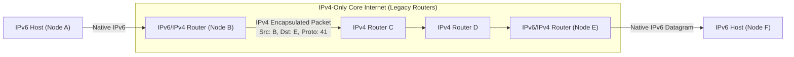

# 08 - IPv6 Protocol & Tunneling Transitions

> [!abstract] Key Takeaway
> **IPv6** expands address space from 32 bits to **128 bits** ($3.4 \times 10^{38}$ addresses) and replaces the variable IPv4 header with a **fixed 40-byte header** to enable high-speed hardware processing. 
> Crucially, IPv6 **removes the header checksum and router-assisted fragmentation**.

---

## 1. IPv6 Header Architecture

```
 0                   1                   2                   3
 0 1 2 3 4 5 6 7 8 9 0 1 2 3 4 5 6 7 8 9 0 1 2 3 4 5 6 7 8 9 0 1
+-+-+-+-+-+-+-+-+-+-+-+-+-+-+-+-+-+-+-+-+-+-+-+-+-+-+-+-+-+-+-+-+
|Version| Traffic Class |           Flow Label                  |
+-+-+-+-+-+-+-+-+-+-+-+-+-+-+-+-+-+-+-+-+-+-+-+-+-+-+-+-+-+-+-+-+
|         Payload Length        |  Next Header  |   Hop Limit   |
+-+-+-+-+-+-+-+-+-+-+-+-+-+-+-+-+-+-+-+-+-+-+-+-+-+-+-+-+-+-+-+-+
|                                                               |
+                                                               +
|                                                               |
+                     Source IP Address                         +
|                         (128 bits)                            |
+                                                               +
|                                                               |
+-+-+-+-+-+-+-+-+-+-+-+-+-+-+-+-+-+-+-+-+-+-+-+-+-+-+-+-+-+-+-+-+
|                                                               |
+                                                               +
|                                                               |
+                  Destination IP Address                       +
|                         (128 bits)                            |
+                                                               +
|                                                               |
+-+-+-+-+-+-+-+-+-+-+-+-+-+-+-+-+-+-+-+-+-+-+-+-+-+-+-+-+-+-+-+-+
|                            Payload                            |
+-+-+-+-+-+-+-+-+-+-+-+-+-+-+-+-+-+-+-+-+-+-+-+-+-+-+-+-+-+-+-+-+
```

### Field-by-Field Breakdown

| Field Name | Size (Bits) | Description & Purpose |
| :--- | :---: | :--- |
| **Version** | 4 | IP Version (`0110` for IPv6). |
| **Traffic Class** | 8 | Equivalent to IPv4 TOS / DiffServ (QoS priority). |
| **Flow Label** | 20 | Identifies packets belonging to a specific non-default audio/video stream (QoS flow). |
| **Payload Length** | 16 | Number of bytes in datagram *following* the 40-byte base header (includes extension headers). |
| **Next Header** | 8 | Identifies upper-layer protocol (TCP=6, UDP=17) or next Extension Header (Hop-by-Hop, Routing, Fragmentation). |
| **Hop Limit** | 8 | Decremented by 1 at each router; packet dropped if 0 (replaces IPv4 TTL). |
| **Source / Dest IP** | $128 + 128$ | 16-byte IPv6 addresses written in hexadecimal (e.g., `2001:0db8:85a3::8a2e:0370:7334`). |

---

## 2. Major Differences: IPv4 vs IPv6

| Architectural Feature | IPv4 | IPv6 | Engineering Rationale |
| :--- | :--- | :--- | :--- |
| **Address Space** | 32 bits ($4.3 \times 10^9$) | **128 bits ($3.4 \times 10^{38}$)** | Eliminates global address exhaustion forever. |
| **Base Header Size** | Variable (20 – 60 bytes) | **Fixed 40 bytes** | Fixed offset enables pipelined hardware processing. |
| **Header Checksum** | Present (Recalculated every hop) | **REMOVED** | Redundant with L2 CRC and L4 checksums; speeds up forwarding. |
| **Fragmentation** | Performed by **routers & hosts** | **REMOVED from routers** | Routers drop oversized packets and send ICMPv6 "Packet Too Big"; source host performs PMTUD. |
| **Options** | Inside base header | **Extension Headers** | Base header stays fixed; extensions processed only when needed. |

---

## 3. IPv4 to IPv6 Transition: Dual-Stack vs Tunneling

Because the Internet contains millions of legacy IPv4 routers, a simultaneous global upgrade ("flag day") is impossible.

### 1. Dual-Stack Approach
Nodes run **both IPv4 and IPv6 protocol stacks** simultaneously. The node uses DNS (A record vs AAAA record) to choose IPv6 if supported, otherwise falling back to IPv4.

### 2. Tunneling (IPv6 Encapsulated in IPv4)



```
Tunneling Encapsulation on the Wire:
+-------------------+-------------------+-------------------------+
| IPv4 Header       | IPv6 Header       | TCP / Payload           |
| (Src: B, Dst: E)  | (Src: A, Dst: F)  |                         |
+-------------------+-------------------+-------------------------+
|<--- IPv4 Outer Payload (Tunnel) ----->|
```

- **Tunnel Ingress Router (B):** Puts the complete IPv6 datagram inside the payload field of an IPv4 datagram (`IPv4 Protocol = 41`).
- **Tunnel Egress Router (E):** Strips off the outer IPv4 header, extracting the original native IPv6 datagram, and forwards it to destination F.

---

## 4. "Why" Questions & Exam Traps

> [!question] What happens when an IPv6 datagram is too large for an outgoing link's MTU?
> **Answer:**
> - The intermediate router **does NOT fragment the datagram**.
> - The router immediately **drops the packet** and sends an **ICMPv6 Type 2 ("Packet Too Big")** error message back to the source host, containing the MTU of the constricted link.
> - The source host then uses this feedback to resize its subsequent packets (**Path MTU Discovery - PMTUD**).

---
#### Navigation
← Previous: [[07 - NAT Architecture & Traversal]] | Next: [[09 - Generalized Forwarding & SDN (OpenFlow)]] →
