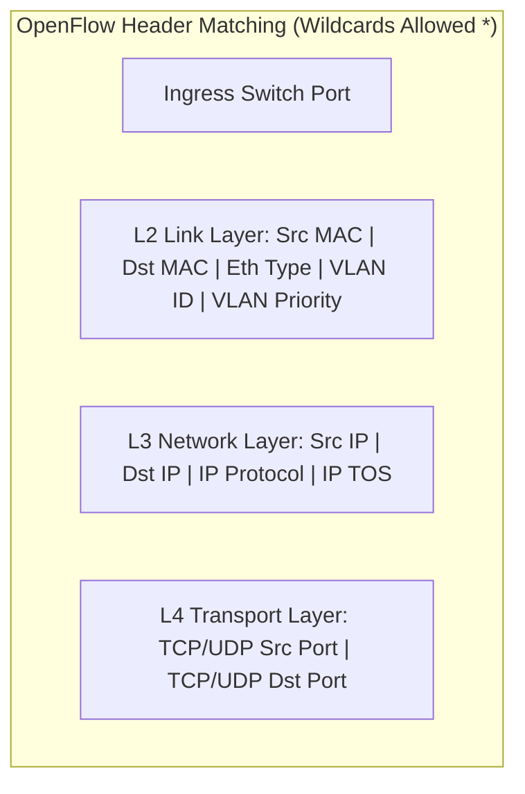

# 09 - Generalized Forwarding & SDN (OpenFlow)

> [!abstract] Key Takeaway
> **Generalized Forwarding (OpenFlow)** replaces rigid destination-IP-only forwarding with a **"Match + Action"** abstraction across multiple protocol layers (L2, L3, and L4), allowing a single physical switch to act as a router, switch, firewall, or NAT device.

---

## 1. Destination-Based vs Generalized Forwarding

```
Destination-Based Forwarding (Traditional IP):
[ Packet ] ──► Match on: Destination IP Address Only ──► Action: Forward out Output Port X

Generalized Forwarding (OpenFlow 1.0+):
[ Packet ] ──► Match on: Ingress Port + L2 MAC + L3 IP + L4 Port ──► Action: Forward, Drop, Rewrite, Copy
```

---

## 2. OpenFlow Flow Table Architecture

Each entry in an OpenFlow **Flow Table** consists of three core components:

```
+------------------------------------+------------------+-------------------+
|            MATCH FIELDS            |     COUNTERS     |      ACTIONS      |
| (Ingress Port, MACs, IPs, Ports)   | (Packets, Bytes) | (Forward/Drop/...) |
+------------------------------------+------------------+-------------------+
```

### The 11 Standard OpenFlow Match Fields



### Flow Table Action Set
1. **Forward:** Send packet out designated physical port(s), flood out all ports, or send up to the SDN Controller.
2. **Drop:** Discard packet (implements Firewall functionality).
3. **Modify Field:** Rewrite header fields (e.g., NAT IP/Port translation or TTL decrement).

---

## 3. Unifying Network Devices via OpenFlow Examples

| Network Device Modeled | OpenFlow Match Condition | OpenFlow Action Executed |
| :--- | :--- | :--- |
| **Traditional Router** | `Dst IP = 128.119.1.229` | Decrement TTL; rewrite Src/Dst MAC; forward out Port 2 |
| **Layer 2 Switch** | `Dst MAC = 00:1A:2B:3C:4D:5E` | Forward out Port 3 |
| **Firewall** | `IP Protocol = 6 (TCP), Dst Port = 22` | **DROP** (Blocks incoming SSH attempts) |
| **Network Address Translation (NAT)** | `Src IP = 10.0.0.1, Src Port = 3345` | Rewrite `Src IP = 138.76.29.7, Src Port = 5001`; forward out Port 1 |

---

## 4. "Why" Questions & Exam Traps

> [!question] Why is Generalized Forwarding superior to traditional hardware forwarding?
> **Answer:**
> - In traditional networks, deploying a new feature (e.g., a firewall rule or load balancer) required purchasing and deploying specialized, expensive physical hardware appliances.
> - With OpenFlow and Generalized Forwarding, standard commodity switches ("white-box switches") can be dynamically programmed from software to perform routing, switching, access control, and load balancing simultaneously.

---
#### Navigation
← Previous: [[08 - IPv6 Protocol & Tunneling Transitions]] | Next: [[10 - Middleboxes & Internet Architecture]] →
