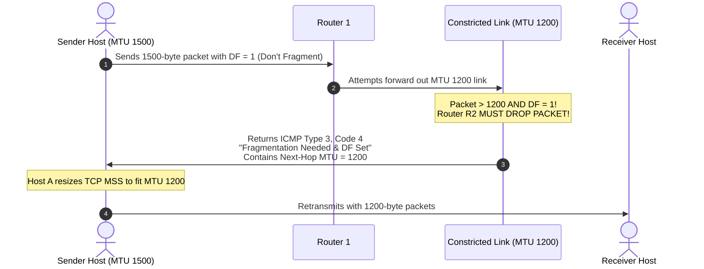

# 11 - Book Extras & Professor Traps (Data Plane)

> [!abstract] Key Takeaway
> This document aggregates obscure edge cases, mathematical subtleties, and high-difficulty exam traps from the **Kurose & Ross (8th Edition)** reading list that frequently appear on 100%-target Final Exams.

---

## 1. Incremental IPv4 Header Checksum Update

When a router forwards an IPv4 packet, it decrements the **TTL** field by 1. Because the header has changed, the **Header Checksum** is invalidated.

> [!question] Professor Question: Does a router re-sum the entire 20-byte header to update the checksum?
> **Answer:**
> **No!** Doing so would waste valuable nanoseconds. Routers use an **incremental checksum update** formula (RFC 1624):
> 
> Let $HC$ be the old checksum, $m$ be the old 16-bit word (containing the old TTL), and $m'$ be the new 16-bit word (containing the new decremented TTL):
> $$HC' = \sim(\sim HC + \sim m + m')$$
> *This allows routers to update the checksum with just three arithmetic operations in hardware.*

---

## 2. Path MTU Discovery (PMTUD) & The "Black Hole" Trap

Modern operating systems do not like IP fragmentation because losing a single fragment causes the entire TCP packet to be lost.



> [!warning] Exam Trap: The PMTUD Black Hole
> If a misconfigured firewall in the path blocks ICMP packets, the ICMP Type 3 Code 4 message will never reach Host A. Host A will keep retransmitting 1500-byte packets that are repeatedly dropped, causing the connection to hang indefinitely (a **PMTUD Black Hole**).

---

## 3. Top 5 Professor Traps Summary Table

| # | Common Student Mistake | Ground Truth Reality | How It Appears on Exams |
| :---: | :--- | :--- | :--- |
| **1** | Computing Fragment Offset in **bytes** rather than **8-byte blocks**. | Fragment Offset field is strictly: $\frac{\text{Byte Offset}}{8}$. | A question asks for the numeric value written into the 13-bit header field. |
| **2** | Forgetting to subtract the **20-byte IP header** when calculating MTU payload. | Max fragment data capacity is $\lfloor \frac{\text{MTU} - 20}{8} \rfloor \times 8$. | If $\text{MTU} = 1500$, data payload is $1480$ bytes (not $1500$). |
| **3** | Setting $\text{MF} = 1$ for the **final fragment**. | The final fragment must have **$\text{MF} = 0$** and non-zero offset. | Table completion question for fragmented datagram. |
| **4** | Confusing IPv4 **Total Length** with IPv6 **Payload Length**. | IPv4 Total Length includes header ($20 + \text{data}$). IPv6 Payload Length includes **only data** after the 40B base header. | Given a 1000-byte packet, IPv4 Total Length $= 1000$; IPv6 Payload Length $= 960$. |
| **5** | Assuming broadcast `255.255.255.255` traverses routers. | Routers **never forward** local broadcast `255.255.255.255` across subnets. | "Why does a DHCP Relay Agent exist?" |

---

## 4. IPv6 Extension Header Chaining Order

Unlike IPv4 options which reside inside the variable header, IPv6 chains optional headers between the 40-byte base header and the upper-layer payload:

```
[ IPv6 Base Header ] ──► [ Hop-by-Hop Options ] ──► [ Routing Header ] ──► [ Fragment Header ] ──► [ TCP / Payload ]
 (Next Header = 0)         (Next Header = 43)        (Next Header = 44)       (Next Header = 6)
```

- Each extension header starts with a 1-byte **Next Header** field pointing to the subsequent header, ending with the transport protocol code (`6` for TCP, `17` for UDP).

---
#### Navigation
← Previous: [[10 - Middleboxes & Internet Architecture]] | Next: [[12 - Comprehensive Worked Numericals & Exam Problems]] →
