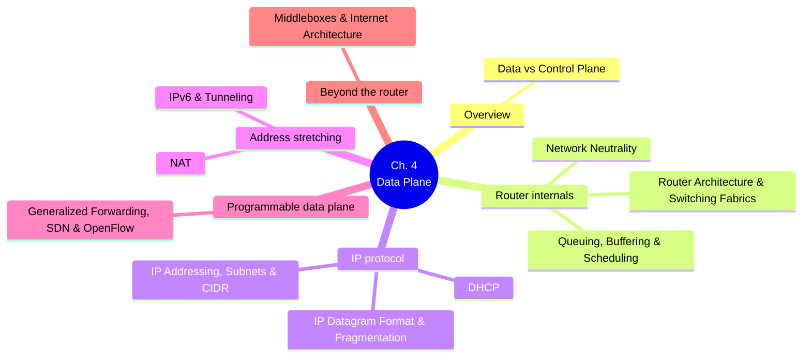

# Chapter 4 — Network Layer: Data Plane

> [!abstract] Chapter roadmap
> This vault-let covers the **data plane** of the network layer — the per-router,
> per-packet machinery that decides how an arriving datagram gets forwarded out
> the correct output link. The **control plane** (routing algorithms, BGP, OSPF)
> is Chapter 5 and only touched on here for contrast.

## 🗺️ Map of notes

| # | Note | Core question it answers |
|---|------|---------------------------|
| 1 | [[01 - Data Plane vs Control Plane]] | What's the difference between *forwarding* and *routing*? |
| 2 | [[02 - Router Architecture & Switching Fabrics]] | What's physically inside a router? |
| 3 | [[03 - Queuing, Buffering & Scheduling]] | What happens when packets arrive faster than they can leave? |
| 4 | [[04 - Network Neutrality]] | Should ISPs be allowed to prioritize traffic? |
| 5 | [[05 - IP Datagram Format & Fragmentation]] | What's actually in an IPv4 packet header? |
| 6 | [[06 - IP Addressing, Subnets & CIDR]] | How is the 32-bit address space carved up? |
| 7 | [[07 - DHCP]] | How does a host get an address automatically? |
| 8 | [[08 - NAT]] | How do billions of devices share a few public IPv4 addresses? |
| 9 | [[09 - IPv6 & Tunneling]] | What replaces IPv4, and how do we get there? |
| 10 | [[10 - Generalized Forwarding, SDN & OpenFlow]] | How does "match + action" generalize destination-based forwarding? |
| 11 | [[11 - Middleboxes & Internet Architecture]] | Is the Internet still "dumb network, smart edge"? |

## 🎯 Two key network-layer functions

> [!info] Forwarding vs. Routing (the trip analogy)
> - **Forwarding** — local, per-router action: move a packet from an input link to the right output link (like passing through a single interchange).
> - **Routing** — network-wide process: determine the end-to-end path a packet takes from source to destination (like planning the whole trip).

## Quick links out

- Kurose & Ross book companion site: [gaia.cs.umass.edu/kurose_ross](https://gaia.cs.umass.edu/kurose_ross/)
- [Google IPv6 statistics](https://www.google.com/intl/en/ipv6/statistics.html) — see [[09 - IPv6 & Tunneling]] for the 2026 milestone
- [P4 language](https://p4.org) — see [[10 - Generalized Forwarding, SDN & OpenFlow]]

---
#### Navigation
Next → [[01 - Data Plane vs Control Plane]]
