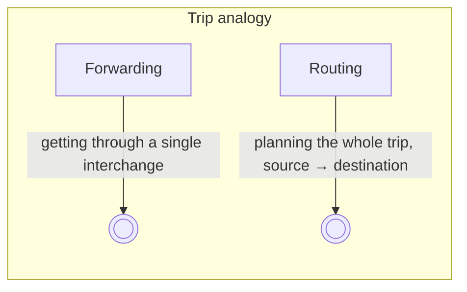
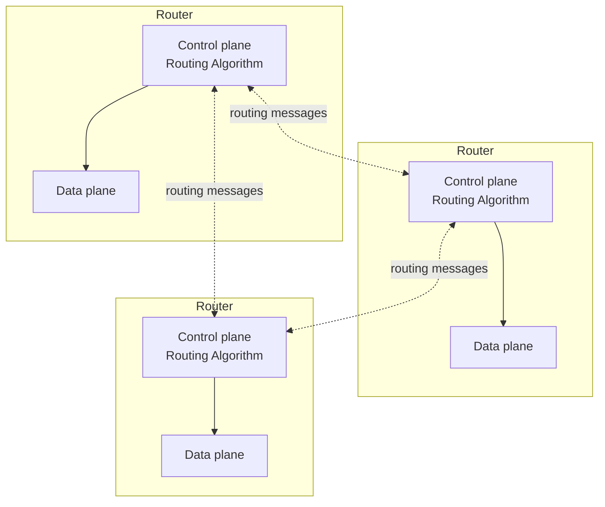
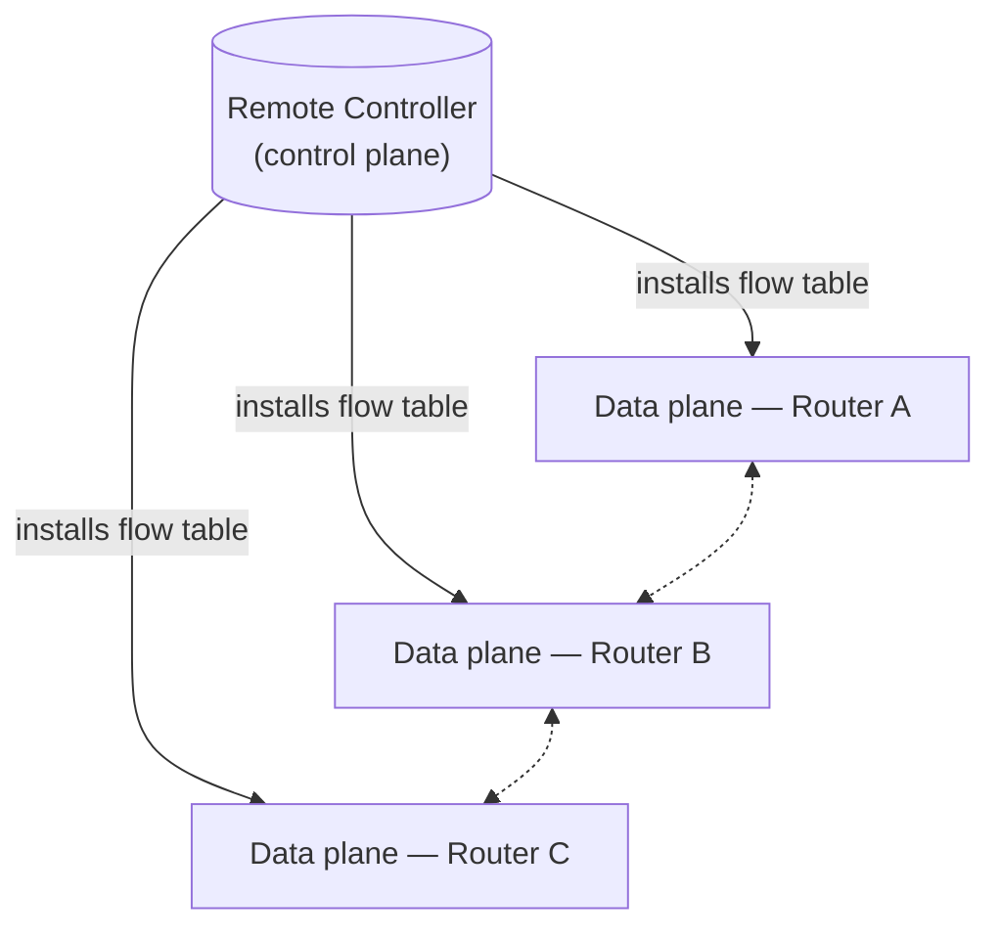

# Data Plane vs. Control Plane

Up → [[00 - Index]]

## Two key network-layer functions

> [!info] Forwarding (data plane)
> Move a packet from a router's **input** link to the appropriate **output** link.
> Local, per-router, happens in **nanoseconds**, implemented in hardware.

> [!info] Routing (control plane)
> Determine the **route** taken by packets from source to destination.
> Network-wide, happens in **milliseconds**, traditionally implemented in software.

## Data plane vs. control plane, side by side

| | Data plane | Control plane |
|---|---|---|
| Scope | local, per-router | network-wide |
| Job | decide how a datagram arriving on an input port is forwarded to an output port | decide how a datagram is routed among routers, end-to-end |
| Speed | nanosecond timescale (hardware) | millisecond timescale (software) |
| Implemented by | forwarding table lookups inside each router | either (a) per-router routing algorithms, or (b) SDN |

## Two ways to build the control plane

### 1. Per-router control plane (traditional)

Each router runs its **own** routing-algorithm process; these processes talk to each other directly.

### 2. Software-Defined Networking (SDN)

A **remote controller** computes forwarding tables and installs them into each router's data plane over the network. This is the topic of [[10 - Generalized Forwarding, SDN & OpenFlow]].

> [!tip] Mental model
> Data plane = **what a single router does with the packet in front of it right now.**
> Control plane = **how the whole network agrees on what "correct" forwarding tables look like.**

## Network service model

> [!question] What service does the "channel" carrying datagrams promise?
> Examples of things a network *could* promise, per datagram or per flow:
> - guaranteed delivery
> - guaranteed delivery with bounded delay (e.g. < 40 ms)
> - in-order delivery
> - guaranteed minimum bandwidth
> - bounds on jitter (inter-packet spacing)

### Comparison of service models

| Architecture | Service Model | Bandwidth | Loss | Order | Timing |
|---|---|---|---|---|---|
| Internet | best effort | none | no guarantee | no guarantee | no guarantee |
| ATM | Constant Bit Rate (CBR) | constant rate | guaranteed | guaranteed | guaranteed |
| ATM | Available Bit Rate (ABR) | guaranteed minimum | no guarantee | guaranteed | no guarantee |
| Internet | IntServ (RFC 1633) | guaranteed | guaranteed | guaranteed | guaranteed |
| Internet | DiffServ (RFC 2475) | possible | possible | possible | no guarantee |

> [!success] Reflections on best-effort service
> - Simplicity of mechanism let the Internet scale to billions of devices.
> - Over-provisioned bandwidth makes real-time apps "good enough, most of the time" without hard guarantees.
> - Replicated application-layer infrastructure (CDNs, datacenters near clients) compensates at the edge.
> - End-host congestion control for "elastic" traffic (see transport layer) helps keep the network usable.
>
> **It's hard to argue with the success of the best-effort model.**

---
#### Navigation
◀ [[00 - Index]] · ▶ [[02 - Router Architecture & Switching Fabrics]]
