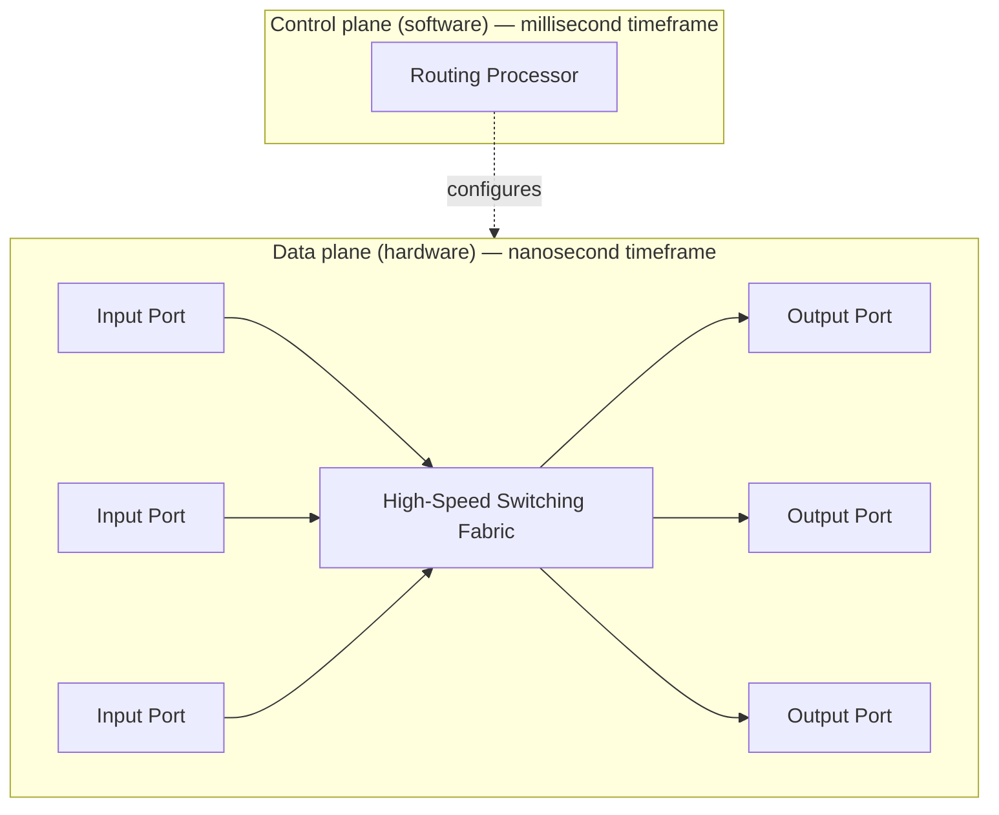
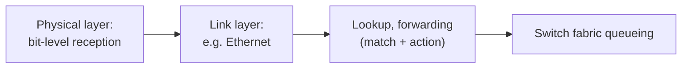
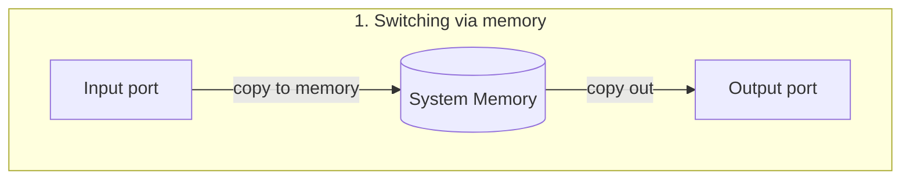
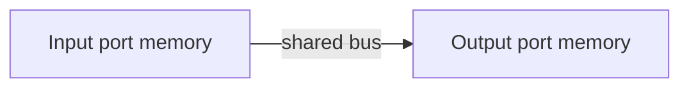
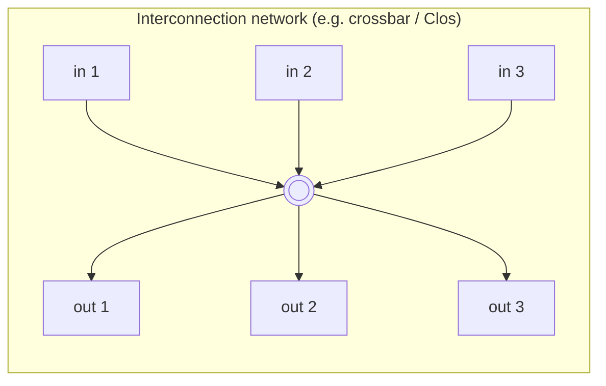

# Router Architecture & Switching Fabrics

Up → [[00 - Index]]

## High-level view

> [!example] Roundabout analogy
> - **Routing processor / station manager** = the traffic planner deciding the rules (control plane).
> - **Entry stations → roundabout → exit roads** = the actual, instantaneous flow of cars (data plane).

## Input port functions

- **Line-speed goal**: input port processing must complete fast enough to keep up with the incoming line rate.
- **Lookup** uses header field values against a **forwarding table** held in input-port memory ("match plus action").
- Two forwarding styles:
  - **Destination-based forwarding** (traditional): forward using *only* the destination IP address.
  - **Generalized forwarding**: forward using *any* combination of header fields — see [[10 - Generalized Forwarding, SDN & OpenFlow]].
- **Input queueing** occurs if datagrams arrive faster than the switch fabric can move them → see [[03 - Queuing, Buffering & Scheduling]].

## Longest prefix matching

> [!info] Rule
> When several forwarding-table entries match a destination address, use the entry with the **longest matching prefix**.

$$
\text{match}(d) = \arg\max_{i \,:\, \text{prefix}_i \sqsubseteq d} \; \text{len}(\text{prefix}_i)
$$

| Link interface | Destination address range (prefix) |
|---|---|
| 0 | `11001000 00010111 00010***  ********` |
| 1 | `11001000 00010111 00011000  ********` |
| 2 | `11001000 00010111 00011***  ********` |
| 3 | otherwise |

Worked examples:

- `11001000 00010111 00010110 10100001` → matches interface **0** (25-bit prefix `00010***`)
- `11001000 00010111 00011000 10101010` → matches interface **1**, because its 24-bit exact prefix is *longer* than interface 2's `00011***` prefix

> [!tip] Hardware behind it
> Longest prefix matching is usually implemented with **Ternary Content-Addressable Memory (TCAM)**: present an address, retrieve the matching table entry in **one clock cycle**, regardless of table size. Example: Cisco Catalyst switches hold on the order of **~1M routing-table entries** in TCAM.

## Switching fabrics — three architectures

Goal: transfer a packet from an input link to the correct output link.
**Switching rate** = the rate at which packets move from inputs to outputs, usually expressed as a multiple of the line rate $R$. For $N$ inputs, an ideal switching rate is $N \times R$.

First-generation routers: a traditional computer, switching under **direct CPU control**. Every packet crosses the system bus **twice** — speed is limited by memory bandwidth.

**Switching via a bus**: datagram goes from input port memory to output port memory over a shared bus. Limited by **bus contention** — e.g. a 32 Gbps bus (Cisco 5600) is enough for access routers but not core routers.

**Switching via interconnection network**: crossbars / Clos networks, borrowed from multiprocessor interconnects. Datagrams are fragmented into fixed-length **cells** on entry, switched through the fabric in parallel, and reassembled on exit — this exploits parallelism to overcome the single-bus bottleneck.

> [!example] Real hardware: Cisco CRS router
> - Built from **8 switching planes** run in parallel.
> - Each plane is a **3-stage interconnection network**.
> - Aggregate switching capacity: up to **hundreds of Tbps**.

## Comparison summary

| Fabric type | Bottleneck | Typical era / use |
|---|---|---|
| Via memory | Memory bandwidth (2 bus crossings) | 1st-gen routers |
| Via bus | Shared bus bandwidth | Access routers (e.g. 32 Gbps bus) |
| Via interconnection network | Parallelizable — scales with more planes/stages | Core / carrier-grade routers |

---
#### Navigation
◀ [[01 - Data Plane vs Control Plane]] · ▶ [[03 - Queuing, Buffering & Scheduling]]
