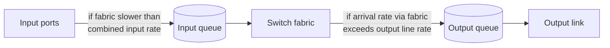
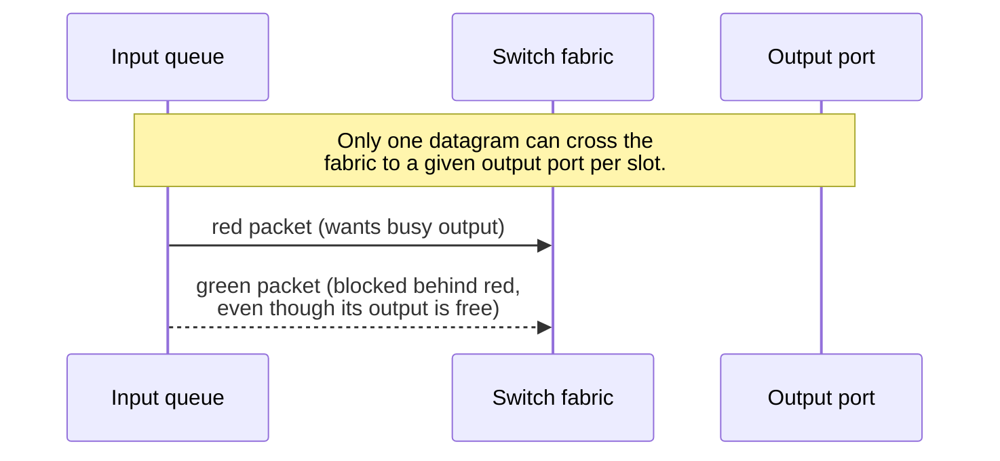
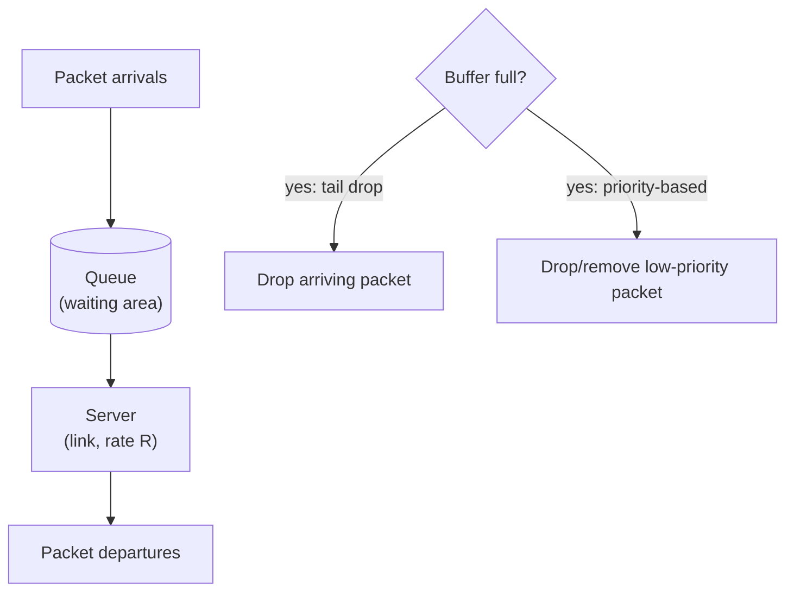
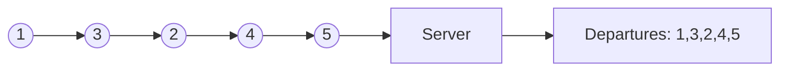
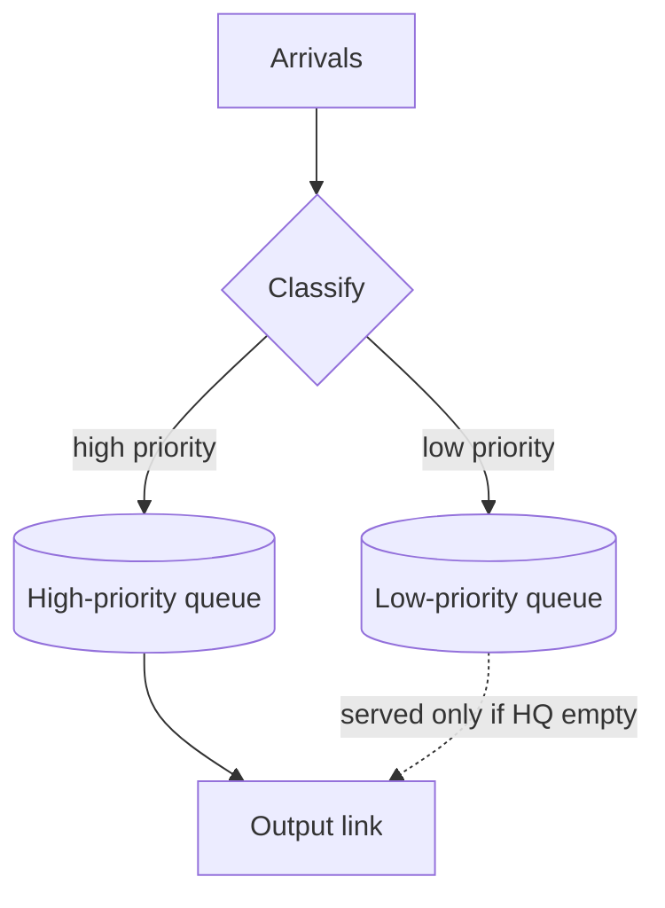

# Queuing, Buffering & Scheduling

Up → [[00 - Index]] · Related → [[02 - Router Architecture & Switching Fabrics]]

## Where queues form

## Input port queuing & Head-of-the-Line (HOL) blocking

> [!warning] HOL blocking
> If the switch fabric is slower than the combined input rate, packets queue at the **input**.
> A queued datagram at the **front** of an input queue can block others behind it — even if
> those other packets are destined for a *free* output port.

## Output port queuing

> [!important] This is a genuinely important slide (per the original deck!)
> Buffering is required whenever datagrams arrive from the fabric **faster** than the
> output link's transmission rate $R$. Two independent design questions arise:
> 1. **Drop policy** — which datagrams to discard when buffers are full?
> 2. **Scheduling discipline** — which queued datagram is transmitted next?

Datagrams can be lost due to **congestion** (buffer overflow), not just noise — this is the dominant loss mechanism in the modern Internet.

> [!question] Priority scheduling and network neutrality
> Choosing *who* gets the best queueing/scheduling treatment is not just a technical
> question — see [[04 - Network Neutrality]].

## How much buffering?

> [!info] RFC 3439 rule of thumb (classic)
> Average buffering should equal a "typical" round-trip time (RTT), e.g. **250 ms**, times the link capacity $C$:
>
> $$
> B \approx \text{RTT} \times C
> $$
>
> Example: $C = 10\text{ Gbps} \Rightarrow B \approx 2.5\text{ Gbit of buffer}$

> [!info] More recent recommendation (for $N$ long-lived TCP flows)
> $$
> B \approx \frac{\text{RTT} \times C}{\sqrt{N}}
> $$

> [!danger] Bufferbloat
> Too much buffering **increases delay** — especially bad in home routers.
> - Long queueing delay → poor performance for real-time apps.
> - Sluggish TCP response, since loss (the classic congestion signal) is delayed.
> - Recall delay-based congestion control's mantra: *"keep the bottleneck link just full enough (busy), but no fuller."*

## Buffer management

Two independent mechanisms:
- **Drop**: which packet to discard when a buffer is full — **tail drop** (drop the arriving packet) or **priority-based** drop/removal.
- **Mark**: which packets to *mark* to signal congestion without dropping (**ECN**, **RED**).

## Packet scheduling disciplines

### FCFS / FIFO

> [!info] First-Come-First-Served
> Packets transmitted in the order they arrived at the output link. Simple, but gives no differentiated treatment.

### Priority scheduling

Arriving traffic is **classified** (using any header fields) and queued by class. The scheduler always serves the **highest-priority non-empty queue**; within a class, service is FCFS.

### Round Robin (RR)

Classify traffic by class, then **cyclically** serve one complete packet from each non-empty class queue in turn.

### Weighted Fair Queueing (WFQ)

> [!info] Generalized round robin
> Each class $i$ has a weight $w_i$ and receives a share of link capacity $R$ proportional to its weight over each cycle:
>
> $$
> \text{share}_i = \frac{w_i}{\sum_j w_j} \times R
> $$
>
> This gives a **minimum bandwidth guarantee** per traffic class.

### Scheduling policy comparison

| Policy | Classifies traffic? | Guarantee | Real-world analogy |
|---|---|---|---|
| FCFS / FIFO | No | None | A single checkout line |
| Priority | Yes | High class always served first (can starve low class) | Airport priority boarding |
| Round Robin | Yes | Equal turns per class | Taking turns speaking in a meeting |
| WFQ | Yes | Weighted minimum bandwidth per class | Toll lanes allocated proportionally to lane weight |

---
#### Navigation
◀ [[02 - Router Architecture & Switching Fabrics]] · ▶ [[04 - Network Neutrality]]
