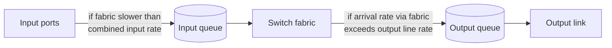
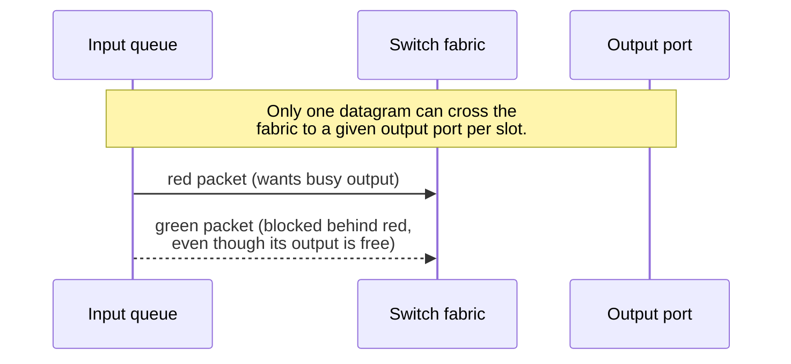
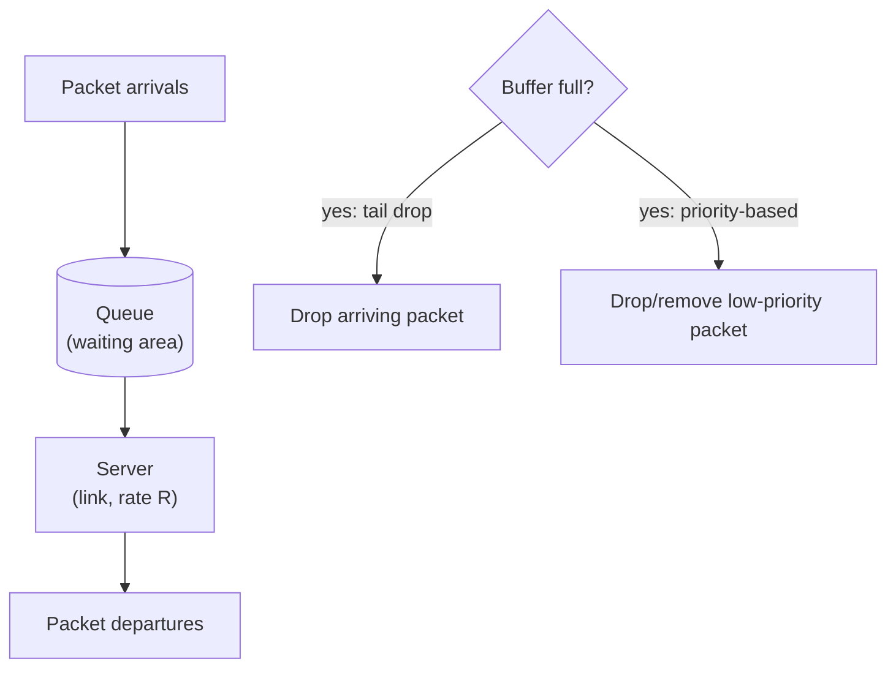
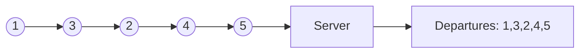
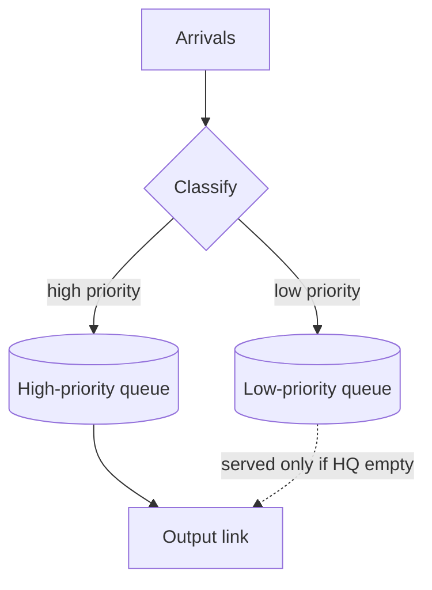

# Queuing, Buffering & Scheduling

Up → [[00 - Index]] · Related → [[02 - Router Architecture & Switching Fabrics]]

## Where queues form

## Input port queuing & Head-of-the-Line (HOL) blocking

> [!warning] HOL blocking
> If the switch fabric is slower than the combined input rate, packets queue at the **input**.
> A queued datagram at the **front** of an input queue can block others behind it — even if
> those other packets are destined for a *free* output port.

> [!question]- Deep Dive: What does "its output is free" mean in HOL blocking?
> Even though the queue is located at the **input port**, every packet in an input queue is waiting to be sent across the fabric to a specific **output port**.
> 
> - **Busy Output:** Another input port is currently transferring a packet to that output port during this clock cycle.
> - **Free Output:** The target output port is completely idle and ready to receive data.
> 
> ### Why HOL Blocking Happens
> Consider Input 1 with a queue of two packets: `[ Packet 1B (dest: Output B) | Packet 1A (dest: Output A) ]`
> 
> 1. Both Input 1 (`Packet 1A`) and Input 2 (`Packet 2A`) try to send to **Output A** at the same time.
> 2. Output A can only accept one packet per cycle. `Packet 2A` wins; `Packet 1A` is blocked at the front of Input 1's queue.
> 3. `Packet 1B` (behind `Packet 1A`) wants to go to **Output B**. **Output B is completely free**, but `Packet 1B` cannot move because `Packet 1A` is blocking the head of the FIFO queue!

## Output port queuing

> [!important] This is a genuinely important slide (per the original deck!)
> Buffering is required whenever datagrams arrive from the fabric **faster** than the
> output link's transmission rate $R$. Two independent design questions arise:
> 1. **Drop policy** — which datagrams to discard when buffers are full?
> 2. **Scheduling discipline** — which queued datagram is transmitted next?

Datagrams can be lost due to **congestion** (buffer overflow), not just noise — this is the dominant loss mechanism in the modern Internet.

> [!question] Priority scheduling and network neutrality
> Choosing *who* gets the best queueing/scheduling treatment is not just a technical
> question — see [[04 - Network Neutrality]].

## How much buffering?

> [!info] RFC 3439 rule of thumb (classic)
> Average buffering should equal a "typical" round-trip time (RTT), e.g. **250 ms**, times the link capacity $C$:
>
> $$
> B \approx \text{RTT} \times C
> $$
>
> Example: $C = 10\text{ Gbps} \Rightarrow B \approx 2.5\text{ Gbit of buffer}$

> [!info] More recent recommendation (for $N$ long-lived TCP flows)
> $$
> B \approx \frac{\text{RTT} \times C}{\sqrt{N}}
> $$

> [!danger] Bufferbloat
> Too much buffering **increases delay** — especially bad in home routers.
> - Long queueing delay → poor performance for real-time apps.
> - Sluggish TCP response, since loss (the classic congestion signal) is delayed.
> - Recall delay-based congestion control's mantra: *"keep the bottleneck link just full enough (busy), but no fuller."*

> [!question]- Deep Dive: Buffer Sizing, BDP, Bufferbloat & Multi-Flow Scaling
> ### 1. What is Bandwidth-Delay Product (BDP)?
> $\text{BDP} = \text{RTT} \times C$ represents the total volume of data currently traveling inside the network pipe at any instant.
> - **Why use full $\text{RTT}$ (and not $\text{RTT}/2$)?** Network cables are full-duplex. Data packets travel forward ($\frac{1}{2}\text{RTT}$) while ACKs travel backward ($\frac{1}{2}\text{RTT}$). Total unacknowledged data in the bidirectional loop $= \text{RTT} \times C$.
> 
> ### 2. Why $B = \text{RTT} \times C$ Prevents Link Starvation
> When a packet drops, TCP cuts its congestion window ($W \to W/2$) and pauses. Due to RTT feedback latency, it takes **1 full RTT** for the sender's new packet stream to reach the router.
> - **Without Buffer ($B=0$):** Output link runs at 50% capacity for 1 RTT $\implies$ wasted throughput.
> - **With Buffer ($B = \text{RTT} \times C$):** Stored buffer packets drain into the link, keeping it at **100% capacity ($C$)** throughout the 1 RTT recovery window.
> 
> ### 3. Packet Size vs. Congestion Window (`cwnd`)
> When congestion occurs, TCP does **NOT** shrink individual packet sizes (MSS, e.g., $1460\text{ bytes}$ stays fixed). Instead, it cuts `cwnd` (the **number of packets** allowed in flight per RTT).
> 
> ### 4. Small Buffers vs. Bufferbloat
> - **Buffer Too Small ($B < \text{RTT} \times C$):** Drains in less than 1 RTT $\implies$ output link goes idle $\implies$ throughput drops.
> - **Buffer Too Large ($B \gg \text{RTT} \times C$):** TCP keeps filling the queue without dropping $\implies$ packets sit in queue for seconds $\implies$ high ping/lag for gaming and VoIP (**Bufferbloat**).
> 
> ### 5. Modern Multi-Flow Scaling ($B \approx \frac{\text{RTT} \times C}{\sqrt{N}}$)
> RFC 3439 assumed 1 single TCP flow. Core routers carry $N \approx 10,000$ desynchronized flows. Because 10,000 flows do not drop packets at the exact same millisecond, statistical averaging (Central Limit Theorem) smooths aggregate traffic. The required buffer shrinks by $\sqrt{N}$ (e.g., by $100\times$), enabling fast on-chip SRAM.

## Buffer management

Two independent mechanisms:
- **Drop**: which packet to discard when a buffer is full — **tail drop** (drop the arriving packet) or **priority-based** drop/removal.
- **Mark**: which packets to *mark* to signal congestion without dropping (**ECN**, **RED**).

## Packet scheduling disciplines

### FCFS / FIFO

> [!info] First-Come-First-Served
> Packets transmitted in the order they arrived at the output link. Simple, but gives no differentiated treatment.

### Priority scheduling

Arriving traffic is **classified** (using any header fields) and queued by class. The scheduler always serves the **highest-priority non-empty queue**; within a class, service is FCFS.

### Round Robin (RR)

Classify traffic by class, then **cyclically** serve one complete packet from each non-empty class queue in turn.

### Weighted Fair Queueing (WFQ)

> [!info] Generalized round robin
> Each class $i$ has a weight $w_i$ and receives a share of link capacity $R$ proportional to its weight over each cycle:
>
> $$
> \text{share}_i = \frac{w_i}{\sum_j w_j} \times R
> $$
>
> This gives a **minimum bandwidth guarantee** per traffic class.

> [!question]- Deep Dive: How Weighted Fair Queueing (WFQ) Works
> ### 1. Weighted Bandwidth Allocation
> If link speed $R = 100\text{ Mbps}$, and queues have weights $w_1 = 3$ (VoIP), $w_2 = 2$ (Web), $w_3 = 1$ (FTP):
> - Total weights $= 3 + 2 + 1 = 6$.
> - VoIP gets $\frac{3}{6} \times 100 = 50\text{ Mbps}$, Web gets $33.3\text{ Mbps}$, FTP gets $16.7\text{ Mbps}$.
> - **Isolation:** A greedy FTP download cannot starve VoIP or Web traffic.
> 
> ### 2. Work-Conserving Property
> If a high-weight queue has no packets (e.g., VoIP is silent), its unused bandwidth is **automatically redistributed** among active queues proportionally to their weights. The link is never left idle.
> 
> ### 3. Virtual Finish Time & Packet Size ($L$)
> Unlike simple Round Robin (which alternates 1 packet per queue regardless of packet length), WFQ prevents large packets ($1500\text{ B}$) from cheating smaller packets ($64\text{ B}$).
> 
> WFQ calculates a **Virtual Finish Time ($F$)** for every arriving packet:
> $$F_{i, k} = \max(F_{i, k-1}, V(a)) + \frac{L_{i, k}}{w_i}$$
> 
> - $L_{i,k}$ = packet length in bits, $w_i$ = queue weight.
> - The scheduler always transmits the packet across all queues with the **smallest virtual finish time $F$**.
> - Higher weight ($w$) and smaller size ($L$) $\implies$ smaller finish time $\implies$ served earlier!

### Scheduling policy comparison

| Policy | Classifies traffic? | Guarantee | Real-world analogy |
|---|---|---|---|
| FCFS / FIFO | No | None | A single checkout line |
| Priority | Yes | High class always served first (can starve low class) | Airport priority boarding |
| Round Robin | Yes | Equal turns per class | Taking turns speaking in a meeting |
| WFQ | Yes | Weighted minimum bandwidth per class | Toll lanes allocated proportionally to lane weight |

---
#### Navigation
◀ [[02 - Router Architecture & Switching Fabrics]] · ▶ [[04 - Network Neutrality]]
