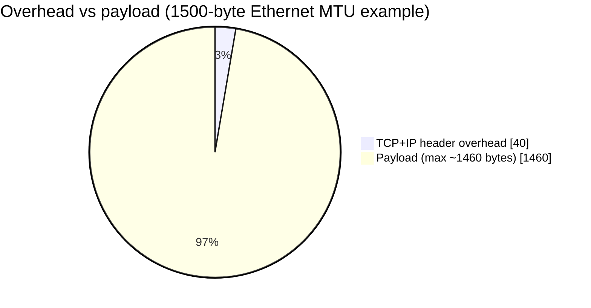
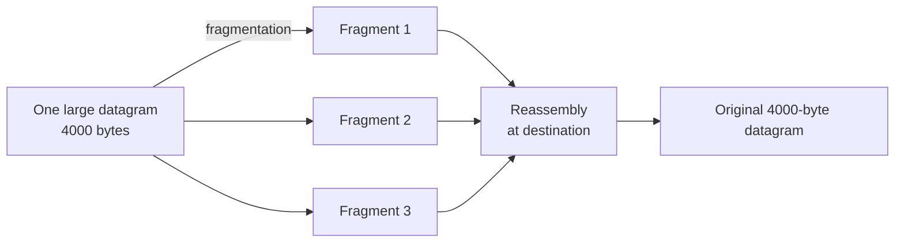

# IP Datagram Format & Fragmentation

Up → [[00 - Index]] · Related → [[09 - IPv6 & Tunneling]]

## IPv4 header layout (32 bits per row)

| Bits 0–3 | Bits 4–7 | Bits 8–15 | Bits 16–18 | Bits 19–31 |
|---|---|---|---|---|
| Version | Header length | Type of service | — | Total length (bytes) |
| 16-bit identifier | | Flags | Fragment offset | |
| Time to live (TTL) | Upper-layer protocol | Header checksum | | |
| Source IP address (32 bits) | | | | |
| Destination IP address (32 bits) | | | | |
| Options (if any) | | | | |
| Payload data | | | | |

> [!info] Field meanings
> - **Version**: IP protocol version number (4).
> - **Header length**: length of header in bytes (accounts for variable-length options).
> - **Type of service**: split into **DiffServ** (bits 0–5) and **ECN** (bits 6–7) — see [[04 - Network Neutrality]] for how this interacts with scheduling.
> - **Total datagram length**: header + data, in bytes. Max length: **64 KB**, though typical datagrams are ≤ **1500 bytes** (Ethernet MTU).
> - **Identifier, flags, fragment offset**: used for fragmentation/reassembly (below).
> - **TTL**: decremented at every router; datagram discarded when it reaches 0 — bounds max hop count.
> - **Header checksum**: verifies header integrity (recomputed at every hop since TTL changes).
> - **Source / destination address**: 32-bit IP addresses.
> - **Upper-layer protocol**: demux key — e.g. 6 = TCP, 17 = UDP.
> - **Options**: e.g. timestamp, record route taken (rare in practice, often stripped by middleboxes).

## Overhead accounting

$$
\underbrace{20\text{ bytes}}_{\text{IP header}} + \underbrace{20\text{ bytes}}_{\text{TCP header}} = 40\text{ bytes of overhead per TCP/IP segment}
$$

## IP fragmentation & reassembly

> [!info] Why fragment?
> Different **link types** have different **MTUs** (maximum transfer units). A large IP
> datagram may need to be split ("fragmented") to cross a link with a smaller MTU than
> the datagram's size. Fragments are **reassembled only at the final destination**, using
> header bits (identifier, flags, fragment offset) to identify and order related fragments.

### Worked example

> [!example] 4000-byte datagram, MTU = 1500 bytes
> Offset is expressed in **8-byte units**.
>
> | Fragment | length | ID | fragflag | offset |
> |---|---|---|---|---|
> | Original | 4000 | x | 0 | 0 |
> | 1 | 1500 (1480 data + 20 header) | x | 1 | 0 |
> | 2 | 1500 (1480 data + 20 header) | x | 1 | 185 |
> | 3 | 1040 (1020 data + 20 header) | x | 0 | 370 |
>
> Offset math for fragment 2:
> $$
> \text{offset}_2 = \frac{1480}{8} = 185
> $$
> `fragflag = 1` means "more fragments follow"; the **last** fragment has `fragflag = 0`.
> Total data bytes: $1480 + 1480 + 1020 = 3980$ (+ per-fragment 20-byte headers not counted as "data").

> [!warning] IPv6 dropped this
> IPv6 removes in-network fragmentation entirely — see [[09 - IPv6 & Tunneling]]. Hosts must perform **Path MTU Discovery** and fragment (if needed) before sending.

---
#### Navigation
◀ [[04 - Network Neutrality]] · ▶ [[06 - IP Addressing, Subnets & CIDR]]
