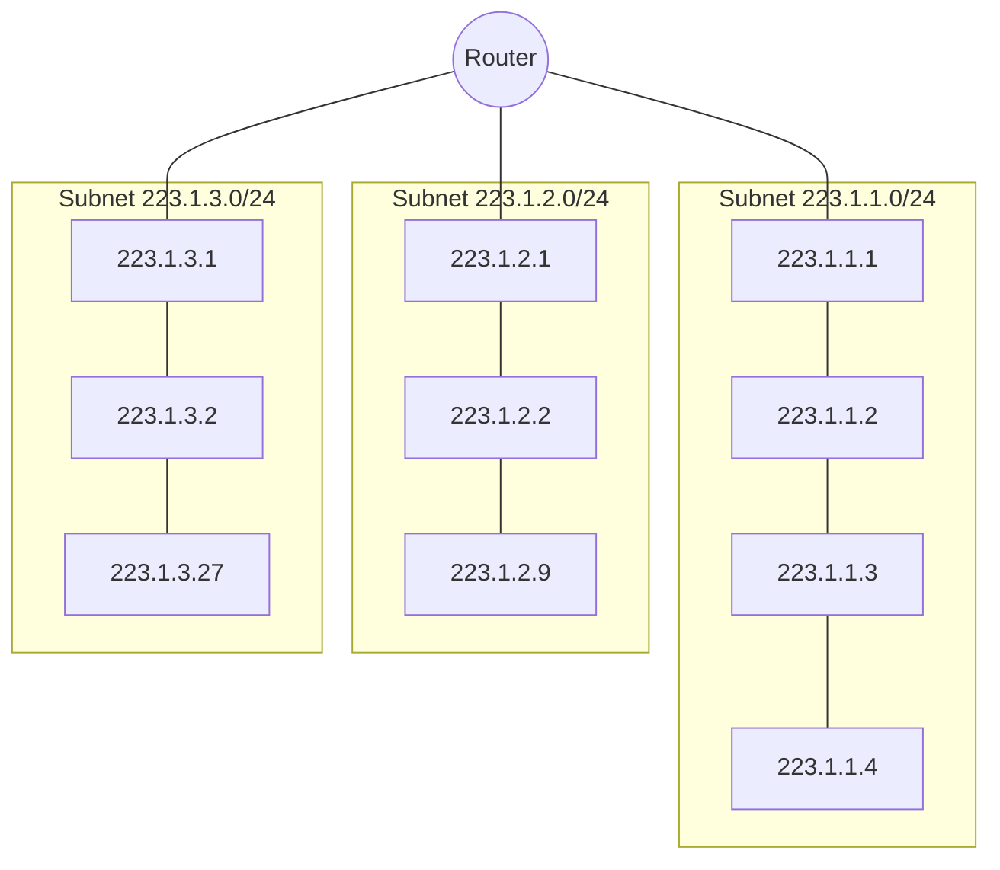
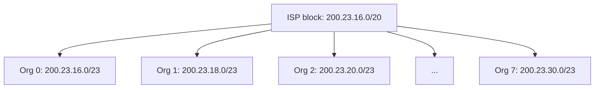
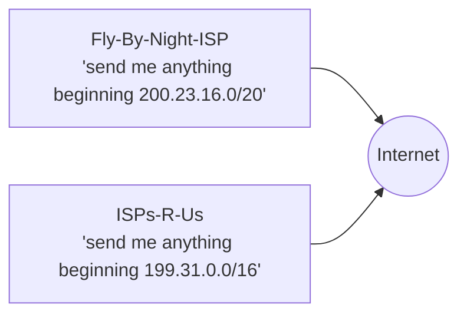
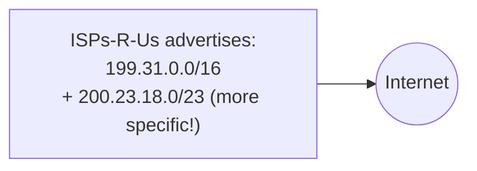

# IP Addressing, Subnets & CIDR

Up → [[00 - Index]] · Related → [[02 - Router Architecture & Switching Fabrics]] (longest prefix matching), [[07 - DHCP]]

## IP address basics

> [!info] Definitions
> - **IP address**: 32-bit identifier associated with each host or router **interface**.
> - **Interface**: the connection between a host/router and a physical link. Routers typically have *multiple* interfaces; a host typically has one or two (e.g. Ethernet + WiFi).

Dotted-decimal notation example:

$$
223.1.1.1 = \underbrace{11011111}_{223}\ \underbrace{00000001}_{1}\ \underbrace{00000001}_{1}\ \underbrace{00000001}_{1}
$$

## Subnets

> [!info] What's a subnet?
> A set of device interfaces that can physically reach each other **without passing through a router**. IP addresses have structure:
> - **Subnet part**: high-order bits, shared by all devices in the same subnet
> - **Host part**: remaining low-order bits, unique per device

> [!tip] Recipe for finding a network's subnets
> Conceptually detach every router interface, splitting the network into isolated
> "islands." Each island is one subnet.

## CIDR: Classless Inter-Domain Routing

> [!info] CIDR (pronounced "cider")
> Subnet portion can be of **arbitrary length** — not fixed to old class A/B/C boundaries.
> Notation: `a.b.c.d/x`, where `x` = number of bits in the subnet (network) portion.

$$
\underbrace{11001000\ 00010111\ 0001000}_{\text{subnet: 23 bits}}\underbrace{0\ 00000000}_{\text{host: 9 bits}} \;=\; 200.23.16.0/23
$$

> [!note] See also
> Longest-prefix matching (how routers use these variable-length prefixes to forward
> packets) is covered in [[02 - Router Architecture & Switching Fabrics]].

## How does a host get an address?

Two distinct questions:
1. How does a **host** get an IP address *within* its network? (host part)
2. How does a **network** get an IP address block *for itself*? (network part)

### Host part — two mechanisms

| Method | How it works |
|---|---|
| Hard-coded | System administrator sets it in a config file (e.g. `/etc/rc.config` on classic Unix) |
| **DHCP** | Dynamic Host Configuration Protocol — host asks a server, gets an address automatically ("plug-and-play") |

Full DHCP mechanics live in → [[07 - DHCP]].

### Network part — hierarchical allocation

A network gets a block of addresses allocated from its **provider ISP's** address space:

## Hierarchical addressing → route aggregation

> [!success] Why hierarchy matters
> Because organizations 0–7 all share the prefix `200.23.16.0/20`, the ISP can advertise
> **one single, short prefix** to the rest of the Internet instead of 8 separate routes.
> This is *route aggregation* ("supernetting") and is what keeps global routing tables
> from exploding in size.

### More-specific routes (multi-homing / provider switch)

If **Organization 1** moves from Fly-By-Night-ISP to ISPs-R-Us but *keeps* its
`200.23.18.0/23` address block, ISPs-R-Us must advertise a **more specific** route
(longer prefix) so traffic for Org 1 is correctly diverted — even though it overlaps
with Fly-By-Night's aggregate announcement. **Longest prefix match** (see [[02 - Router Architecture & Switching Fabrics]]) resolves the conflict correctly.

## Who hands out address blocks?

> [!info] ICANN
> **ICANN** (Internet Corporation for Assigned Names and Numbers) allocates IP addresses
> through **5 Regional Registries (RRs)**, which may further delegate to local registries.
> ICANN also manages the DNS root zone, including delegation of TLDs (`.com`, `.edu`, …).

> [!warning] IPv4 exhaustion
> ICANN allocated the **last chunk of unassigned IPv4 address space** to the RRs in
> **2011**. Two responses to exhaustion: [[08 - NAT|NAT]] (stretch what's left) and
> [[09 - IPv6 & Tunneling|IPv6]] (128-bit address space).

> [!quote] Vint Cerf, reflecting on the decision to make IPv4 addresses 32 bits long
> "Who the hell knew how much address space we needed?"

---
#### Navigation
◀ [[05 - IP Datagram Format & Fragmentation]] · ▶ [[07 - DHCP]]
