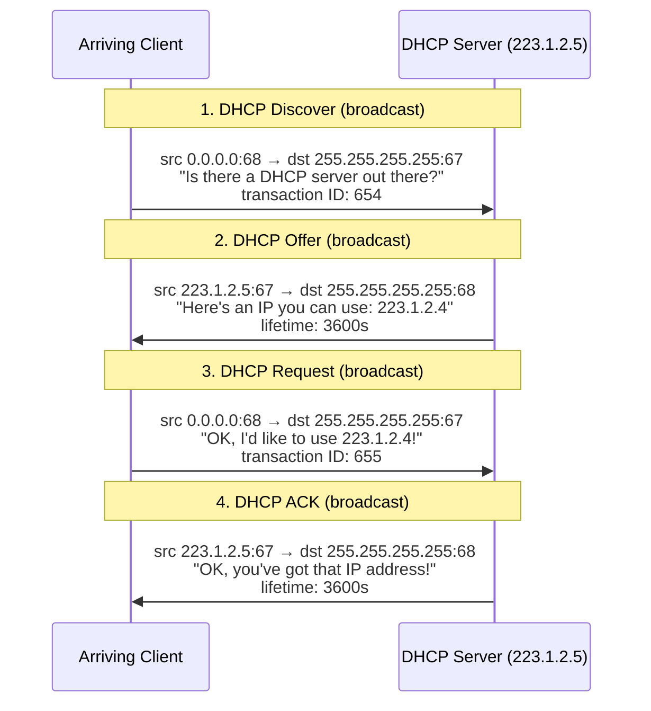
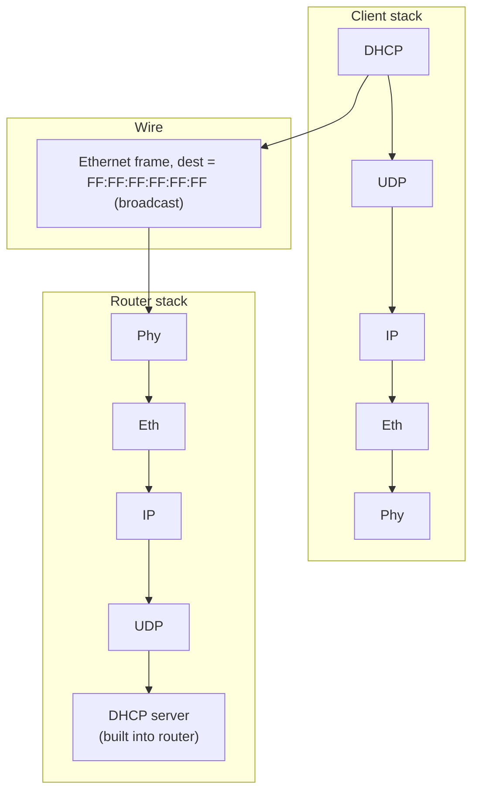

# DHCP: Dynamic Host Configuration Protocol

Up → [[00 - Index]] · Related → [[06 - IP Addressing, Subnets & CIDR]]

> [!info] Goal
> A host dynamically obtains an IP address from a network server when it "joins" a
> network — plug-and-play. Supports **address reuse** (only held while connected) and
> **mobile users** who join/leave frequently. Leases can be **renewed**.

## The four-message handshake ("DORA")

> [!tip] Shortcut per RFC 2131
> Steps 1–2 (Discover/Offer) can be **skipped** if a client remembers and wishes to
> reuse a previously allocated network address — it goes straight to Request.

> [!note] Typical deployment
> The DHCP server is often **co-located in the first-hop router**, serving all subnets
> to which that router is attached.

## More than just an IP address

DHCP can also hand back:
- Address of the client's **first-hop router**
- Name and IP address of the **DNS server**
- **Network mask** (network vs. host portion of the address)

## Encapsulation, end to end

1. Client broadcasts a **DHCP REQUEST**, encapsulated in UDP → IP → Ethernet.
2. Ethernet frame is broadcast (`dest = FF:FF:FF:FF:FF:FF`) on the LAN; received at the router running the DHCP server.
3. Frame is de-multiplexed: Ethernet → IP → UDP → DHCP.
4. Server formulates a **DHCP ACK** containing the client's IP address, first-hop router
   address, and DNS server info — encapsulated the same way and sent back.
5. Client now knows: its own IP address, its first-hop router's address, and its DNS server's address.

## Wireshark reality check

> [!example] Real captured DHCP Request/ACK pair (home LAN)
>
> | Field | Request | ACK |
> |---|---|---|
> | Message type | Boot Request (1) | Boot Reply (2) |
> | Transaction ID | `0x6b3a11b7` | `0x6b3a11b7` |
> | Client IP address | `0.0.0.0` | `192.168.1.101` |
> | Client MAC | `00:16:d3:23:68:8a` | `00:16:d3:23:68:8a` |
> | Option 53 | DHCP Message Type = Request | DHCP Message Type = ACK |
> | Option 50 | Requested IP = `192.168.1.101` | — |
> | Option 1 | — | Subnet Mask = `255.255.255.0` |
> | Option 3 | — | Router = `192.168.1.1` |
> | Option 6 | — | DNS servers = `68.87.71.226`, `68.87.73.242`, `68.87.64.146` |
> | Option 15 | — | Domain Name = `hsd1.ma.comcast.net.` |

---
#### Navigation
◀ [[06 - IP Addressing, Subnets & CIDR]] · ▶ [[08 - NAT]]
