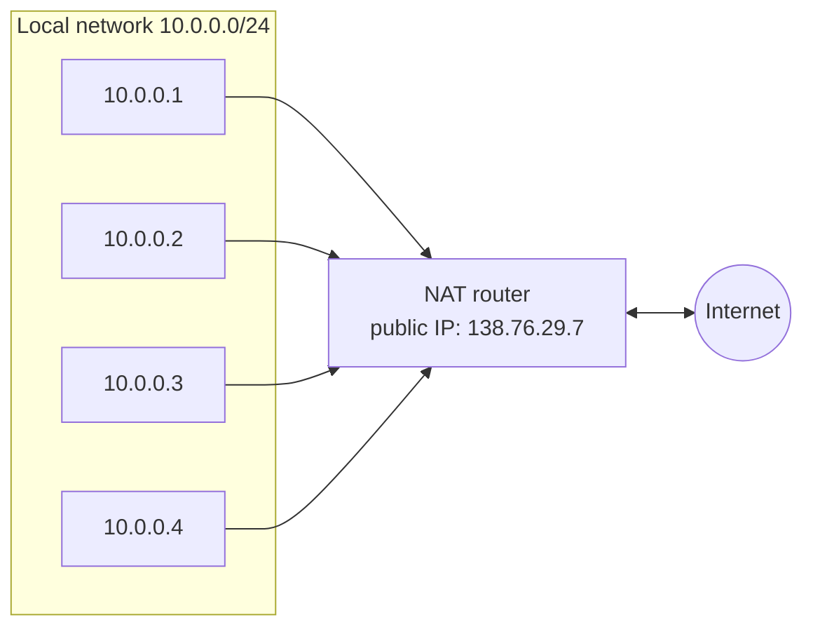
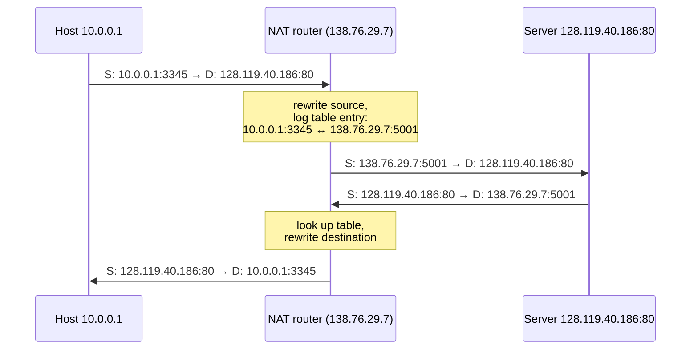

# NAT: Network Address Translation

Up → [[00 - Index]] · Related → [[06 - IP Addressing, Subnets & CIDR]], [[09 - IPv6 & Tunneling]]

> [!info] Core idea
> All devices in a local network share **one single public IPv4 address** as far as
> the outside world is concerned.

All datagrams *leaving* the local network share the **same source IP** (`138.76.29.7`)
but get **different source port numbers**. Datagrams *inside* the local network still
use ordinary `10.0.0.0/24` addressing.

## Private address space (RFC 1918)

| Range | CIDR |
|---|---|
| `10.0.0.0 – 10.255.255.255` | `10.0.0.0/8` |
| `172.16.0.0 – 172.31.255.255` | `172.16.0.0/12` |
| `192.168.0.0 – 192.168.255.255` | `192.168.0.0/16` |

## Advantages

> [!success] Why NAT caught on
> - Only **one** public IP address needed from the ISP for the whole local network.
> - Can renumber devices locally without notifying the outside world.
> - Can switch ISPs without renumbering internal devices.
> - Security side-effect: internal devices aren't directly addressable/visible from outside.

## How it works: the translation table

**NAT translation table** (excerpt):

| WAN-side address | LAN-side address |
|---|---|
| `138.76.29.7, 5001` | `10.0.0.1, 3345` |
| … | … |

**Router logic:**
- **Outgoing**: replace `(source IP, port)` with `(NAT IP, new port)`; remember the mapping.
- **Incoming**: look up `(NAT IP, port)` in the destination field of arriving datagrams, rewrite to the corresponding `(original source IP, port)`.

## Controversy

> [!warning] NAT has been controversial
> - Routers "should" only process up through layer 3 — NAT touches transport-layer **port numbers**, which arguably violates the **end-to-end argument** (see [[11 - Middleboxes & Internet Architecture]]).
> - The IPv4 address "shortage" arguably should have been solved by **IPv6** instead of a workaround.
> - **NAT traversal** is a real problem: what if an external client needs to *initiate* a connection to a server sitting behind a NAT?

> [!success] But NAT is here to stay
> Extensively used in home networks, institutional networks, and **4G/5G cellular
> networks** (carrier-grade NAT), regardless of the controversy.

---
#### Navigation
◀ [[07 - DHCP]] · ▶ [[09 - IPv6 & Tunneling]]
