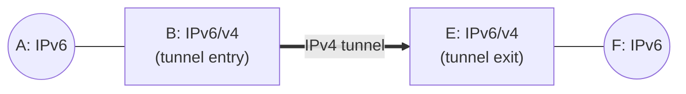
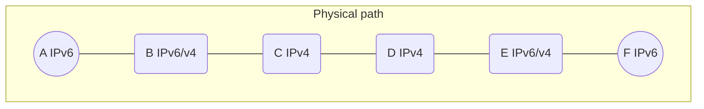
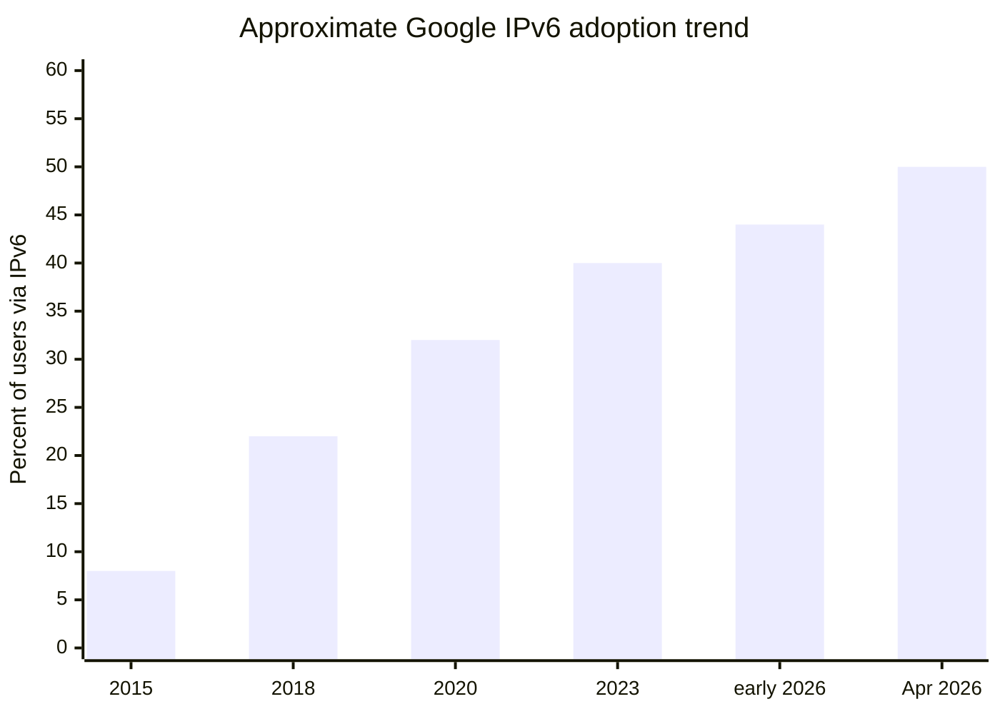

# IPv6 & Tunneling

Up → [[00 - Index]] · Related → [[05 - IP Datagram Format & Fragmentation]], [[08 - NAT]]

## Motivation

> [!info] Why IPv6?
> - **Original driver**: the 32-bit IPv4 address space was going to run out.
> - **Additional drivers**: faster processing/forwarding via a fixed 40-byte header, and the ability to give different network-layer treatment to "flows."

## IPv6 header — what's different from IPv4

| Field | Purpose |
|---|---|
| Version (4 bits) | `6` |
| Priority (traffic class) | Identify priority among datagrams in a flow |
| **Flow label** (20 bits) | Identify datagrams belonging to the same "flow" (concept not fully standardized) |
| Payload length | Length of data following the header |
| Next header | Replaces IPv4's "protocol" + options chaining |
| Hop limit | Replaces IPv4's TTL |
| Source address (**128 bits**) | |
| Destination address (**128 bits**) | |

> [!warning] What's missing compared to IPv4
> - **No checksum** — speeds up processing at every router (end-to-end / link-layer checksums cover this instead).
> - **No in-network fragmentation/reassembly** — see [[05 - IP Datagram Format & Fragmentation]]; hosts must do Path MTU Discovery.
> - **No options field** in the base header — extensions are chained via the "next header" mechanism instead.

## Address space, by the numbers

$$
\text{IPv4 space} = 2^{32} \approx 4.3 \times 10^{9}\ \text{addresses}
$$
$$
\text{IPv6 space} = 2^{128} \approx 3.4 \times 10^{38}\ \text{addresses}
$$

That's roughly $7.9 \times 10^{28}$ times larger — often described as enough to give
every atom on the surface of the Earth its own address, with room to spare.

## Transition: IPv4 ↔ IPv6 via tunneling

> [!info] The problem
> Not all routers can be upgraded to IPv6 simultaneously — there's no "flag day."
> The network must keep working with a **mixed** population of IPv4-only and
> IPv6-capable routers.

> [!tip] Tunneling: "a packet within a packet"
> An IPv6 datagram is carried whole as the **payload** of an IPv4 datagram while it
> crosses a run of IPv4-only routers, then unwrapped back into a native IPv6 datagram
> on the far side.

Logical view: A and F just see native IPv6 end to end. Physically, between B and E,
the IPv6 datagram rides inside an IPv4 datagram — `src: A, dest: F` is preserved
*inside* the tunneled payload the whole way, while the *outer* IPv4 header shows
`src: B, dest: E` for the tunneled hop.

> [!note] Tunneling isn't just an IPv4↔IPv6 trick
> The same "packet within a packet" idea is used extensively elsewhere, e.g. in
> **4G/5G** mobile network data planes.

## Adoption, as of 2026

> [!success] IPv6 crossed the 50% mark in 2026
> According to Google's IPv6 statistics, native IPv6 adoption among users accessing
> Google services **exceeded 50% for the first time on March 28, 2026** (reaching
> ~50.10%), after climbing from roughly 40% in 2023 and ~43.8% earlier in 2026. That
> milestone — about **18 years after IPv6 standardization work matured** — was widely
> covered as "IPv6 reaches majority."

> [!question] Why did it take ~25 years?
> The original slides pose this as an open discussion question. Common explanations
> include: the chicken-and-egg problem (ISPs wait for content to support IPv6, content
> waits for ISPs), the fact that **NAT** (see [[08 - NAT]]) took a lot of the exhaustion
> pressure off, and the sheer cost/risk of touching core infrastructure that "already
> works."

Sources: [APNIC Blog — "Google hits 50% IPv6"](https://blog.apnic.net/2026/04/28/google-hits-50-ipv6/), [Internet Society Pulse — "18 Years Later, IPv6 Reaches Majority"](https://pulse.internetsociety.org/en/blog/2026/04/18-years-later-ipv6-reaches-majority/), [Google IPv6 statistics](https://www.google.com/intl/en/ipv6/statistics.html)

---
#### Navigation
◀ [[08 - NAT]] · ▶ [[10 - Generalized Forwarding, SDN & OpenFlow]]
