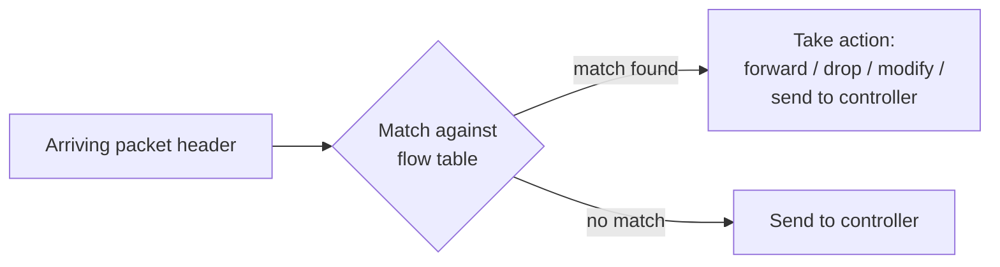
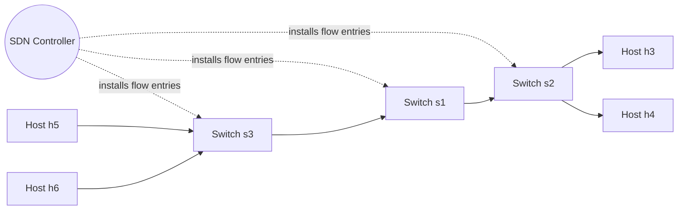

# Generalized Forwarding, SDN & OpenFlow

Up → [[00 - Index]] · Related → [[01 - Data Plane vs Control Plane]], [[02 - Router Architecture & Switching Fabrics]]

## Match plus action

> [!info] The abstraction
> Every router contains a **forwarding table** (a.k.a. **flow table**). Its logic is:
> **match** bits in the arriving packet header(s), then **take an action**.
>
> - **Destination-based forwarding** (classic): match only the destination IP address.
> - **Generalized forwarding**: match on *any* combination of link-, network-, and
>   transport-layer header fields, and take from a *richer* set of actions.

## Flow table abstraction

A **flow** is defined by header field values across link, network, and transport
layers. Each flow-table entry has:

| Component | Meaning |
|---|---|
| **Match** | pattern over packet header fields (may include wildcards `*`) |
| **Action** | drop / forward / modify+forward / send to controller |
| **Priority** | disambiguates overlapping/conflicting patterns |
| **Counters** | #bytes and #packets matched |

Example table:

| Match | Action |
|---|---|
| `src=*.*.*.*, dest=3.4.*.*` | `forward(2)` |
| `src=1.2.*.*, dest=*.*.*.*` | `drop` |
| `src=10.1.2.3, dest=*.*.*.*` | `send to controller` |

## OpenFlow: the concrete protocol

> [!info] Header fields OpenFlow can match on
> Spanning **link layer** (ingress port, src/dst MAC, Ethernet type, VLAN ID/priority),
> **network layer** (IP src/dst, protocol, ToS), and **transport layer** (TCP/UDP src/dst port).

Actions: **(1)** forward to port(s), **(2)** drop, **(3)** modify header field(s),
**(4)** encapsulate & send to controller.

### Worked examples

> [!example] Destination-based forwarding
> `IP Dst = 51.6.0.8` → `forward(port 6)` — all other fields wildcarded.

> [!example] Firewall: block SSH
> `TCP dst port = 22` → `drop`

> [!example] Firewall: block a specific source host
> `IP Src = 128.119.1.1` → `drop`

> [!example] Layer-2 switching
> `MAC dst = 22:A7:23:11:E1:02` → `forward(port 3)`

## One abstraction, many device types

> [!success] Match+action unifies router, switch, firewall, and NAT
>
> | Device | Match | Action |
> |---|---|---|
> | Router | longest destination-IP prefix | forward out a link |
> | Switch | destination MAC address | forward or flood |
> | Firewall | IP addresses + TCP/UDP ports | permit or deny |
> | NAT | IP address + port | rewrite address and port |

## Network-wide behavior via orchestrated tables

A controller can install *coordinated* flow-table entries across multiple switches to
realize a network-wide policy — e.g. routing all traffic from hosts h5/h6 to h3/h4 via
a specific path through switches s1/s2/s3.

Example per-switch entries realizing this policy:

| Switch | Match | Action |
|---|---|---|
| s3 | `IP Src = 10.3.*.*, IP Dst = 10.2.*.*` | `forward(3)` |
| s1 | `ingress port = 1, IP Dst = 10.2.0.3` | `forward(3)` |
| s1 | `IP Src = 10.3.*.*, IP Dst = 10.2.*.*` | `forward(4)` |
| s2 | `ingress port = 2, IP Dst = 10.2.0.4` | `forward(4)` |

## Summary & beyond OpenFlow

> [!info] Generalized forwarding, in one line
> "Match + action" over header bits in **any** layer, with local actions of
> drop/forward/modify/send-to-controller, lets a controller **program** network-wide
> behavior — a simple form of network programmability.

- Historical roots: **active networking** (late 1990s).
- Today: more general **programmable data planes**, e.g. **P4** ([p4.org](https://p4.org)), which lets you define custom header parsing and match+action pipelines rather than being limited to OpenFlow's fixed field set.

---
#### Navigation
◀ [[09 - IPv6 & Tunneling]] · ▶ [[11 - Middleboxes & Internet Architecture]]
