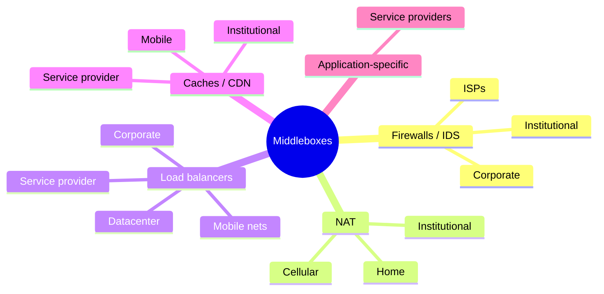
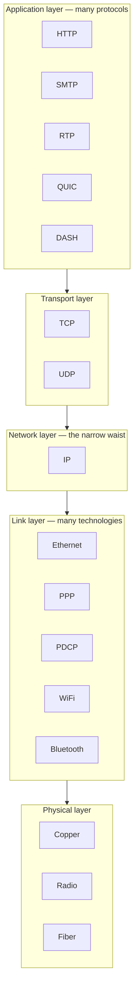
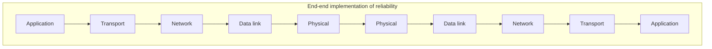
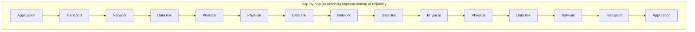

# Middleboxes & Internet Architecture

Up → [[00 - Index]] · Related → [[08 - NAT]], [[10 - Generalized Forwarding, SDN & OpenFlow]]

## What's a middlebox?

> [!quote] RFC 3234
> "Any intermediary box performing functions apart from normal, standard functions of
> an IP router on the data path between a source host and destination host."

## Middleboxes are everywhere

## Where the industry is heading

> [!info] Trend: from proprietary boxes to programmable software
> - **Initially**: proprietary, closed hardware appliances.
> - **Moving toward**: "whitebox" hardware with an **open API**.
> - **Local programmability**: match+action (see [[10 - Generalized Forwarding, SDN & OpenFlow]]).
> - **Differentiation shifts to software** rather than custom silicon.
> - **SDN**: (logically) centralized control/configuration, often hosted in private/public cloud.
> - **NFV** (Network Functions Virtualization): programmable services running over
>   generic "whitebox" networking, compute, and storage — firewalls, load balancers,
>   etc. become software you can spin up on demand rather than dedicated appliances.

## The IP "hourglass"

> [!info] The Internet's narrow waist
> One network-layer protocol — **IP** — sits underneath a wide variety of application
> and transport protocols, and above a wide variety of link technologies. Every
> Internet-connected device must implement it.

> [!warning] "Middle age" — the hourglass grows love handles
> As the Internet matured, **middleboxes** (NAT, firewalls, caching) increasingly
> operate *inside* the network at that narrow waist — not strictly "just IP forwarding"
> anymore. This is sometimes drawn as the hourglass developing "love handles" around
> the IP layer.

## Architectural principles of the Internet

> [!quote] RFC 1958
> "Many members of the Internet community would argue that there is no architecture,
> but only a tradition… in very general terms, the community believes that the goal
> is connectivity, the tool is the Internet Protocol, and the intelligence is
> end to end rather than hidden in the network."

Three cornerstone beliefs:
1. **Simple connectivity** is the goal.
2. **IP** is the (narrow-waist) tool.
3. **Intelligence and complexity live at the network edge**, not inside the network.

## The end-to-end argument

> [!quote] Saltzer, Reed & Clark, 1981
> "The function in question can completely and correctly be implemented only with the
> knowledge and help of the application standing at the end points of the
> communication system. Therefore, providing that questioned function as a feature of
> the communication system itself is not possible. (Sometimes an incomplete version of
> the function provided by the communication system may be useful as a performance
> enhancement.)"

> [!tip] Practical reading
> The end-to-end argument doesn't say the network can *never* help — an "incomplete"
> in-network version of a function (e.g. link-layer retransmission, in-network
> caching) can be a **useful performance optimization**, as long as correctness still
> ultimately depends on the endpoints.

## Where's the intelligence, over time?

| Era | Intelligence / computing lives... |
|---|---|
| 20th-century phone network | At network switches |
| Internet, pre-2005 | At the edge (application-level) |
| Internet, post-2005 | Both: **programmable network devices** *and* massive application-level infrastructure at the edge |

> [!question] So is the Internet still "dumb network, smart edge"?
> Middleboxes and SDN/NFV complicate the classic story — the data plane itself has
> become programmable (see [[10 - Generalized Forwarding, SDN & OpenFlow]]), even as
> most application intelligence still concentrates at the edge (CDNs, datacenters).
> The chapter frames this tension as unresolved and ongoing.

---

## Chapter 4 recap

> [!success] Chapter 4: done!
> - Network layer overview: data plane vs. control plane
> - What's inside a router: ports, switching fabrics, queuing, scheduling
> - IP: the Internet Protocol — datagram format, addressing, DHCP
> - Generalized forwarding, SDN — match + action, OpenFlow
> - Middleboxes and Internet architecture

> [!question] Open question heading into Chapter 5
> **How are forwarding tables (destination-based) or flow tables (generalized
> forwarding) actually *computed*?**
> **Answer: by the control plane — routing algorithms and SDN control, covered next.**

---
#### Navigation
◀ [[10 - Generalized Forwarding, SDN & OpenFlow]] · ▲ [[00 - Index]]
