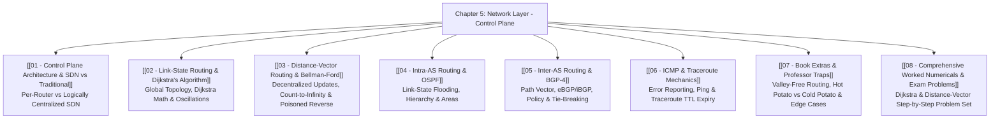

# Chapter 5: Network Layer — Control Plane

> [!abstract] Executive Summary & Roadmap
> The **Control Plane** coordinates the network-wide logic that determines how datagrams are routed end-to-end among routers from source to destination.
> 
> This vault covers the two architectural paradigms (Per-Router vs SDN), the core routing algorithms (Dijkstra's Link-State and Bellman-Ford Distance-Vector), modern routing protocols (OSPF and BGP-4), and network diagnostics via ICMP and Traceroute.

---

## 🗺️ Master Visual Navigation Map

---

## 📑 Detailed Note Registry

| # | Note Document | Core Question Answered | High-Yield Topics |
| :---: | :--- | :--- | :--- |
| **01** | [[01 - Control Plane Architecture & SDN vs Traditional]] | *How do traditional per-router protocols differ from SDN?* | Per-Router vs SDN Control Plane, Southbound APIs, Control Agents |
| **02** | [[02 - Link-State Routing & Dijkstra's Algorithm]] | *How does Dijkstra's algorithm find least-cost paths globally?* | Dijkstra Steps ($N', D(v), p(v)$), Complexity ($O(\|V\|^2)$ vs $O(\|E\| + \|V\|\log\|V\|)$), Traffic Oscillations |
| **03** | [[03 - Distance-Vector Routing & Bellman-Ford]] | *How do decentralized routers converge without global topology?* | Bellman-Ford Eq ($d_x(y) = \min_v \{ c(x,v) + d_v(y) \}$), Count-to-Infinity, Poisoned Reverse (2-node vs 3-node) |
| **04** | [[04 - Intra-AS Routing & OSPF]] | *How does an Autonomous System route internal traffic securely?* | OSPF Features (MD5, ECMP), Hierarchical OSPF (Area 0 Backbone, ABRs, ASBRs) |
| **05** | [[05 - Inter-AS Routing & BGP-4]] | *How do competing global ISPs negotiate traffic routing?* | eBGP vs iBGP, Path Attributes (`AS-PATH`, `NEXT-HOP`), Policy Tie-Breakers, Hot Potato Routing |
| **06** | [[06 - ICMP & Traceroute Mechanics]] | *How does the Internet diagnose faults and map router hops?* | ICMP Type/Code Matrix (Type 0/8 Echo, Type 3 Unreachable, Type 11 TTL Exceeded), Traceroute |
| **07** | [[07 - Book Extras & Professor Traps]] | *What subtle edge cases appear on high-difficulty exams?* | Valley-Free Routing (Gao-Rexford), Poisoned Reverse Loophole, Hot-Potato vs BGP Policy |
| **08** | [[08 - Comprehensive Worked Numericals & Exam Problems]] | *How do you solve routing algorithm tables with zero errors?* | Full Dijkstra execution matrices, Distance-Vector routing tables with link cost changes |

---
#### Navigation
Next → [[01 - Control Plane Architecture & SDN vs Traditional]]
