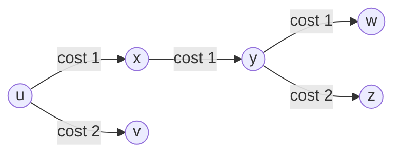

# 02 - Link-State Routing & Dijkstra's Algorithm

> [!abstract] Key Takeaway
> In **Link-State (LS) Routing**, all routers obtain a **complete, global view** of the network topology and link costs via **Link-State Broadcast (Flooding)**. 
> Each router independently executes **Dijkstra's Algorithm** to compute the Shortest Path Tree (SPT) and construct its local forwarding table.

---

## 1. Graph Abstraction & Formal Notation

A computer network is modeled as an undirected weighted graph $G = (N, E)$:
- **Nodes ($N$):** Set of routers $= \{u, v, w, x, y, z\}$.
- **Edges ($E$):** Set of physical links connecting router pairs.
- **Link Cost $c(x, y)$:** Cost of edge between $x$ and $y$. If $(x, y) \notin E$, then $c(x, y) = \infty$.
- **$D(v)$:** Current cost of the least-cost path from source node $u$ to destination $v$.
- **$p(v)$:** Predecessor node along the current least-cost path to $v$.
- **$N'$:** Set of nodes whose least-cost paths from the source are definitively known.

---

## 2. Dijkstra's Algorithm (Formal Pseudocode)

```
Initialization:
  N' = {u}                                  // u is the source node
  for all nodes v in N:
    if v is adjacent to u:
      D(v) = c(u, v), p(v) = u
    else:
      D(v) = infinity

Loop:
  find w not in N' such that D(w) is minimum
  add w to N'
  for all neighbors v of w not in N':
    D(v) = min( D(v), D(w) + c(w, v) )     // Relax edges
    if D(v) changed:
      p(v) = w
until all nodes in N are in N'
```

### Computational & Message Complexity

| Complexity Dimension | Naive Implementation | Optimized Min-Heap Implementation |
| :--- | :---: | :---: |
| **Time Complexity** | $O(|V|^2)$ | **$O(|E| + |V| \log |V|)$** |
| **Message Complexity** | **$O(|V| \cdot |E|)$** (Each of $|V|$ nodes broadcasts link states over $|E|$ links) | — |

---

## 3. Step-by-Step Worked Numerical Example

### Network Topology & Link Costs

```
          2
     v -------- w
   / | \      / | \
  2  |  3    1  |  5
 /   2   \  /   |   \
u -- x --- y ---+--- z
  1     1     2
```
*Links:* $c(u,v)=2, c(u,x)=1, c(v,x)=2, c(v,w)=3, c(x,y)=1, c(w,y)=1, c(w,z)=5, c(y,z)=2$.

---

### Step-by-Step Dijkstra Execution Table (Source Node $u$)

| Step | Confirmed Set $N'$ | $D(v), p(v)$ | $D(w), p(w)$ | $D(x), p(x)$ | $D(y), p(y)$ | $D(z), p(z)$ |
| :---: | :--- | :---: | :---: | :---: | :---: | :---: |
| **0** | $\{u\}$ | $2, u$ | $\infty$ | **$1, u$** *(Min)* | $\infty$ | $\infty$ |
| **1** | $\{u, x\}$ | **$2, u$** *(Min)* | $\infty$ | $1, u$ | $2, x$ | $\infty$ |
| **2** | $\{u, x, v\}$ | $2, u$ | $5, v$ | $1, u$ | **$2, x$** *(Min)* | $\infty$ |
| **3** | $\{u, x, v, y\}$ | $2, u$ | **$3, y$** *(Min)* | $1, u$ | $2, x$ | $4, y$ |
| **4** | $\{u, x, v, y, w\}$ | $2, u$ | $3, y$ | $1, u$ | $2, x$ | **$4, y$** *(Min)* |
| **5** | $\{u, x, v, y, w, z\}$ | $2, u$ | $3, y$ | $1, u$ | $2, x$ | $4, y$ |

---

### Resulting Shortest Path Tree & Forwarding Table at Node $u$



| Destination Node | Least-Cost Path | Total Cost | Next-Hop Outgoing Interface from $u$ |
| :---: | :--- | :---: | :---: |
| **$v$** | $u \to v$ | $2$ | Direct link $(u, v)$ |
| **$x$** | $u \to x$ | $1$ | Direct link $(u, x)$ |
| **$y$** | $u \to x \to y$ | $2$ | Interface towards $x$ |
| **$w$** | $u \to x \to y \to w$ | $3$ | Interface towards $x$ |
| **$z$** | $u \to x \to y \to z$ | $4$ | Interface towards $x$ |

---

## 4. Routing Oscillations under Load-Sensitive Routing

> [!warning] Exam Trap: The Oscillation Problem
> If link costs are defined dynamically as a function of carried traffic load (e.g., higher traffic = higher cost), Link-State routing causes **continuous, severe routing oscillations**.

```
Initial State: All traffic routes Counter-Clockwise (CW is cheap).
Update 1: CCW becomes congested (cost spikes); all routers switch to CW simultaneously.
Update 2: CW becomes congested; all routers switch back to CCW simultaneously!
```

### Solutions to Prevent Oscillations
1. **Load-Insensitive Metrics (Standard in Internet):** Define link costs based on static bandwidth or physical distance rather than real-time traffic.
2. **Desynchronized Timers:** Randomize the execution interval of the link-state algorithm at each router so that not all routers update simultaneously.

---
#### Navigation
← Previous: [[01 - Control Plane Architecture & SDN vs Traditional]] | Next: [[03 - Distance-Vector Routing & Bellman-Ford]] →
