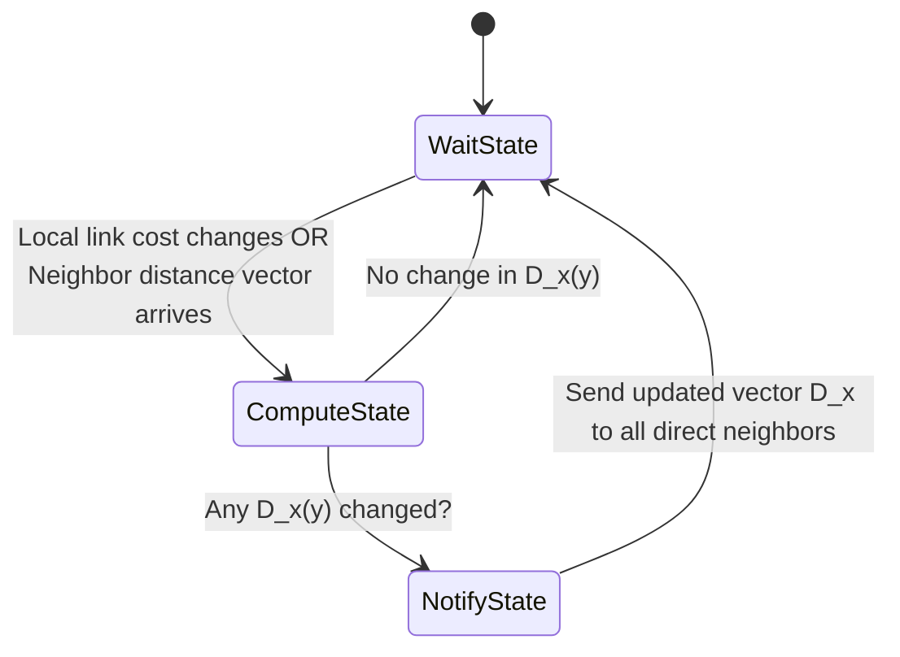

# 03 - Distance-Vector Routing & Bellman-Ford

> [!abstract] Key Takeaway
> **Distance-Vector (DV) Routing** is an **iterative, asynchronous, and distributed** algorithm based on the **Bellman-Ford equation**. 
> Nodes maintain only their own distance estimates and exchange vectors solely with **direct physical neighbors**.

---

## 1. The Bellman-Ford Equation

Let $d_x(y)$ be the cost of the least-cost path from node $x$ to node $y$. The dynamic programming relation is:

$$d_x(y) = \min_{v \in \text{Neighbors}(x)} \{ c(x, v) + d_v(y) \}$$

```
                v1 ───────► ( dv1(y) ) ──┐
              /                           │
             c(x,v1)                      │
            /                             ▼
Node x ────┼─── c(x,v2) ──► v2 ───► ( dv2(y) ) ──► Destination y
            \                             ▲
             c(x,v3)                      │
              \                           │
                v3 ───────► ( dv3(y) ) ──┘
```

---

## 2. Distance Vector Algorithm State Machine



---

## 3. Link-State (LS) vs Distance-Vector (DV) Comparison

| Dimension | Link-State (LS / Dijkstra) | Distance-Vector (DV / Bellman-Ford) |
| :--- | :--- | :--- |
| **Information Scope** | **Global:** Every node knows full topology and all link costs. | **Local/Decentralized:** Nodes know only direct link costs and neighbor estimates. |
| **Message Complexity** | **$O(\|V\| \cdot \|E\|)$** messages via flooding. | Exchanges only between direct neighbors; message volume depends on convergence time. |
| **Speed of Convergence** | **Fast:** $O(\|V\|^2)$ local computation; no loops. | **Slower:** Can suffer from routing loops and the Count-to-Infinity problem. |
| **Robustness (Failure Mode)** | **High:** Node errors are localized; a node only computes its own table. | **Low:** An incorrect node distance vector propagates errors globally (e.g., black-holing traffic). |

---

## 4. Pathologies: The Count-to-Infinity Problem

> [!warning] Exam Trap: "Good News Travels Fast, Bad News Travels Slowly"
> When a link cost **decreases**, the network converges in 1–2 iterations. But when a link cost **increases** or fails ($\infty$), a 2-node routing loop causes distance estimates to increment slowly step-by-step toward infinity.

```
Topology:  (x) <==== 4 ====> (y) <==== 1 ====> (z)
Initially: Dy(x) = 4, Dz(x) = 5 (via y).
```

### The Count-to-Infinity Failure Sequence
1. Link $(x, y)$ cost suddenly increases from $4 \to 60$.
2. Node $y$ checks its neighbors to find path to $x$:
   - Direct to $x$: $c(y, x) = 60$.
   - Via $z$: $c(y, z) + D_z(x) = 1 + 5 = 6$.
3. Node $y$ falsely concludes: *"Going through $z$ costs only 6!"* and updates $D_y(x) = 6$.
4. Node $y$ advertises $D_y(x) = 6$ to $z$.
5. Node $z$ updates: $D_z(x) = c(z, y) + D_y(x) = 1 + 6 = 7$, and advertises back to $y$.
6. $y$ and $z$ bounce traffic back and forth in a loop, incrementing costs ($8, 9, 10, \dots$) until cost reaches $60$!

---

## 5. Poisoned Reverse & The 3-Node Loop Trap

### Poisoned Reverse Heuristic
If node $z$ routes through neighbor $y$ to reach destination $x$, $z$ explicitly advertises to $y$ that its distance to $x$ is infinity:
$$D_z(x) = \infty \quad (\text{advertised to } y \text{ only})$$
*This prevents node $y$ from ever attempting to route back through $z$ to reach $x$.*

> [!warning] Critical Professor Trap: Poisoned Reverse DOES NOT solve loops with $\ge 3$ nodes!
> - Poisoned Reverse completely prevents **2-node direct loops** ($y \leftrightarrow z$).
> - However, if a routing loop involves **three or more nodes** ($A \to B \to C \to A$), poisoned reverse fails because node $C$ does not know that $A$'s path relies on $B$, causing Count-to-Infinity to occur anyway.
> - **Solution in modern Internet:** Path-Vector routing (BGP) which records full `AS-PATH` to detect arbitrary loops.

---
#### Navigation
← Previous: [[02 - Link-State Routing & Dijkstra's Algorithm]] | Next: [[04 - Intra-AS Routing & OSPF]] →
